# 73. Global Challenges and Progress in Kidney Health - Figures and Tables Index

This document lists all figures and tables extracted from `73. Global Challenges and Progress in Kidney Health.pdf`.

## Table of Contents
- [Figures](#figures)
- [Tables](#tables)

---

## Figures

### Fig_73_1

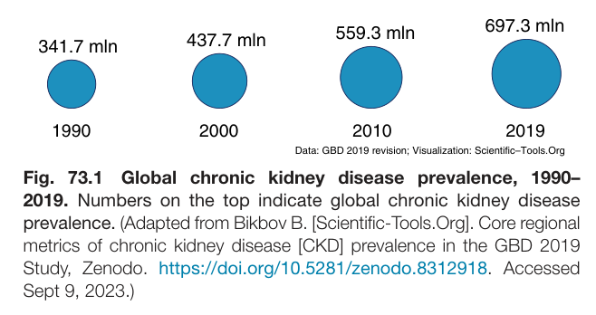

Fig. 73.1 Global chronic kidney disease prevalence, 1990– 2019. Numbers on the top indicate global chronic kidney disease prevalence. (Adapted from Bikbov B. [Scientific-Tools.Org]. Core regional metrics of chronic kidney disease [CKD] prevalence in the GBD 2019 Study, Zenodo. https://doi.org/10.5281/zenodo.8312918. Accessed Sept 9, 2023.)

---

### Fig_73_2

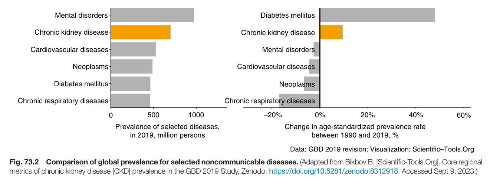

Fig. 73.2 Comparison of global prevalence for selected noncommunicable diseases. (Adapted from Bikbov B. [Scientific-Tools.Org]. Core regiona metrics of chronic kidney disease [CKD] prevalence in the GBD 2019 Study, Zenodo. https://doi.org/10.5281/zenodo.8312918. Accessed Sept 9, 2023.)

---

### Fig_73_3

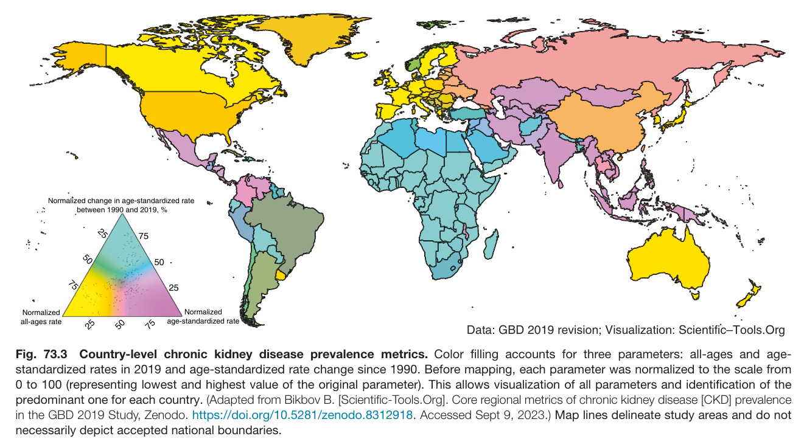

Fig. 73.3 Country-level chronic kidney disease prevalence metrics. Color filling accounts for three parameters: all-ages and age- standardized rates in 2019 and age-standardized rate change since 1990. Before mapping, each parameter was normalized to the scale from 0 to 100 (representing lowest and highest value of the original parameter). This allows visualization of all parameters and identification of the predominant one for each country. (Adapted from Bikbov B. [Scientific-Tools.Org]. Core regional metrics of chronic kidney disease [CKD] prevalence in the GBD 2019 Study, Zenodo. https://doi.org/10.5281/zenodo.8312918. Accessed Sept 9, 2023.) Map lines delineate study areas and do not necessarily depict accepted national boundaries.

---

### Fig_73_4

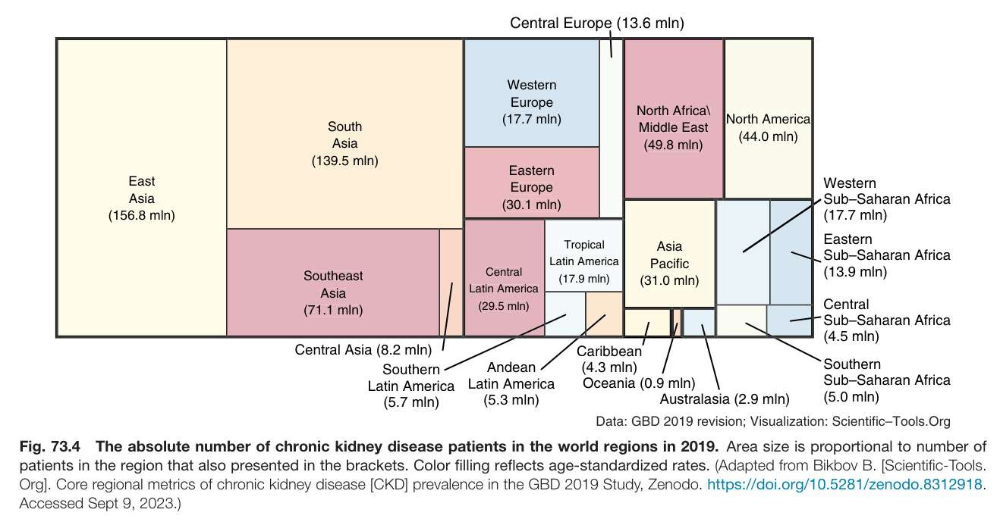

Fig. 73.4 The absolute number of chronic kidney disease patients in the world regions in 2019. Area size is proportional to number of patients in the region that also presented in the brackets. Color filling reflects age-standardized rates. (Adapted from Bikbov B. [Scientific-Tools. Org]. Core regional metrics of chronic kidney disease [CKD] prevalence in the GBD 2019 Study, Zenodo. https://doi.org/10.5281/zenodo.8312918. Accessed Sept 9, 2023.)

---

### Fig_73_5

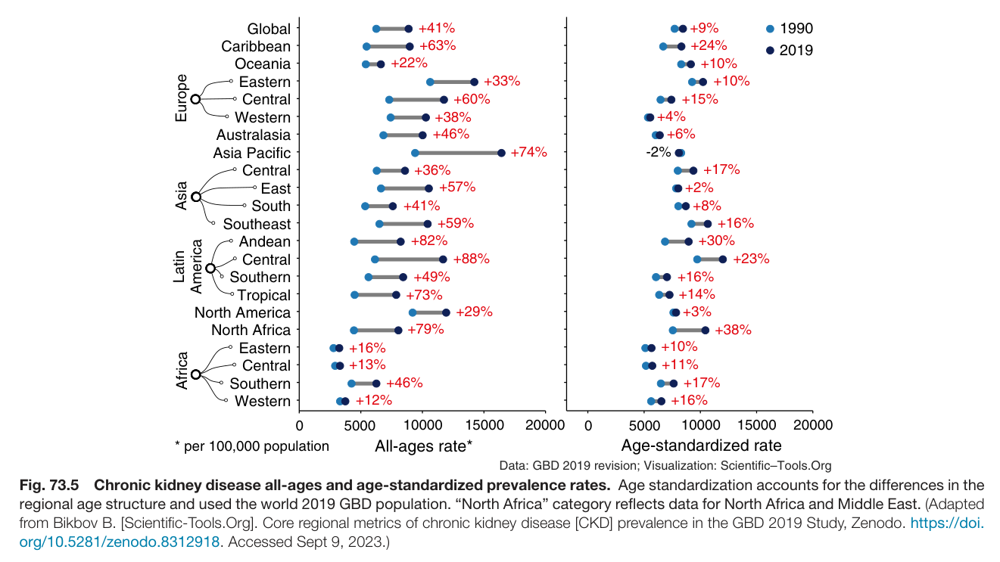

Fig. 73.5 Chronic kidney disease all-ages and age-standardized prevalence rates. Age standardization accounts for the differences in the regional age structure and used the world 2019 GBD population. “North Africa” category reflects data for North Africa and Middle East. (Adapted from Bikbov B. [Scientific-Tools.Org]. Core regional metrics of chronic kidney disease [CKD] prevalence in the GBD 2019 Study, Zenodo. https://doi. org/10.5281/zenodo.8312918. Accessed Sept 9, 2023.)

---

### Fig_73_6

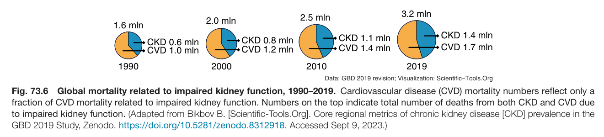

Fig. 73.6 Global mortality related to impaired kidney function, 1990–2019. Cardiovascular disease (CVD) mortality numbers reflect only a fraction of CVD mortality related to impaired kidney function. Numbers on the top indicate total number of deaths from both CKD and CVD due to impaired kidney function. (Adapted from Bikbov B. [Scientific-Tools.Org]. Core regional metrics of chronic kidney disease [CKD] prevalence in the GBD 2019 Study, Zenodo. https://doi.org/10.5281/zenodo.8312918. Accessed Sept 9, 2023.)

---

### Fig_73_7

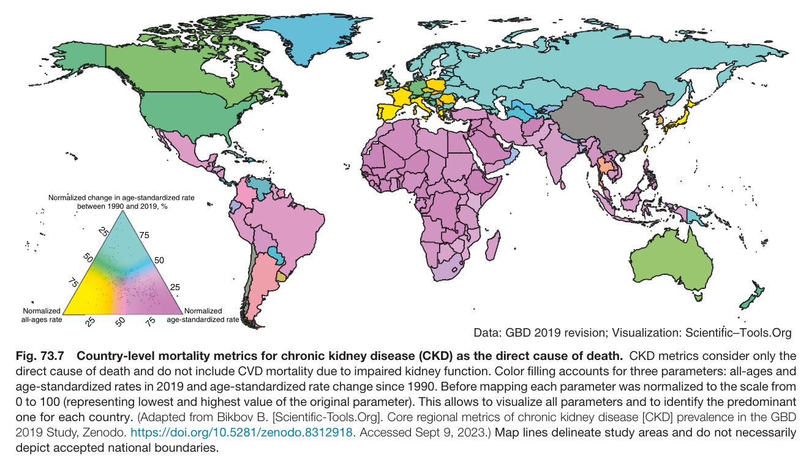

Fig. 73.7 Country-level mortality metrics for chronic kidney disease (CKD) as the direct cause of death. CKD metrics consider only the direct cause of death and do not include CVD mortality due to impaired kidney function. Color filling accounts for three parameters: all-ages and age-standardized rates in 2019 and age-standardized rate change since 1990. Before mapping each parameter was normalized to the scale from 0 to 100 (representing lowest and highest value of the original parameter). This allows to visualize all parameters and to identify the predominant one for each country. (Adapted from Bikbov B. [Scientific-Tools.Org]. Core regional metrics of chronic kidney disease [CKD] prevalence in the GBD 2019 Study, Zenodo. https://doi.org/10.5281/zenodo.8312918. Accessed Sept 9, 2023.) Map lines delineate study areas and do not necessarily depict accepted national boundaries.

---

### Fig_73_8

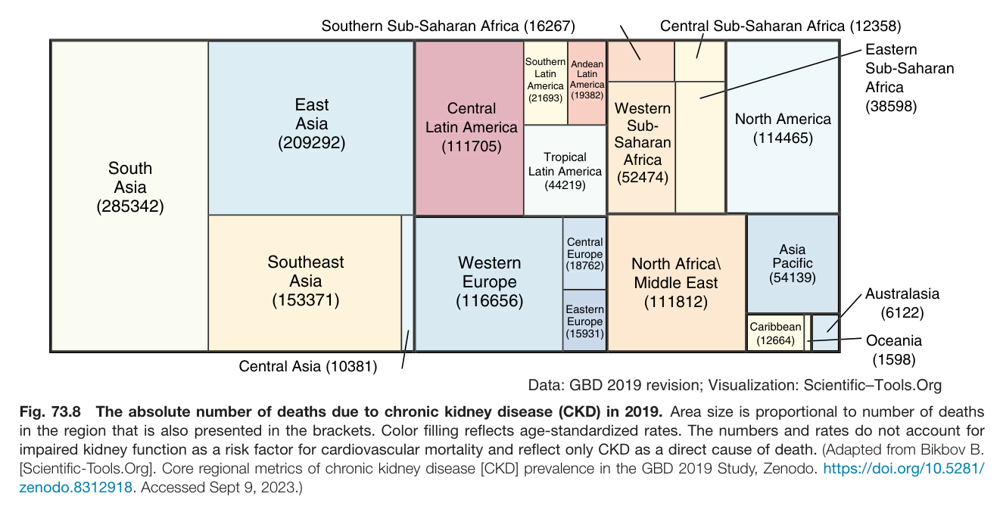

Fig. 73.8 The absolute number of deaths due to chronic kidney disease (CKD) in 2019. Area size is proportional to number of deaths in the region that is also presented in the brackets. Color filling reflects age-standardized rates. The numbers and rates do not account for impaired kidney function as a risk factor for cardiovascular mortality and reflect only CKD as a direct cause of death. (Adapted from Bikbov B. [Scientific-Tools.Org]. Core regional metrics of chronic kidney disease [CKD] prevalence in the GBD 2019 Study, Zenodo. https://doi.org/10.5281/ zenodo.8312918. Accessed Sept 9, 2023.)

---

### Fig_73_9

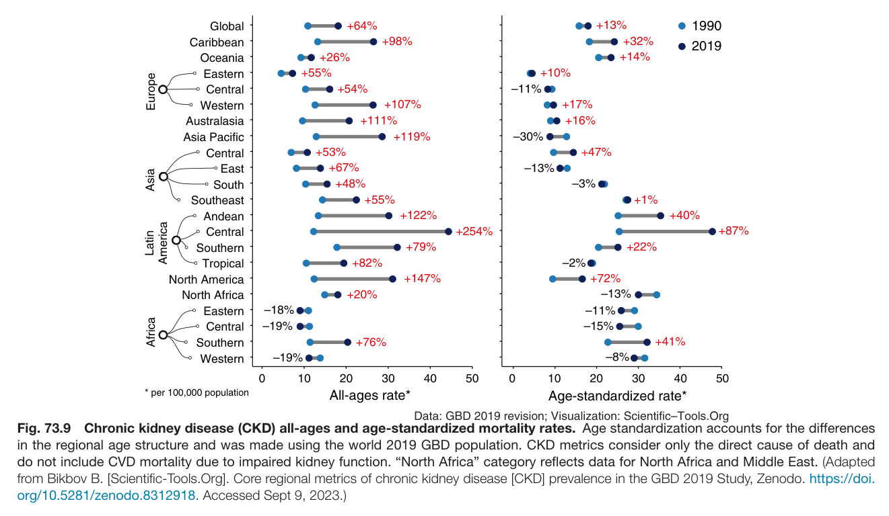

Fig. 73.9 Chronic kidney disease (CKD) all-ages and age-standardized mortality rates. Age standardization accounts for the differences in the regional age structure and was made using the world 2019 GBD population. CKD metrics consider only the direct cause of death and do not include CVD mortality due to impaired kidney function. “North Africa” category reflects data for North Africa and Middle East. (Adapted from Bikbov B. [Scientific-Tools.Org]. Core regional metrics of chronic kidney disease [CKD] prevalence in the GBD 2019 Study, Zenodo. https://doi. org/10.5281/zenodo.8312918. Accessed Sept 9, 2023.)

---

### Fig_73_10

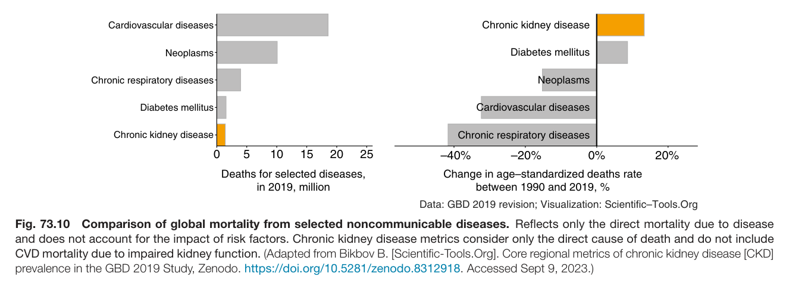

Fig. 73.10 Comparison of global mortality from selected noncommunicable diseases. Reflects only the direct mortality due to disease and does not account for the impact of risk factors. Chronic kidney disease metrics consider only the direct cause of death and do not include CVD mortality due to impaired kidney function. (Adapted from Bikbov B. [Scientific-Tools.Org]. Core regional metrics of chronic kidney disease [CKD] prevalence in the GBD 2019 Study, Zenodo. https://doi.org/10.5281/zenodo.8312918. Accessed Sept 9, 2023.)

---

### Fig_73_11

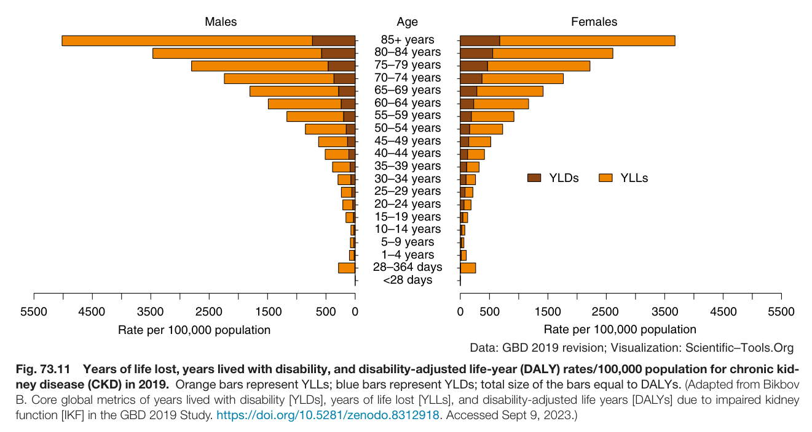

Fig. 73.11 Years of life lost, years lived with disability, and disability-adjusted life-year (DALY) rates/100,000 population for chronic kid- ney disease (CKD) in 2019. Orange bars represent YLLs; blue bars represent YLDs; total size of the bars equal to DALYs. (Adapted from Bikbov B. Core global metrics of years lived with disability [YLDs], years of life lost [YLLs], and disability-adjusted life years [DALYs] due to impaired kidney function [IKF] in the GBD 2019 Study. https://doi.org/10.5281/zenodo.8312918. Accessed Sept 9, 2023.)

---

### Fig_73_12

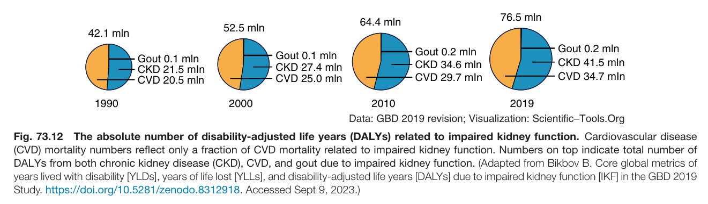

Fig. 73.12 The absolute number of disability-adjusted life years (DALYs) related to impaired kidney function. Cardiovascular disease (CVD) mortality numbers reflect only a fraction of CVD mortality related to impaired kidney function. Numbers on top indicate total number of DALYs from both chronic kidney disease (CKD), CVD, and gout due to impaired kidney function. (Adapted from Bikbov B. Core global metrics of years lived with disability [YLDs], years of life lost [YLLs], and disability-adjusted life years [DALYs] due to impaired kidney function [IKF] in the GBD 2019 Study. https://doi.org/10.5281/zenodo.8312918. Accessed Sept 9, 2023.)

---

### Fig_73_13

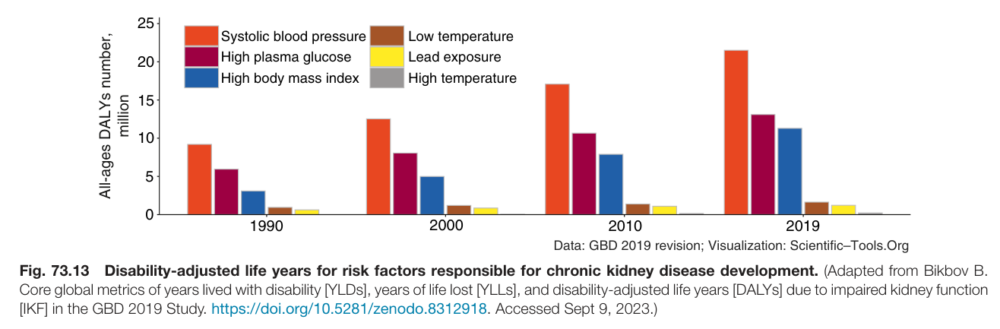

Fig. 73.13 Disability-adjusted life years for risk factors responsible for chronic kidney disease development. (Adapted from Bikbov B. Core global metrics of years lived with disability [YLDs], years of life lost [YLLs], and disability-adjusted life years [DALYs] due to impaired kidney function [IKF] in the GBD 2019 Study. https://doi.org/10.5281/zenodo.8312918. Accessed Sept 9, 2023.)

---

### Fig_73_14

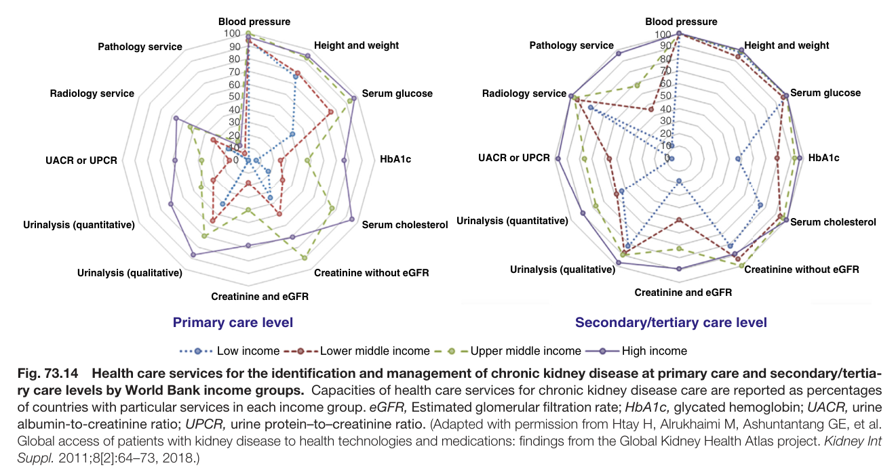

Fig. 73.14 Health care services for the identification and management of chronic kidney disease at primary care and secondary/tertiary care levels by World Bank income groups. Capacities of health care services for chronic kidney disease care are reported as percentages of countries with particular services in each income group. eGFR, Estimated glomerular filtration rate; HbA1c, glycated hemoglobin; UACR, urine albumin-to-creatinine ratio; UPCR, urine protein–to–creatinine ratio. (Adapted with permission from Htay H, Alrukhaimi M, Ashuntantang GE, et al. Global access of patients with kidney disease to health technologies and medications: findings from the Global Kidney Health Atlas project. Kidney Int Suppl. 2011;8[2]:64–73, 2018.)

---

### Fig_73_15

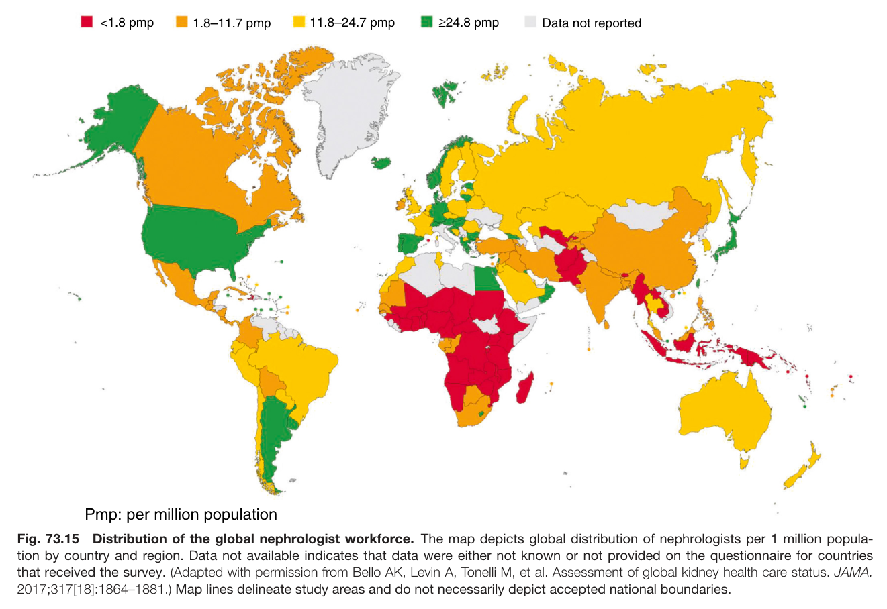

Fig. 73.15 Distribution of the global nephrologist workforce. The map depicts global distribution of nephrologists per 1 million popula- tion by country and region. Data not available indicates that data were either not known or not provided on the questionnaire for countries that received the survey. (Adapted with permission from Bello AK, Levin A, Tonelli M, et al. Assessment of global kidney health care status. JAMA. 2017;317[18]:1864–1881.) Map lines delineate study areas and do not necessarily depict accepted national boundaries.

---

### Fig_73_16

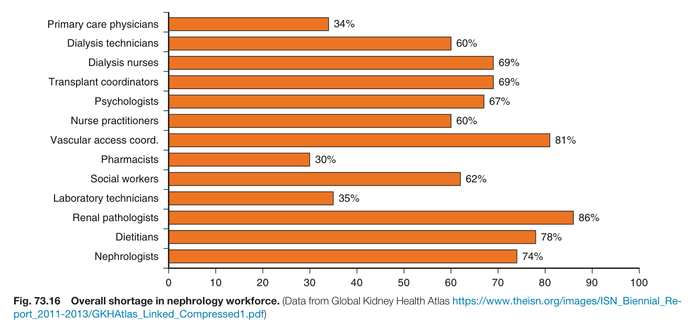

Fig. 73.16 Overall shortage in nephrology workforce. (Data from Global Kidney Health Atlas https://www.theisn.org/images/ISN\_Biennial\_Report\_2011-2013/GKHAtlas\_Linked\_Compressed1.pdf)

---

### Fig_73_17

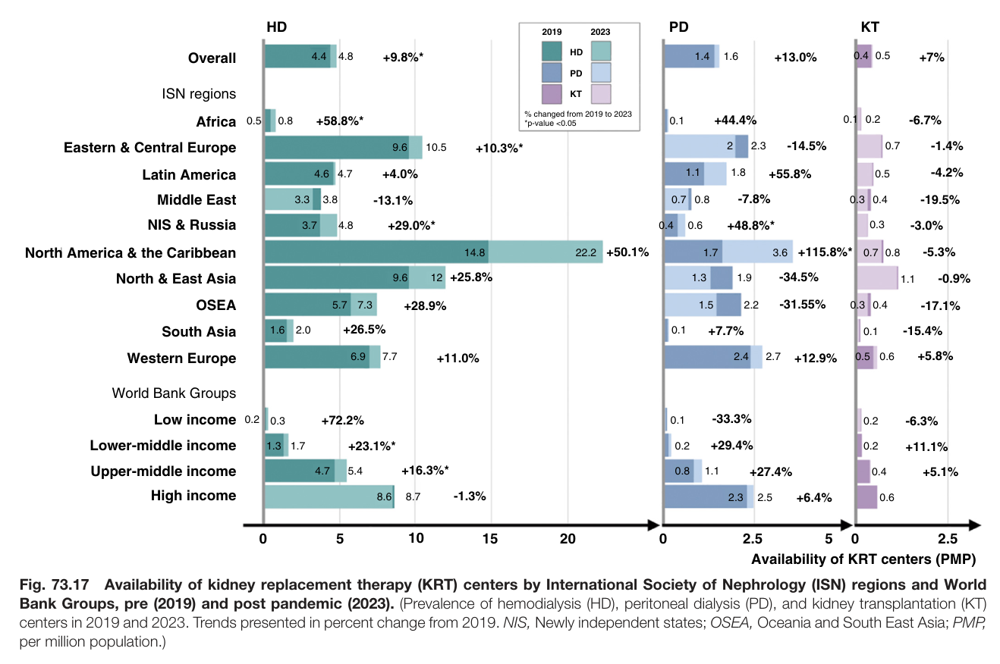

Fig. 73.17 Availability of kidney replacement therapy (KRT) centers by International Society of Nephrology (ISN) regions and World Bank Groups, pre (2019) and post pandemic (2023). (Prevalence of hemodialysis (HD), peritoneal dialysis (PD), and kidney transplantation (KT) centers in 2019 and 2023. Trends presented in percent change from 2019. NIS, Newly independent states; OSEA, Oceania and South East Asia; PMP, per million population.)

---

### Fig_73_18

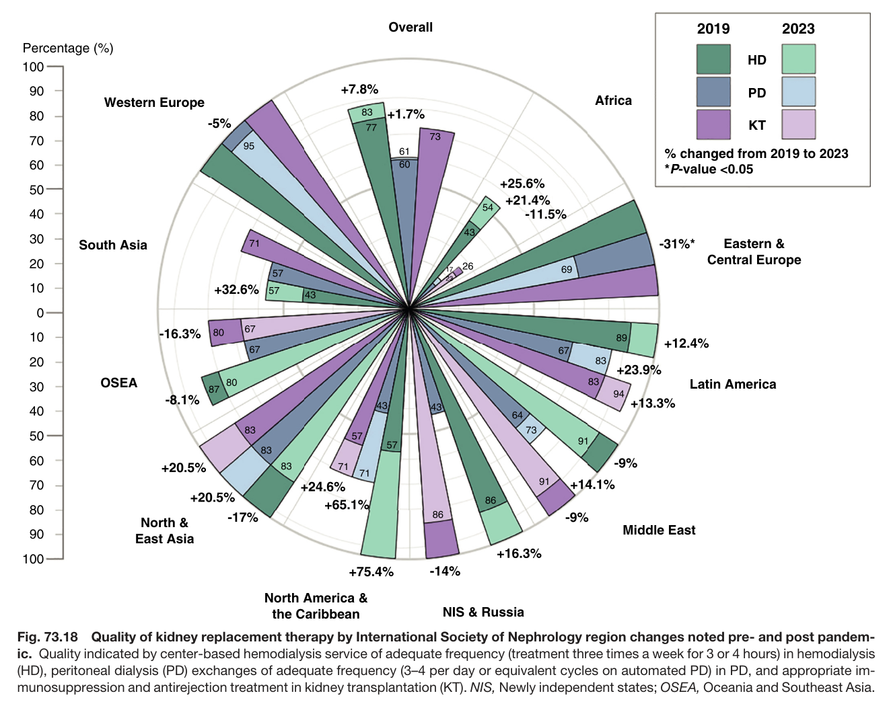

Fig. 73.18 Quality of kidney replacement therapy by International Society of Nephrology region changes noted pre- and post pandem- ic. Quality indicated by center-based hemodialysis service of adequate frequency (treatment three times a week for 3 or 4 hours) in hemodialysis (HD), peritoneal dialysis (PD) exchanges of adequate frequency (3–4 per day or equivalent cycles on automated PD) in PD, and appropriate im- munosuppression and antirejection treatment in kidney transplantation (KT). NIS, Newly independent states; OSEA, Oceania and Southeast Asia.

---

### Fig_73_19

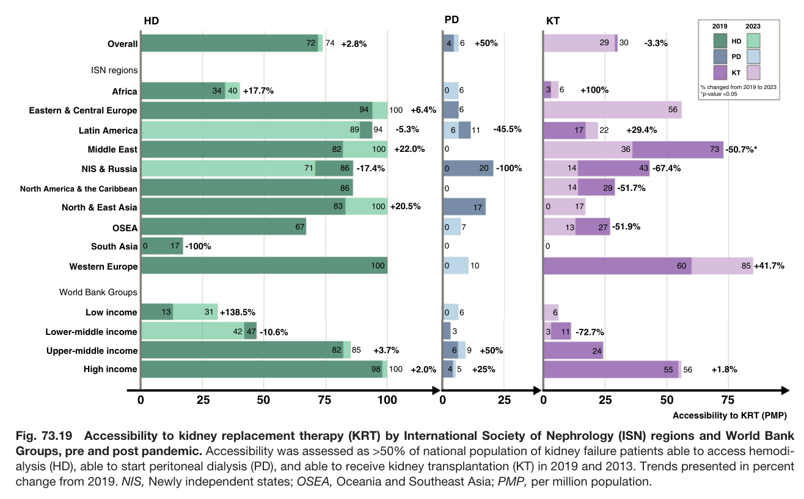

Fig. 73.19 Accessibility to kidney replacement therapy (KRT) by International Society of Nephrology (ISN) regions and World Bank Groups, pre and post pandemic. Accessibility was assessed as >50% of national population of kidney failure patients able to access hemodi alysis (HD), able to start peritoneal dialysis (PD), and able to receive kidney transplantation (KT) in 2019 and 2013. Trends presented in percent change from 2019. NIS, Newly independent states; OSEA, Oceania and Southeast Asia; PMP, per million population.

---

### Fig_73_20

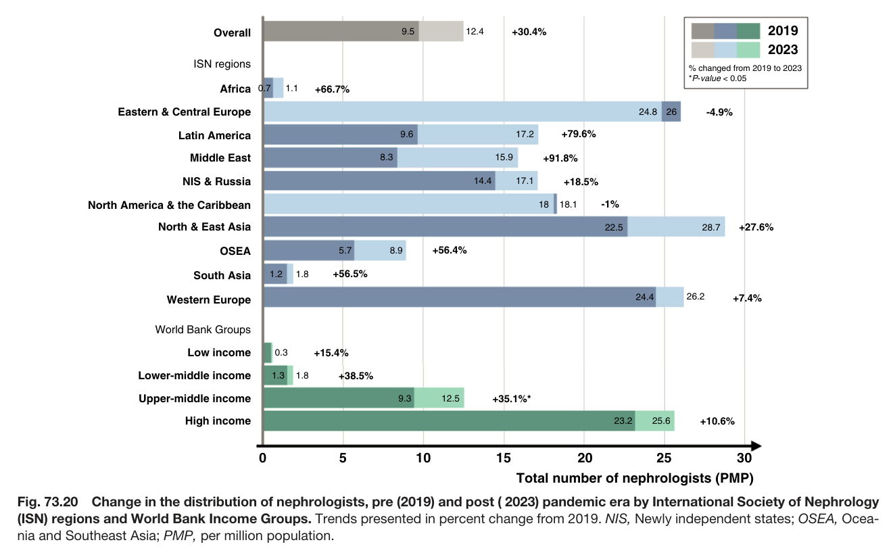

Fig. 73.20 Change in the distribution of nephrologists, pre (2019) and post ( 2023) pandemic era by International Society of Nephrology (ISN) regions and World Bank Income Groups. Trends presented in percent change from 2019. NIS, Newly independent states; OSEA, Ocea- nia and Southeast Asia; PMP, per million population.

---

### Fig_73_21

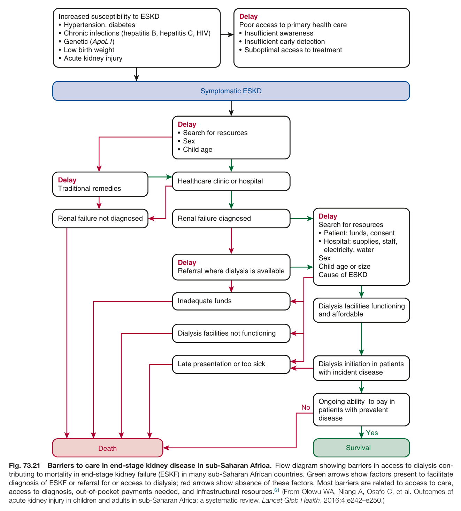

Fig. 73.21 Barriers to care in end-stage kidney disease in sub-Saharan Africa. Flow diagram showing barriers in access to dialysis con tributing to mortality in end-stage kidney failure (ESKF) in many sub-Saharan African countries. Green arrows show factors present to facilitate diagnosis of ESKF or referral for or access to dialysis; red arrows show absence of these factors. Most barriers are related to access to care, access to diagnosis, out-of-pocket payments needed, and infrastructural resources.<sup>61</sup> (From Olowu WA, Niang A, Osafo C, et al. Outcomes o acute kidney injury in children and adults in sub-Saharan Africa: a systematic review. Lancet Glob Health. 2016;4:e242–e250.

---

### Fig_73_22

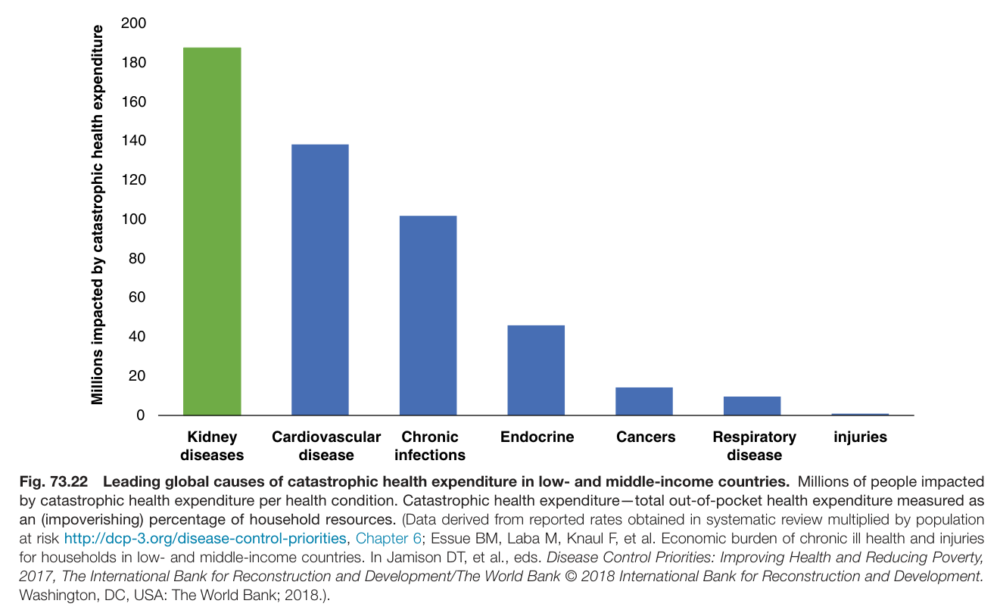

Fig. 73.22 Leading global causes of catastrophic health expenditure in low- and middle-income countries. Millions of people impacted by catastrophic health expenditure per health condition. Catastrophic health expenditure—total out-of-pocket health expenditure measured as an (impoverishing) percentage of household resources. (Data derived from reported rates obtained in systematic review multiplied by population at risk http://dcp-3.org/disease-control-priorities, Chapter 6; Essue BM, Laba M, Knaul F, et al. Economic burden of chronic ill health and injuries for households in low- and middle-income countries. In Jamison DT, et al., eds. Disease Control Priorities: Improving Health and Reducing Poverty, 2017, The International Bank for Reconstruction and Development/The World Bank © 2018 International Bank for Reconstruction and Development. Washington, DC, USA: The World Bank; 2018.).

---

### Fig_73_23

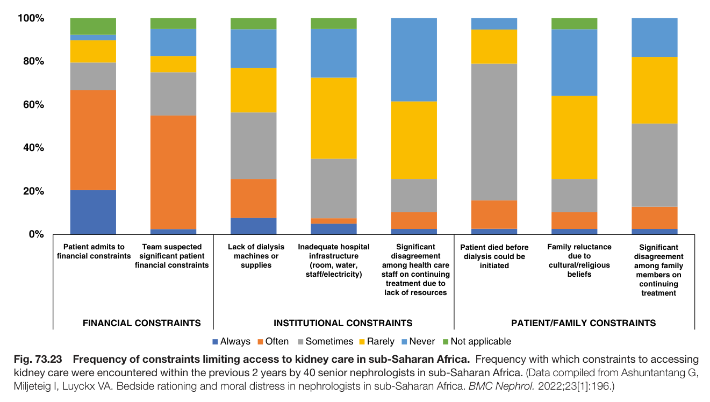

Fig. 73.23 Frequency of constraints limiting access to kidney care in sub-Saharan Africa. Frequency with which constraints to accessing kidney care were encountered within the previous 2 years by 40 senior nephrologists in sub-Saharan Africa. (Data compiled from Ashuntantang G, Miljeteig I, Luyckx VA. Bedside rationing and moral distress in nephrologists in sub-Saharan Africa. BMC Nephrol. 2022;23[1]:196.)

---

### Fig_73_24

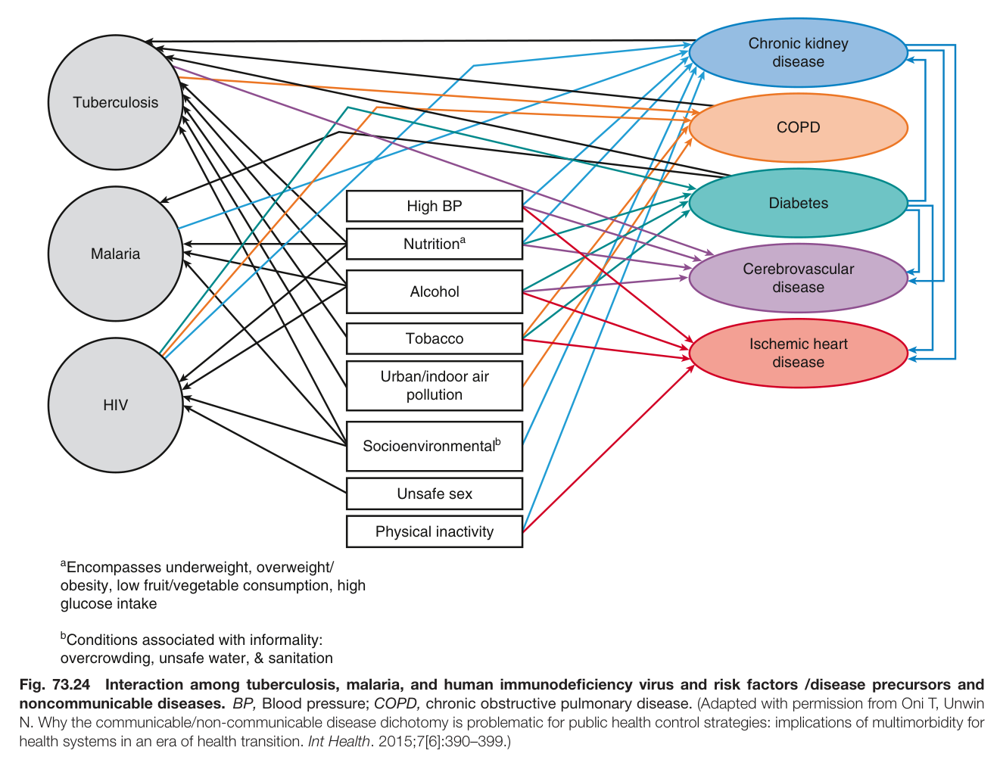

Fig. 73.24 Interaction among tuberculosis, malaria, and human immunodeficiency virus and risk factors /disease precursors and noncommunicable diseases. BP, Blood pressure; COPD, chronic obstructive pulmonary disease. (Adapted with permission from Oni T, Unwin N. Why the communicable/non-communicable disease dichotomy is problematic for public health control strategies: implications of multimorbidity for health systems in an era of health transition. Int Health. 2015;7[6]:390–399.)

---

### Fig_73_25

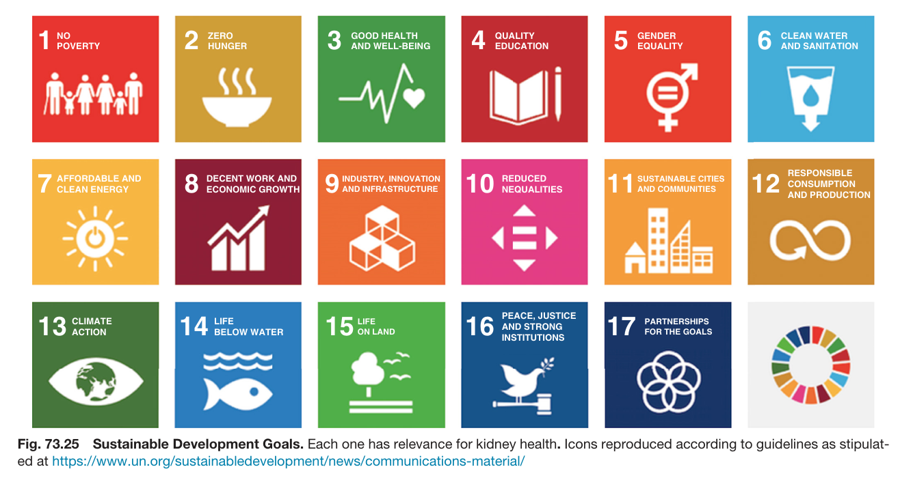

Fig. 73.25 Sustainable Development Goals. Each one has relevance for kidney health. Icons reproduced according to guidelines as stipulat- ed at https://www.un.org/sustainabledevelopment/news/communications-material/

---

## Tables

### Table_73_1

#### Table Image

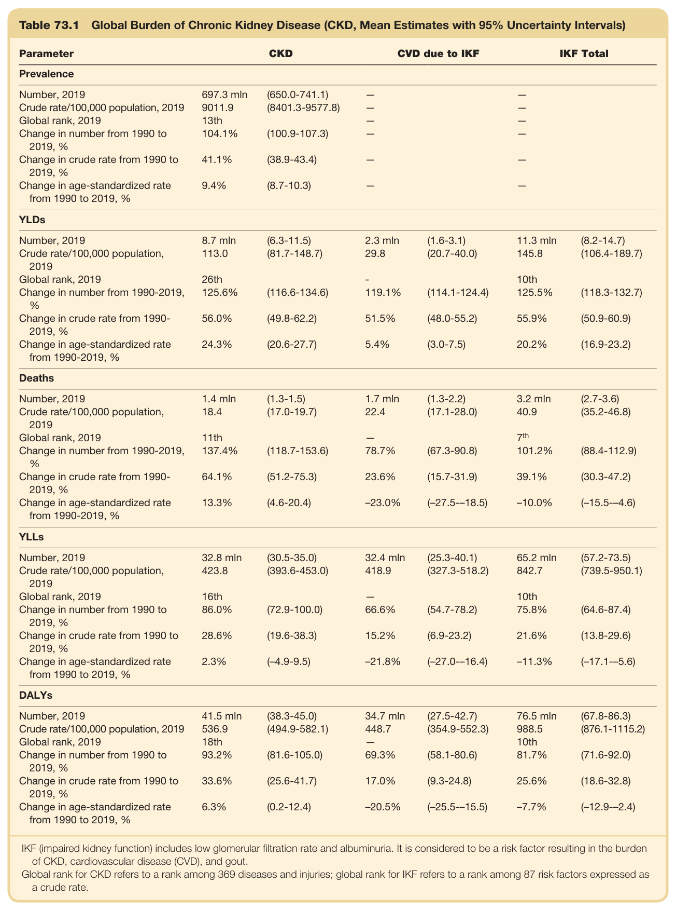

#### Table Data (CSV: [Table_73_1.csv](Table_73_1.csv))

```markdown
| Table Text (OCR) |
| :--- |
| Table 73.1  Global Burden of Chronic Kidney Disease (CKD, Mean Estimates with 95% Uncertainty Intervals) Parameter    CKD  CVD due to IKF  IKF Total    Prevalence    Number, 2019  697.3 mln  (650.0-741.1)  —    —      Crude rate/100,000 population, 2019  9011.9  (8401.3-9577.8)  —    —      Global rank, 2019  13th    —    —      Change in number from 1990 to 2019, %  104.1%  (100.9-107.3)  —    —      Change in crude rate from 1990 to 2019, %  41.1%  (38.9-43.4)  —    —      Change in age-standardized rate from 1990 to 2019, %  9.4%  (8.7-10.3)  —    —      YLDs    Number, 2019  8.7 mln  (6.3-11.5)  2.3 mln  (1.6-3.1)  11.3 mln  (8.2-14.7)    Crude rate/100,000 population, 2019  113.0  (81.7-148.7)  29.8  (20.7-40.0)  145.8  (106.4-189.7)    Global rank, 2019  26th    —    10th      Change in number from 1990-2019, %  125.6%  (116.6-134.6)  119.1%  (114.1-124.4)  125.5%  (118.3-132.7)    Change in crude rate from 1990-2019, %  56.0%  (49.8-62.2)  51.5%  (48.0-55.2)  55.9%  (50.9-60.9)    Change in age-standardized rate from 1990-2019, %  24.3%  (20.6-27.7)  5.4%  (3.0-7.5)  20.2%  (16.9-23.2)    Deaths    Number, 2019  1.4 mln  (1.3-1.5)  1.7 mln  (1.3-2.2)  3.2 mln  (2.7-3.6)    Crude rate/100,000 population, 2019  18.4  (17.0-19.7)  22.4  (17.1-28.0)  40.9  (35.2-46.8)    Global rank, 2019  11th    —     7^{\text{th}}       Change in number from 1990-2019, %  137.4%  (118.7-153.6)  78.7%  (67.3-90.8)  101.2%  (88.4-112.9)    Change in crude rate from 1990-2019, %  64.1%  (51.2-75.3)  23.6%  (15.7-31.9)  39.1%  (30.3-47.2)    Change in age-standardized rate from 1990-2019, %  13.3%  (4.6-20.4)  -23.0%  (-27.5--18.5)  -10.0%  (-15.5--4.6)    YLLs    Number, 2019  32.8 mln  (30.5-35.0)  32.4 mln  (25.3-40.1)  65.2 mln  (57.2-73.5)    Crude rate/100,000 population, 2019  423.8  (393.6-453.0)  418.9  (327.3-518.2)  842.7  (739.5-950.1)    Global rank, 2019  16th    —    10th      Change in number from 1990 to 2019, %  86.0%  (72.9-100.0)  66.6%  (54.7-78.2)  75.8%  (64.6-87.4)    Change in crude rate from 1990 to 2019, %  28.6%  (19.6-38.3)  15.2%  (6.9-23.2)  21.6%  (13.8-29.6)    Change in age-standardized rate from 1990 to 2019, %  2.3%  (-4.9-9.5)  -21.8%  (-27.0--16.4)  -11.3%  (-17.1--5.6)    DALYs    Number, 2019  41.5 mln  (38.3-45.0)  34.7 mln  (27.5-42.7)  76.5 mln  (67.8-86.3)    Crude rate/100,000 population, 2019  536.9  (494.9-582.1)  448.7  (354.9-552.3)  988.5  (876.1-1115.2)    Global rank, 2019  18th    —    10th      Change in number from 1990 to 2019, %  93.2%  (81.6-105.0)  69.3%  (58.1-80.6)  81.7%  (71.6-92.0)    Change in crude rate from 1990 to 2019, %  33.6%  (25.6-41.7)  17.0%  (9.3-24.8)  25.6%  (18.6-32.8)    Change in age-standardized rate from 1990 to 2019, %  6.3%  (0.2-12.4)  -20.5%  (-25.5--15.5)  -7.7%  (-12.9--2.4) IKF (impaired kidney function) includes low glomerular filtration rate and albuminuria. It is considered to be a risk factor resulting in the burden of CKD, cardiovascular disease (CVD), and gout. Global rank for CKD refers to a rank among 369 diseases and injuries; global rank for IKF refers to a rank among 87 risk factors expressed as a crude rate. |
```

Table 73.1 Global Burden of Chronic Kidney Disease (CKD, Mean Estimates with 95% Uncertainty Intervals)

---

### Table_73_2

#### Table Image

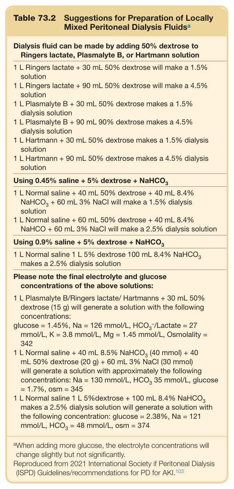

#### Table Data (CSV: [Table_73_2.csv](Table_73_2.csv))

```markdown
| Table Text (OCR) |
| :--- |
| Table 73.2  Suggestions for Preparation of Locally Mixed Peritoneal Dialysis Fluids<sup>a</sup> Dialysis fluid can be made by adding 50% dextrose to Ringers lactate, Plasmalyte B, or Hartmann solution 1 L Ringers lactate + 30 mL 50% dextrose will make a 1.5% solution    1 L Ringers lactate + 90 mL 50% dextrose will make a 4.5% solution    1 L Plasmalyte B + 30 mL 50% dextrose makes a 1.5% dialysis solution    1 L Plasmalyte B + 90 mL 90% dextrose makes a 4.5% dialysis solution    1 L Hartmann + 30 mL 50% dextrose makes a 1.5% dialysis solution    1 L Hartmann + 90 mL 50% dextrose makes a 4.5% dialysis solution |
```

Table 73.2 Suggestions for Preparation of Locally Mixed Peritoneal Dialysis Fluids<sup>a</sup>

---

### Table_73_3

#### Table Image

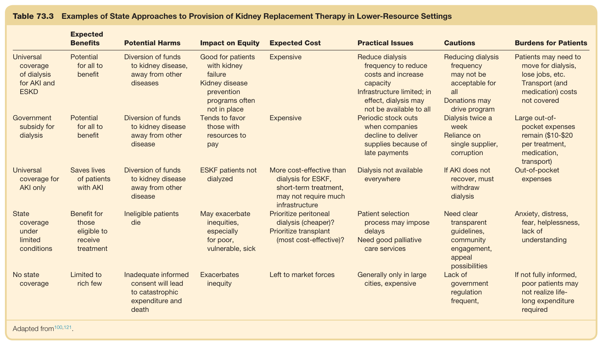

#### Table Data (CSV: [Table_73_3.csv](Table_73_3.csv))

```markdown
| Table Text (OCR) |
| :--- |
| Table 73.3Examples of State Approaches to Provision of Kidney Replacement Therapy in Lower-Resource Settings Expected Benefits  Potential Harms  Impact on Equity  Expected Cost  Practical Issues  Cautions  Burdens for Patients    Universal coverage of dialysis for AKI and ESKD  Potential for all to benefit  Diversion of funds to kidney disease, away from other diseases  Good for patients with kidney failureKidney disease prevention programs often not in place  Expensive  Reduce dialysis frequency to reduce costs and increase capacityInfrastructure limited; in effect, dialysis may not be available to all  Reducing dialysis frequency may not be acceptable for allDonations may drive program  Patients may need to move for dialysis, lose jobs, etc.Transport (and medication) costs not covered    Government subsidy for dialysis  Potential for all to benefit  Diversion of funds to kidney disease away from other disease  Tends to favor those with resources to pay  Expensive  Periodic stock outs when companies decline to deliver supplies because of late payments  Dialysis twice a weekReliance on single supplier, corruption  Large out-of-pocket expenses remain ($10-$20 per treatment, medication, transport)    Universal coverage for AKI only  Saves lives of patients with AKI  Diversion of funds to kidney disease away from other disease  ESKF patients not dialyzed  More cost-effective than dialysis for ESKF, short-term treatment, may not require much infrastructure  Dialysis not available everywhere  If AKI does not recover, must withdraw dialysis  Out-of-pocket expenses    State coverage under limited conditions  Benefit for those eligible to receive treatment  Ineligible patients die  May exacerbate inequities, especially for poor, vulnerable, sick  Prioritize peritoneal dialysis (cheaper)?Prioritize transplant (most cost-effective)?  Patient selection process may impose delaysNeed good palliative care services  Need clear transparent guidelines, community engagement, appeal possibilities  Anxiety, distress, fear, helplessness, lack of understanding    No state coverage  Limited to rich few  Inadequate informed consent will lead to catastrophic expenditure and death  Exacerbates inequity  Left to market forces  Generally only in large cities, expensive  Lack of government regulation frequent,  If not fully informed, poor patients may not realize life-long expenditure required Adapted from100,121. |
```

Table 73.3 Examples of State Approaches to Provision of Kidney Replacement Therapy in Lower-Resource Settings

---

### Table_73_4

#### Table Image

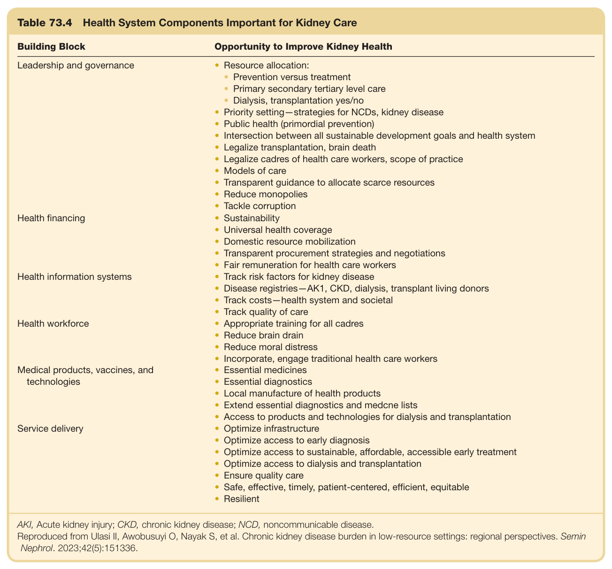

#### Table Data (CSV: [Table_73_4.csv](Table_73_4.csv))

```markdown
| Table Text (OCR) |
| :--- |
| Table 73.4  Health System Components Important for Kidney Care Building Block  Opportunity to Improve Kidney Health    Leadership and governance  Resource allocation:Prevention versus treatmentPrimary secondary tertiary level careDialysis, transplantation yes/noPriority setting—strategies for NCDs, kidney diseasePublic health (primordial prevention)Intersection between all sustainable development goals and health systemLegalize transplantation, brain deathLegalize cadres of health care workers, scope of practiceModels of careTransparent guidance to allocate scarce resourcesReduce monopoliesTackle corruption    Health financing  SustainabilityUniversal health coverageDomestic resource mobilizationTransparent procurement strategies and negotiationsFair remuneration for health care workers    Health information systems  Track risk factors for kidney diseaseDisease registries—AK1, CKD, dialysis, transplant living donorsTrack costs—health system and societalTrack quality of care    Health workforce  Appropriate training for all cadresReduce brain drainReduce moral distressIncorporate, engage traditional health care workers    Medical products, vaccines, and technologies  Essential medicinesEssential diagnosticsLocal manufacture of health productsExtend essential diagnostics and medicine listsAccess to products and technologies for dialysis and transplantation    Service delivery  Optimize infrastructureOptimize access to early diagnosisOptimize access to sustainable, affordable, accessible early treatmentOptimize access to dialysis and transplantationEnsure quality careSafe, effective, timely, patient-centered, efficient, equitableResilient AKI, Acute kidney injury; CKD, chronic kidney disease; NCD, noncommunicable disease. Reproduced from Ulasi II, Awobusuyi O, Nayak S, et al. Chronic kidney disease burden in low-resource settings: regional perspectives. Semin Nephrol. 2023;42(5):151336. |
```

Table 73.4 Health System Components Important for Kidney Care

---

### Table_73_5

#### Table Image

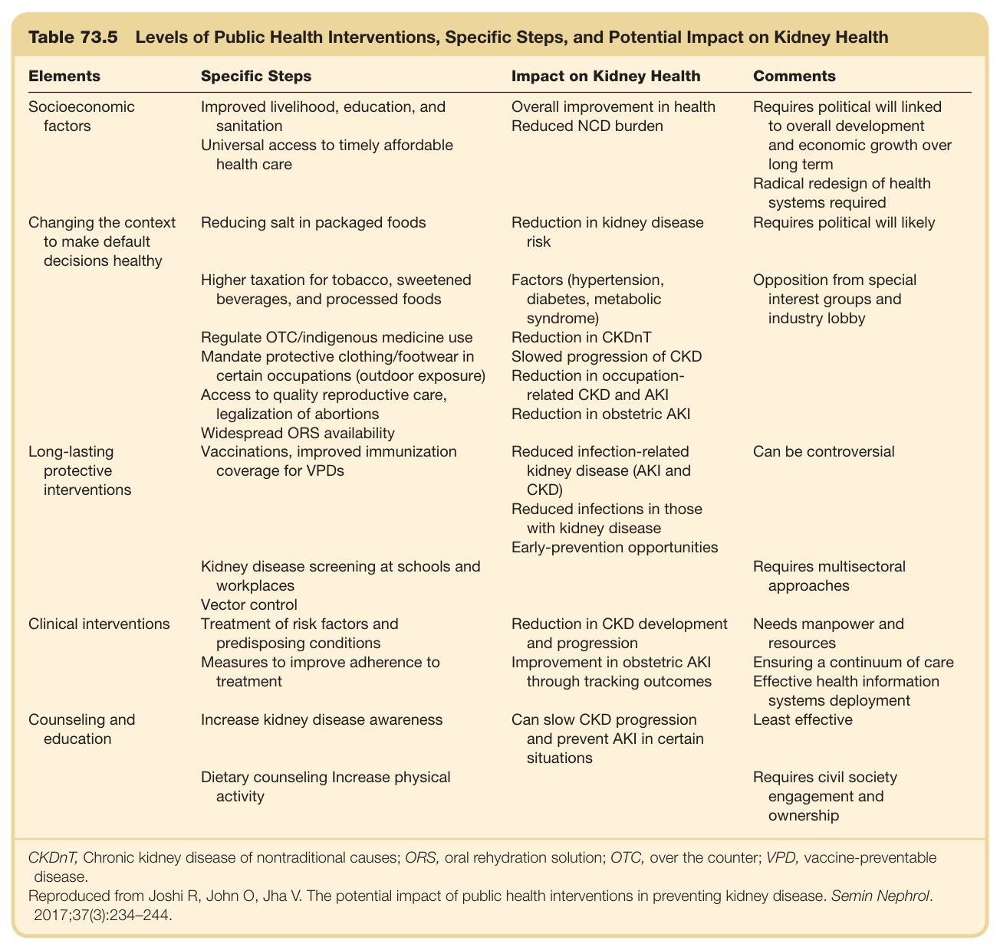

#### Table Data (CSV: [Table_73_5.csv](Table_73_5.csv))

```markdown
| Table Text (OCR) |
| :--- |
| Table 73.5  Levels of Public Health Interventions, Specific Steps, and Potential Impact on Kidney Health Elements  Specific Steps  Impact on Kidney Health  Comments    Socioeconomic factors  Improved livelihood, education, and sanitationUniversal access to timely affordable health care  Overall improvement in healthReduced NCD burden  Requires political will linked to overall development and economic growth over long termRadical redesign of health systems required    Changing the context to make default decisions healthy  Reducing salt in packaged foods  Reduction in kidney disease risk  Requires political will likely    Higher taxation for tobacco, sweetened beverages, and processed foods  Factors (hypertension, diabetes, metabolic syndrome)  Opposition from special interest groups and industry lobby    Regulate OTC/indigenous medicine useMandate protective clothing/footwear in certain occupations (outdoor exposure)Access to quality reproductive care,legalization of abortionsWidespread ORS availability  Reduction in CKDnTSlowed progression of CKDReduction in occupation-related CKD and AKIReduction in obstetric AKI      Long-lasting protective interventions  Vaccinations, improved immunization coverage for VPDs  Reduced infection-related kidney disease (AKI and CKD)Reduced infections in those with kidney diseaseEarly-prevention opportunities  Can be controversial    Kidney disease screening at schools and workplacesVector control    Requires multisectoral approaches    Clinical interventions  Treatment of risk factors and predisposing conditionsMeasures to improve adherence to treatment  Reduction in CKD development and progressionImprovement in obstetric AKI through tracking outcomes  Needs manpower and resourcesEnsuring a continuum of careEffective health information systems deployment    Counseling and education  Increase kidney disease awareness  Can slow CKD progression and prevent AKI in certain situations  Least effective    Dietary counseling Increase physical activity    Requires civil society engagement and ownership CKDnT, Chronic kidney disease of nontraditional causes; ORS, oral rehydration solution; OTC, over the counter; VPD, vaccine-preventable disease Reproduced from Joshi R, John O, Jha V. The potential impact of public health interventions in preventing kidney disease. Semin Nephrol. 2017;37(3):234–244. |
```

Table 73.5 Levels of Public Health Interventions, Specific Steps, and Potential Impact on Kidney Health

---

### Table_73_6

#### Table Image

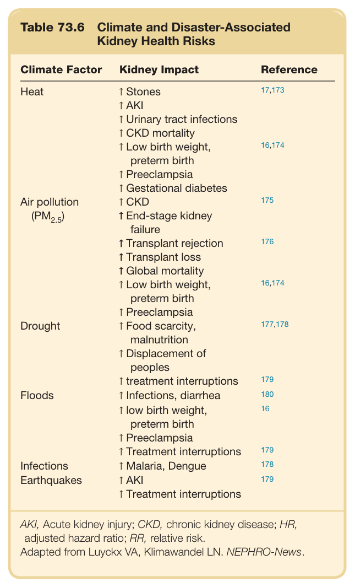

#### Table Data (CSV: [Table_73_6.csv](Table_73_6.csv))

```markdown
| Table Text (OCR) |
| :--- |
| Table 73.6  Climate and Disaster-Associated Kidney Health Risks Climate Factor  Kidney Impact  Reference    Heat  ↑ Stones  17,173    ↑ AKI      ↑ Urinary tract infections      ↑ CKD mortality      ↑ Low birth weight, preterm birth  16,174    ↑ Preeclampsia      ↑ Gestational diabetes      Air pollution (PM _{2.5} )  ↑ CKD  175    ↑ End-stage kidney failure      ↑ Transplant rejection  176    ↑ Transplant loss      ↑ Global mortality      ↑ Low birth weight, preterm birth  16,174    ↑ Preeclampsia      Drought  ↑ Food scarcity, malnutrition  177,178    ↑ Displacement of peoples      ↑ treatment interruptions  179    Floods  ↑ Infections, diarrhea  180    ↑ low birth weight, preterm birth  16    ↑ Preeclampsia      ↑ Treatment interruptions  179    Infections  ↑ Malaria, Dengue  178    Earthquakes  ↑ AKI  179    ↑ Treatment interruptions AKI, Acute kidney injury; CKD, chronic kidney disease; HR, adjusted hazard ratio; RR, relative risk. Adapted from Luyckx VA, Klimawandel LN. NEPHRO-News. |
```

Table 73.6 Climate and Disaster-Associated Kidney Health Risks

---
