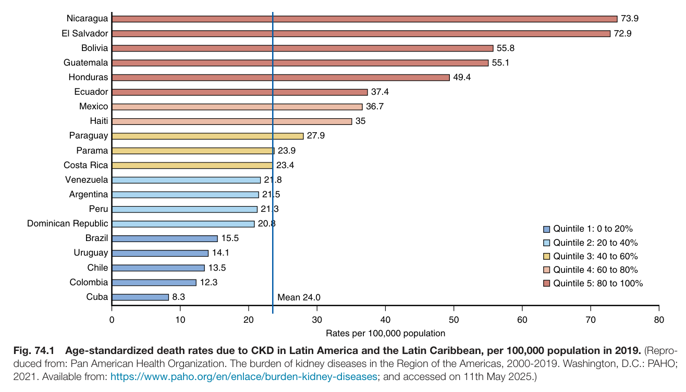
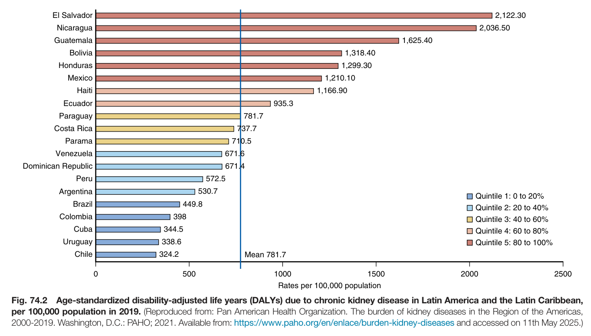
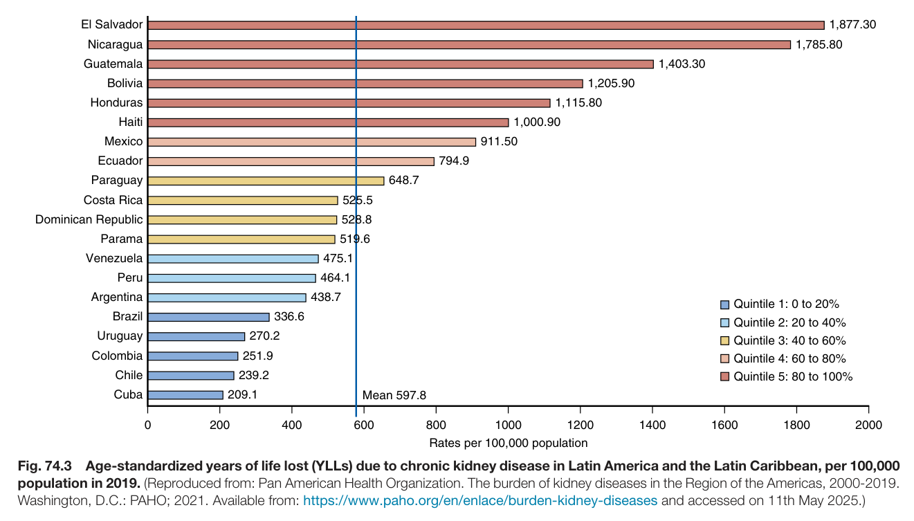
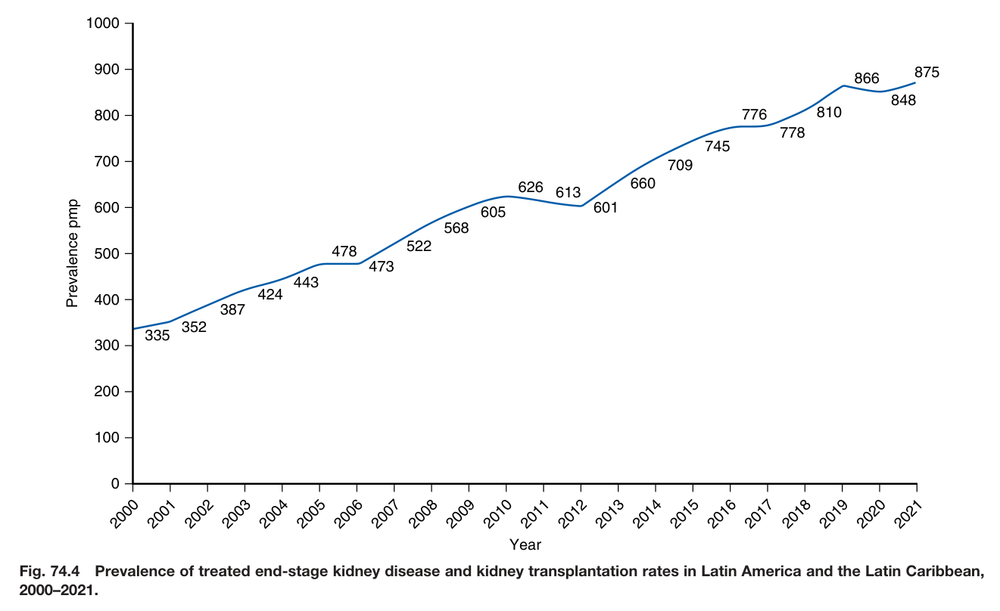
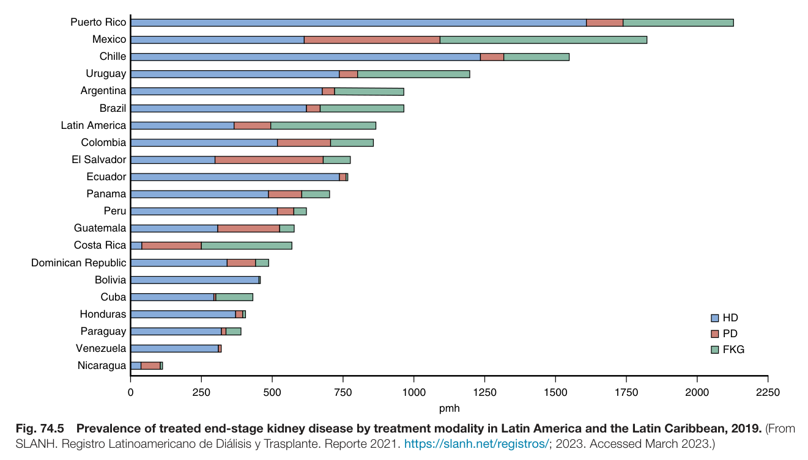
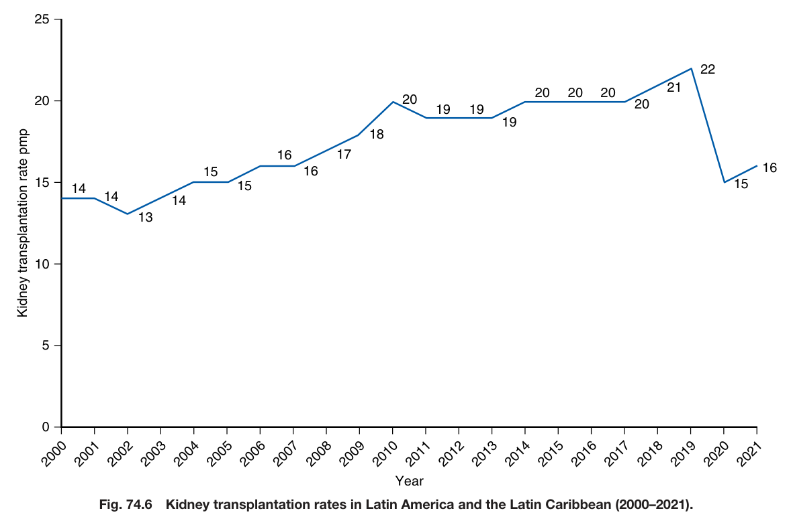
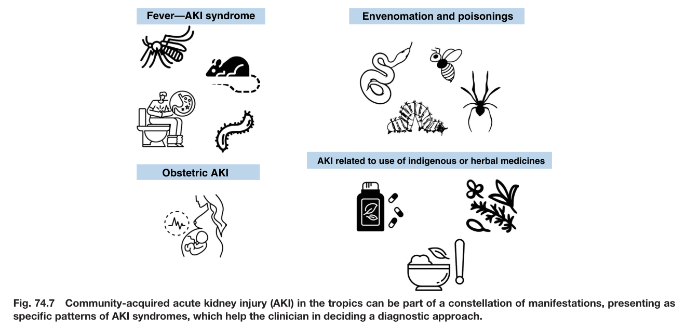
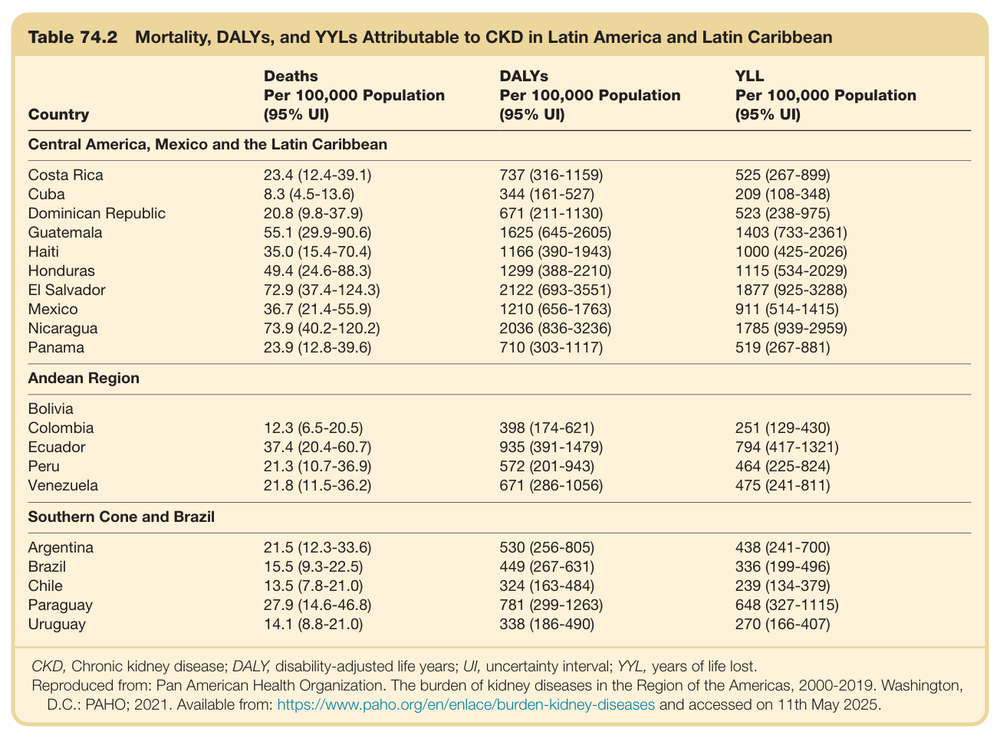
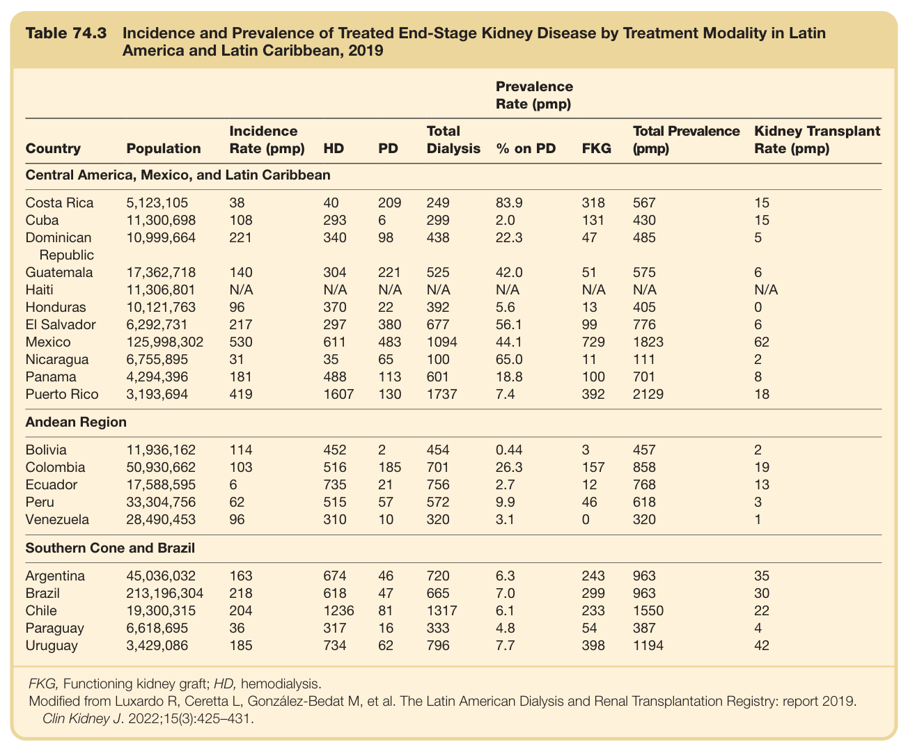
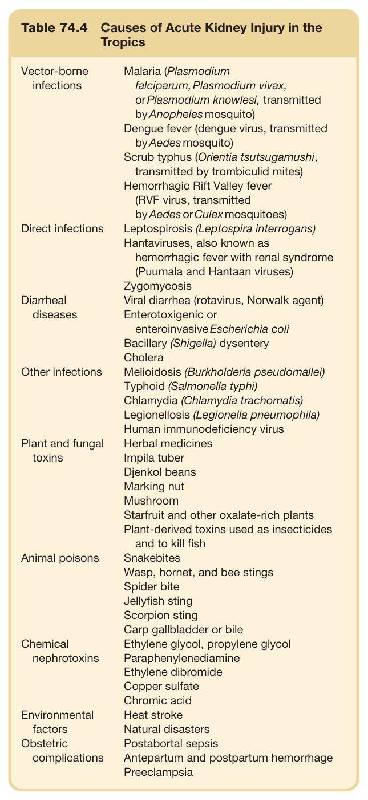

# 74. Global Considerations in Kidney Disease_ Latin America - Figures and Tables Index

This document lists all figures and tables extracted from `74. Global Considerations in Kidney Disease_ Latin America.pdf`.

## Table of Contents
- [Figures](#figures)
- [Tables](#tables)

---

## Figures

### Fig_74_1



Fig. 74.1 Age-standardized death rates due to CKD in Latin America and the Latin Caribbean, per 100,000 population in 2019. (Repro duced from: Pan American Health Organization. The burden of kidney diseases in the Region of the Americas, 2000-2019. Washington, D.C.: PAHO; 2021. Available from: https://www.paho.org/en/enlace/burden-kidney-diseases; and accessed on 11th May 2025.)

---

### Fig_74_2



Fig. 74.2 Age-standardized disability-adjusted life years (DALYs) due to chronic kidney disease in Latin America and the Latin Caribbean, per 100,000 population in 2019. (Reproduced from: Pan American Health Organization. The burden of kidney diseases in the Region of the Americas, 2000-2019. Washington, D.C.: PAHO; 2021. Available from: https://www.paho.org/en/enlace/burden-kidney-diseases and accessed on 11th May 2025.)

---

### Fig_74_3



Fig. 74.3 Age-standardized years of life lost (YLLs) due to chronic kidney disease in Latin America and the Latin Caribbean, per 100,000 population in 2019. (Reproduced from: Pan American Health Organization. The burden of kidney diseases in the Region of the Americas, 2000-2019. Washington, D.C.: PAHO; 2021. Available from: https://www.paho.org/en/enlace/burden-kidney-diseases and accessed on 11th May 2025.)

---

### Fig_74_4



Fig. 74.4 Prevalence of treated end-stage kidney disease and kidney transplantation rates in Latin America and the Latin Caribbean, 2000–2021.

---

### Fig_74_5



Fig. 74.5 Prevalence of treated end-stage kidney disease by treatment modality in Latin America and the Latin Caribbean, 2019. (From SLANH. Registro Latinoamericano de Diálisis y Trasplante. Reporte 2021. https://slanh.net/registros/; 2023. Accessed March 2023.)

---

### Fig_74_6



Fig. 74.6 Kidney transplantation rates in Latin America and the Latin Caribbean (2000–2021).

---

### Fig_74_7



Fig. 74.7 Community-acquired acute kidney injury (AKI) in the tropics can be part of a constellation of manifestations, presenting as specific patterns of AKI syndromes, which help the clinician in deciding a diagnostic approach.

---

## Tables

### Table_74_2

#### Table Image



#### Table Data (CSV: [Table_74_2.csv](Table_74_2.csv))

```markdown
| Table Text (OCR) |
| :--- |
| Table 74.2 Mortality, DALYs, and YYLs Attributable to CKD in Latin America and Latin Caribbean Country  DeathsPer 100,000 Population(95% UI)  DALYsPer 100,000 Population(95% UI)  YLLPer 100,000 Population(95% UI)    Central America, Mexico and the Latin Caribbean    Costa Rica  23.4 (12.4-39.1)  737 (316-1159)  525 (267-899)    Cuba  8.3 (4.5-13.6)  344 (161-527)  209 (108-348)    Dominican Republic  20.8 (9.8-37.9)  671 (211-1130)  523 (238-975)    Guatemala  55.1 (29.9-90.6)  1625 (645-2605)  1403 (733-2361)    Haiti  35.0 (15.4-70.4)  1166 (390-1943)  1000 (425-2026)    Honduras  49.4 (24.6-88.3)  1299 (388-2210)  1115 (534-2029)    El Salvador  72.9 (37.4-124.3)  2122 (693-3551)  1877 (925-3288)    Mexico  36.7 (21.4-55.9)  1210 (656-1763)  911 (514-1415)    Nicaragua  73.9 (40.2-120.2)  2036 (836-3236)  1785 (939-2959)    Panama  23.9 (12.8-39.6)  710 (303-1117)  519 (267-881)    Andean Region    Bolivia          Colombia  12.3 (6.5-20.5)  398 (174-621)  251 (129-430)    Ecuador  37.4 (20.4-60.7)  935 (391-1479)  794 (417-1321)    Peru  21.3 (10.7-36.9)  572 (201-943)  464 (225-824)    Venezuela  21.8 (11.5-36.2)  671 (286-1056)  475 (241-811)    Southern Cone and Brazil    Argentina  21.5 (12.3-33.6)  530 (256-805)  438 (241-700)    Brazil  15.5 (9.3-22.5)  449 (267-631)  336 (199-496)    Chile  13.5 (7.8-21.0)  324 (163-484)  239 (134-379)    Paraguay  27.9 (14.6-46.8)  781 (299-1263)  648 (327-1115)    Uruguay  14.1 (8.8-21.0)  338 (186-490)  270 (166-407) CKD, Chronic kidney disease; DALY, disability-adjusted life years; UI, uncertainty interval; YYL, years of life lost. Reproduced from: Pan American Health Organization. The burden of kidney diseases in the Region of the Americas, 2000-2019. Washington, D.C.: PAHO; 2021. Available from: https://www.paho.org/en/enlace/burden-kidney-diseases and accessed on 11th May 2025. |
```

Table 74.2 Mortality, DALYs, and YYLs Attributable to CKD in Latin America and Latin Caribbean

---

### Table_74_3

#### Table Image



#### Table Data (CSV: [Table_74_3.csv](Table_74_3.csv))

```markdown
| Table Text (OCR) |
| :--- |
| Table 74.3  Incidence and Prevalence of Treated End-Stage Kidney Disease by Treatment Modality in Latin America and Latin Caribbean, 2019 Prevalence Rate (pmp)    Country  Population  Incidence Rate (pmp)  HD  PD  Total Dialysis  % on PD  FKG  Total Prevalence (pmp)  Kidney Transplant Rate (pmp)    Central America, Mexico, and Latin Caribbean    Costa Rica  5,123,105  38  40  209  249  83.9  318  567  15    Cuba  11,300,698  108  293  6  299  2.0  131  430  15    Dominican Republic  10,999,664  221  340  98  438  22.3  47  485  5    Guatemala  17,362,718  140  304  221  525  42.0  51  575  6    Haiti  11,306,801  N/A  N/A  N/A  N/A  N/A  N/A  N/A  N/A    Honduras  10,121,763  96  370  22  392  5.6  13  405  0    El Salvador  6,292,731  217  297  380  677  56.1  99  776  6    Mexico  125,998,302  530  611  483  1094  44.1  729  1823  62    Nicaragua  6,755,895  31  35  65  100  65.0  11  111  2    Panama  4,294,396  181  488  113  601  18.8  100  701  8    Puerto Rico  3,193,694  419  1607  130  1737  7.4  392  2129  18    Andean Region    Bolivia  11,936,162  114  452  2  454  0.44  3  457  2    Colombia  50,930,662  103  516  185  701  26.3  157  858  19    Ecuador  17,588,595  6  735  21  756  2.7  12  768  13    Peru  33,304,756  62  515  57  572  9.9  46  618  3    Venezuela  28,490,453  96  310  10  320  3.1  0  320  1    Southern Cone and Brazil    Argentina  45,036,032  163  674  46  720  6.3  243  963  35    Brazil  213,196,304  218  618  47  665  7.0  299  963  30    Chile  19,300,315  204  1236  81  1317  6.1  233  1550  22    Paraguay  6,618,695  36  317  16  333  4.8  54  387  4    Uruguay  3,429,086  185  734  62  796  7.7  398  1194  42 FKG, Functioning kidney graft; HD, hemodialysis. Modified from Luxardo R, Ceretta L, González-Bedat M, et al. The Latin American Dialysis and Renal Transplantation Registry: report 2019. Clin Kidney J. 2022;15(3):425–431. |
```

Table 74.3 Incidence and Prevalence of Treated End-Stage Kidney Disease by Treatment Modality in Latin America and Latin Caribbean, 2019

---

### Table_74_4

#### Table Image



#### Table Data (CSV: [Table_74_4.csv](Table_74_4.csv))

```markdown
| Table Text (OCR) |
| :--- |
| Table 74.4  Causes of Acute Kidney Injury in the Tropics Vector-borne infections  Malaria (Plasmodium falciparum, Plasmodium vivax, or Plasmodium knowlesi, transmitted by Anopheles mosquito)Dengue fever (dengue virus, transmitted by Aedes mosquito)Scrub typhus (Orientia tsutsugamushi, transmitted by trombiculid mites)Hemorrhagic Rift Valley fever (RVF virus, transmitted by Aedes or Culex mosquitoes)    Direct infections  Leptospirosis (Leptospira interrogans)Hantaviruses, also known as hemorrhagic fever with renal syndrome (Puumala and Hantaan viruses)Zygomycosis    Diarrheal diseases  Viral diarrhea (rotavirus, Norwalk agent)Enterotoxigenic or enteroinvasive Escherichia coliBacillary (Shigella) dysenteryCholera    Other infections  Melioidosis (Burkholderia pseudomallei)Typhoid (Salmonella typhi)Chlamydia (Chlamydia trachomatis)Legionellosis (Legionella pneumophila)Human immunodeficiency virus    Plant and fungal toxins  Herbal medicinesImpila tuberDjenkol beansMarking nutMushroomStarfruit and other oxalate-rich plantsPlant-derived toxins used as insecticides and to kill fish    Animal poisons  SnakebitesWasp, hornet, and bee stingsSpider biteJellyfish stingScorpion stingCarp gallbladder or bile    Chemical nephrotoxins  Ethylene glycol, propylene glycolParaphenylenediamineEthylene dibromideCopper sulfateChromic acid    Environmental factors  Heat strokeNatural disasters    Obstetric complications  Postabortal sepsisAntepartum and postpartum hemorrhagePreeclampsia |
```

Table 74.4 Causes of Acute Kidney Injury in the Tropics

---
