# 75. Global Considerations in Kidney Disease_ Africa - Figures and Tables Index

This document lists all figures and tables extracted from `75. Global Considerations in Kidney Disease_ Africa.pdf`.

## Table of Contents
- [Figures](#figures)
- [Tables](#tables)

---

## Figures

### Fig_75_1

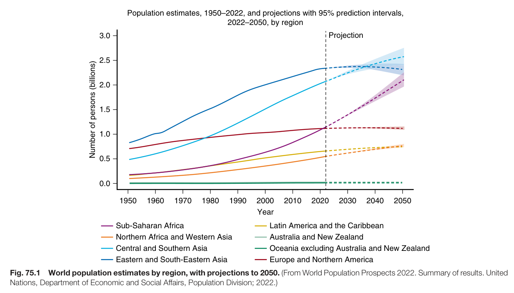

Fig. 75.1 World population estimates by region, with projections to 2050. (From World Population Prospects 2022. Summary of results. United Nations, Department of Economic and Social Affairs, Population Division; 2022.)

---

### Fig_75_2

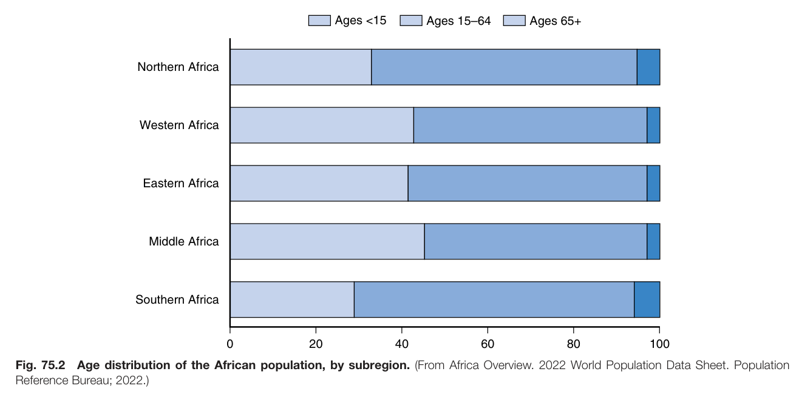

Fig. 75.2 Age distribution of the African population, by subregion. (From Africa Overview. 2022 World Population Data Sheet. Population Reference Bureau; 2022.)

---

### Fig_75_3

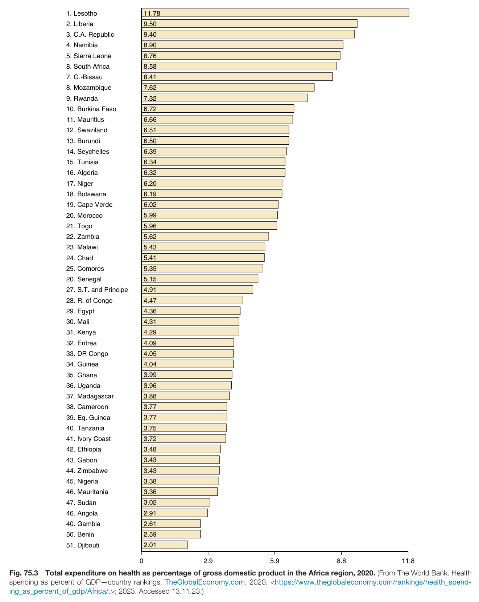

Fig. 75.3 Total expenditure on health as percentage of gross domestic product in the Africa region, 2020. (From The World Bank. Health spending as percent of GDP—country rankings. TheGlobalEconomy.com, 2020. <https://www.theglobaleconomy.com/rankings/health\_spending\_as\_percent\_of\_gdp/Africa/.>; 2023. Accessed 13.11.23.)

---

### Fig_75_4

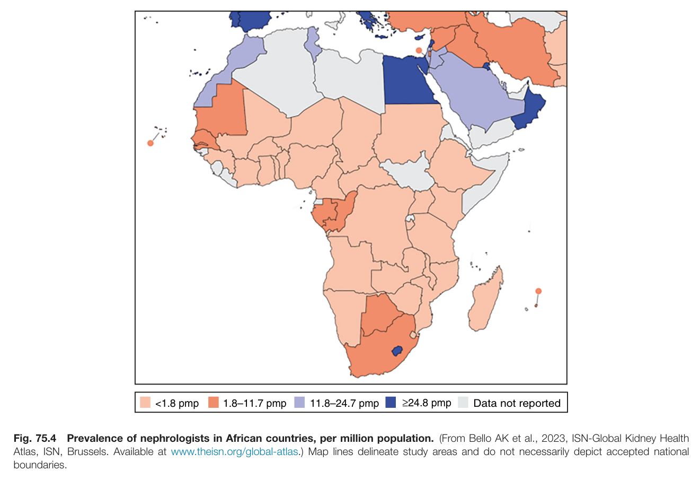

Fig. 75.4 Prevalence of nephrologists in African countries, per million population. (From Bello AK et al., 2023, ISN-Global Kidney Health Atlas, ISN, Brussels. Available at www.theisn.org/global-atlas.) Map lines delineate study areas and do not necessarily depict accepted nationa boundaries.

---

### Fig_75_5

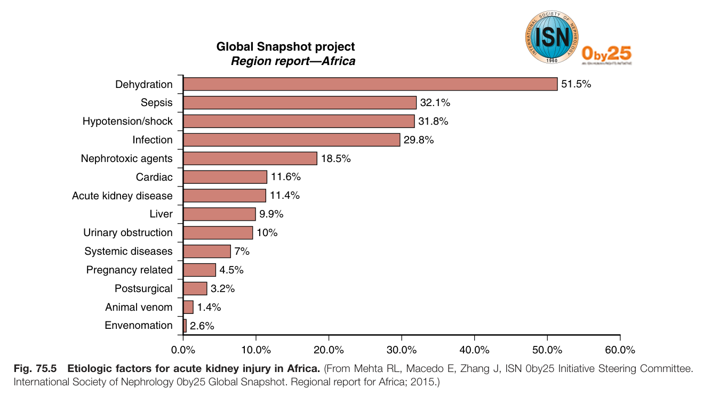

Fig. 75.5 Etiologic factors for acute kidney injury in Africa. (From Mehta RL, Macedo E, Zhang J, ISN 0by25 Initiative Steering Committee. International Society of Nephrology 0by25 Global Snapshot. Regional report for Africa; 2015.)

---

### Fig_75_6

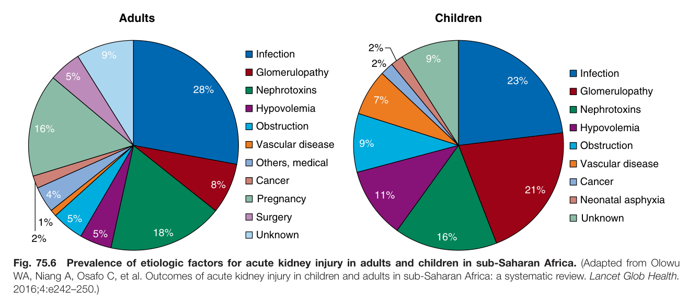

Fig. 75.6 Prevalence of etiologic factors for acute kidney injury in adults and children in sub-Saharan Africa. (Adapted from Olowu WA, Niang A, Osafo C, et al. Outcomes of acute kidney injury in children and adults in sub-Saharan Africa: a systematic review. Lancet Glob Health. 2016;4:e242–250.)

---

### Fig_75_7

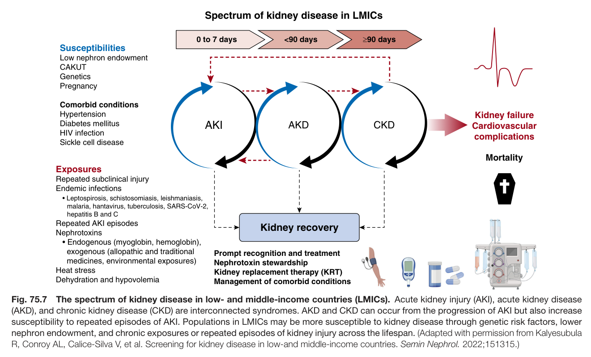

Fig. 75.7 The spectrum of kidney disease in low- and middle-income countries (LMICs). Acute kidney injury (AKI), acute kidney disease (AKD), and chronic kidney disease (CKD) are interconnected syndromes. AKD and CKD can occur from the progression of AKI but also increase susceptibility to repeated episodes of AKI. Populations in LMICs may be more susceptible to kidney disease through genetic risk factors, lower nephron endowment, and chronic exposures or repeated episodes of kidney injury across the lifespan. (Adapted with permission from Kalyesubula R, Conroy AL, Calice-Silva V, et al. Screening for kidney disease in low-and middle-income countries. Semin Nephrol. 2022;151315.)

---

### Fig_75_8

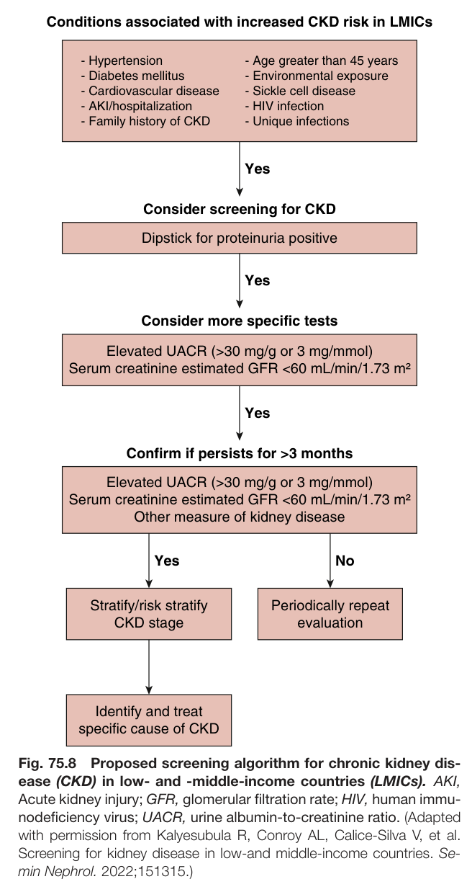

Fig. 75.8 Proposed screening algorithm for chronic kidney dis- ease (CKD) in low- and -middle-income countries (LMICs). AKI, Acute kidney injury; GFR, glomerular filtration rate; HIV, human immu- nodeficiency virus; UACR, urine albumin-to-creatinine ratio. (Adapted with permission from Kalyesubula R, Conroy AL, Calice-Silva V, et al. Screening for kidney disease in low-and middle-income countries. Se- min Nephrol. 2022;151315.)

---

### Fig_75_9

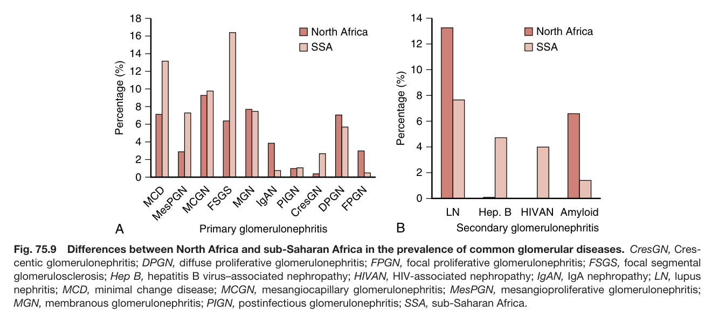

Fig. 75.9 Differences between North Africa and sub-Saharan Africa in the prevalence of common glomerular diseases. CresGN, Cres centic glomerulonephritis; DPGN, diffuse proliferative glomerulonephritis; FPGN, focal proliferative glomerulonephritis; FSGS, focal segmenta glomerulosclerosis; Hep B, hepatitis B virus–associated nephropathy; HIVAN, HIV-associated nephropathy; IgAN, IgA nephropathy; LN, lupus nephritis; MCD, minimal change disease; MCGN, mesangiocapillary glomerulonephritis; MesPGN, mesangioproliferative glomerulonephritis; MGN, membranous glomerulonephritis; PIGN, postinfectious glomerulonephritis; SSA, sub-Saharan Africa

---

## Tables

### Table_75_1

#### Table Image

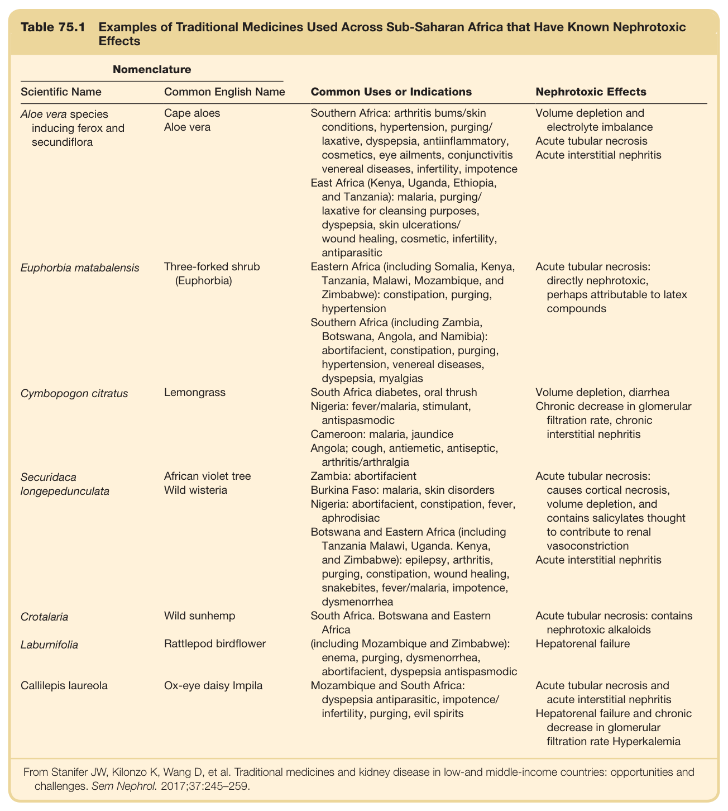

#### Table Data (CSV: [Table_75_1.csv](Table_75_1.csv))

```markdown
| Table Text (OCR) |
| :--- |
| Table 75.1 Examples of Traditional Medicines Used Across Sub-Saharan Africa that Have Known Nephrotoxic Effects Nomenclature    Scientific Name  Common English Name  Common Uses or Indications  Nephrotoxic Effects    Aloe vera species inducing ferox and secundiflora  Cape aloesAloe vera  Southern Africa: arthritis bums/skin conditions, hypertension, purging/laxative, dyspepsia, antiinflammatory, cosmetics, eye ailments, conjunctivitis venereal diseases, infertility, impotenceEast Africa (Kenya, Uganda, Ethiopia, and Tanzania): malaria, purging/laxative for cleansing purposes, dyspepsia, skin ulcerations/wound healing, cosmetic, infertility, antiparasitic  Volume depletion and electrolyte imbalanceAcute tubular necrosisAcute interstitial nephritis    Euphorbia matabalensis  Three-forked shrub (Euphorbia)  Eastern Africa (including Somalia, Kenya, Tanzania, Malawi, Mozambique, and Zimbabwe): constipation, purging, hypertensionSouthern Africa (including Zambia, Botswana, Angola, and Namibia): abortifacient, constipation, purging, hypertension, venereal diseases, dyspepsia, myalgias  Acute tubular necrosis: directly nephrotoxic, perhaps attributable to latex compounds    Cymbopogon citratus  Lemongrass  South Africa diabetes, oral thrushNigeria: fever/malaria, stimulant, antispasmodicCameroon: malaria, jaundiceAngola; cough, antiemetic, antiseptic, arthritis/arthralgia  Volume depletion, diarrheaChronic decrease in glomerular filtration rate, chronic interstitial nephritis    Securidaca longepedunculata  African violet treeWild wisteria  Zambia: abortifacientBurkina Faso: malaria, skin disordersNigeria: abortifacient, constipation, fever, aphrodisiacBotswana and Eastern Africa (including Tanzania Malawi, Uganda. Kenya, and Zimbabwe): epilepsy, arthritis, purging, constipation, wound healing, snakebites, fever/malaria, impotence, dysmenorrhea  Acute tubular necrosis: causes cortical necrosis, volume depletion, and contains salicylates thought to contribute to renal vasoconstrictionAcute interstitial nephritis    Crotalaria  Wild sunhemp  South Africa. Botswana and Eastern Africa  Acute tubular necrosis: contains nephrotoxic alkaloids    Laburnifolia  Rattlepod birdflower  (including Mozambique and Zimbabwe): enema, purging, dysmenorrhea, abortifacient, dyspepsia antispasmodic  Hepatorenal failure    Callilepis laureola  Ox-eye daisy Impila  Mozambique and South Africa: dyspepsia antiparasitic, impotence/infertility, purging, evil spirits  Acute tubular necrosis and acute interstitial nephritisHepatorenal failure and chronic decrease in glomerular filtration rate Hyperkalemia From Stanifer JW, Kilonzo K, Wang D, et al. Traditional medicines and kidney disease in low-and middle-income countries: opportunities and challenges. Sem Nephrol. 2017;37:245–259. |
```

Table 75.1 Examples of Traditional Medicines Used Across Sub-Saharan Africa that Have Known Nephrotoxic Effects

---

### Table_75_2

#### Table Image

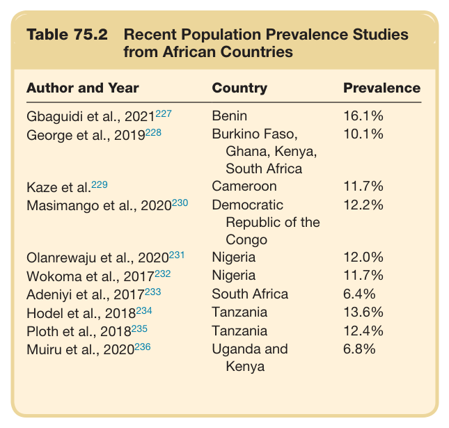

#### Table Data (CSV: [Table_75_2.csv](Table_75_2.csv))

```markdown
| Table Text (OCR) |
| :--- |
| Table 75.2  Recent Population Prevalence Studies from African Countries Author and Year  Country  Prevalence    Gbaguidi et al., 2021227  Benin  16.1%    George et al., 2019228  Burkino Faso, Ghana, Kenya, South Africa  10.1%    Kaze et al.229  Cameroon  11.7%    Masimango et al., 2020230  Democratic Republic of the Congo  12.2%    Olanrewaju et al., 2020231  Nigeria  12.0%    Wokoma et al., 2017232  Nigeria  11.7%    Adeniyi et al., 2017233  South Africa  6.4%    Hodel et al., 2018234  Tanzania  13.6%    Ploth et al., 2018235  Tanzania  12.4%    Muiru et al., 2020236  Uganda and Kenya  6.8% |
```

Table 75.2 Recent Population Prevalence Studies from African Countries

---

### Table_75_3

#### Table Image

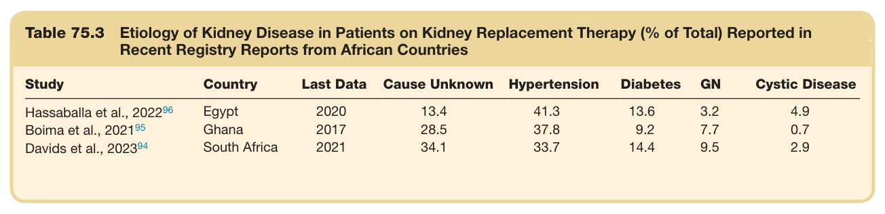

#### Table Data (CSV: [Table_75_3.csv](Table_75_3.csv))

```markdown
| Table Text (OCR) |
| :--- |
| Table 75.3  Etiology of Kidney Disease in Patients on Kidney Replacement Therapy (% of Total) Reported in Recent Registry Reports from African Countries Study  Country  Last Data  Cause Unknown  Hypertension  Diabetes  GN  Cystic Disease    Hassaballa et al., 202296  Egypt  2020  13.4  41.3  13.6  3.2  4.9    Boima et al., 202195  Ghana  2017  28.5  37.8  9.2  7.7  0.7    Davids et al., 202394  South Africa  2021  34.1  33.7  14.4  9.5  2.9 |
```

Table 75.3 Etiology of Kidney Disease in Patients on Kidney Replacement Therapy (% of Total) Reported in Recent Registry Reports from African Countries

---

### Table_75_4

#### Table Image

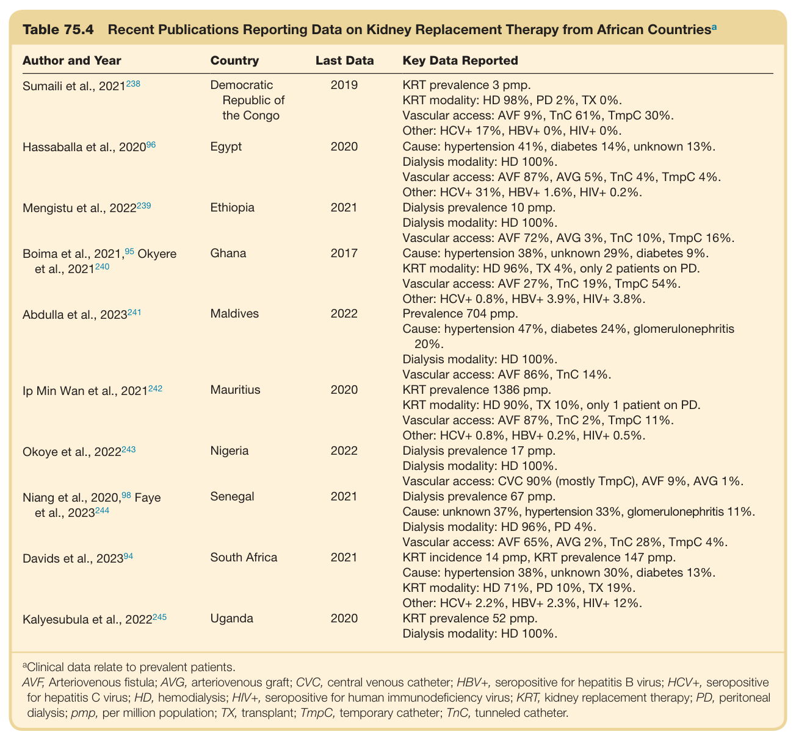

#### Table Data (CSV: [Table_75_4.csv](Table_75_4.csv))

```markdown
| Table Text (OCR) |
| :--- |
| Table 75.4  Recent Publications Reporting Data on Kidney Replacement Therapy from African Countries<sup>a</sup> Author and Year  Country  Last Data  Key Data Reported     Sumaili et al., 2021^{238}   Democratic Republic of the Congo  2019  KRT prevalence 3 pmp.KRT modality: HD 98%, PD 2%, TX 0%.Vascular access: AVF 9%, TnC 61%, TmpC 30%.Other: HCV+ 17%, HBV+ 0%, HIV+ 0%.     Hassaballa et al., 2020^{96}   Egypt  2020  Cause: hypertension 41%, diabetes 14%, unknown 13%.Dialysis modality: HD 100%.Vascular access: AVF 87%, AVG 5%, TnC 4%, TmpC 4%.Other: HCV+ 31%, HBV+ 1.6%, HIV+ 0.2%.     Mengistu et al., 2022^{239}   Ethiopia  2021  Dialysis prevalence 10 pmp.Dialysis modality: HD 100%.Vascular access: AVF 72%, AVG 3%, TnC 10%, TmpC 16%.     Boima et al., 2021, ^{95} Okyere et al., 2021^{240}   Ghana  2017  Cause: hypertension 38%, unknown 29%, diabetes 9%.KRT modality: HD 96%, TX 4%, only 2 patients on PD.Vascular access: AVF 27%, TnC 19%, TmpC 54%.Other: HCV+ 0.8%, HBV+ 3.9%, HIV+ 3.8%.     Abdulla et al., 2023^{241}   Maldives  2022  Prevalence 704 pmp.Cause: hypertension 47%, diabetes 24%, glomerulonephritis 20%.Dialysis modality: HD 100%.Vascular access: AVF 86%, TnC 14%.     Ip Min Wan et al., 2021^{242}   Mauritius  2020  KRT prevalence 1386 pmp.KRT modality: HD 90%, TX 10%, only 1 patient on PD.Vascular access: AVF 87%, TnC 2%, TmpC 11%.Other: HCV+ 0.8%, HBV+ 0.2%, HIV+ 0.5%.     Okoye et al., 2022^{243}   Nigeria  2022  Dialysis prevalence 17 pmp.Dialysis modality: HD 100%.Vascular access: CVC 90% (mostly TmpC), AVF 9%, AVG 1%.     Niang et al., 2020, ^{98} Faye et al., 2023^{244}   Senegal  2021  Dialysis prevalence 67 pmp.Cause: unknown 37%, hypertension 33%, glomerulonephritis 11%.Dialysis modality: HD 96%, PD 4%.Vascular access: AVF 65%, AVG 2%, TnC 28%, TmpC 4%.     Davids et al., 2023^{94}   South Africa  2021  KRT incidence 14 pmp, KRT prevalence 147 pmp.Cause: hypertension 38%, unknown 30%, diabetes 13%.KRT modality: HD 71%, PD 10%, TX 19%.Other: HCV+ 2.2%, HBV+ 2.3%, HIV+ 12%.     Kalyesubula et al., 2022^{245}   Uganda  2020  KRT prevalence 52 pmp.Dialysis modality: HD 100%. <sup>a</sup>Clinical data relate to prevalent patients. AVF, Arteriovenous fistula; AVG, arteriovenous graft; CVC, central venous catheter; HBV+, seropositive for hepatitis B virus; HCV+, seropositive for hepatitis C virus; HD, hemodialysis; HIV+, seropositive for human immunodeficiency virus; KRT, kidney replacement therapy; PD, peritoneal dialysis; pmp, per million population; TX, transplant; TmpC, temporary catheter; TnC, tunneled catheter. |
```

Table 75.4 Recent Publications Reporting Data on Kidney Replacement Therapy from African Countries<sup>a</sup>

---
