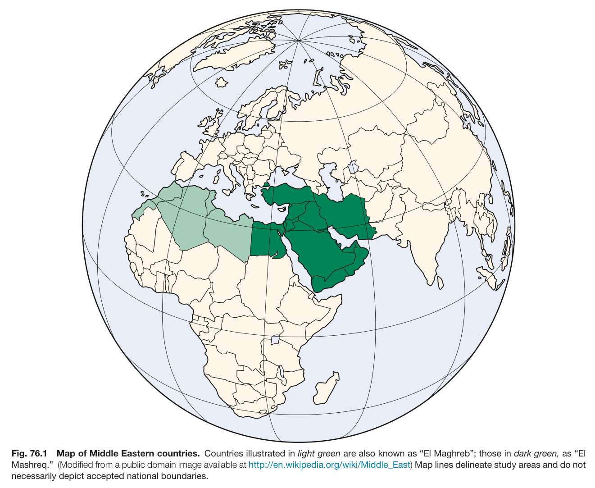
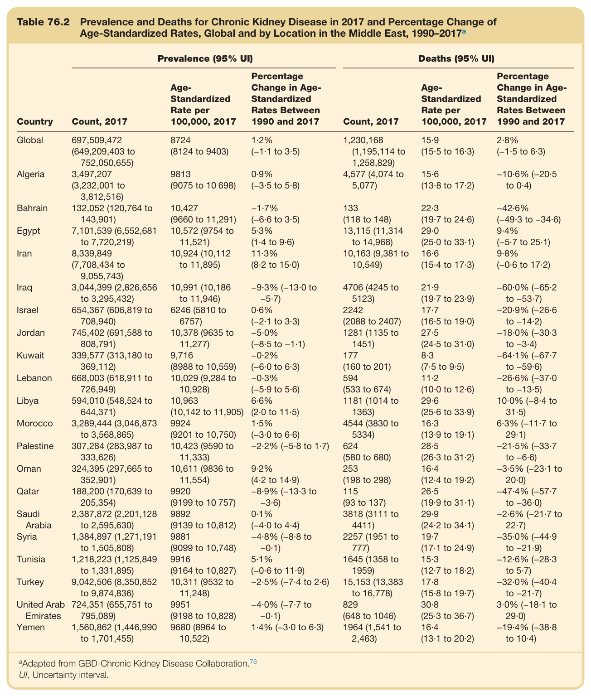
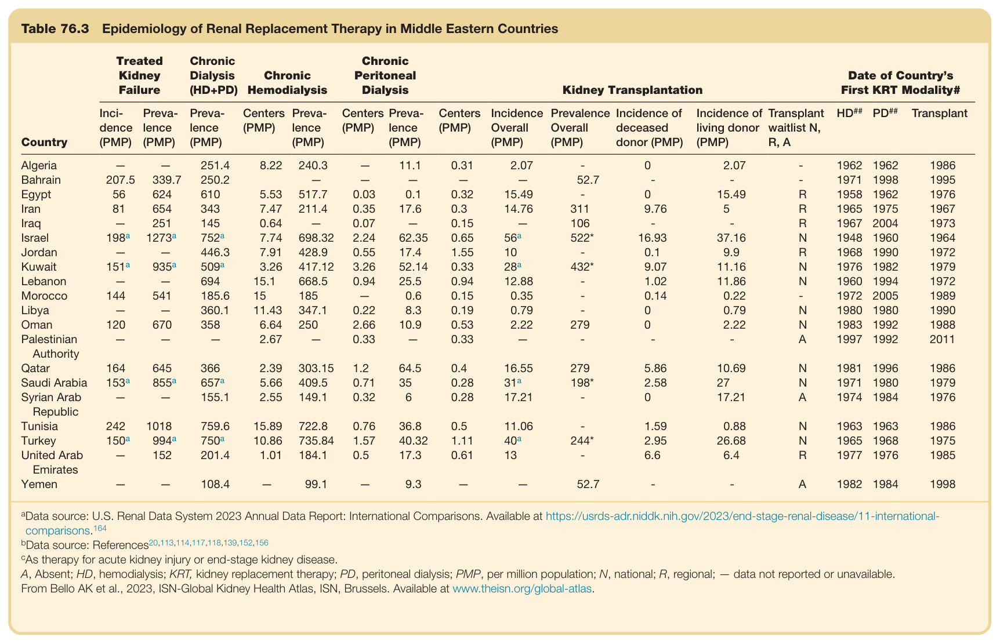
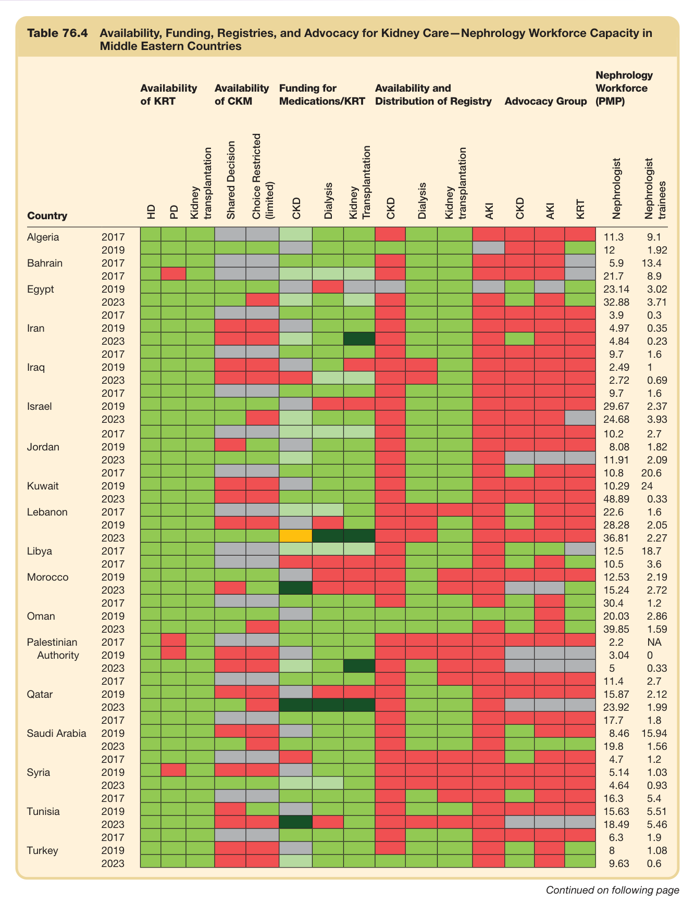
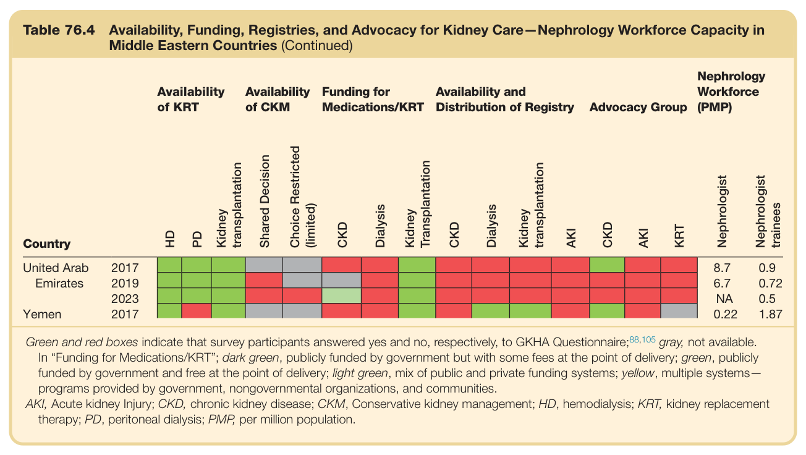
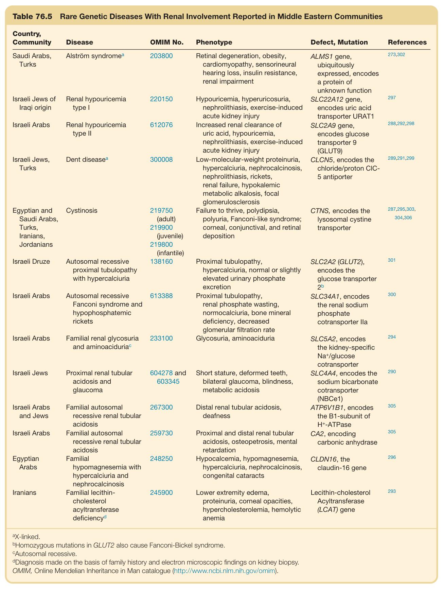
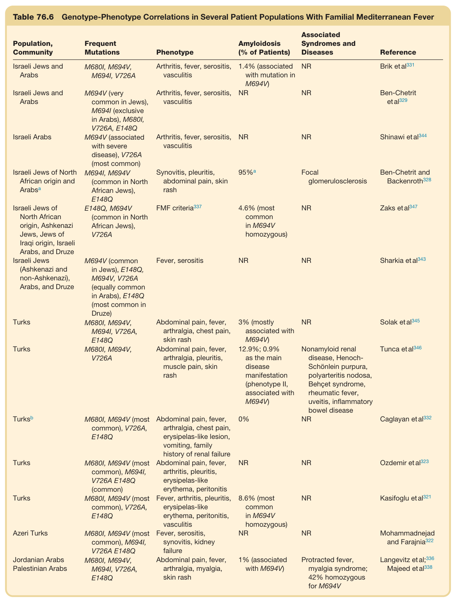
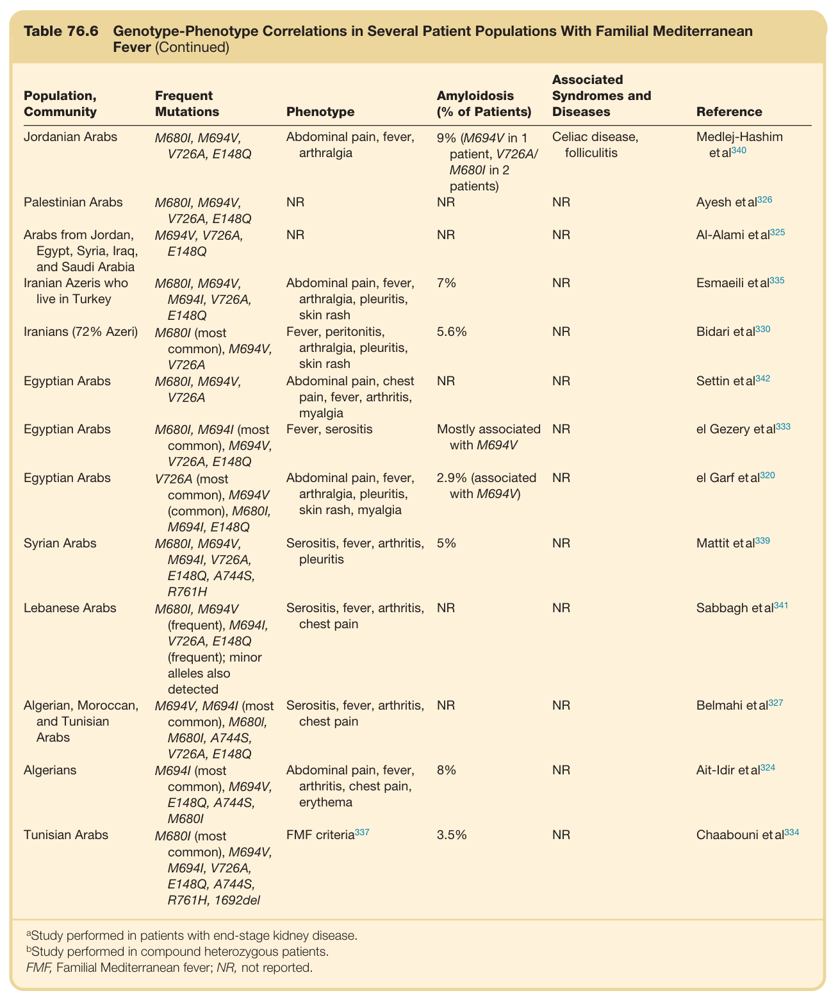

# 76. Global Considerations in Kidney Disease_ Near and Middle East - Figures and Tables Index

This document lists all figures and tables extracted from `76. Global Considerations in Kidney Disease_ Near and Middle East.pdf`.

## Table of Contents
- [Figures](#figures)
- [Tables](#tables)

---

## Figures

### Fig_76_1



Fig. 76.1 Map of Middle Eastern countries. Countries illustrated in light green are also known as “El Maghreb”; those in dark green, as “E Mashreq.” (Modified from a public domain image available at http://en.wikipedia.org/wiki/Middle\_East) Map lines delineate study areas and do not necessarily depict accepted national boundaries.

---

## Tables

### Table_76_2

#### Table Images (2 Parts)

- **Part 1 (Page 6)**:
  

- **Part 2 (Page 7)**:
  

#### Table Data (CSV: [Table_76_2.csv](Table_76_2.csv))

```markdown
| Table Text (OCR) |
| :--- |
| Table 76.2 Prevalence and Deaths for Chronic Kidney Disease in 2017 and Percentage Change of Age-Standardized Rates, Global and by Location in the Middle East, 1990–2017<sup>a</sup> Country  Prevalence (95% UI)  Deaths (95% UI)    Count, 2017  Age-Standardized Rate per 100,000, 2017  Percentage Change in Age-Standardized Rates Between 1990 and 2017  Count, 2017  Age-Standardized Rate per 100,000, 2017  Percentage Change in Age-Standardized Rates Between 1990 and 2017    Global  697,509,472(649,209,403 to 752,050,655)  8724(8124 to 9403)  1·2%(-1·1 to 3·5)  1,230,168(1,195,114 to 1,258,829)  15·9(15·5 to 16·3)  2·8%(-1·5 to 6·3)    Algeria  3,497,207(3,232,001 to 3,812,516)  9813(9075 to 10 698)  0·9%(-3·5 to 5·8)  4,577 (4,074 to 5,077)  15·6(13·8 to 17·2)  -10·6% (-20·5 to 0·4)    Bahrain  132,052 (120,764 to 143,901)  10,427(9660 to 11,291)  -1·7%(-6·6 to 3·5)  133(118 to 148)  22·3(19·7 to 24·6)  -42·6%(-49·3 to -34·6)    Egypt  7,101,539 (6,552,681 to 7,720,219)  10,572 (9754 to 11,521)  5·3%(1·4 to 9·6)  13,115 (11,314 to 14,968)  29·0(25·0 to 33·1)  9·4%(-5·7 to 25·1)    Iran  8,339,849(7,708,434 to 9,055,743)  10,924 (10,112 to 11,895)  11·3%(8·2 to 15·0)  10,163 (9,381 to 10,549)  16·6(15·4 to 17·3)  9·8%(-0·6 to 17·2)    Iraq  3,044,399 (2,826,656 to 3,295,432)  10,991 (10,186 to 11,946)  -9·3% (-13·0 to -5·7)  4706 (4245 to 5123)  21·9(19·7 to 23·9)  -60·0% (-65·2 to -53·7)    Israel  654,367 (606,819 to 708,940)  6246 (5810 to 6757)  0·6%(-2·1 to 3·3)  2242(2088 to 2407)  17·7(16·5 to 19·0)  -20·9% (-26·6 to -14·2)    Jordan  745,402 (691,588 to 808,791)  10,378 (9635 to 11,277)  -5·0%(-8·5 to -1·1)  1281 (1135 to 1451)  27·5(24·5 to 31·0)  -18·0% (-30·3 to -3·4)    Kuwait  339,577 (313,180 to 369,112)  9,716(8988 to 10,559)  -0·2%(-6·0 to 6·3)  177(160 to 201)  8·3(7·5 to 9·5)  -64·1% (-67·7 to -59·6)    Lebanon  668,003 (618,911 to 726,949)  10,029 (9,284 to 10,928)  -0·3%(-5·9 to 5·6)  594(533 to 674)  11·2(10·0 to 12·6)  -26·6% (-37·0 to -13·5)    Libya  594,010 (548,524 to 644,371)  10,963(10,142 to 11,905)  6·6%(2·0 to 11·5)  1181 (1014 to 1363)  29·6(25·6 to 33·9)  10·0% (-8·4 to 31·5)    Morocco  3,289,444 (3,046,873 to 3,568,865)  9924(9201 to 10,750)  1·5%(-3·0 to 6·6)  4544 (3830 to 5334)  16·3(13·9 to 19·1)  6·3% (-11·7 to 29·1)    Palestine  307,284 (283,987 to 333,626)  10,423 (9590 to 11,333)  -2·2% (-5·8 to 1·7)  624(580 to 680)  28·5(26·3 to 31·2)  -21·5% (-33·7 to -6·6)    Oman  324,395 (297,665 to 352,901)  10,611 (9836 to 11,554)  9·2%(4·2 to 14·9)  253(198 to 298)  16·4(12·4 to 19·2)  -3·5% (-23·1 to 20·0)    Qatar  188,200 (170,639 to 205,354)  9920(9199 to 10 757)  -8·9% (-13·3 to -3·6)  115(93 to 137)  26·5(19·9 to 31·1)  -47·4% (-57·7 to -36·0)    Saudi Arabia  2,387,872 (2,201,128 to 2,595,630)  9892(9139 to 10,812)  0·1%(-4·0 to 4·4)  3818 (3111 to 4411)  29·9(24·2 to 34·1)  -2·6% (-21·7 to 22·7)    Syria  1,384,897 (1,271,191 to 1,505,808)  9881(9099 to 10,748)  -4·8% (-8·8 to -0·1)  2257 (1951 to 777)  19·7(17·1 to 24·9)  -35·0% (-44·9 to -21·9)    Tunisia  1,218,223 (1,125,849 to 1,331,895)  9916(9164 to 10,827)  5·1%(-0·6 to 11·9)  1645 (1358 to 1959)  15·3(12·7 to 18·2)  -12·6% (-28·3 to 5·7)    Turkey  9,042,506 (8,350,852 to 9,874,836)  10,311 (9532 to 11,248)  -2·5% (-7·4 to 2·6)  15,153 (13,383 to 16,778)  17·8(15·8 to 19·7)  -32·0% (-40·4 to -21·7)    United Arab Emirates  724,351 (655,751 to 795,089)  9951(9198 to 10,828)  -4·0% (-7·7 to -0·1)  829(648 to 1046)  30·8(25·3 to 36·7)  3·0% (-18·1 to 29·0)    Yemen  1,560,862 (1,446,990 to 1,701,455)  9680 (8964 to 10,522)  1·4% (-3·0 to 6·3)  1964 (1,541 to 2,463)  16·4(13·1 to 20·2)  -19·4% (-38·8 to 10·4) <sup>a</sup>Adapted from GBD-Chronic Kidney Disease Collaboration.<sup>76</sup> UI, Uncertainty interval. |
```

Table 76.2 Prevalence and Deaths for Chronic Kidney Disease in 2017 and Percentage Change of Age-Standardized Rates, Global and by Location in the Middle East, 1990–2017<sup>a</sup>

---

### Table_76_4

#### Table Images (2 Parts)

- **Part 1 (Page 9)**:
  

- **Part 2 (Page 10)**:
  

#### Table Data (CSV: [Table_76_4.csv](Table_76_4.csv))

```markdown
| Table Text (OCR) |
| :--- |
| Table 76.4 Availability, Funding, Registries, and Advocacy for Kidney Care—Nephrology Workforce Capacity in Middle Eastern Countries Availability of KRT  Availability of CKM  Funding for Medications/KRT  Availability and Distribution of Registry  Advocacy Group  Nephrology Workforce (PMP)    HD  PD  Kidney transplantation  Shared Decision  Choice Restricted (limited)  CKD  Dialysis  Kidney Transplantation  CKD  Dialysis  Kidney transplantation  AKI  CKD  AKI  KRT  Nephrologist trainees    Country                                      Algeria  2017                                11.3    2019                                12    Bahrain  2017                                5.9    2017                                21.7    Egypt  2019                                23.14    2023                                32.88    2017                                3.9    Iran  2019                                4.97    2023                                4.84    2017                                9.7    Iraq  2019                                2.49    2023                                2.72    2017                                9.7    Israel  2019                                29.67    2023                                24.68    2017                                10.2    Jordan  2019                                8.08    2023                                11.91    2017                                10.8    Kuwait  2019                                10.29    2023                                48.89    Lebanon  2017                                22.6    2019                                28.28    2023                                36.81    Libya  2017                                12.5    2017                                10.5    Morocco  2019                                12.53    2023                                15.24    2017                                30.4    Oman  2019                                20.03    2023                                39.85    Palestinian Authority  2017                                2.2    2019                                3.04    2023                                5    2017                                11.4    Qatar  2019                                15.87    2023                                23.92    2017                                17.7    Saudi Arabia  2019                                8.46    2023                                19.8    2017                                4.7    Syria  2019                                5.14    2023                                4.64    2017                                16.3    Tunisia  2019                                15.63    2023                                18.49    2017                                6.3    Turkey  2019                                8    2023                                9.63 Continued on following page |
```

Table 76.4 Availability, Funding, Registries, and Advocacy for Kidney Care—Nephrology Workforce Capacity in Middle Eastern Countries (Continued)

---

### Table_76_5

#### Table Image



#### Table Data (CSV: [Table_76_5.csv](Table_76_5.csv))

```markdown
| Table Text (OCR) |
| :--- |
| Table 76.5 Rare Genetic Diseases With Renal Involvement Reported in Middle Eastern Communities Country, Community  Disease  OMIM No.  Phenotype  Defect, Mutation  References    Saudi Arabs, Turks   Alström\ syndrome^a   203800  Retinal degeneration, obesity, cardiomyopathy, sensorineural hearing loss, insulin resistance, renal impairment  ALMS1 gene, ubiquitously expressed, encodes a protein of unknown function  273,302    Israeli Jews of Iraqi origin  Renal hypouricemia type I  220150  Hypouricemia, hyperuricosuria, nephrolithiasis, exercise-induced acute kidney injury  SLC22A12 gene, encodes uric acid transporter URAT1  297    Israeli Arabs  Renal hypouricemia type II  612076  Increased renal clearance of uric acid, hypouricemia, nephrolithiasis, exercise-induced acute kidney injury  SLC2A9 gene, encodes glucose transporter 9 (GLUT9)  288,292,298    Israeli Jews, Turks   Dent\ disease^a   300008  Low-molecular-weight proteinuria, hypercalciuria, nephrocalcinosis, nephrolithiasis, rickets, renal failure, hypokalemic metabolic alkalosis, focal glomerulosclerosis  CLCN5, encodes the chloride/proton CIC-5 antiporter  289,291,299    Egyptian and Saudi Arabs, Turks, Iranians, Jordanians  Cystinosis  219750 (adult)219900 (juvenile)219800 (infantile)  Failure to thrive, polydipsia, polyuria, Fanconi-like syndrome; corneal, conjunctival, and retinal deposition  CTNS, encodes the lysosomal cystine transporter  287,295,303,304,306    Israeli Druze  Autosomal recessive proximal tubulopathy with hypercalciuria  138160  Proximal tubulopathy, hypercalciuria, normal or slightly elevated urinary phosphate excretion  SLC2A2 (GLUT2), encodes the glucose transporter  2^b   301    Israeli Arabs  Autosomal recessive Fanconi syndrome and hypophosphatemic rickets  613388  Proximal tubulopathy, renal phosphate wasting, normocalciuria, bone mineral deficiency, decreased glomerular filtration rate  SLC34A1, encodes the renal sodium phosphate cotransporter IIa  300    Israeli Arabs  Familial renal glycosuria and aminoacidurica  233100  Glycosuria, aminoaciduria  SLC5A2, encodes the kidney-specific  Na^+/glucose  cotransporter  294    Israeli Jews  Proximal renal tubular acidosis and glaucoma  604278 and 603345  Short stature, deformed teeth, bilateral glaucoma, blindness, metabolic acidosis  SLC4A4, encodes the sodium bicarbonate cotransporter (NBCe1)  290    Israeli Arabs and Jews  Familial autosomal recessive renal tubular acidosis  267300  Distal renal tubular acidosis, deafness  ATP6V1B1, encodes the B1-subunit of  H^+-ATPase   305    Israeli Arabs  Familial autosomal recessive renal tubular acidosis  259730  Proximal and distal renal tubular acidosis, osteopetrosis, mental retardation  CA2, encoding carbonic anhydrase  305    Egyptian Arabs  Familial hypomagnesemia with hypercalciuria and nephrocalcinosis  248250  Hypocalcemia, hypomagnesemia, hypercalciuria, nephrocalcinosis, congenital cataracts  CLDN16, the claudin-16 gene  296    Iranians  Familial lecithin-cholesterol acyltransferase  deficiency^d   245900  Lower extremity edema, proteinuria, corneal opacities, hypercholesterolemia, hemolytic anemia  Lecithin-cholesterol Acyltransferase (LCAT) gene  293 <sup>a</sup>X-linked. <sup>b</sup>Homozygous mutations in GLUT2 also cause Fanconi-Bickel syndrome. <sup>c</sup>Autosomal recessive. <sup>d</sup>Diagnosis made on the basis of family history and electron microscopic findings on kidney biopsy. OMIM, Online Mendelian Inheritance in Man catalogue (http://www.ncbi.nlm.nih.gov/omim). |
```

Table 76.5 Rare Genetic Diseases With Renal Involvement Reported in Middle Eastern Communities

---

### Table_76_6

#### Table Images (2 Parts)

- **Part 1 (Page 18)**:
  

- **Part 2 (Page 19)**:
  

#### Table Data (CSV: [Table_76_6.csv](Table_76_6.csv))

```markdown
| Table Text (OCR) |
| :--- |
| Table 76.6 Genotype-Phenotype Correlations in Several Patient Populations With Familial Mediterranean Fever Population, Community  Frequent Mutations  Phenotype  Amyloidosis (% of Patients)  Associated Syndromes and Diseases  Reference    Israeli Jews and Arabs  M680I, M694V, M694I, V726A  Arthritis, fever, serositis, vasculitis  1.4% (associated with mutation in M694V)  NR  Brik et al331    Israeli Jews and Arabs  M694V (very common in Jews), M694I (exclusive in Arabs), M680I, V726A, E148Q  Arthritis, fever, serositis, vasculitis  NR  NR  Ben-Chetrit et al329    Israeli Arabs  M694V (associated with severe disease), V726A (most common)  Arthritis, fever, serositis, vasculitis  NR  NR  Shinawi et al344    Israeli Jews of North African origin and  Arabs^a   M694I, M694V (common in North African Jews), E148Q  Synovitis, pleuritis, abdominal pain, skin rash   95\%^a   Focal glomerulosclerosis  Ben-Chetrit and Backenroth328    Israeli Jews of North African origin, Ashkenazi Jews, Jews of Iraqi origin, Israeli Arabs, and Druze  E148Q, M694V (common in North African Jews), V726A   FMF\ criteria^{337}   4.6% (most common in M694V homozygous)  NR  Zaks et al347    Israeli Jews (Ashkenazi and non-Ashkenazi), Arabs, and Druze  M694V (common in Jews), E148Q, M694V, V726A (equally common in Arabs), E148Q (most common in Druze)  Fever, serositis  NR  NR  Sharkia et al343    Turks  M680I, M694V, M694I, V726A, E148Q  Abdominal pain, fever, arthralgia, chest pain, skin rash  3% (mostly associated with M694V)  NR  Solak et al345    Turks  M680I, M694V, V726A  Abdominal pain, fever, arthralgia, pleuritis, muscle pain, skin rash  12.9%; 0.9% as the main disease manifestation (phenotype II, associated with M694V)  Nonamyloid renal disease, Henoch-Schönlein purpura, polyarteritis nodosa, Behçet syndrome, rheumatic fever, uveitis, inflammatory bowel disease  Tunca et al346     Turks^b   M680I, M694V (most common), V726A, E148Q  Abdominal pain, fever, arthralgia, chest pain, erysipelas-like lesion, vomiting, family history of renal failure  0%  NR  Caglayan et al332    Turks  M680I, M694V (most common), M694I, V726A E148Q (common)  Abdominal pain, fever, arthritis, pleuritis, erysipelas-like erythema, peritonitis  NR  NR  Ozdemir et al323    Turks  M680I, M694V (most common), V726A, E148Q  Fever, arthritis, pleuritis, erysipelas-like erythema, peritonitis, vasculitis  8.6% (most common in M694V homozygous)  NR  Kasifoglu et al321    Azeri Turks  M680I, M694V (most common), M694I, V726A E148Q  Fever, serositis, synovitis, kidney failure  NR  NR  Mohammadnejad and Farajnia322    Jordanian Arabs Palestinian Arabs  M680I, M694V, M694I, V726A, E148Q  Abdominal pain, fever, arthralgia, myalgia, skin rash  1% (associated with M694V)  Protracted fever, myalgia syndrome; 42% homozygous for M694V  Langevitz et al;336Majeed et al338    Jordanian Arabs  M680I, M694V, V726A, E148Q  Abdominal pain, fever, arthralgia  9% (M694V in 1 patient, V726A/M680I in 2 patients)  Celiac disease, folliculitis  Medlej-Hashim et al340    Palestinian Arabs  M680I, M694V, V726A, E148Q  NR  NR  NR  Ayesh et al326    Arabs from Jordan, Egypt, Syria, Iraq, and Saudi Arabia  M694V, V726A, E148Q  NR  NR  NR  Al-Alami et al325    Iranian Azeris who live in Turkey  M680I, M694V, M694I, V726A, E148Q  Abdominal pain, fever, arthralgia, pleuritis, skin rash  7%  NR  Esmaeili et al335    Iranians (72% Azeri)  M680I (most common), M694V, V726A  Fever, peritonitis, arthralgia, pleuritis, skin rash  5.6%  NR  Bidari et al330    Egyptian Arabs  M680I, M694V, V726A  Abdominal pain, chest pain, fever, arthritis, myalgia  NR  NR  Settin et al342    Egyptian Arabs  M680I, M694I (most common), M694V, V726A, E148Q  Fever, serositis  Mostly associated with M694V  NR  el Gezery et al333    Egyptian Arabs  V726A (most common), M694V (common), M680I, M694I, E148Q  Abdominal pain, fever, arthralgia, pleuritis, skin rash, myalgia  2.9% (associated with M694V)  NR  el Garf et al320    Syrian Arabs  M680I, M694V, M694I, V726A, E148Q, A744S, R761H  Serositis, fever, arthritis, pleuritis  5%  NR  Mattit et al339    Lebanese Arabs  M680I, M694V (frequent), M694I, V726A, E148Q (frequent); minor alleles also detected  Serositis, fever, arthritis, chest pain  NR  NR  Sabbagh et al341    Algerian, Moroccan, and Tunisian Arabs  M694V, M694I (most common), M680I, M680I, A744S, V726A, E148Q  Serositis, fever, arthritis, chest pain  NR  NR  Belmahi et al327    Algerians  M694I (most common), M694V, E148Q, A744S, M680I  Abdominal pain, fever, arthritis, chest pain, erythema  8%  NR  Ait-Idir et al324    Tunisian Arabs  M680I (most common), M694V, M694I, V726A, E148Q, A744S, R761H, 1692del  FMF criteria337  3.5%  NR  Chaabouni et al334 <sup>a</sup>Study performed in patients with end-stage kidney disease. <sup>b</sup>Study performed in compound heterozygous patients. FMF, Familial Mediterranean fever; NR, not reported. |
```

Table 76.6 Genotype-Phenotype Correlations in Several Patient Populations With Familial Mediterranean Fever

---
