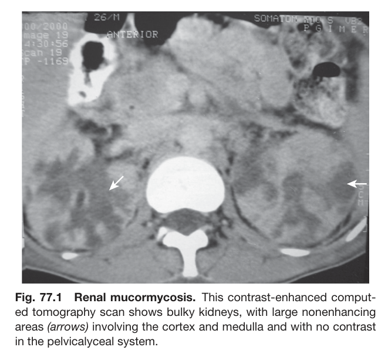
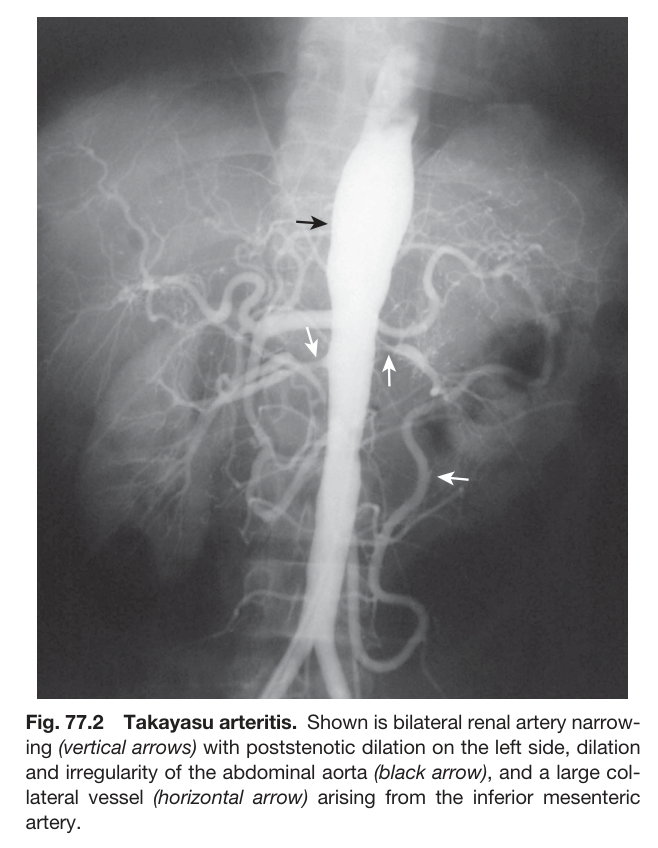
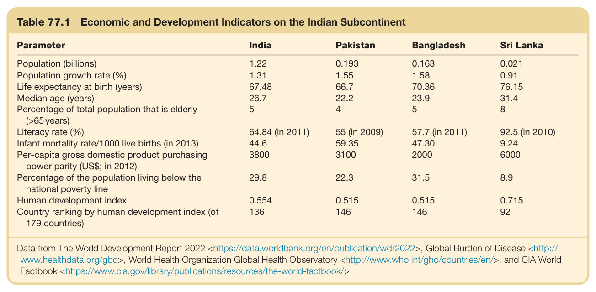
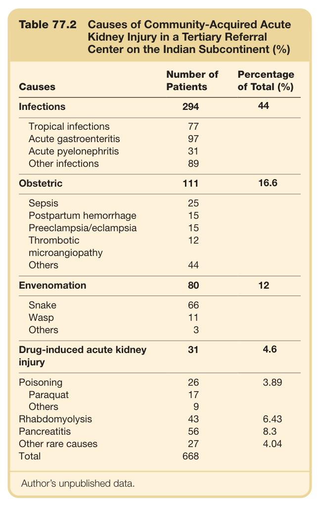
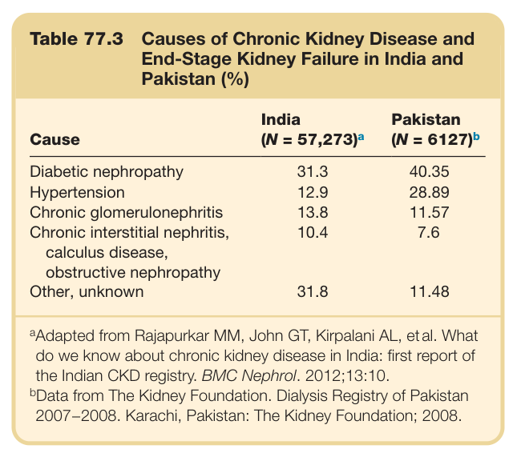
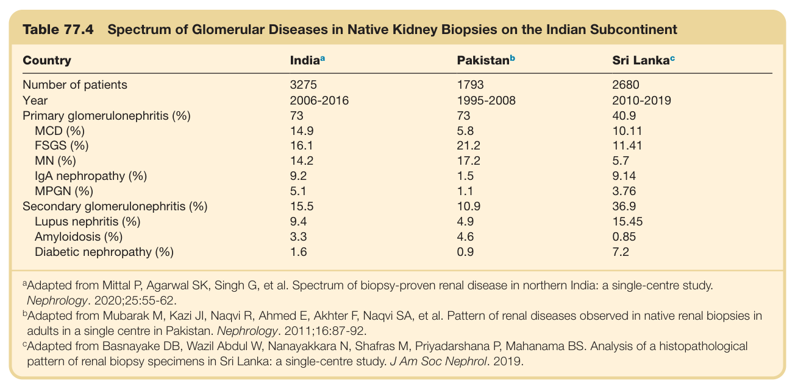

# 77. Global Considerations in Kidney Disease_ Indian Subcontinent - Figures and Tables Index

This document lists all figures and tables extracted from `77. Global Considerations in Kidney Disease_ Indian Subcontinent.pdf`.

## Table of Contents
- [Figures](#figures)
- [Tables](#tables)

---

## Figures

### Fig_77_1



Fig. 77.1 Renal mucormycosis. This contrast-enhanced comput- ed tomography scan shows bulky kidneys, with large nonenhancing areas (arrows) involving the cortex and medulla and with no contrast in the pelvicalyceal system.

---

### Fig_77_2



Fig. 77.2 Takayasu arteritis. Shown is bilateral renal artery narrow- ing (vertical arrows) with poststenotic dilation on the left side, dilation and irregularity of the abdominal aorta (black arrow), and a large col- lateral vessel (horizontal arrow) arising from the inferior mesenteric artery.

---

## Tables

### Table_77_1

#### Table Image



#### Table Data (CSV: [Table_77_1.csv](Table_77_1.csv))

```markdown
| Table Text (OCR) |
| :--- |
| Table 77.1  Economic and Development Indicators on the Indian Subcontinent Parameter  India  Pakistan  Bangladesh  Sri Lanka    Population (billions)  1.22  0.193  0.163  0.021    Population growth rate (%)  1.31  1.55  1.58  0.91    Life expectancy at birth (years)  67.48  66.7  70.36  76.15    Median age (years)  26.7  22.2  23.9  31.4    Percentage of total population that is elderly (>65 years)  5  4  5  8    Literacy rate (%)  64.84 (in 2011)  55 (in 2009)  57.7 (in 2011)  92.5 (in 2010)    Infant mortality rate/1000 live births (in 2013)  44.6  59.35  47.30  9.24    Per-capita gross domestic product purchasing power parity (US$; in 2012)  3800  3100  2000  6000    Percentage of the population living below the national poverty line  29.8  22.3  31.5  8.9    Human development index  0.554  0.515  0.515  0.715    Country ranking by human development index (of 179 countries)  136  146  146  92 Data from The World Development Report 2022 <https://data.worldbank.org/en/publication/wdr2022>, Global Burden of Disease <http:// www.healthdata.org/gbd>, World Health Organization Global Health Observatory <http://www.who.int/gho/countries/en/>, and CIA World Factbook <https://www.cia.gov/library/publications/resources/the-world-factbook/> |
```

Table 77.1 Economic and Development Indicators on the Indian Subcontinent

---

### Table_77_2

#### Table Image



#### Table Data (CSV: [Table_77_2.csv](Table_77_2.csv))

```markdown
| Table Text (OCR) |
| :--- |
| Table 77.2 Causes of Community-Acquired Acute Kidney Injury in a Tertiary Referral Center on the Indian Subcontinent (%) Causes  Number of Patients  Percentage of Total (%)    Infections  294  44    Tropical infections  77      Acute gastroenteritis  97      Acute pyelonephritis  31      Other infections  89      Obstetric  111  16.6    Sepsis  25      Postpartum hemorrhage  15      Preeclampsia/eclampsia  15      Thrombotic microangiopathy  12      Others  44      Envenomation  80  12    Snake  66      Wasp  11      Others  3      Drug-induced acute kidney injury  31  4.6    Poisoning  26  3.89    Paraquat  17      Others  9      Rhabdomyolysis  43  6.43    Pancreatitis  56  8.3    Other rare causes  27  4.04    Total  668 Author’s unpublished data. |
```

Table 77.2 Causes of Community-Acquired Acute Kidney Injury in a Tertiary Referral Center on the Indian Subcontinent (%)

---

### Table_77_3

#### Table Image



#### Table Data (CSV: [Table_77_3.csv](Table_77_3.csv))

```markdown
| Table Text (OCR) |
| :--- |
| Table 77.3  Causes of Chronic Kidney Disease and End-Stage Kidney Failure in India and Pakistan (%) Cause  India (N = 57,273)a  Pakistan (N = 6127)b    Diabetic nephropathy  31.3  40.35    Hypertension  12.9  28.89    Chronic glomerulonephritis  13.8  11.57    Chronic interstitial nephritis, calculus disease, obstructive nephropathy  10.4  7.6    Other, unknown  31.8  11.48 <sup>a</sup>Adapted from Rajapurkar MM, John GT, Kirpalani AL, etal. What do we know about chronic kidney disease in India: first report of the Indian CKD registry. BMC Nephrol. 2012;13:10. <sup>b</sup>Data from The Kidney Foundation. Dialysis Registry of Pakistan 2007−2008. Karachi, Pakistan: The Kidney Foundation; 2008. |
```

Table 77.3 Causes of Chronic Kidney Disease and End-Stage Kidney Failure in India and Pakistan (%)

---

### Table_77_4

#### Table Image



#### Table Data (CSV: [Table_77_4.csv](Table_77_4.csv))

```markdown
| Table Text (OCR) |
| :--- |
| Table 77.4 Spectrum of Glomerular Diseases in Native Kidney Biopsies on the Indian Subcontinent Country  Indiaa  Pakistanb  Sri Lankac    Number of patients  3275  1793  2680    Year  2006-2016  1995-2008  2010-2019    Primary glomerulonephritis (%)  73  73  40.9    MCD (%)  14.9  5.8  10.11    FSGS (%)  16.1  21.2  11.41    MN (%)  14.2  17.2  5.7    IgA nephropathy (%)  9.2  1.5  9.14    MPGN (%)  5.1  1.1  3.76    Secondary glomerulonephritis (%)  15.5  10.9  36.9    Lupus nephritis (%)  9.4  4.9  15.45    Amyloidosis (%)  3.3  4.6  0.85    Diabetic nephropathy (%)  1.6  0.9  7.2 <sup>a</sup>Adapted from Mittal P, Agarwal SK, Singh G, et al. Spectrum of biopsy-proven renal disease in northern India: a single-centre study. Nephrology. 2020;25:55-62. <sup>b</sup>Adapted from Mubarak M, Kazi JI, Naqvi R, Ahmed E, Akhter F, Naqvi SA, et al. Pattern of renal diseases observed in native renal biopsies in adults in a single centre in Pakistan. Nephrology. 2011;16:87-92. <sup>c</sup>Adapted from Basnayake DB, Wazil Abdul W, Nanayakkara N, Shafras M, Priyadarshana P, Mahanama BS. Analysis of a histopathologica pattern of renal biopsy specimens in Sri Lanka: a single-centre study. J Am Soc Nephrol. 2019. |
```

Table 77.4 Spectrum of Glomerular Diseases in Native Kidney Biopsies on the Indian Subcontinent

---
