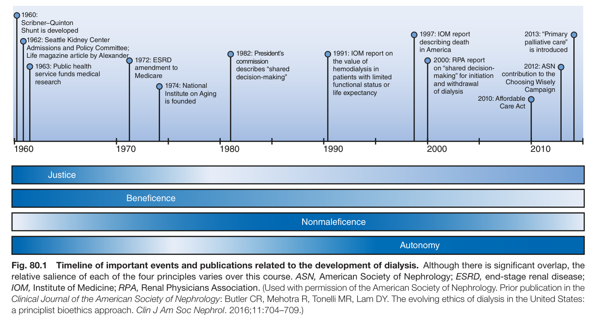
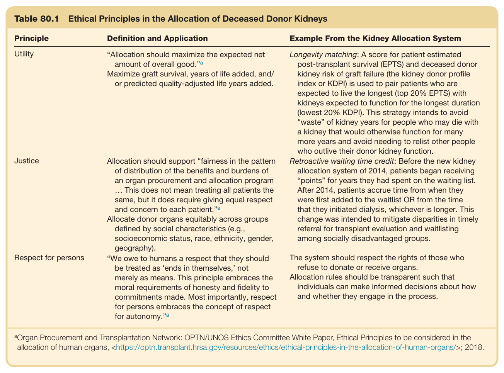
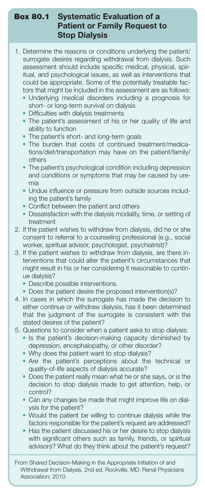
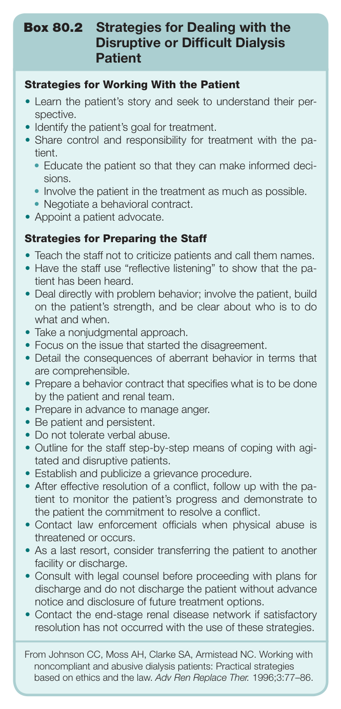

# 80. Ethical Dilemmas Facing Nephrology - Figures and Tables Index

This document lists all figures, tables and boxes extracted from `80. Ethical Dilemmas Facing Nephrology.pdf`.

## Table of Contents
- [Figures](#figures)
- [Tables](#tables)
- [Boxes](#boxes)

---

## Figures

### Fig_80_1



Fig. 80.1 Timeline of important events and publications related to the development of dialysis. Although there is significant overlap, the relative salience of each of the four principles varies over this course. ASN, American Society of Nephrology; ESRD, end-stage renal disease; IOM, Institute of Medicine; RPA, Renal Physicians Association. (Used with permission of the American Society of Nephrology. Prior publication in the Clinical Journal of the American Society of Nephrology: Butler CR, Mehotra R, Tonelli MR, Lam DY. The evolving ethics of dialysis in the United States: a principlist bioethics approach. Clin J Am Soc Nephrol. 2016;11:704–709.)

---

## Tables

### Table_80_1

#### Table Image



#### Table Data (CSV: [Table_80_1.csv](Table_80_1.csv))

```markdown
| Table Text (OCR) |
| :--- |
| Table 80.1  Ethical Principles in the Allocation of Deceased Donor Kidneys Principle  Definition and Application  Example From the Kidney Allocation System    Utility  “Allocation should maximize the expected net amount of overall good.” ^{a} Maximize graft survival, years of life added, and/or predicted quality-adjusted life years added.  Longevity matching: A score for patient estimated post-transplant survival (EPTS) and deceased donor kidney risk of graft failure (the kidney donor profile index or KDPI) is used to pair patients who are expected to live the longest (top 20% EPTS) with kidneys expected to function for the longest duration (lowest 20% KDPI). This strategy intends to avoid “waste” of kidney years for people who may die with a kidney that would otherwise function for many more years and avoid needing to relist other people who outlive their donor kidney function.    Justice  Allocation should support “fairness in the pattern of distribution of the benefits and burdens of an organ procurement and allocation program ... This does not mean treating all patients the same, but it does require giving equal respect and concern to each patient.” ^{a} Allocate donor organs equitably across groups defined by social characteristics (e.g., socioeconomic status, race, ethnicity, gender, geography).  Retroactive waiting time credit: Before the new kidney allocation system of 2014, patients began receiving “points” for years they had spent on the waiting list. After 2014, patients accrue time from when they were first added to the waitlist OR from the time that they initiated dialysis, whichever is longer. This change was intended to mitigate disparities in timely referral for transplant evaluation and waitlisting among socially disadvantaged groups.    Respect for persons  “We owe to humans a respect that they should be treated as ‘ends in themselves,’ not merely as means. This principle embraces the moral requirements of honesty and fidelity to commitments made. Most importantly, respect for persons embraces the concept of respect for autonomy.” ^{a}   The system should respect the rights of those who refuse to donate or receive organs.Allocation rules should be transparent such that individuals can make informed decisions about how and whether they engage in the process. <sup>a</sup>Organ Procurement and Transplantation Network: OPTN/UNOS Ethics Committee White Paper, Ethical Principles to be considered in the allocation of human organs, <https://optn.transplant.hrsa.gov/resources/ethics/ethical-principles-in-the-allocation-of-human-organs/>; 2018. |
```

Table 80.1 Ethical Principles in the Allocation of Deceased Donor Kidneys

---

## Boxes

### Box_80_1



#### Box Text

```markdown
Box 80.1 Systematic Evaluation of a Patient or Family Request to Stop Dialysis 1. Determine the reasons or conditions underlying the patient/ surrogate desires regarding withdrawal from dialysis. Such assessment should include specific medical, physical, spir- itual, and psychological issues, as well as interventions that could be appropriate. Some of the potentially treatable fac- tors that might be included in the assessment are as follows: • Underlying medical disorders including a prognosis for short- or long-term survival on dialysis • Difficulties with dialysis treatments • The patient’s assessment of his or her quality of life and ability to function • The patient’s short- and long-term goals The burden that costs of continued treatment/medica- tions/diet/transportation may have on the patient/family/ others The patient’s psychological condition including depression and conditions or symptoms that may be caused by ure- mia • Undue influence or pressure from outside sources includ- ing the patient’s family • Conflict between the patient and others Dissatisfaction with the dialysis modality, time, or setting of treatment 2. If the patient wishes to withdraw from dialysis, did he or she consent to referral to a counseling professional (e.g., social worker, spiritual advisor, psychologist, psychiatrist)? 3. If the patient wishes to withdraw from dialysis, are there in- terventions that could alter the patient’s circumstances that might result in his or her considering it reasonable to contin- ue dialysis? • Describe possible interventions. • Does the patient desire the proposed intervention(s)? 4. In cases in which the surrogate has made the decision to either continue or withdraw dialysis, has it been determined that the judgment of the surrogate is consistent with the stated desires of the patient? 5. Questions to consider when a patient asks to stop dialysis: • Is the patient’s decision-making capacity diminished by depression, encephalopathy, or other disorder? • Why does the patient want to stop dialysis? • Are the patient’s perceptions about the technical or quality-of-life aspects of dialysis accurate? Does the patient really mean what he or she says, or is the decision to stop dialysis made to get attention, help, or control? • Can any changes be made that might improve life on dial- ysis for the patient? • Would the patient be willing to continue dialysis while the factors responsible for the patient’s request are addressed? Has the patient discussed his or her desire to stop dialysis with significant others such as family, friends, or spiritual advisors? What do they think about the patient’s request? From Shared Decision-Making in the Appropriate Initiation of and Withdrawal from Dialysis. 2nd ed. Rockville, MD: Renal Physicians Association; 2010.
```

Box 80.1 Systematic Evaluation of a Patient or Family Request to Stop Dialysis

---

### Box_80_2



#### Box Text

```markdown
Box 80.2 Strategies for Dealing with the Disruptive or Difficult Dialysis Patient Strategies for Working With the Patient • Learn the patient’s story and seek to understand their per- spective. • Identify the patient’s goal for treatment. • Share control and responsibility for treatment with the pa- tient. • Educate the patient so that they can make informed deci- sions. • Involve the patient in the treatment as much as possible. • Negotiate a behavioral contract. • Appoint a patient advocate. Strategies for Preparing the Staff • Teach the staff not to criticize patients and call them names. • Have the staff use “reflective listening” to show that the pa- tient has been heard. • Deal directly with problem behavior; involve the patient, build on the patient’s strength, and be clear about who is to do what and when. • Take a nonjudgmental approach. • Focus on the issue that started the disagreement. • Detail the consequences of aberrant behavior in terms that are comprehensible. • Prepare a behavior contract that specifies what is to be done by the patient and renal team. • Prepare in advance to manage anger. • Be patient and persistent. • Do not tolerate verbal abuse. • Outline for the staff step-by-step means of coping with agi- tated and disruptive patients. • Establish and publicize a grievance procedure. • After effective resolution of a conflict, follow up with the pa- tient to monitor the patient’s progress and demonstrate to the patient the commitment to resolve a conflict. • Contact law enforcement officials when physical abuse is threatened or occurs. • As a last resort, consider transferring the patient to another facility or discharge. • Consult with legal counsel before proceeding with plans for discharge and do not discharge the patient without advance notice and disclosure of future treatment options. • Contact the end-stage renal disease network if satisfactory resolution has not occurred with the use of these strategies. From Johnson CC, Moss AH, Clarke SA, Armistead NC. Working with noncompliant and abusive dialysis patients: Practical strategies based on ethics and the law. Adv Ren Replace Ther. 1996;3:77–86.
```

Box 80.2 Strategies for Dealing with the Disruptive or Difficult Dialysis Patient

---
