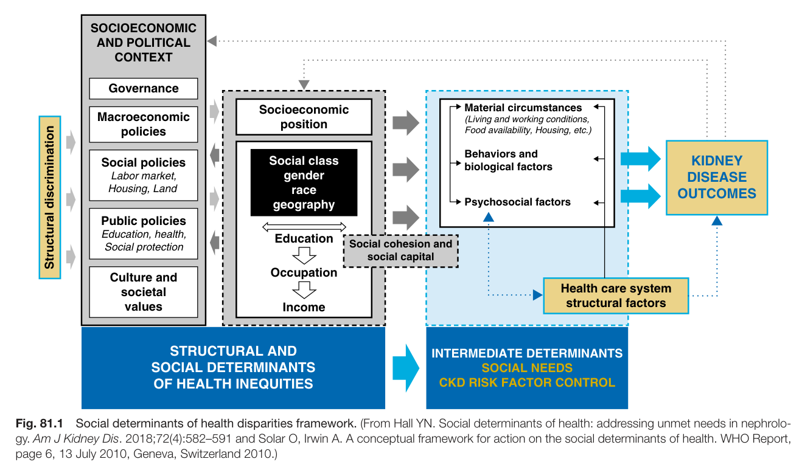
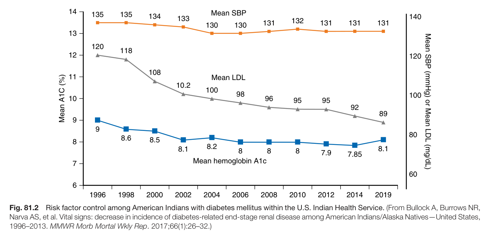
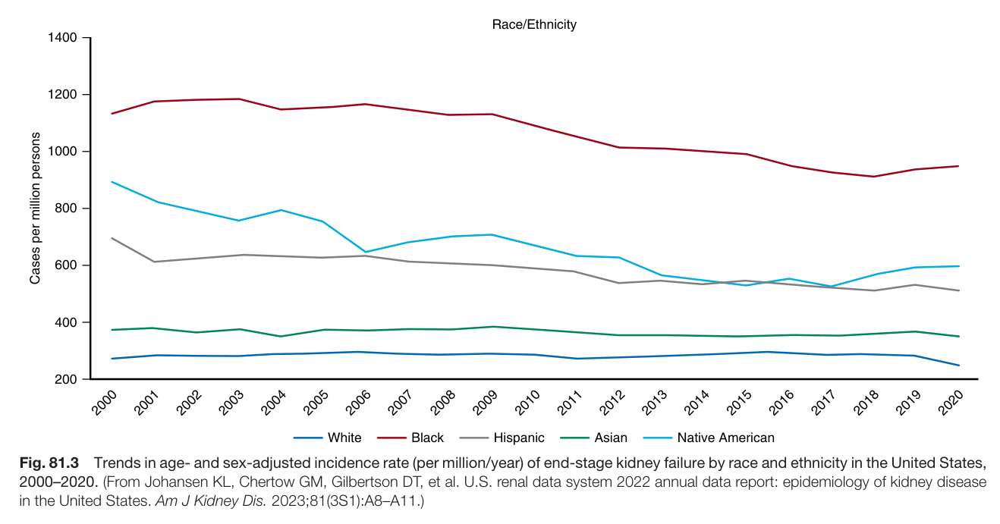
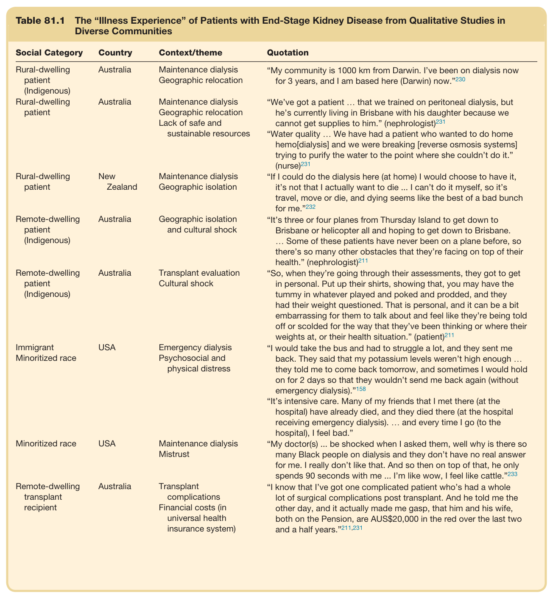

# 81. Health Disparities in Nephrology - Figures and Tables Index

This document lists all figures and tables extracted from `81. Health Disparities in Nephrology.pdf`.

## Table of Contents
- [Figures](#figures)
- [Tables](#tables)

---

## Figures

### Fig_81_1



Fig. 81.1 Social determinants of health disparities framework. (From Hall YN. Social determinants of health: addressing unmet needs in nephrolo- gy. Am J Kidney Dis. 2018;72(4):582–591 and Solar O, Irwin A. A conceptual framework for action on the social determinants of health. WHO Report, page 6, 13 July 2010, Geneva, Switzerland 2010.)

---

### Fig_81_2



Fig. 81.2 Risk factor control among American Indians with diabetes mellitus within the U.S. Indian Health Service. (From Bullock A, Burrows NR, Narva AS, et al. Vital signs: decrease in incidence of diabetes-related end-stage renal disease among American Indians/Alaska Natives—United States, 1996–2013. MMWR Morb Mortal Wkly Rep. 2017;66(1):26–32.)

---

### Fig_81_3



Fig. 81.3 Trends in age- and sex-adjusted incidence rate (per million/year) of end-stage kidney failure by race and ethnicity in the United States, 2000–2020. (From Johansen KL, Chertow GM, Gilbertson DT, et al. U.S. renal data system 2022 annual data report: epidemiology of kidney disease in the United States. Am J Kidney Dis. 2023;81(3S1):A8–A11.)

---

## Tables

### Table_81_1

#### Table Image



#### Table Data (CSV: [Table_81_1.csv](Table_81_1.csv))

```markdown
| Table Text (OCR) |
| :--- |
| Table 81.1 The “Illness Experience” of Patients with End-Stage Kidney Disease from Qualitative Studies in Diverse Communities Social Category  Country  Context/theme  Quotation    Rural-dwelling patient (Indigenous)  Australia  Maintenance dialysis Geographic relocation  “My community is 1000 km from Darwin. I’ve been on dialysis now for 3 years, and I am based here (Darwin) now.” ^{230}     Rural-dwelling patient  Australia  Maintenance dialysis Geographic relocation Lack of safe and sustainable resources  “We’ve got a patient ... that we trained on peritoneal dialysis, but he’s currently living in Brisbane with his daughter because we cannot get supplies to him.” (nephrologist) ^{231} “Water quality ... We have had a patient who wanted to do home hemo[dialysis] and we were breaking [reverse osmosis systems] trying to purify the water to the point where she couldn’t do it.” (nurse) ^{231}     Rural-dwelling patient  New Zealand  Maintenance dialysis Geographic isolation  “If I could do the dialysis here (at home) I would choose to have it, it’s not that I actually want to die ... I can’t do it myself, so it’s travel, move or die, and dying seems like the best of a bad bunch for me.” ^{232}     Remote-dwelling patient (Indigenous)  Australia  Geographic isolation and cultural shock  “It’s three or four planes from Thursday Island to get down to Brisbane or helicopter all and hoping to get down to Brisbane. ... Some of these patients have never been on a plane before, so there’s so many other obstacles that they’re facing on top of their health.” (nephrologist) ^{211}     Remote-dwelling patient (Indigenous)  Australia  Transplant evaluation Cultural shock  “So, when they’re going through their assessments, they got to get in personal. Put up their shirts, showing that, you may have the tummy in whatever played and poked and prodded, and they had their weight questioned. That is personal, and it can be a bit embarrassing for them to talk about and feel like they’re being told off or scolded for the way that they’ve been thinking or where their weights at, or their health situation.” (patient) ^{211}     Immigrant Minoritized race  USA  Emergency dialysis Psychosocial and physical distress  “I would take the bus and had to struggle a lot, and they sent me back. They said that my potassium levels weren’t high enough ... they told me to come back tomorrow, and sometimes I would hold on for 2 days so that they wouldn’t send me back again (without emergency dialysis).” ^{158} “It’s intensive care. Many of my friends that I met there (at the hospital) have already died, and they died there (at the hospital receiving emergency dialysis). ... and every time I go (to the hospital), I feel bad.”    Minoritized race  USA  Maintenance dialysis Mistrust  “My doctor(s) ... be shocked when I asked them, well why is there so many Black people on dialysis and they don’t have no real answer for me. I really don’t like that. And so then on top of that, he only spends 90 seconds with me ... I’m like wow, I feel like cattle.” ^{233}     Remote-dwelling transplant recipient  Australia  Transplant complications Financial costs (in universal health insurance system)  “I know that I’ve got one complicated patient who’s had a whole lot of surgical complications post transplant. And he told me the other day, and it actually made me gasp, that him and his wife, both on the Pension, are AUS$20,000 in the red over the last two and a half years.” ^{211,231} |
```

Table 81.1 The “Illness Experience” of Patients with End-Stage Kidney Disease from Qualitative Studies in Diverse Communities

---
