# 82. Disaster Nephrology - Figures and Tables Index

This document lists all figures and tables extracted from `82. Disaster Nephrology.pdf`.

## Table of Contents
- [Figures](#figures)
- [Tables](#tables)

---

## Figures

### Fig_82_1

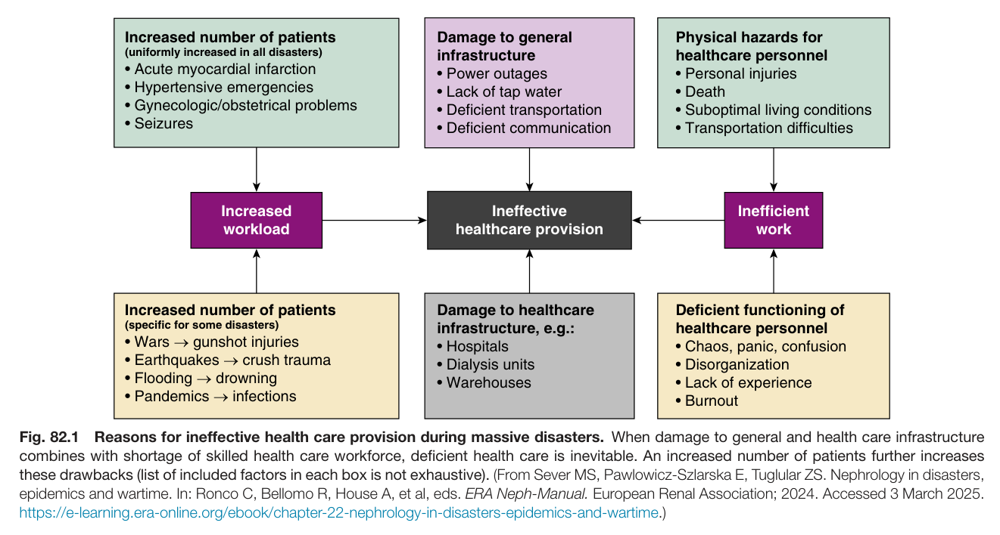

Fig. 82.1 Reasons for ineffective health care provision during massive disasters. When damage to general and health care infrastructure combines with shortage of skilled health care workforce, deficient health care is inevitable. An increased number of patients further increases these drawbacks (list of included factors in each box is not exhaustive). (From Sever MS, Pawlowicz-Szlarska E, Tuglular ZS. Nephrology in disasters, epidemics and wartime. In: Ronco C, Bellomo R, House A, et al, eds. ERA Neph-Manual. European Renal Association; 2024. Accessed 3 March 2025. https://e-learning.era-online.org/ebook/chapter-22-nephrology-in-disasters-epidemics-and-wartime.)

---

### Fig_82_2

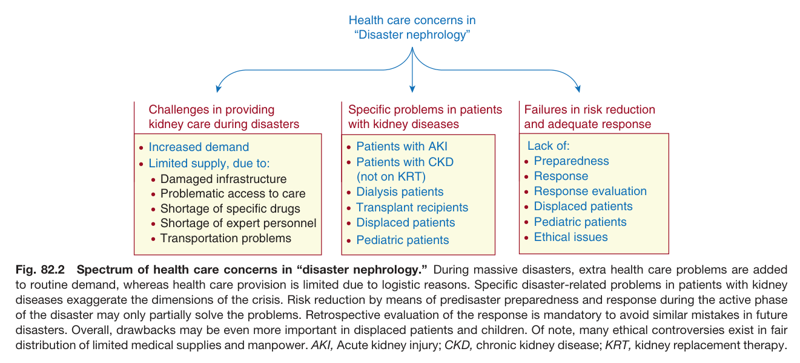

Fig. 82.2 Spectrum of health care concerns in “disaster nephrology.” During massive disasters, extra health care problems are added to routine demand, whereas health care provision is limited due to logistic reasons. Specific disaster-related problems in patients with kidney diseases exaggerate the dimensions of the crisis. Risk reduction by means of predisaster preparedness and response during the active phase of the disaster may only partially solve the problems. Retrospective evaluation of the response is mandatory to avoid similar mistakes in future disasters. Overall, drawbacks may be even more important in displaced patients and children. Of note, many ethical controversies exist in fair distribution of limited medical supplies and manpower. AKI, Acute kidney injury; CKD, chronic kidney disease; KRT, kidney replacement therapy.

---

### Fig_82_3

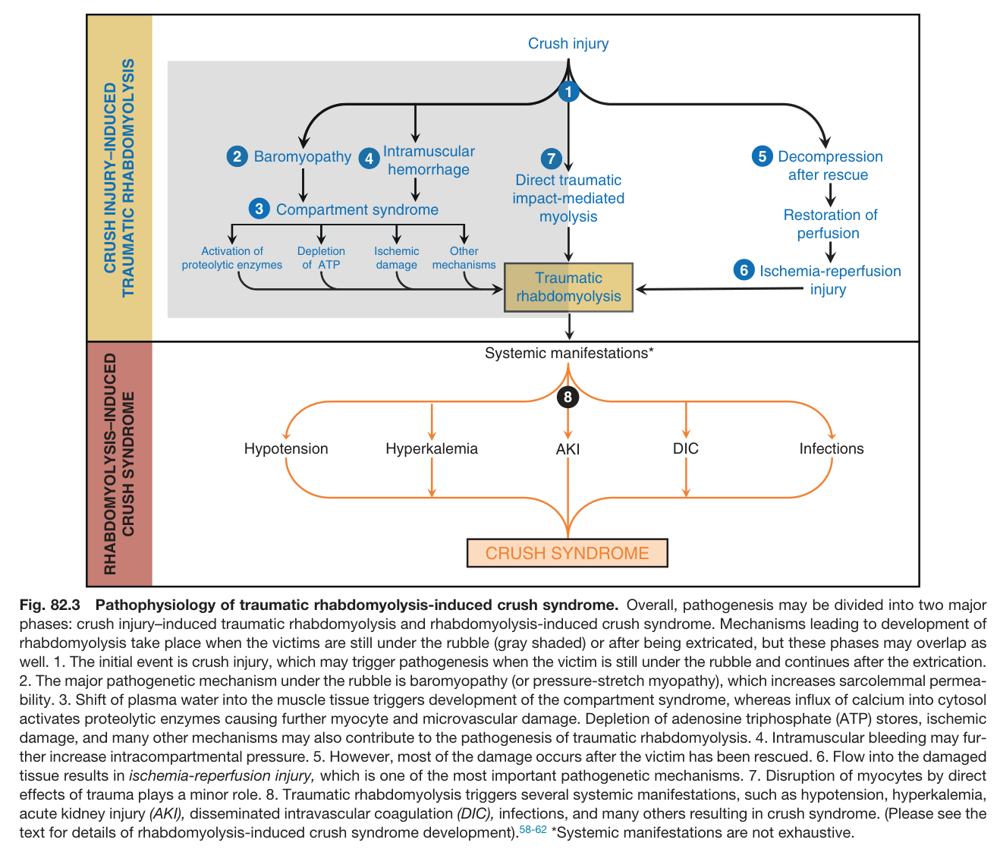

Fig. 82.3 Pathophysiology of traumatic rhabdomyolysis-induced crush syndrome. Overall, pathogenesis may be divided into two major phases: crush injury–induced traumatic rhabdomyolysis and rhabdomyolysis-induced crush syndrome. Mechanisms leading to development of rhabdomyolysis take place when the victims are still under the rubble (gray shaded) or after being extricated, but these phases may overlap as well. 1. The initial event is crush injury, which may trigger pathogenesis when the victim is still under the rubble and continues after the extrication. 2. The major pathogenetic mechanism under the rubble is baromyopathy (or pressure-stretch myopathy), which increases sarcolemmal permea- bility. 3. Shift of plasma water into the muscle tissue triggers development of the compartment syndrome, whereas influx of calcium into cytoso activates proteolytic enzymes causing further myocyte and microvascular damage. Depletion of adenosine triphosphate (ATP) stores, ischemic damage, and many other mechanisms may also contribute to the pathogenesis of traumatic rhabdomyolysis. 4. Intramuscular bleeding may fur- ther increase intracompartmental pressure. 5. However, most of the damage occurs after the victim has been rescued. 6. Flow into the damaged tissue results in ischemia-reperfusion injury, which is one of the most important pathogenetic mechanisms. 7. Disruption of myocytes by direct effects of trauma plays a minor role. 8. Traumatic rhabdomyolysis triggers several systemic manifestations, such as hypotension, hyperkalemia, acute kidney injury (AKI), disseminated intravascular coagulation (DIC), infections, and many others resulting in crush syndrome. (Please see the text for details of rhabdomyolysis-induced crush syndrome development).<sup>58-62</sup> *Systemic manifestations are not exhaustive.

---

### Fig_82_4

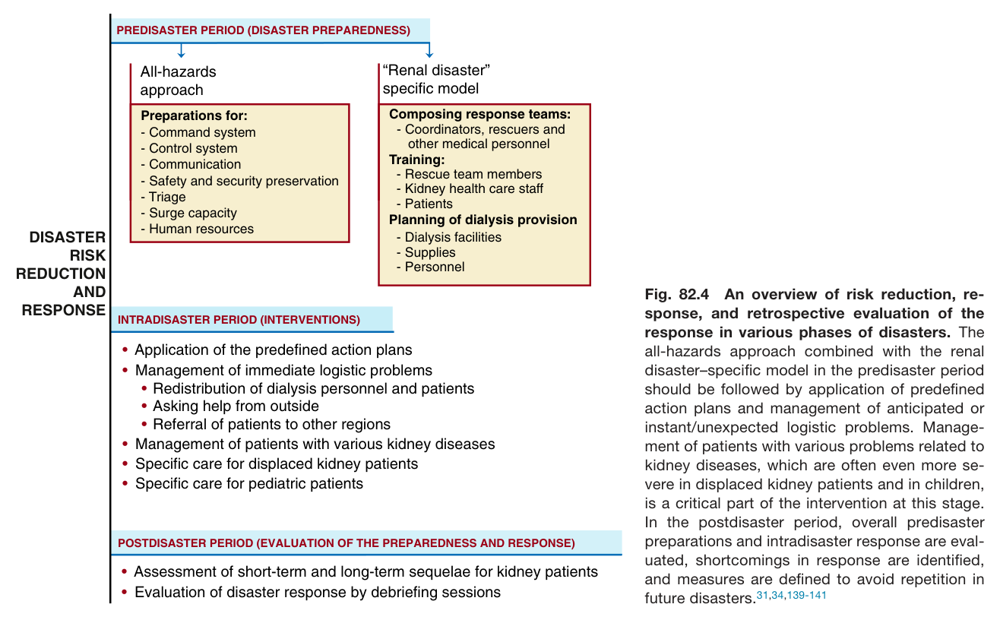

Fig. 82.4 An overview of risk reduction, re- sponse, and retrospective evaluation of the response in various phases of disasters. The all-hazards approach combined with the renal disaster–specific model in the predisaster period should be followed by application of predefined action plans and management of anticipated or instant/unexpected logistic problems. Manage- ment of patients with various problems related to kidney diseases, which are often even more se- vere in displaced kidney patients and in children, is a critical part of the intervention at this stage. In the postdisaster period, overall predisaster preparations and intradisaster response are eval- uated, shortcomings in response are identified, and measures are defined to avoid repetition in future disasters.<sup>31,34,139-141</sup>

---

### Fig_82_5

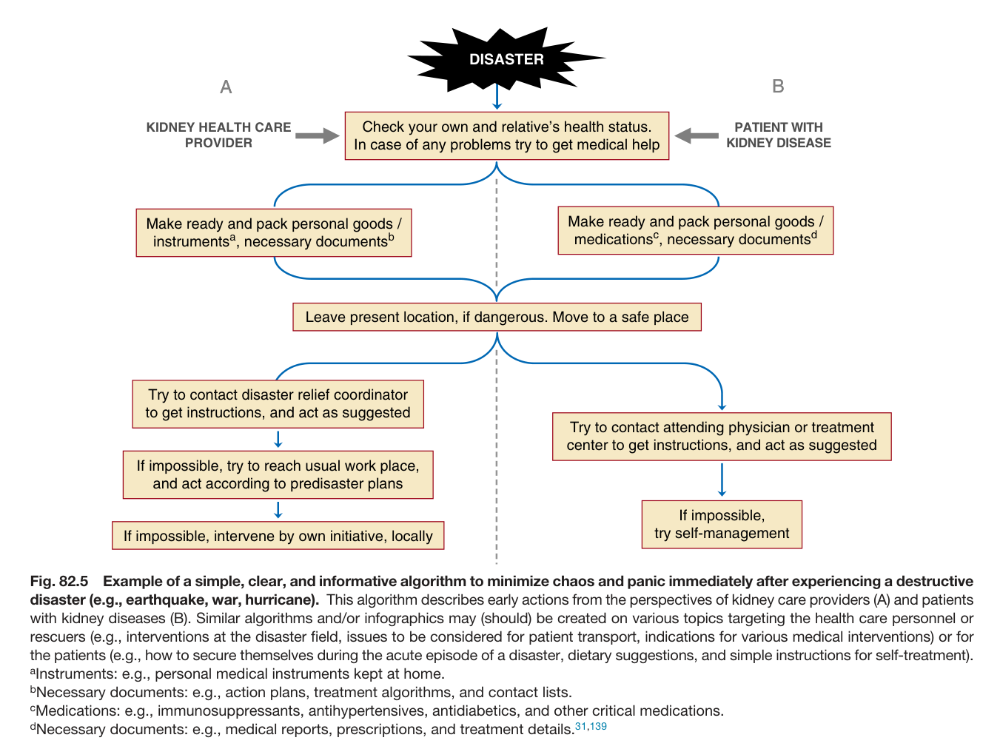

Fig. 82.5 Example of a simple, clear, and informative algorithm to minimize chaos and panic immediately after experiencing a destructive disaster (e.g., earthquake, war, hurricane). This algorithm describes early actions from the perspectives of kidney care providers (A) and patients with kidney diseases (B). Similar algorithms and/or infographics may (should) be created on various topics targeting the health care personnel or rescuers (e.g., interventions at the disaster field, issues to be considered for patient transport, indications for various medical interventions) or for the patients (e.g., how to secure themselves during the acute episode of a disaster, dietary suggestions, and simple instructions for self-treatment).

---

### Fig_82_6

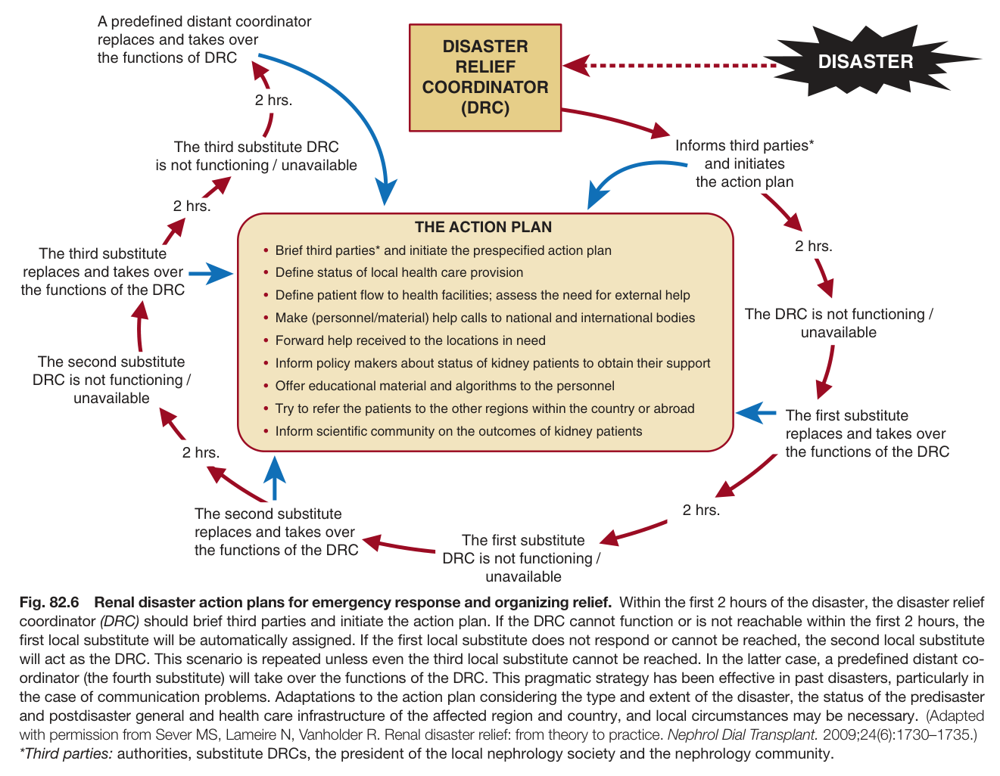

Fig. 82.6 Renal disaster action plans for emergency response and organizing relief. Within the first 2 hours of the disaster, the disaster relief coordinator (DRC) should brief third parties and initiate the action plan. If the DRC cannot function or is not reachable within the first 2 hours, the first local substitute will be automatically assigned. If the first local substitute does not respond or cannot be reached, the second local substitute will act as the DRC. This scenario is repeated unless even the third local substitute cannot be reached. In the latter case, a predefined distant co- ordinator (the fourth substitute) will take over the functions of the DRC. This pragmatic strategy has been effective in past disasters, particularly in the case of communication problems. Adaptations to the action plan considering the type and extent of the disaster, the status of the predisaster and postdisaster general and health care infrastructure of the affected region and country, and local circumstances may be necessary. (Adapted with permission from Sever MS, Lameire N, Vanholder R. Renal disaster relief: from theory to practice. Nephrol Dial Transplant. 2009;24(6):1730–1735.) *Third parties: authorities, substitute DRCs, the president of the local nephrology society and the nephrology community.

---

### Fig_82_7

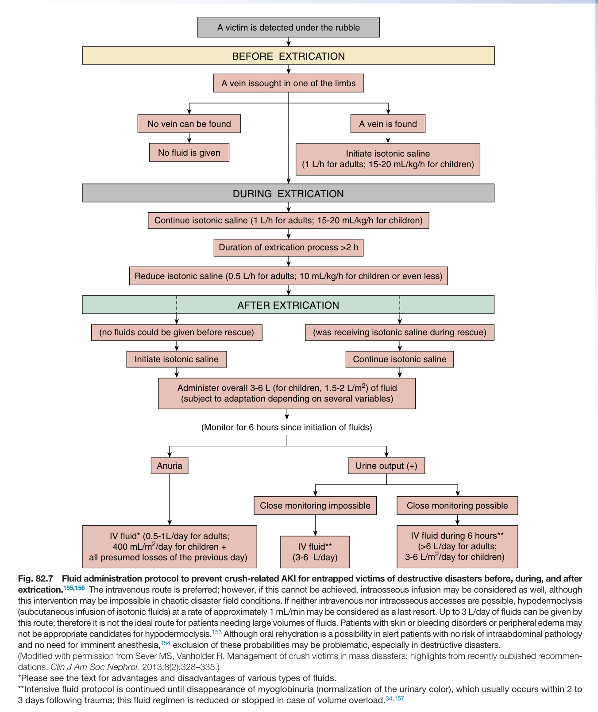

Fig. 82.7 Fluid administration protocol to prevent crush-related AKI for entrapped victims of destructive disasters before, during, and after extrication.<sup>155,156</sup> The intravenous route is preferred; however, if this cannot be achieved, intraosseous infusion may be considered as well, although this intervention may be impossible in chaotic disaster field conditions. If neither intravenous nor intraosseous accesses are possible, hypodermoclysis (subcutaneous infusion of isotonic fluids) at a rate of approximately 1 mL/min may be considered as a last resort. Up to 3 L/day of fluids can be given by this route; therefore it is not the ideal route for patients needing large volumes of fluids. Patients with skin or bleeding disorders or peripheral edema may not be appropriate candidates for hypodermoclysis.<sup>153</sup> Although oral rehydration is a possibility in alert patients with no risk of intraabdominal pathology and no need for imminent anesthesia,<sup>154</sup> exclusion of these probabilities may be problematic, especially in destructive disasters.

---

## Tables

### Table_82_1

#### Table Image

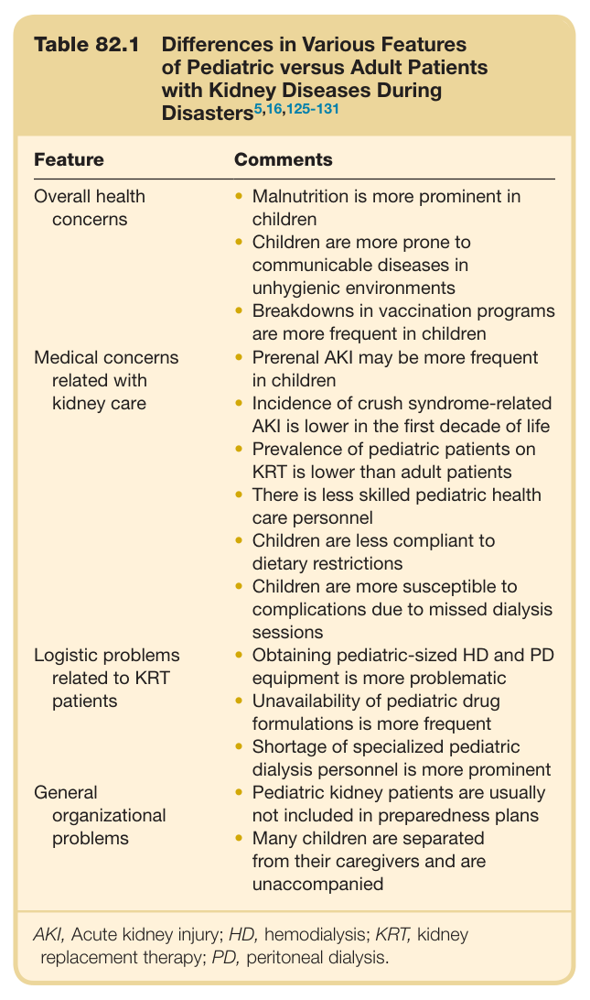

#### Table Data (CSV: [Table_82_1.csv](Table_82_1.csv))

```markdown
| Table Text (OCR) |
| :--- |
| Table 82.1 Differences in Various Features of Pediatric versus Adult Patients with Kidney Diseases During Disasters<sup>5,16,125-131</sup> Feature  Comments    Overall health concerns  Malnutrition is more prominent in childrenChildren are more prone to communicable diseases in unhygienic environmentsBreakdowns in vaccination programs are more frequent in children    Medical concerns related with kidney care  Prerenal AKI may be more frequent in childrenIncidence of crush syndrome-related AKI is lower in the first decade of lifePrevalence of pediatric patients on KRT is lower than adult patientsThere is less skilled pediatric health care personnelChildren are less compliant to dietary restrictionsChildren are more susceptible to complications due to missed dialysis sessions    Logistic problems related to KRT patients  Obtaining pediatric-sized HD and PD equipment is more problematicUnavailability of pediatric drug formulations is more frequentShortage of specialized pediatric dialysis personnel is more prominent    General organizational problems  Pediatric kidney patients are usually not included in preparedness plansMany children are separated from their caregivers and are unaccompanied AKI, Acute kidney injury; HD, hemodialysis; KRT, kidney replacement therapy; PD, peritoneal dialysis. |
```

Table 82.1 Differences in Various Features of Pediatric versus Adult Patients with Kidney Diseases During Disasters<sup>5,16,125-131</sup>

---

### Table_82_2

#### Table Image

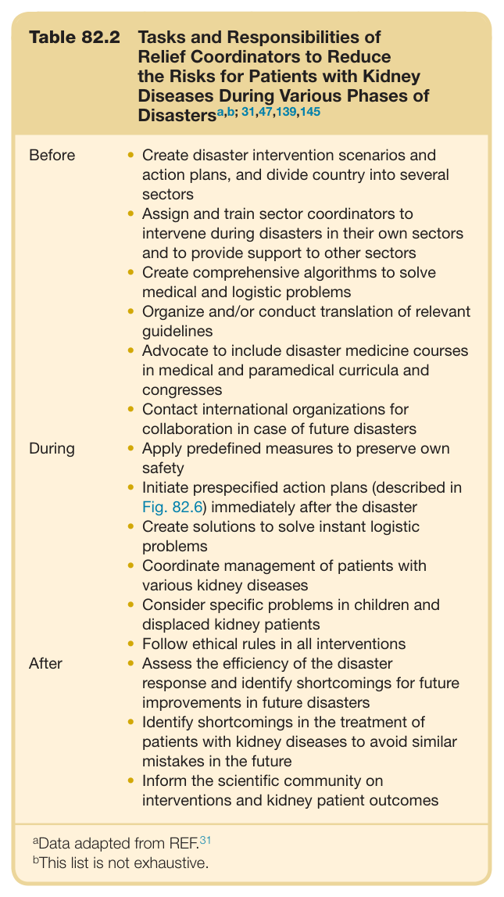

#### Table Data (CSV: [Table_82_2.csv](Table_82_2.csv))

```markdown
| Table Text (OCR) |
| :--- |
| Table 82.2 Tasks and Responsibilities of Relief Coordinators to Reduce the Risks for Patients with Kidney Diseases During Various Phases of Disasters<sup>a,b;</sup> <sup>31,47,139,145</sup> Before  Create disaster intervention scenarios and action plans, and divide country into several sectorsAssign and train sector coordinators to intervene during disasters in their own sectors and to provide support to other sectorsCreate comprehensive algorithms to solve medical and logistic problemsOrganize and/or conduct translation of relevant guidelinesAdvocate to include disaster medicine courses in medical and paramedical curricula and congressesContact international organizations for collaboration in case of future disasters    During  Apply predefined measures to preserve own safetyInitiate prespecified action plans (described in Fig. 82.6) immediately after the disasterCreate solutions to solve instant logistic problemsCoordinate management of patients with various kidney diseasesConsider specific problems in children and displaced kidney patientsFollow ethical rules in all interventions    After  Assess the efficiency of the disaster response and identify shortcomings for future improvements in future disastersIdentify shortcomings in the treatment of patients with kidney diseases to avoid similar mistakes in the futureInform the scientific community on interventions and kidney patient outcomes <sup>a</sup>Data adapted from REF.<sup>3</sup> <sup>b</sup>This list is not exhaustive. |
```

Table 82.2 Tasks and Responsibilities of Relief Coordinators to Reduce the Risks for Patients with Kidney Diseases During Various Phases of Disasters<sup>a,b;</sup> <sup>31,47,139,145</sup>

---

### Table_82_3

#### Table Image

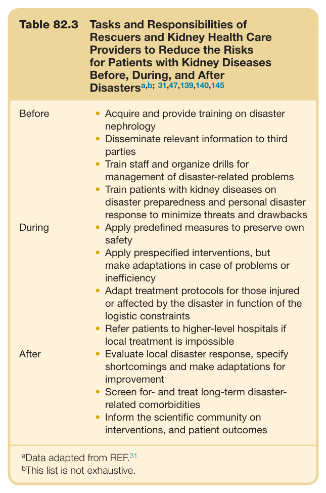

#### Table Data (CSV: [Table_82_3.csv](Table_82_3.csv))

```markdown
| Table Text (OCR) |
| :--- |
| Table 82.3 Tasks and Responsibilities of Rescuers and Kidney Health Care Providers to Reduce the Risks for Patients with Kidney Diseases Before, During, and After Disasters<sup>a,b;</sup> <sup>31,47,139,140,145</sup> Before  Acquire and provide training on disaster nephrologyDisseminate relevant information to third partiesTrain staff and organize drills for management of disaster-related problemsTrain patients with kidney diseases on disaster preparedness and personal disaster response to minimize threats and drawbacks    During  Apply predefined measures to preserve own safetyApply prespecified interventions, but make adaptations in case of problems or inefficiencyAdapt treatment protocols for those injured or affected by the disaster in function of the logistic constraintsRefer patients to higher-level hospitals if local treatment is impossible    After  Evaluate local disaster response, specify shortcomings and make adaptations for improvementScreen for- and treat long-term disaster-related comorbiditiesInform the scientific community on interventions, and patient outcomes <sup>a</sup>Data adapted from REF.<sup>31</sup> <sup>b</sup>This list is not exhaustive. |
```

Table 82.3 Tasks and Responsibilities of Rescuers and Kidney Health Care Providers to Reduce the Risks for Patients with Kidney Diseases Before, During, and After Disasters<sup>a,b;</sup> <sup>31,47,139,140,145</sup>

---

### Table_82_4

#### Table Image

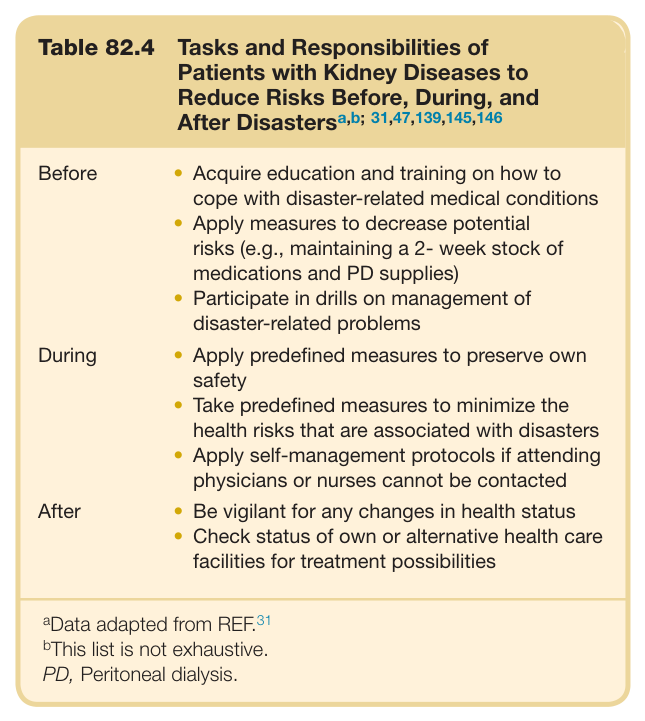

#### Table Data (CSV: [Table_82_4.csv](Table_82_4.csv))

```markdown
| Table Text (OCR) |
| :--- |
| Table 82.4 Tasks and Responsibilities of Patients with Kidney Diseases to Reduce Risks Before, During, and After Disasters<sup>a,b;</sup> <sup>31,47,139,145,146</sup> Before  ·Acquire education and training on how to cope with disaster-related medical conditions·Apply measures to decrease potential risks (e.g., maintaining a 2- week stock of medications and PD supplies)·Participate in drills on management of disaster-related problems    During  ·Apply predefined measures to preserve own safety·Take predefined measures to minimize the health risks that are associated with disasters·Apply self-management protocols if attending physicians or nurses cannot be contacted    After  ·Be vigilant for any changes in health status·Check status of own or alternative health care facilities for treatment possibilities <sup>a</sup>Data adapted from REF.<sup>31</sup> <sup>b</sup>This list is not exhaustive. PD, Peritoneal dialysis. |
```

Table 82.4 Tasks and Responsibilities of Patients with Kidney Diseases to Reduce Risks Before, During, and After Disasters<sup>a,b;</sup> <sup>31,47,139,145,146</sup>

---

### Table_82_5

#### Table Image

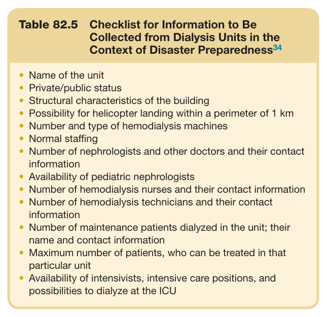

#### Table Data (CSV: [Table_82_5.csv](Table_82_5.csv))

```markdown
| Table Text (OCR) |
| :--- |
| Table 82.5 Checklist for Information to Be Collected from Dialysis Units in the Context of Disaster Preparedness<sup>34</sup> •	 Name of the unit •	 Private/public status •	 Structural characteristics of the building •	 Possibility for helicopter landing within a perimeter of 1 km •	 Number and type of hemodialysis machines •	 Normal staffing •	 Number of nephrologists and other doctors and their contact information •	 Availability of pediatric nephrologists •	 Number of hemodialysis nurses and their contact information •	 Number of hemodialysis technicians and their contact information •	 Number of maintenance patients dialyzed in the unit; their name and contact information •	 Maximum number of patients, who can be treated in that particular unit Availability of intensivists, intensive care positions, and possibilities to dialyze at the ICU immediate postdisaster dialysis needs).<sup>96,150</sup> However, this strategy cannot be applied in unforeseeable disasters such as earthquakes, tsunamis, and terrorist attacks. All nephrology and dialysis units in and around disaster- prone areas should develop their own detailed disaster preparedness plans to cope with sudden increases in dialysis needs. Specific information about these facilities should be registered in the regional/national preparedness plans (Table 82.5)<sup>34</sup> and databases that should be available to relevant stakeholders—coordinators, nephrologists, nurses, and patients. Considering the possibility that many dialysis facilities will collapse, regional or national directories for nephrology and dialysis units should identify the capacities for material and/or personnel support, as well as accepting patients from nonfunctional units.<sup>34,107</sup> Likewise, considering the need for gigantic quantities of consumables for dialysis<sup>33</sup> and the potential for damage to warehouses that store dialysis supplies, international support will mostly be needed after massive disasters.<sup>40,140,141,151</sup> Therefore regional, national, and supranational preparedness should be considered in disaster-prone countries.<sup>17,34,140</sup> Personnel planning is complex because of unpredictable shortages of staff members.<sup>8,139</sup> Many measures to cope with personnel shortage can be taken only after observing the extent of the disaster. To summarize, preparedness plans for the interventions during the disaster should be detailed and solve the questions “who,” “what,” “when,” and “how” clearly.<sup>139</sup> Regular drills are needed to compensate for potential inexperience of the responders. |
```

Table 82.5 Checklist for Information to Be Collected from Dialysis Units in the Context of Disaster Preparedness<sup>34</sup>

---

### Table_82_6

#### Table Image

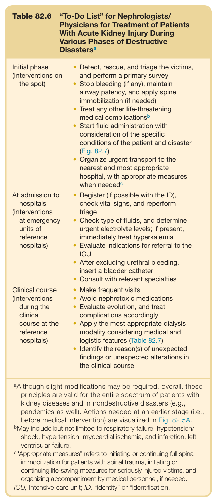

#### Table Data (CSV: [Table_82_6.csv](Table_82_6.csv))

```markdown
| Table Text (OCR) |
| :--- |
| Table 82.6 “To-Do List” for Nephrologists/ Physicians for Treatment of Patients With Acute Kidney Injury During Various Phases of Destructive Disasters<sup>a</sup> Initial phase(interventions on the spot)  Detect, rescue, and triage the victims, and perform a primary surveyStop bleeding (if any), maintain airway patency, and apply spine immobilization (if needed)Treat any other life-threatening medical complicationsbStart fluid administration with consideration of the specific conditions of the patient and disaster (Fig. 82.7)Organize urgent transport to the nearest and most appropriate hospital, with appropriate measures when neededc    At admission to hospitals(interventions at emergency units of reference hospitals)  Register (if possible with the ID), check vital signs, and reperform triageCheck type of fluids, and determine urgent electrolyte levels; if present, immediately treat hyperkalemiaEvaluate indications for referral to the ICUAfter excluding urethral bleeding, insert a bladder catheterConsult with relevant specialties    Clinical course(interventions during the clinical course at the reference hospitals)  Make frequent visitsAvoid nephrotoxic medicationsEvaluate evolution, and treat complications accordinglyApply the most appropriate dialysis modality considering medical and logistic features (Table 82.7)Identify the reason(s) of unexpected findings or unexpected alterations in the clinical course <sup>a</sup>Although slight modifications may be required, overall, these principles are valid for the entire spectrum of patients with kidney diseases and in nondestructive disasters (e.g., pandemics as well). Actions needed at an earlier stage (i.e., before medical intervention) are visualized in Fig. 82.5A. <sup>b</sup>May include but not limited to respiratory failure, hypotension/ shock, hypertension, myocardial ischemia, and infarction, left ventricular failure. <sup>c</sup>“Appropriate measures” refers to initiating or continuing full spinal immobilization for patients with spinal trauma, initiating or continuing life-saving measures for seriously injured victims, and organizing accompaniment by medical personnel, if needed. ICU, Intensive care unit; ID, “identity” or “identification. |
```

Table 82.6 “To-Do List” for Nephrologists/ Physicians for Treatment of Patients With Acute Kidney Injury During Various Phases of Destructive Disasters<sup>a</sup>

---

### Table_82_7

#### Table Image

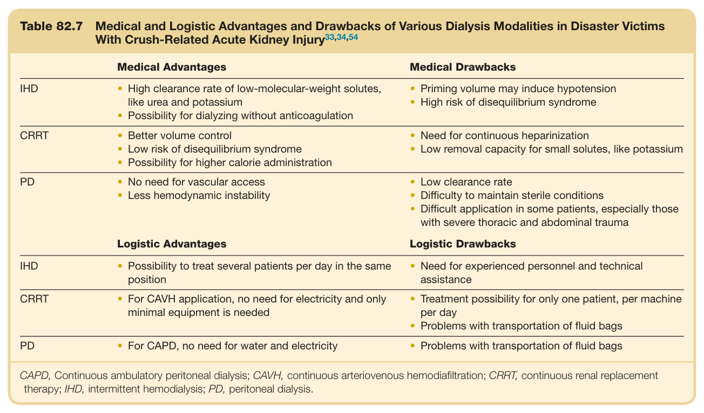

#### Table Data (CSV: [Table_82_7.csv](Table_82_7.csv))

```markdown
| Table Text (OCR) |
| :--- |
| Table 82.7  Medical and Logistic Advantages and Drawbacks of Various Dialysis Modalities in Disaster Victims With Crush-Related Acute Kidney Injury<sup>33,34,54</sup> Medical Advantages  Medical Drawbacks    IHD  High clearance rate of low-molecular-weight solutes, like urea and potassiumPossibility for dialyzing without anticoagulation  Priming volume may induce hypotensionHigh risk of disequilibrium syndrome    CRRT  Better volume controlLow risk of disequilibrium syndromePossibility for higher calorie administration  Need for continuous heparinizationLow removal capacity for small solutes, like potassium    PD  No need for vascular accessLess hemodynamic instability  Low clearance rateDifficulty to maintain sterile conditionsDifficult application in some patients, especially those with severe thoracic and abdominal trauma      Logistic Advantages  Logistic Drawbacks    IHD  Possibility to treat several patients per day in the same position  Need for experienced personnel and technical assistance    CRRT  For CAVH application, no need for electricity and only minimal equipment is needed  Treatment possibility for only one patient, per machine per dayProblems with transportation of fluid bags    PD  For CAPD, no need for water and electricity  Problems with transportation of fluid bags CAPD, Continuous ambulatory peritoneal dialysis; CAVH, continuous arteriovenous hemodiafiltration; CRRT, continuous renal replacement therapy; IHD, intermittent hemodialysis; PD, peritoneal dialysis. |
```

Table 82.7 Medical and Logistic Advantages and Drawbacks of Various Dialysis Modalities in Disaster Victims With Crush-Related Acute Kidney Injury<sup>33,34,54</sup>

---
