# 83. Chronic Kidney Disease of Uncertain Etiology - Figures and Tables Index

This document lists all figures and tables extracted from `83. Chronic Kidney Disease of Uncertain Etiology.pdf`.

## Table of Contents
- [Figures](#figures)
- [Tables](#tables)

---

## Figures

### Fig_83_1

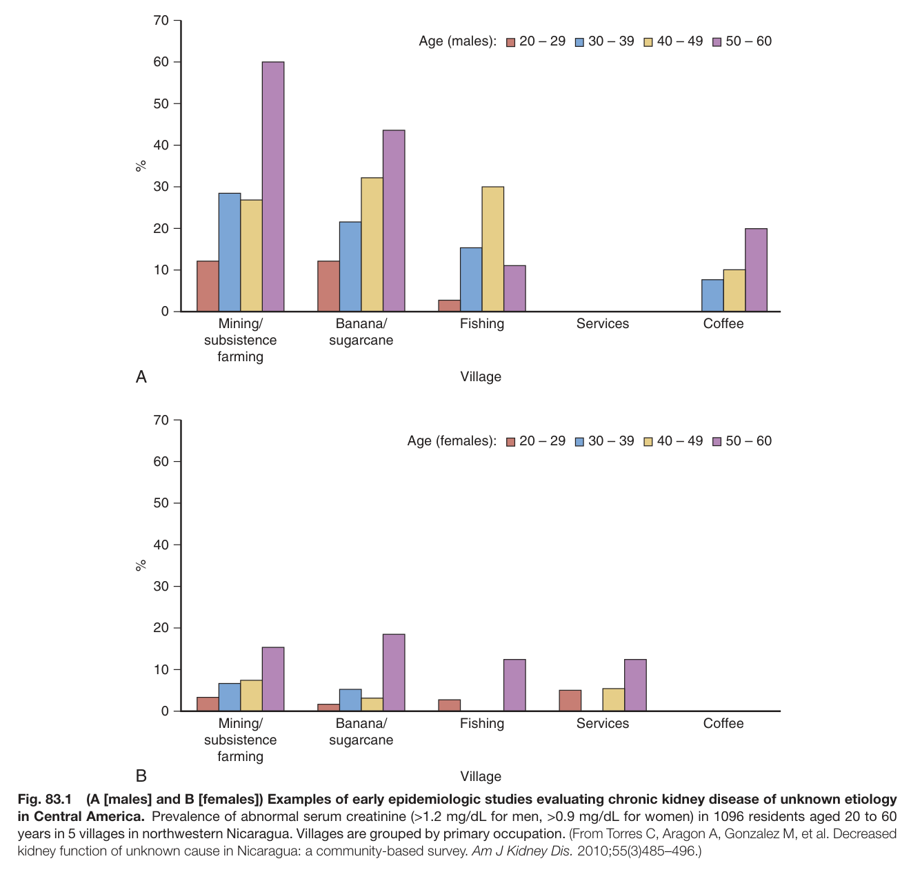

Fig. 83.1 (A [males] and B [females]) Examples of early epidemiologic studies evaluating chronic kidney disease of unknown etiology in Central America. Prevalence of abnormal serum creatinine (>1.2 mg/dL for men, >0.9 mg/dL for women) in 1096 residents aged 20 to 60 years in 5 villages in northwestern Nicaragua. Villages are grouped by primary occupation. (From Torres C, Aragon A, Gonzalez M, et al. Decreased kidney function of unknown cause in Nicaragua: a community-based survey. Am J Kidney Dis. 2010;55(3)485–496.)

---

### Fig_83_2

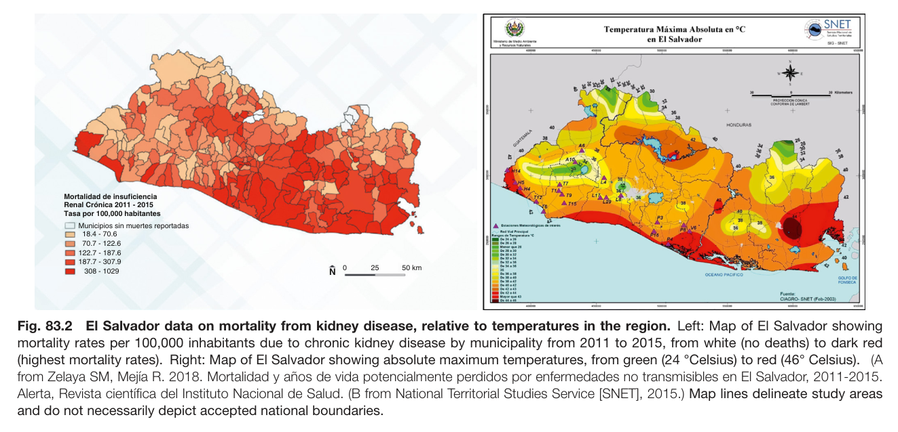

Fig. 83.2 El Salvador data on mortality from kidney disease, relative to temperatures in the region. Left: Map of El Salvador showing mortality rates per 100,000 inhabitants due to chronic kidney disease by municipality from 2011 to 2015, from white (no deaths) to dark red (highest mortality rates). Right: Map of El Salvador showing absolute maximum temperatures, from green (24 °Celsius) to red (46° Celsius). (A from Zelaya SM, Mejía R. 2018. Mortalidad y años de vida potencialmente perdidos por enfermedades no transmisibles en El Salvador, 2011-2015. Alerta, Revista científica del Instituto Nacional de Salud. (B from National Territorial Studies Service [SNET], 2015.) Map lines delineate study areas and do not necessarily depict accepted national boundaries.

---

### Fig_83_3

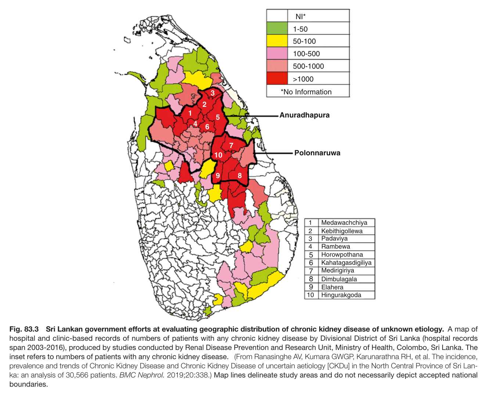

Fig. 83.3 Sri Lankan government efforts at evaluating geographic distribution of chronic kidney disease of unknown etiology. A map of hospital and clinic-based records of numbers of patients with any chronic kidney disease by Divisional District of Sri Lanka (hospital records span 2003-2016), produced by studies conducted by Renal Disease Prevention and Research Unit, Ministry of Health, Colombo, Sri Lanka. The inset refers to numbers of patients with any chronic kidney disease. (From Ranasinghe AV, Kumara GWGP, Karunarathna RH, et al. The incidence, prevalence and trends of Chronic Kidney Disease and Chronic Kidney Disease of uncertain aetiology [CKDu] in the North Central Province of Sri Lan- ka: an analysis of 30,566 patients. BMC Nephrol. 2019;20:338.) Map lines delineate study areas and do not necessarily depict accepted nationa boundaries.

---

### Fig_83_4

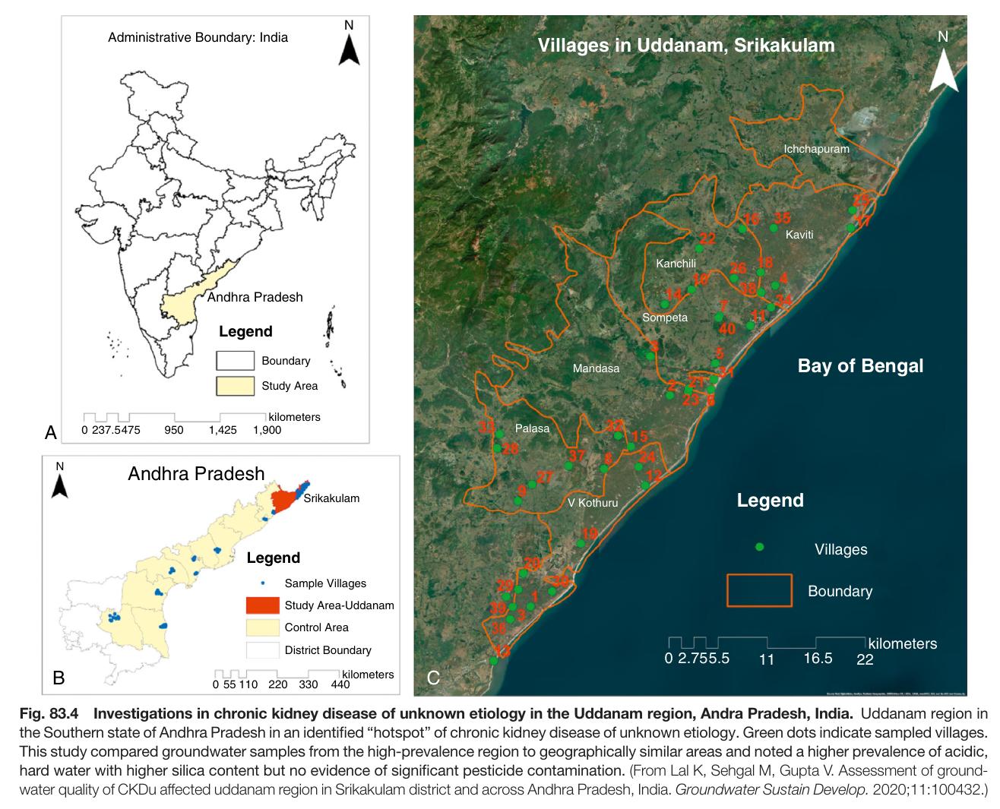

Fig. 83.4 Investigations in chronic kidney disease of unknown etiology in the Uddanam region, Andra Pradesh, India. Uddanam region in the Southern state of Andhra Pradesh in an identified “hotspot” of chronic kidney disease of unknown etiology. Green dots indicate sampled villages. This study compared groundwater samples from the high-prevalence region to geographically similar areas and noted a higher prevalence of acidic, hard water with higher silica content but no evidence of significant pesticide contamination. (From Lal K, Sehgal M, Gupta V. Assessment of ground- water quality of CKDu affected uddanam region in Srikakulam district and across Andhra Pradesh, India. Groundwater Sustain Develop. 2020;11:100432.)

---

### Fig_83_5

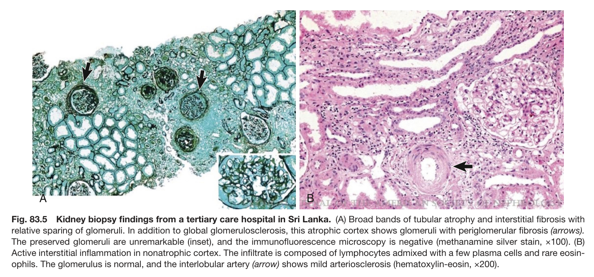

Fig. 83.5 Kidney biopsy findings from a tertiary care hospital in Sri Lanka. (A) Broad bands of tubular atrophy and interstitial fibrosis with relative sparing of glomeruli. In addition to global glomerulosclerosis, this atrophic cortex shows glomeruli with periglomerular fibrosis (arrows). The preserved glomeruli are unremarkable (inset), and the immunofluorescence microscopy is negative (methanamine silver stain, ×100). (B) Active interstitial inflammation in nonatrophic cortex. The infiltrate is composed of lymphocytes admixed with a few plasma cells and rare eosin- ophils. The glomerulus is normal, and the interlobular artery (arrow) shows mild arteriosclerosis (hematoxylin-eosin, ×200).

---

### Fig_83_6

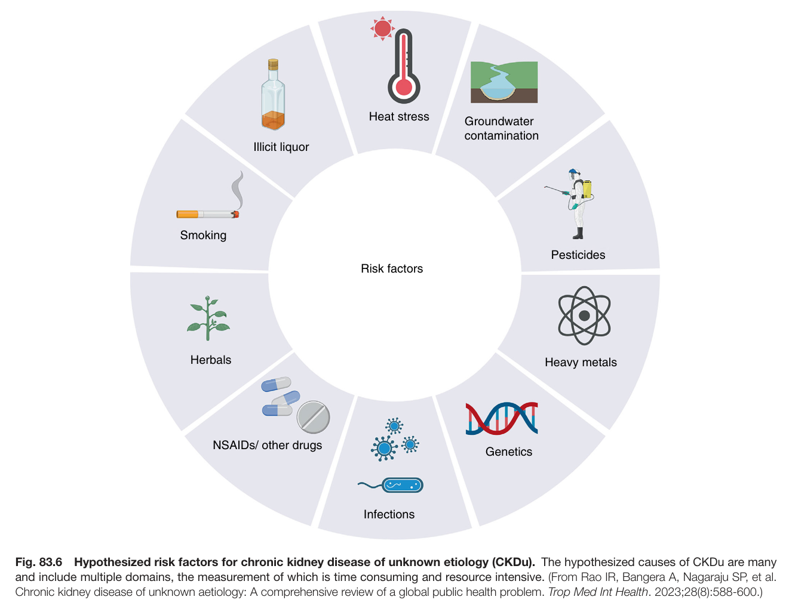

Fig. 83.6 Hypothesized risk factors for chronic kidney disease of unknown etiology (CKDu). The hypothesized causes of CKDu are many and include multiple domains, the measurement of which is time consuming and resource intensive. (From Rao IR, Bangera A, Nagaraju SP, et al. Chronic kidney disease of unknown aetiology: A comprehensive review of a global public health problem. Trop Med Int Health. 2023;28(8):588-600.)

---

### Fig_83_7

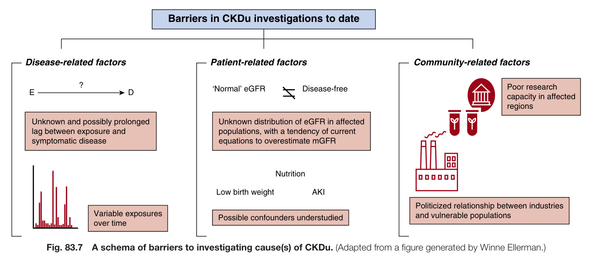

Fig. 83.7 A schema of barriers to investigating cause(s) of CKDu. (Adapted from a figure generated by Winne Ellerman.)

---

### Fig_83_8

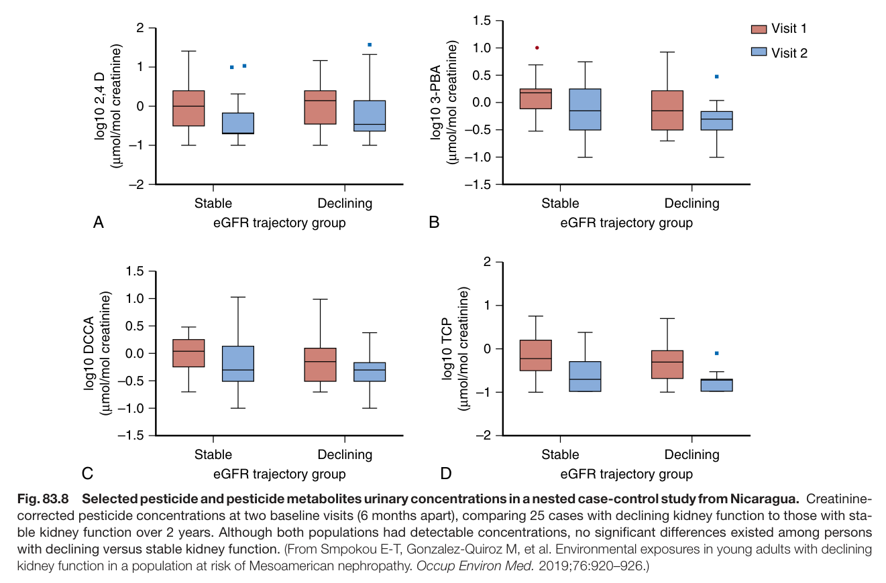

Fig. 83.8 Selected pesticide and pesticide metabolites urinary concentrations in a nested case-control study from Nicaragua. Creatinine- corrected pesticide concentrations at two baseline visits (6 months apart), comparing 25 cases with declining kidney function to those with sta- ble kidney function over 2 years. Although both populations had detectable concentrations, no significant differences existed among persons with declining versus stable kidney function. (From Smpokou E-T, Gonzalez-Quiroz M, et al. Environmental exposures in young adults with declining kidney function in a population at risk of Mesoamerican nephropathy. Occup Environ Med. 2019;76:920–926.)

---

### Fig_83_9

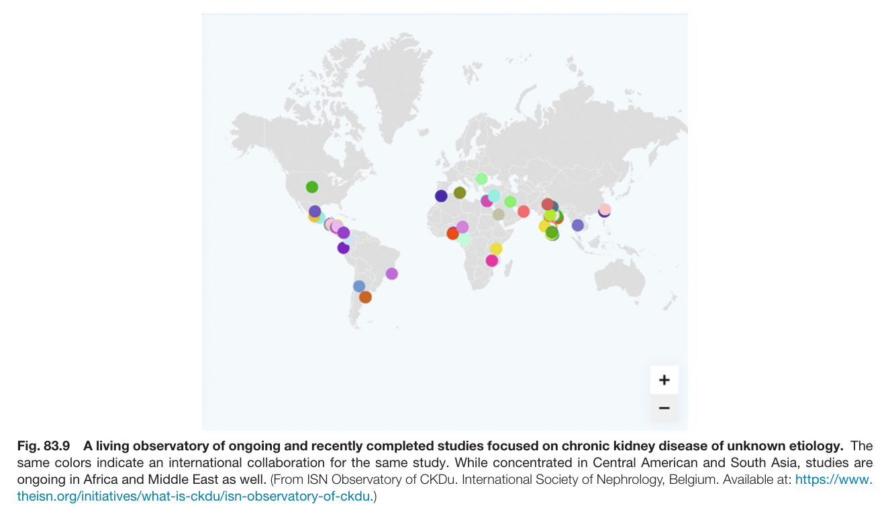

Fig. 83.9 A living observatory of ongoing and recently completed studies focused on chronic kidney disease of unknown etiology. The same colors indicate an international collaboration for the same study. While concentrated in Central American and South Asia, studies are ongoing in Africa and Middle East as well. (From ISN Observatory of CKDu. International Society of Nephrology, Belgium. Available at: https://www. theisn.org/initiatives/what-is-ckdu/isn-observatory-of-ckdu.)

---

## Tables

### Table_83_1

#### Table Image

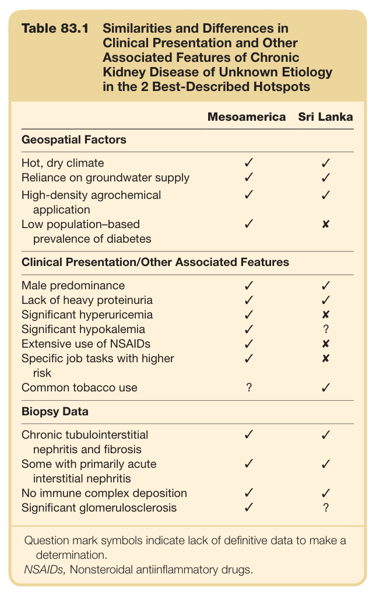

#### Table Data (CSV: [Table_83_1.csv](Table_83_1.csv))

```markdown
| Table Text (OCR) |
| :--- |
| Table 83.1  Similarities and Differences in Clinical Presentation and Other Associated Features of Chronic Kidney Disease of Unknown Etiology in the 2 Best-Described Hotspots Mesoamerica  Sri Lanka    Geospatial Factors    Hot, dry climate  ✓  ✓    Reliance on groundwater supply  ✓  ✓    High-density agrochemical application  ✓  ✓    Low population-based prevalence of diabetes  ✓  X    Clinical Presentation/Other Associated Features    Male predominance  ✓  ✓    Lack of heavy proteinuria  ✓  ✓    Significant hyperuricemia  ✓  X    Significant hypokalemia  ✓  ?    Extensive use of NSAIDs  ✓  X    Specific job tasks with higher risk  ✓  X    Common tobacco use  ?  ✓    Biopsy Data    Chronic tubulointerstitial nephritis and fibrosis  ✓  ✓    Some with primarily acute interstitial nephritis  ✓  ✓    No immune complex deposition  ✓  ✓    Significant glomerulosclerosis  ✓  ?    Question mark symbols indicate lack of definitive data to make a determination.NSAIDs, Nonsteroidal antiinflammatory drugs. |
```

Table 83.1 Similarities and Differences in Clinical Presentation and Other Associated Features of Chronic Kidney Disease of Unknown Etiology in the 2 Best-Described Hotspots

---

### Table_83_2

#### Table Images (3 Parts)

- **Part 1 (Page 7)**:
  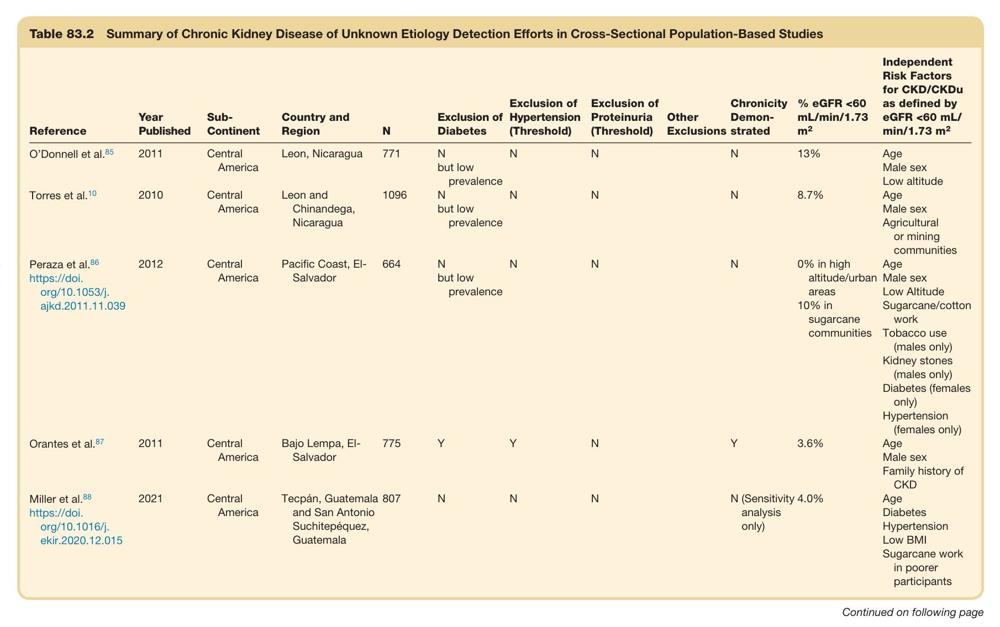

- **Part 2 (Page 8)**:
  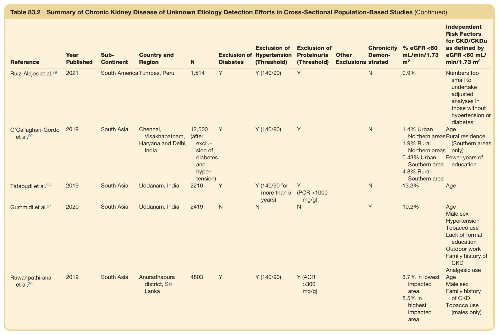

- **Part 3 (Page 9)**:
  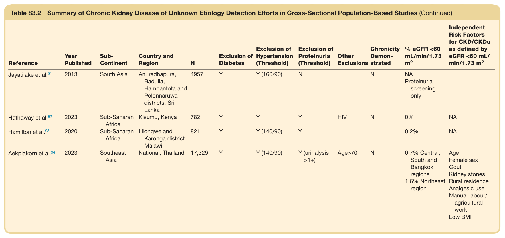

#### Table Data (CSV: [Table_83_2.csv](Table_83_2.csv))

```markdown
| Table Text (OCR) |
| :--- |
| Table 83.2Summary of Chronic Kidney Disease of Unknown Etiology Detection Efforts in Cross-Sectional Population-Based Studies Reference  Year Published  Sub-Continent  Country and Region  N  Exclusion of Diabetes  Exclusion of Hypertension (Threshold)  Exclusion of Proteinuria (Threshold)  Other Exclusions  Chronicity Demonstrated  % eGFR <60 mL/min/1.73  m^2   Independent Risk Factors for CKD/CKDu as defined by eGFR <60 mL/min/1.73  m^2     O'Donnell et al. ^{85}   2011  Central America  Leon, Nicaragua  771  N but low prevalence  N  N    N  13%  AgeMale sexLow altitude    Torres et al. ^{10}   2010  Central America  Leon and Chinandega, Nicaragua  1096  N but low prevalence  N  N    N  8.7%  AgeMale sexAgricultural or mining communities    Peraza et al. ^{86} https://doi.org/10.1053/j.ajkd.2011.11.039  2012  Central America  Pacific Coast, El-Salvador  664  N but low prevalence  N  N    N  0% in high altitude/urban areas10% in sugarcane communities  AgeMale sexLow Altitude Sugarcane/cotton workTobacco use (males only)Kidney stones (males only)Diabetes (females only)Hypertension (females only)    Orantes et al. ^{87}   2011  Central America  Bajo Lempa, El-Salvador  775  Y  Y  N    Y  3.6%  AgeMale sexFamily history of CKD    Miller et al. ^{88} https://doi.org/10.1016/j.ekir.2020.12.015  2021  Central America  Tecpán, Guatemala and San Antonio Suchitepéquez, Guatemala  807  N  N  N    N (Sensitivity analysis only)  4.0%  AgeDiabetesHypertensionLow BMI Sugarcane work in poorer participants Continued on following page |
```

Table 83.2 Summary of Chronic Kidney Disease of Unknown Etiology Detection Efforts in Cross-Sectional Population-Based Studies (Continued)

---

### Table_83_3

#### Table Image

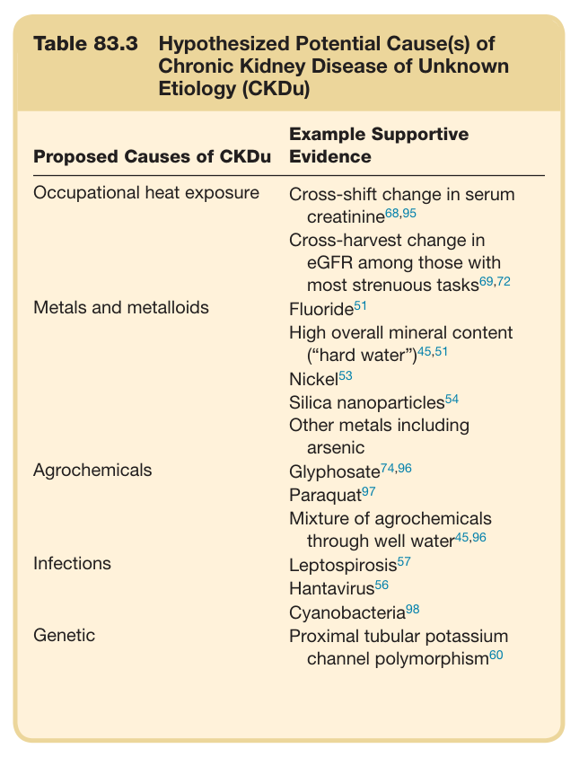

#### Table Data (CSV: [Table_83_3.csv](Table_83_3.csv))

```markdown
| Table Text (OCR) |
| :--- |
| Table 83.3  Hypothesized Potential Cause(s) of Chronic Kidney Disease of Unknown Etiology (CKDu) Proposed Causes of CKDu  Example Supportive Evidence    Occupational heat exposure  Cross-shift change in serum creatinine ^{68,95}     Cross-harvest change in eGFR among those with most strenuous tasks ^{69,72}     Metals and metalloids  Fluoride ^{51}     High overall mineral content (“hard water”) ^{45,51}     Nickel ^{53}     Silica nanoparticles ^{54}     Other metals including arsenic    Agrochemicals  Glyphosate ^{74,96}     Paraquat ^{97}     Mixture of agrochemicals through well water ^{45,96}     Infections  Leptospirosis ^{57}     Hantavirus ^{56}     Cyanobacteria ^{98}     Genetic  Proximal tubular potassium channel polymorphism ^{60} |
```

Table 83.3 Hypothesized Potential Cause(s) of Chronic Kidney Disease of Unknown Etiology (CKDu)

---
