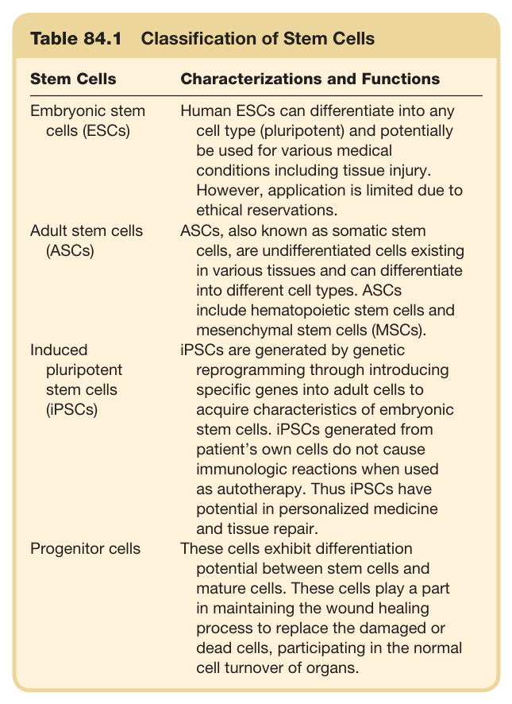
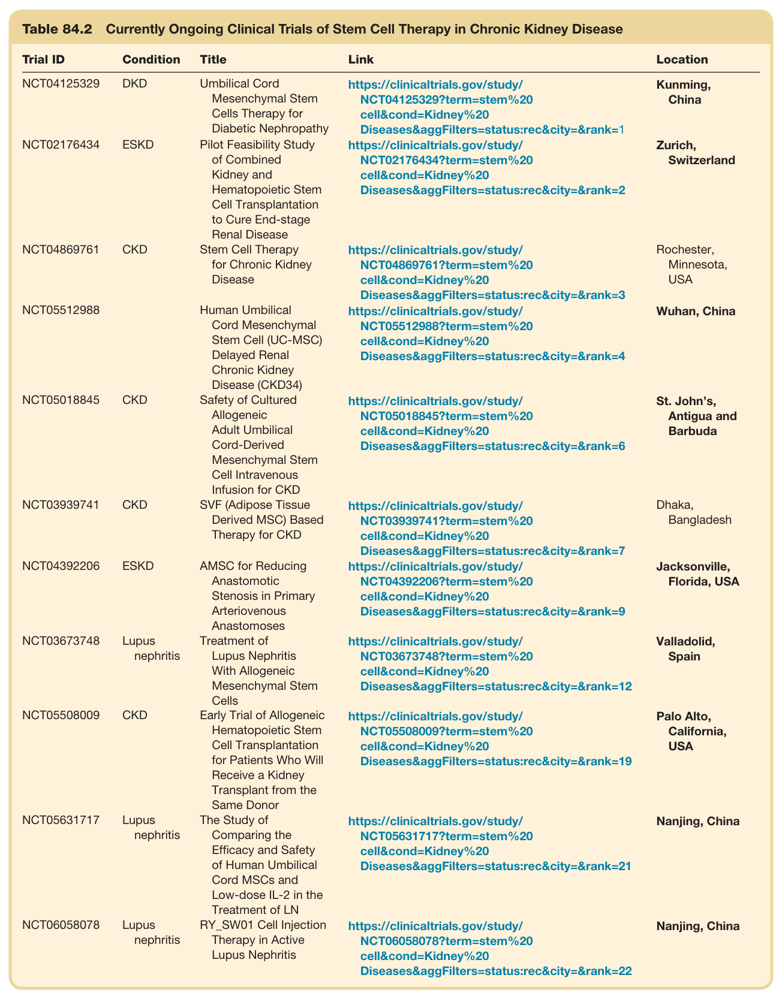

# 84. Stem Cells, Kidney Regeneration, and Gene and Cell Therapy in Nephrology - Figures and Tables Index

This document lists all figures and tables extracted from `84. Stem Cells, Kidney Regeneration, and Gene and Cell Therapy in Nephrology.pdf`.

## Table of Contents
- [Figures](#figures)
- [Tables](#tables)

---

## Figures

*No figures resolved for this chapter.*

## Tables

### Table_84_1

#### Table Image



#### Table Data (CSV: [Table_84_1.csv](Table_84_1.csv))

```markdown
| Table Text (OCR) |
| :--- |
| Table 84.1 Classification of Stem Cells Stem Cells  Characterizations and Functions    Embryonic stem cells (ESCs)  Human ESCs can differentiate into any cell type (pluripotent) and potentially be used for various medical conditions including tissue injury. However, application is limited due to ethical reservations.    Adult stem cells (ASCs)  ASCs, also known as somatic stem cells, are undifferentiated cells existing in various tissues and can differentiate into different cell types. ASCs include hematopoietic stem cells and mesenchymal stem cells (MSCs).    Induced pluripotent stem cells (iPSCs)  iPSCs are generated by genetic reprogramming through introducing specific genes into adult cells to acquire characteristics of embryonic stem cells. iPSCs generated from patient’s own cells do not cause immunologic reactions when used as autotherapy. Thus iPSCs have potential in personalized medicine and tissue repair.    Progenitor cells  These cells exhibit differentiation potential between stem cells and mature cells. These cells play a part in maintaining the wound healing process to replace the damaged or dead cells, participating in the normal cell turnover of organs. |
```

Table 84.1 Classification of Stem Cells

---

### Table_84_2

#### Table Image



#### Table Data (CSV: [Table_84_2.csv](Table_84_2.csv))

```markdown
| Table Text (OCR) |
| :--- |
| Table 84.2 Currently Ongoing Clinical Trials of Stem Cell Therapy in Chronic Kidney Disease Trial ID  Condition  Title  Link  Location    NCT04125329  DKD  Umbilical CordMesenchymal StemCells Therapy forDiabetic Nephropathy  https://clinicaltrials.gov/study/NCT04125329?term=stem%20cell&cond=Kidney%20Diseases&aggFilters=status:rec&city=&rank=1  Kunming,China    NCT02176434  ESKD  Pilot Feasibility Studyof CombinedKidney andHematopoietic StemCell Transplantationto Cure End-stageRenal Disease  https://clinicaltrials.gov/study/NCT02176434?term=stem%20cell&cond=Kidney%20Diseases&aggFilters=status:rec&city=&rank=2  Zurich,Switzerland    NCT04869761  CKD  Stem Cell Therapyfor Chronic KidneyDisease  https://clinicaltrials.gov/study/NCT04869761?term=stem%20cell&cond=Kidney%20Diseases&aggFilters=status:rec&city=&rank=3  Rochester,Minnesota,USA    NCT05512988    Human UmbilicalCord MesenchymalStem Cell (UC-MSC)Delayed RenalChronic KidneyDisease (CKD34)  https://clinicaltrials.gov/study/NCT05512988?term=stem%20cell&cond=Kidney%20Diseases&aggFilters=status:rec&city=&rank=4  Wuhan, China    NCT05018845  CKD  Safety of CulturedAllogeneicAdult UmbilicalCord-DerivedMesenchymal StemCell IntravenousInfusion for CKD  https://clinicaltrials.gov/study/NCT05018845?term=stem%20cell&cond=Kidney%20Diseases&aggFilters=status:rec&city=&rank=6  St. John's,Antigua andBarbuda    NCT03939741  CKD  SVF (Adipose TissueDerived MSC) BasedTherapy for CKD  https://clinicaltrials.gov/study/NCT03939741?term=stem%20cell&cond=Kidney%20Diseases&aggFilters=status:rec&city=&rank=7  Dhaka,Bangladesh    NCT04392206  ESKD  AMSC for ReducingAnastomoticStenosis in PrimaryArteriovenousAnastomoses  https://clinicaltrials.gov/study/NCT04392206?term=stem%20cell&cond=Kidney%20Diseases&aggFilters=status:rec&city=&rank=9  Jacksonville,Florida, USA    NCT03673748  Lupusnephritis  Treatment ofLupus NephritisWith AllogeneicMesenchymal StemCells  https://clinicaltrials.gov/study/NCT03673748?term=stem%20cell&cond=Kidney%20Diseases&aggFilters=status:rec&city=&rank=12  Valladolid,Spain    NCT05508009  CKD  Early Trial of AllogeneicHematopoietic StemCell Transplantationfor Patients Who WillReceive a KidneyTransplant from theSame Donor  https://clinicaltrials.gov/study/NCT05508009?term=stem%20cell&cond=Kidney%20Diseases&aggFilters=status:rec&city=&rank=19  Palo Alto,California,USA    NCT05631717  Lupusnephritis  The Study ofComparing theEfficacy and Safetyof Human UmbilicalCord MSCs andLow-dose IL-2 in theTreatment of LN  https://clinicaltrials.gov/study/NCT05631717?term=stem%20cell&cond=Kidney%20Diseases&aggFilters=status:rec&city=&rank=21  Nanjing, China    NCT06058078  Lupusnephritis  RY_SW01 Cell InjectionTherapy in ActiveLupus Nephritis  https://clinicaltrials.gov/study/NCT06058078?term=stem%20cell&cond=Kidney%20Diseases&aggFilters=status:rec&city=&rank=22  Nanjing, China |
```

Table 84.2 Currently Ongoing Clinical Trials of Stem Cell Therapy in Chronic Kidney Disease

---
