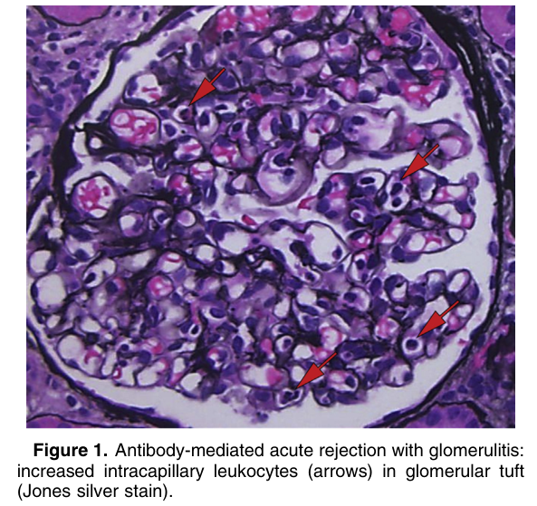
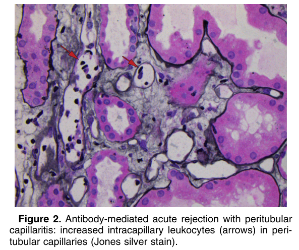
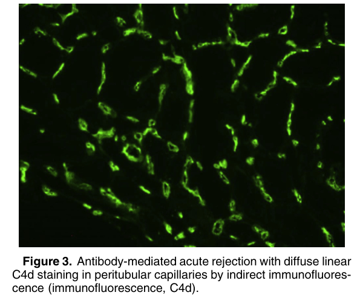
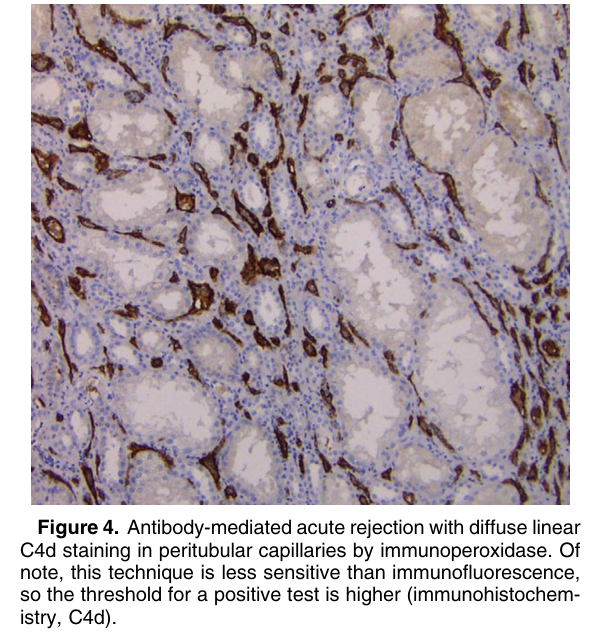

# Acute Antibody-Mediated Rejection - Figures and Tables Index

This document lists all figures and tables extracted from `Acute Antibody-Mediated Rejection.pdf`.

## Table of Contents
- [Figures](#figures)
- [Tables](#tables)

---

## Figures

### Fig_1

Figure 1. Antibody-mediated acute rejection with glomerulitis: increased intracapillary leukocytes (arrows) in glomerular tuft (Jones silver stain).

---

### Fig_2

Figure 2. Antibody-mediated acute rejection with peritubular capillaritis: increased intracapillary leukocytes (arrows) in peritubular capillaries (Jones silver stain).

---

### Fig_3

Figure 3. Antibody-mediated acute rejection with diffuse linear C4d staining in peritubular capillaries by indirect immunofluorescence (immunofluorescence, C4d).

---

### Fig_4

Figure 4. Antibody-mediated acute rejection with diffuse linear C4d staining in peritubular capillaries by immunoperoxidase. Of note, this technique is less sensitive than immunofluorescence, so the threshold for a positive test is higher (immunohistochemistry, C4d).

---

## Tables

*No tables resolved for this chapter.*
