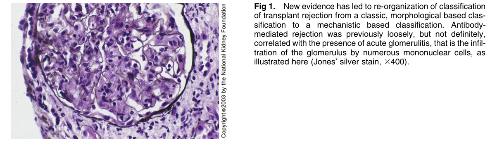
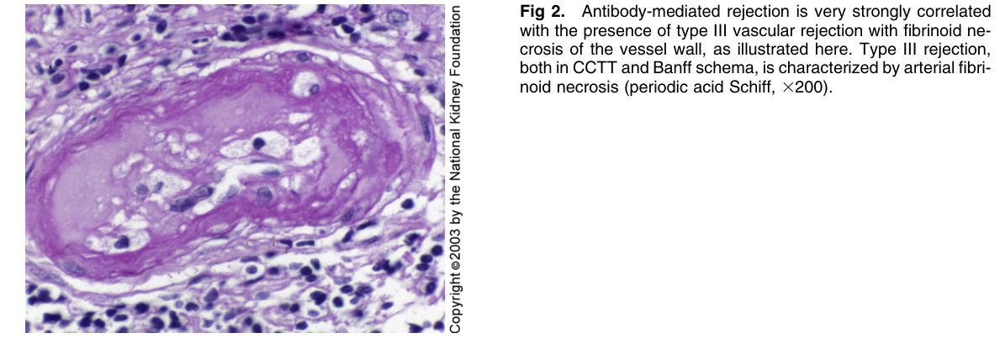
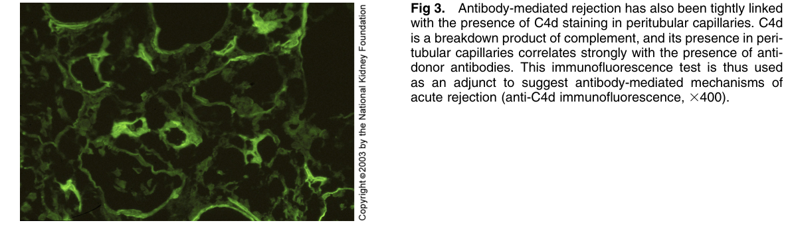

# Acute Humoral Rejection - Figures and Tables Index

This document lists all figures and tables extracted from `Acute Humoral Rejection.pdf`.

## Table of Contents
- [Figures](#figures)
- [Tables](#tables)

---

## Figures

### Fig_1

Figure 1. New evidence has led to re-organization of classification of transplant rejection from a classic, morphological based classification to a mechanistic based classification. Antibodymediated rejection was previously loosely, but not definitely, correlated with the presence of acute glomerulitis, that is the infiltration of the glomerulus by numerous mononuclear cells, as illustrated here (Jones’ silver stain, 3400).

---

### Fig_2

Figure 2. Antibody-mediated rejection is very strongly correlated with the presence of type III vascular rejection with fibrinoid ne crosis of the vessel wall, as illustrated here. Type III rejection, both in CCTT and Banff schema, is characterized by arterial fibri noid necrosis (periodic acid Schiff, 3200).

---

### Fig_3

Figure 3. Antibody-mediated rejection has also been tightly linked with the presence of C4d staining in peritubular capillaries. C4d is a breakdown product of complement, and its presence in peritubular capillaries correlates strongly with the presence of antidonor antibodies. This immunofluorescence test is thus used as an adjunct to suggest antibody-mediated mechanisms of acute rejection (anti-C4d immunofluorescence, 3400).

---

## Tables

*No tables resolved for this chapter.*
