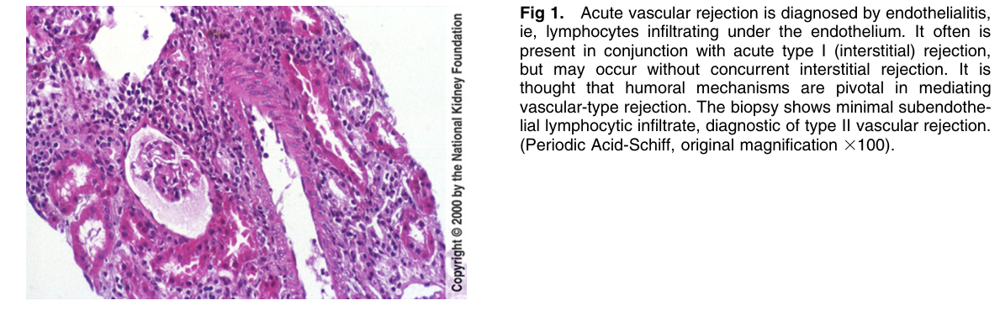
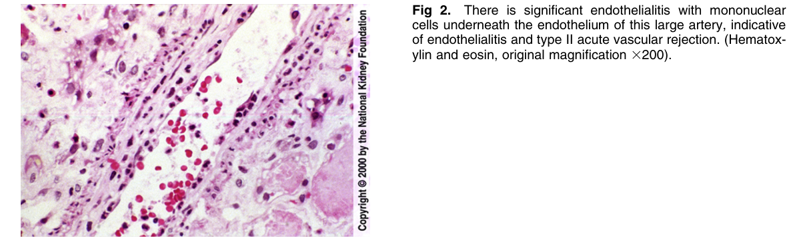
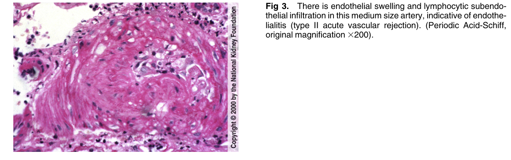
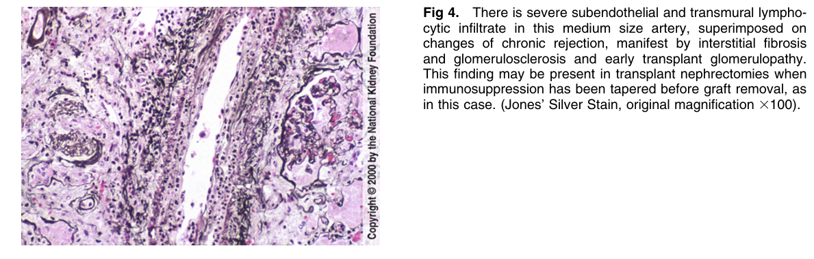
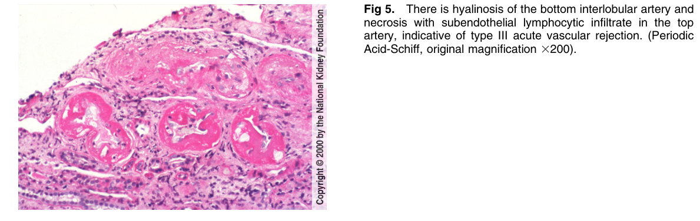

# Acute Rejection, Types II & III (Vascular) - Figures and Tables Index

This document lists all figures and tables extracted from `Acute Rejection, Types II & III (Vascular).pdf`.

## Table of Contents
- [Figures](#figures)
- [Tables](#tables)

---

## Figures

### Fig_1

Figure 1. Acute vascular rejection is diagnosed by endothelialitis, ie, lymphocytes infiltrating under the endothelium. It often is present in conjunction with acute type I (interstitial) rejection, but may occur without concurrent interstitial rejection. It is thought that humoral mechanisms are pivotal in mediating vascular-type rejection. The biopsy shows minimal subendothelial lymphocytic infiltrate, diagnostic of type II vascular rejection. (Periodic Acid-Schiff, original magnification 3100).

---

### Fig_2

Figure 2. There is significant endothelialitis with mononuclear cells underneath the endothelium of this large artery, indicative of endothelialitis and type II acute vascular rejection. (Hematoxylin and eosin, original magnification 3200).

---

### Fig_3

Figure 3. There is endothelial swelling and lymphocytic subendothelial infiltration in this medium size artery, indicative of endothelialitis (type II acute vascular rejection). (Periodic Acid-Schiff, original magnification 3200).

---

### Fig_4

Figure 4. There is severe subendothelial and transmural lymphocytic infiltrate in this medium size artery, superimposed on changes of chronic rejection, manifest by interstitial fibrosis and glomerulosclerosis and early transplant glomerulopathy. This finding may be present in transplant nephrectomies when immunosuppression has been tapered before graft removal, as in this case. (Jones’ Silver Stain, original magnification 3100).

---

### Fig_5

Figure 5. There is hyalinosis of the bottom interlobular artery and necrosis with subendothelial lymphocytic infiltrate in the top artery, indicative of type III acute vascular rejection. (Periodi Acid-Schiff, original magnification 3200).

---

## Tables

*No tables resolved for this chapter.*
