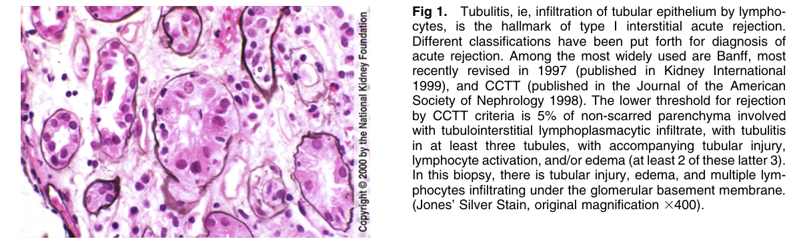
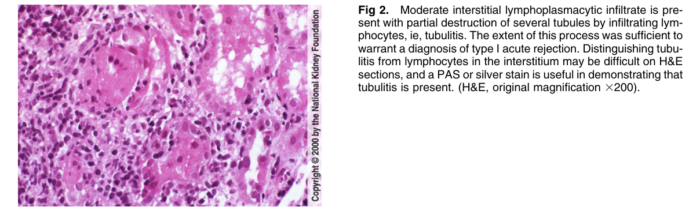
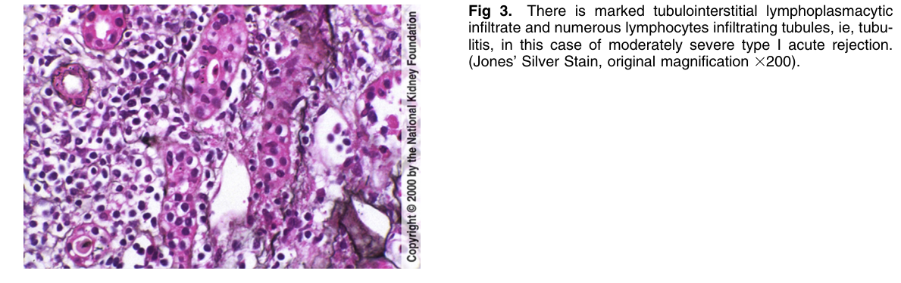
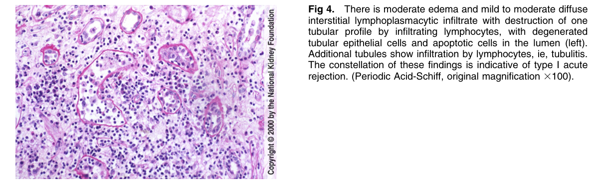
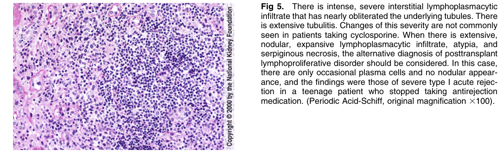

# Acute Rejection, type I (Interstitial) - Figures and Tables Index

This document lists all figures and tables extracted from `Acute Rejection, type I (Interstitial).pdf`.

## Table of Contents
- [Figures](#figures)
- [Tables](#tables)

---

## Figures

### Fig_1

Figure 1. Tubulitis, ie, infiltration of tubular epithelium by lymphocytes, is the hallmark of type I interstitial acute rejection. Different classifications have been put forth for diagnosis of acute rejection. Among the most widely used are Banff, most recently revised in 1997 (published in Kidney Internationa 1999), and CCTT (published in the Journal of the American Society of Nephrology 1998). The lower threshold for rejection by CCTT criteria is 5% of non-scarred parenchyma involved with tubulointerstitial lymphoplasmacytic infiltrate, with tubulitis in at least three tubules, with accompanying tubular injury, lymphocyte activation, and/or edema (at least 2 of these latter 3). In this biopsy, there is tubular injury, edema, and multiple lymphocytes infiltrating under the glomerular basement membrane. (Jones’ Silver Stain, original magnification 3400).

---

### Fig_2

Figure 2. Moderate interstitial lymphoplasmacytic infiltrate is present with partial destruction of several tubules by infiltrating lymphocytes, ie, tubulitis. The extent of this process was sufficient to warrant a diagnosis of type I acute rejection. Distinguishing tubulitis from lymphocytes in the interstitium may be difficult on H&E sections, and a PAS or silver stain is useful in demonstrating tha tubulitis is present. (H&E, original magnification 3200).

---

### Fig_3

Figure 3. There is marked tubulointerstitial lymphoplasmacytic infiltrate and numerous lymphocytes infiltrating tubules, ie, tubulitis, in this case of moderately severe type I acute rejection. (Jones’ Silver Stain, original magnification 3200).

---

### Fig_4

Figure 4. There is moderate edema and mild to moderate diffuse interstitial lymphoplasmacytic infiltrate with destruction of one tubular profile by infiltrating lymphocytes, with degenerated tubular epithelial cells and apoptotic cells in the lumen (left). Additional tubules show infiltration by lymphocytes, ie, tubulitis. The constellation of these findings is indicative of type I acute rejection. (Periodic Acid-Schiff, original magnification 3100).

---

### Fig_5

Figure 5. There is intense, severe interstitial lymphoplasmacytic infiltrate that has nearly obliterated the underlying tubules. There is extensive tubulitis. Changes of this severity are not commonly seen in patients taking cyclosporine. When there is extensive, nodular, expansive lymphoplasmacytic infiltrate, atypia, and serpiginous necrosis, the alternative diagnosis of posttransplant lymphoproliferative disorder should be considered. In this case, there are only occasional plasma cells and no nodular appearance, and the findings were those of severe type I acute rejection in a teenage patient who stopped taking antirejection medication. (Periodic Acid-Schiff, original magnification 3100).

---

## Tables

*No tables resolved for this chapter.*
