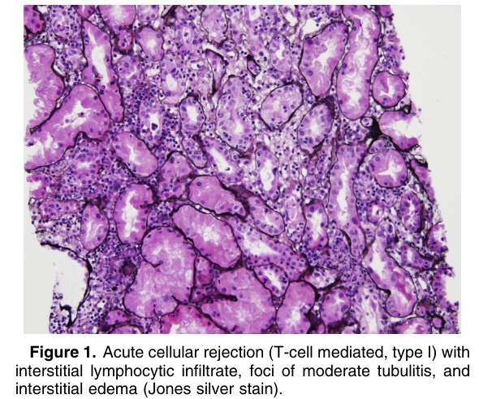
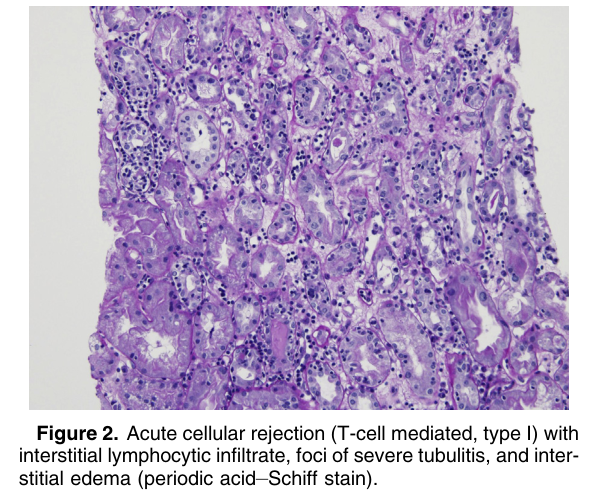
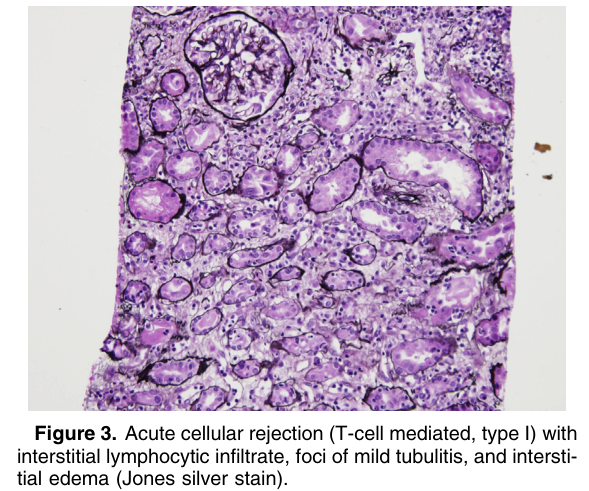
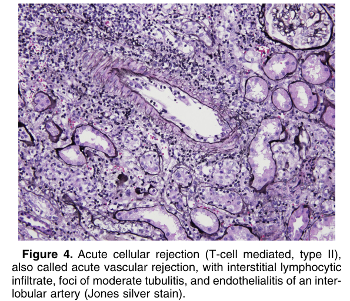

# Acute T-Cell–Mediated Rejection - Figures and Tables Index

This document lists all figures and tables extracted from `Acute T-Cell–Mediated Rejection.pdf`.

## Table of Contents
- [Figures](#figures)
- [Tables](#tables)

---

## Figures

### Fig_1

Figure 1. Acute cellular rejection (T-cell mediated, type I) with interstitial lymphocytic infiltrate, foci of moderate tubulitis, and interstitial edema (Jones silver stain).

---

### Fig_2

Figure 2. Acute cellular rejection (T-cell mediated, type I) with interstitial lymphocytic infiltrate, foci of severe tubulitis, and interstitial edema (periodic acid–Schiff stain).

---

### Fig_3

Figure 3. Acute cellular rejection (T-cell mediated, type I) with interstitial lymphocytic infiltrate, foci of mild tubulitis, and intersti tial edema (Jones silver stain).

---

### Fig_4

Figure 4. Acute cellular rejection (T-cell mediated, type II), also called acute vascular rejection, with interstitial lymphocytic infiltrate, foci of moderate tubulitis, and endothelialitis of an interlobular artery (Jones silver stain).

---

## Tables

*No tables resolved for this chapter.*
