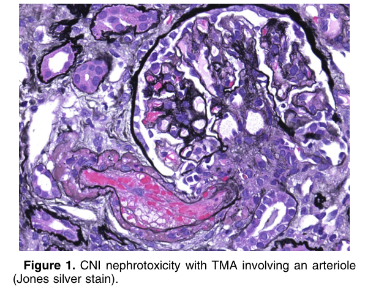
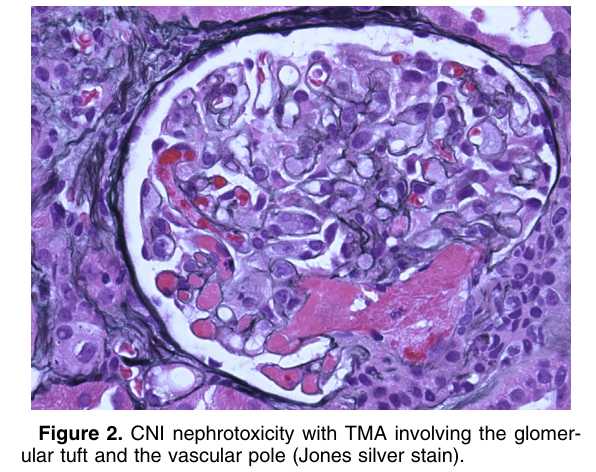
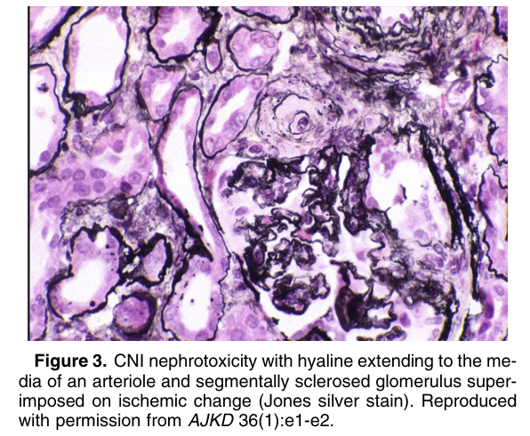
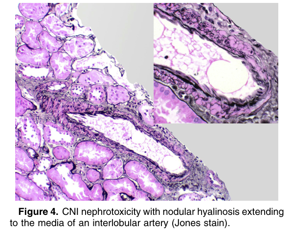
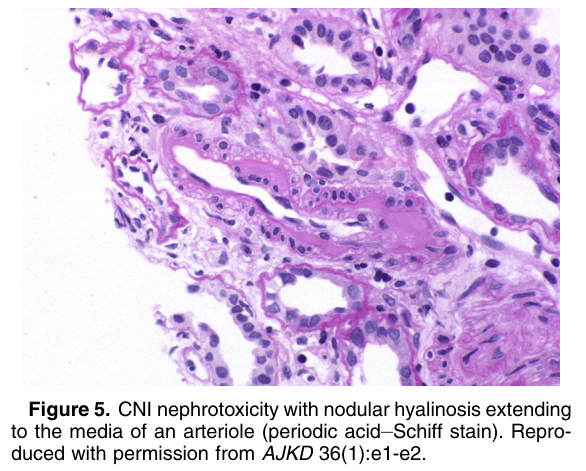
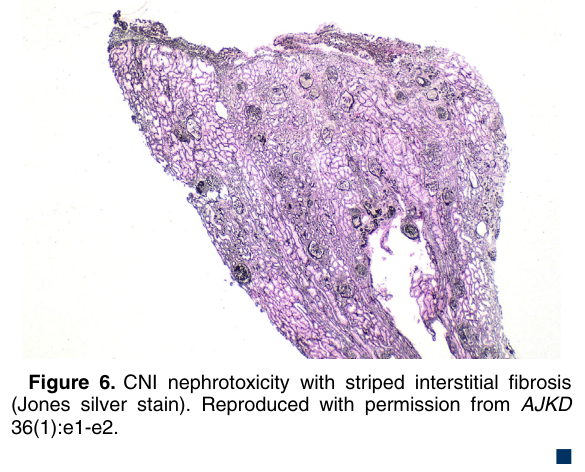

# Calcineurin Inhibitor Nephrotoxicity - Figures and Tables Index

This document lists all figures and tables extracted from `Calcineurin Inhibitor Nephrotoxicity.pdf`.

## Table of Contents
- [Figures](#figures)
- [Tables](#tables)

---

## Figures

### Fig_1

Figure 1. CNI nephrotoxicity with TMA involving an arteriole (Jones silver stain).

---

### Fig_2

Figure 2. CNI nephrotoxicity with TMA involving the glomerular tuft and the vascular pole (Jones silver stain).

---

### Fig_3

Figure 3. CNI nephrotoxicity with hyaline extending to the media of an arteriole and segmentally sclerosed glomerulus superimposed on ischemic change (Jones silver stain). Reproduced with permission from AJKD 36(1):e1-e2.

---

### Fig_4

Figure 4. CNI nephrotoxicity with nodular hyalinosis extending to the media of an interlobular artery (Jones stain).

---

### Fig_5

Figure 5. CNI nephrotoxicity with nodular hyalinosis extending to the media of an arteriole (periodic acid–Schiff stain). Reproduced with permission from AJKD 36(1):e1-e2.

---

### Fig_6

Figure 6. CNI nephrotoxicity with striped interstitial fibrosis (Jones silver stain). Reproduced with permission from AJKD 36(1):e1-e2. -

---

## Tables

*No tables resolved for this chapter.*
