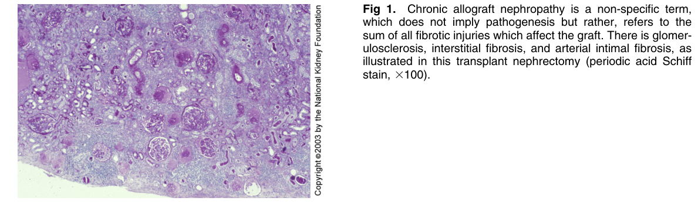
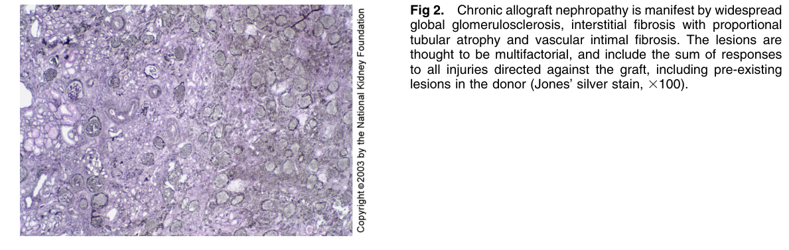
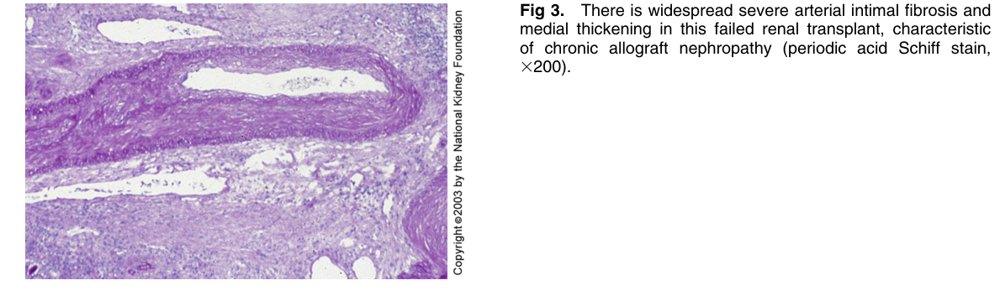
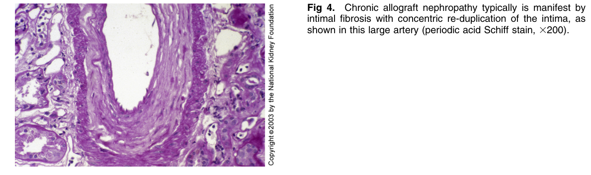
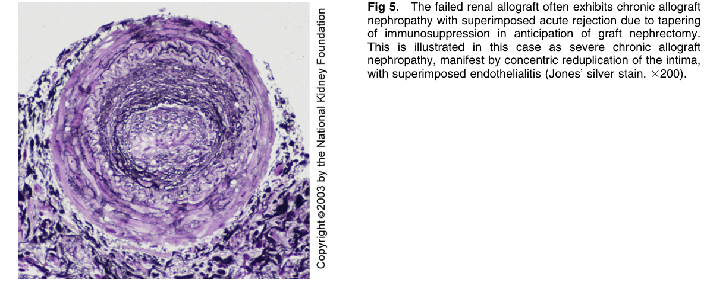

# Chronic Allograft Nephropathy 2 - Figures and Tables Index

This document lists all figures and tables extracted from `Chronic Allograft Nephropathy 2.pdf`.

## Table of Contents
- [Figures](#figures)
- [Tables](#tables)

---

## Figures

### Fig_1

Figure 1. Chronic allograft nephropathy is a non-specific term, which does not imply pathogenesis but rather, refers to the sum of all fibrotic injuries which affect the graft. There is glomerulosclerosis, interstitial fibrosis, and arterial intimal fibrosis, as illustrated in this transplant nephrectomy (periodic acid Schif stain, 3100).

---

### Fig_2

Figure 2. Chronic allograft nephropathy is manifest by widespread global glomerulosclerosis, interstitial fibrosis with proportiona tubular atrophy and vascular intimal fibrosis. The lesions are thought to be multifactorial, and include the sum of responses to all injuries directed against the graft, including pre-existing lesions in the donor (Jones’ silver stain, 3100).

---

### Fig_3

Figure 3. There is widespread severe arterial intimal fibrosis and medial thickening in this failed renal transplant, characteristi of chronic allograft nephropathy (periodic acid Schiff stain, 3200).

---

### Fig_4

Figure 4. Chronic allograft nephropathy typically is manifest b intimal fibrosis with concentric re-duplication of the intima, as shown in this large artery (periodic acid Schiff stain, 3200).

---

### Fig_5

Figure 5. The failed renal allograft often exhibits chronic allograf nephropathy with superimposed acute rejection due to tapering of immunosuppression in anticipation of graft nephrectomy. This is illustrated in this case as severe chronic allograf nephropathy, manifest by concentric reduplication of the intima, with superimposed endothelialitis (Jones’ silver stain, 3200).

---

## Tables

*No tables resolved for this chapter.*
