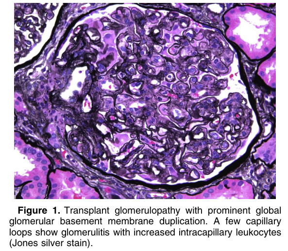
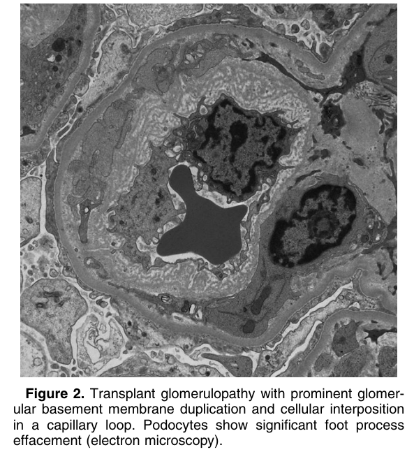
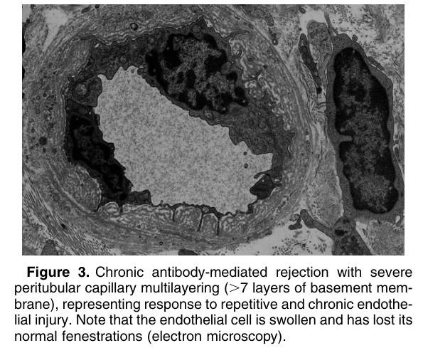
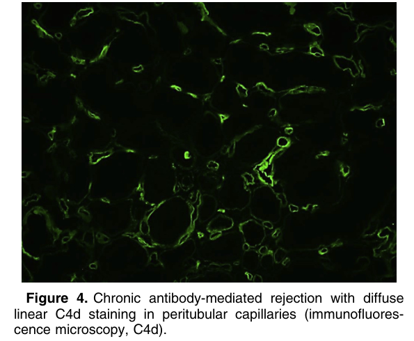

# Chronic Antibody-Mediated Rejection - Figures and Tables Index

This document lists all figures and tables extracted from `Chronic Antibody-Mediated Rejection.pdf`.

## Table of Contents
- [Figures](#figures)
- [Tables](#tables)

---

## Figures

### Fig_1

Figure 1. Transplant glomerulopathy with prominent global glomerular basement membrane duplication. A few capillary loops show glomerulitis with increased intracapillary leukocytes (Jones silver stain).

---

### Fig_2

Figure 2. Transplant glomerulopathy with prominent glomerular basement membrane duplication and cellular interposition in a capillary loop. Podocytes show significant foot process effacement (electron microscopy).

---

### Fig_3

Figure 3. Chronic antibody-mediated rejection with severe peritubular capillary multilayering (.7 layers of basement mem brane), representing response to repetitive and chronic endothelial injury. Note that the endothelial cell is swollen and has lost its normal fenestrations (electron microscopy).

---

### Fig_4

Figure 4. Chronic antibody-mediated rejection with diffuse linear C4d staining in peritubular capillaries (immunofluores cence microscopy, C4d).

---

## Tables

*No tables resolved for this chapter.*
