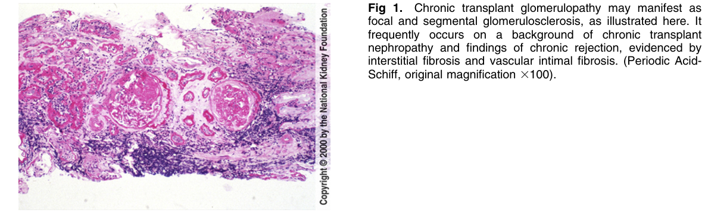
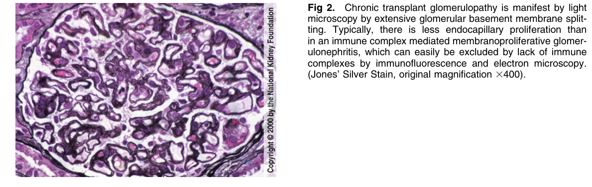
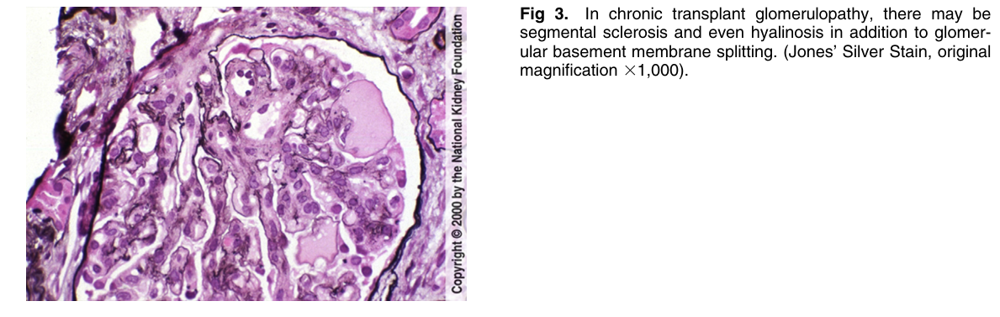
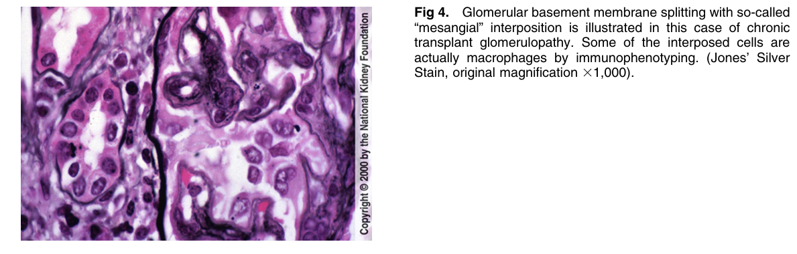
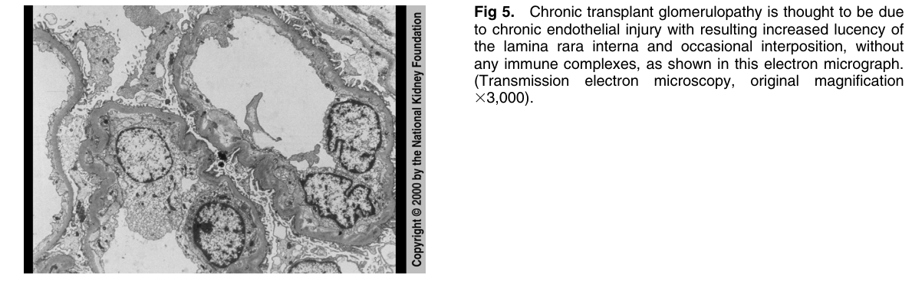

# Chronic Transplant Glomerulopathy - Figures and Tables Index

This document lists all figures and tables extracted from `Chronic Transplant Glomerulopathy.pdf`.

## Table of Contents
- [Figures](#figures)
- [Tables](#tables)

---

## Figures

### Fig_1

Figure 1. Chronic transplant glomerulopathy may manifest as focal and segmental glomerulosclerosis, as illustrated here. It frequently occurs on a background of chronic transplant nephropathy and findings of chronic rejection, evidenced by interstitial fibrosis and vascular intimal fibrosis. (Periodic Acid-Schiff, original magnification 3100).

---

### Fig_2

Figure 2. Chronic transplant glomerulopathy is manifest by ligh microscopy by extensive glomerular basement membrane splitting. Typically, there is less endocapillary proliferation than in an immune complex mediated membranoproliferative glomerulonephritis, which can easily be excluded by lack of immune complexes by immunofluorescence and electron microscopy. (Jones’ Silver Stain, original magnification 3400).

---

### Fig_3

Figure 3. In chronic transplant glomerulopathy, there may be segmental sclerosis and even hyalinosis in addition to glomerular basement membrane splitting. (Jones’ Silver Stain, origina magnification 31,000).

---

### Fig_4

Figure 4. Glomerular basement membrane splitting with so-called “mesangial” interposition is illustrated in this case of chronic transplant glomerulopathy. Some of the interposed cells are actually macrophages by immunophenotyping. (Jones’ Silver Stain, original magnification 31,000).

---

### Fig_5

Figure 5. Chronic transplant glomerulopathy is thought to be due to chronic endothelial injury with resulting increased lucency o the lamina rara interna and occasional interposition, withou any immune complexes, as shown in this electron micrograph. (Transmission electron microscopy, original magnification 33,000).

---

## Tables

*No tables resolved for this chapter.*
