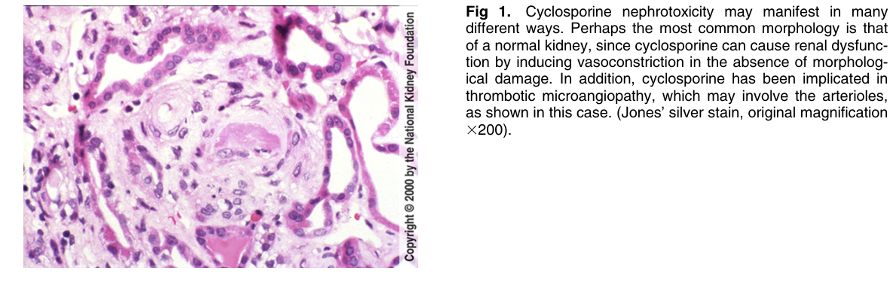
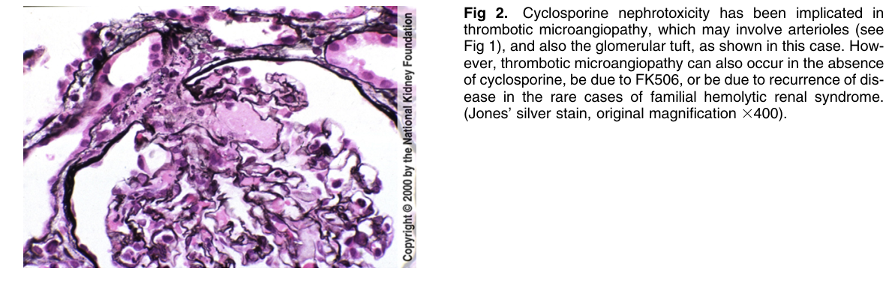
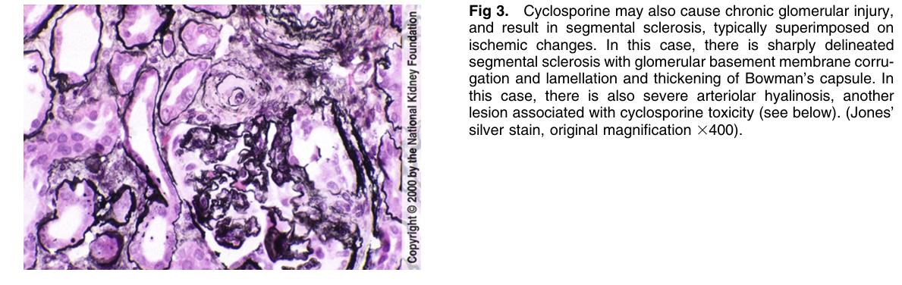
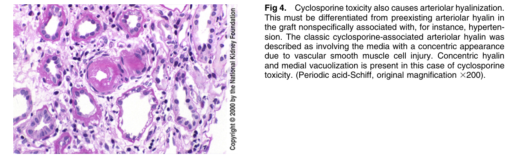
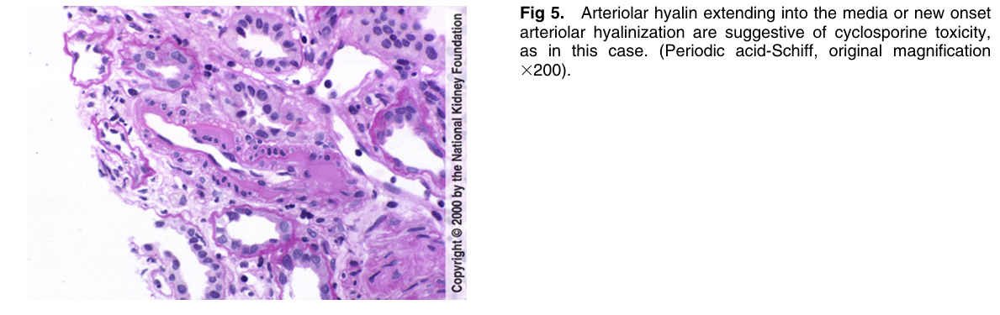
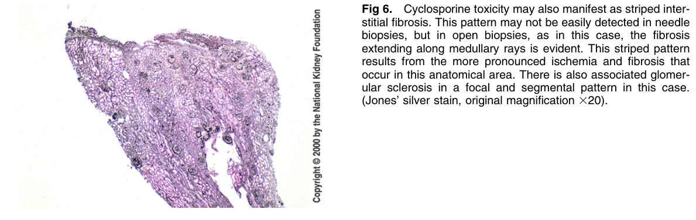

# Cyclosporine Toxicity - Figures and Tables Index

This document lists all figures and tables extracted from `Cyclosporine Toxicity.pdf`.

## Table of Contents
- [Figures](#figures)
- [Tables](#tables)

---

## Figures

### Fig_1

Figure 1. Cyclosporine nephrotoxicity may manifest in many different ways. Perhaps the most common morphology is that of a normal kidney, since cyclosporine can cause renal dysfunction by inducing vasoconstriction in the absence of morphological damage. In addition, cyclosporine has been implicated in thrombotic microangiopathy, which may involve the arterioles, as shown in this case. (Jones’ silver stain, original magnification 3200).

---

### Fig_2

Figure 2. Cyclosporine nephrotoxicity has been implicated in thrombotic microangiopathy, which may involve arterioles (see Fig 1), and also the glomerular tuft, as shown in this case. However, thrombotic microangiopathy can also occur in the absence of cyclosporine, be due to FK506, or be due to recurrence of disease in the rare cases of familial hemolytic renal syndrome. (Jones’ silver stain, original magnification 3400).

---

### Fig_3

Figure 3. Cyclosporine may also cause chronic glomerular injury, and result in segmental sclerosis, typically superimposed on ischemic changes. In this case, there is sharply delineated segmental sclerosis with glomerular basement membrane corrugation and lamellation and thickening of Bowman’s capsule. In this case, there is also severe arteriolar hyalinosis, another lesion associated with cyclosporine toxicity (see below). (Jones silver stain, original magnification 3400).

---

### Fig_4

Figure 4. Cyclosporine toxicity also causes arteriolar hyalinization. This must be differentiated from preexisting arteriolar hyalin in the graft nonspecifically associated with, for instance, hypertension. The classic cyclosporine-associated arteriolar hyalin was described as involving the media with a concentric appearance due to vascular smooth muscle cell injury. Concentric hyalin and medial vacuolization is present in this case of cyclosporine toxicity. (Periodic acid-Schiff, original magnification 3200).

---

### Fig_5

Figure 5. Arteriolar hyalin extending into the media or new onse arteriolar hyalinization are suggestive of cyclosporine toxicity, as in this case. (Periodic acid-Schiff, original magnification 3200).

---

### Fig_6

Figure 6. Cyclosporine toxicity may also manifest as striped interstitial fibrosis. This pattern may not be easily detected in needle biopsies, but in open biopsies, as in this case, the fibrosis extending along medullary rays is evident. This striped pattern results from the more pronounced ischemia and fibrosis tha occur in this anatomical area. There is also associated glomerular sclerosis in a focal and segmental pattern in this case. (Jones’ silver stain, original magnification 320).

---

## Tables

*No tables resolved for this chapter.*
