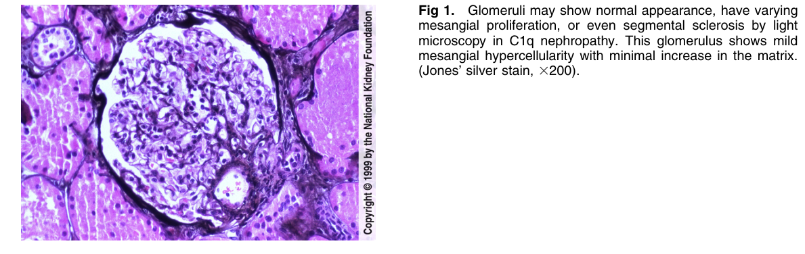
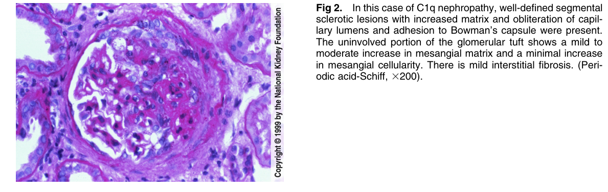
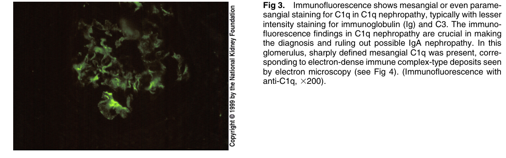
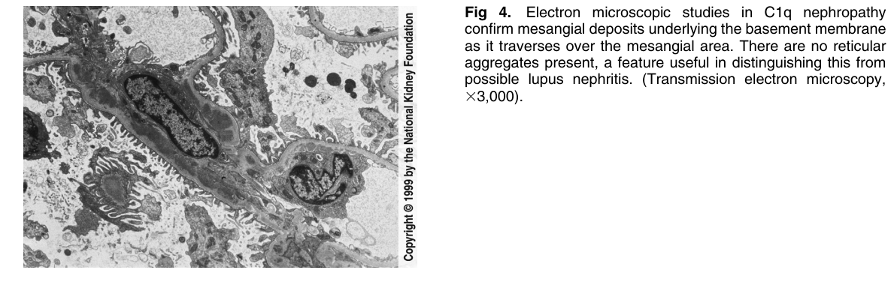

# C1q Nephropathy 2 - Figures and Tables Index

This document lists all figures and tables extracted from `C1q Nephropathy 2.pdf`.

## Table of Contents
- [Figures](#figures)
- [Tables](#tables)

---

## Figures

### Fig_1

Figure 1. Glomeruli may show normal appearance, have varying mesangial proliferation, or even segmental sclerosis by ligh microscopy in C1q nephropathy. This glomerulus shows mild mesangial hypercellularity with minimal increase in the matrix. (Jones’ silver stain, 3200).

---

### Fig_2

Figure 2. In this case of C1q nephropathy, well-defined segmenta sclerotic lesions with increased matrix and obliteration of capillary lumens and adhesion to Bowman’s capsule were present. The uninvolved portion of the glomerular tuft shows a mild to moderate increase in mesangial matrix and a minimal increase in mesangial cellularity. There is mild interstitial fibrosis. (Periodic acid-Schiff, 3200).

---

### Fig_3

Figure 3. Immunofluorescence shows mesangial or even paramesangial staining for C1q in C1q nephropathy, typically with lesser intensity staining for immunoglobulin (Ig) and C3. The immunofluorescence findings in C1q nephropathy are crucial in making the diagnosis and ruling out possible IgA nephropathy. In this glomerulus, sharply defined mesangial C1q was present, corresponding to electron-dense immune complex-type deposits seen by electron microscopy (see Fig 4). (Immunofluorescence with anti-C1q, 3200).

---

### Fig_4

Figure 4. Electron microscopic studies in C1q nephropath confirm mesangial deposits underlying the basement membrane as it traverses over the mesangial area. There are no reticular aggregates present, a feature useful in distinguishing this from possible lupus nephritis. (Transmission electron microscopy, 33,000).

---

## Tables

*No tables resolved for this chapter.*
