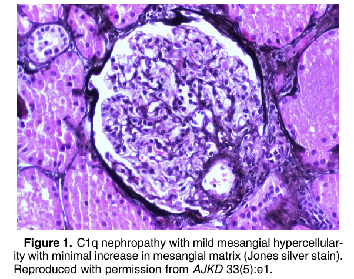
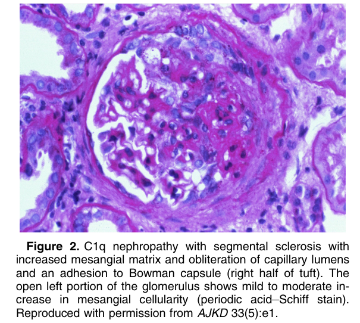
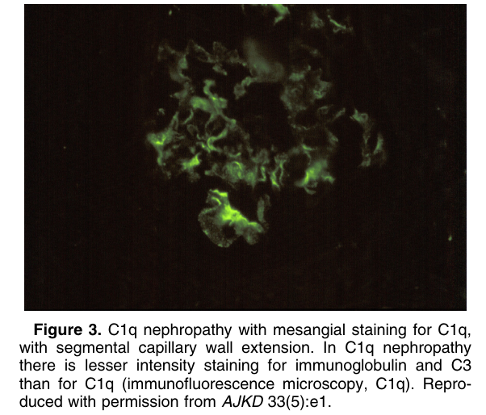
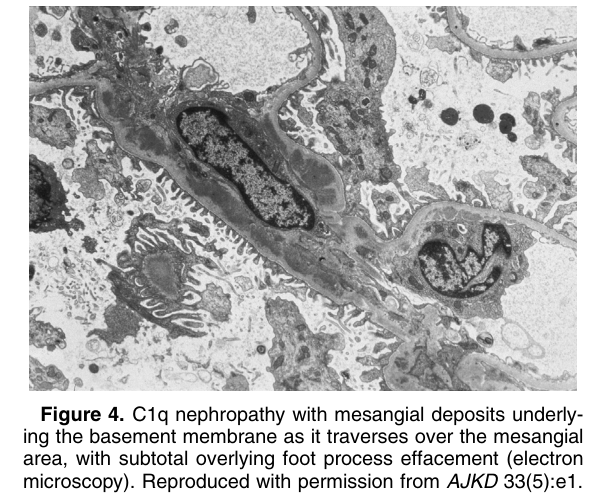

# C1q Nephropathy - Figures and Tables Index

This document lists all figures and tables extracted from `C1q Nephropathy.pdf`.

## Table of Contents
- [Figures](#figures)
- [Tables](#tables)

---

## Figures

### Fig_1

Figure 1. C1q nephropathy with mild mesangial hypercellular ity with minimal increase in mesangial matrix (Jones silver stain). Reproduced with permission from AJKD 33(5):e1.

---

### Fig_2

Figure 2. C1q nephropathy with segmental sclerosis with increased mesangial matrix and obliteration of capillary lumens and an adhesion to Bowman capsule (right half of tuft). The open left portion of the glomerulus shows mild to moderate increase in mesangial cellularity (periodic acid–Schiff stain). Reproduced with permission from AJKD 33(5):e1.

---

### Fig_3

Figure 3. C1q nephropathy with mesangial staining for C1q, with segmental capillary wall extension. In C1q nephropathy there is lesser intensity staining for immunoglobulin and C3 than for C1q (immunofluorescence microscopy, C1q). Reproduced with permission from AJKD 33(5):e1.

---

### Fig_4

Figure 4. C1q nephropathy with mesangial deposits underlying the basement membrane as it traverses over the mesangial area, with subtotal overlying foot process effacement (electron microscopy). Reproduced with permission from AJKD 33(5):e1.

---

## Tables

*No tables resolved for this chapter.*
