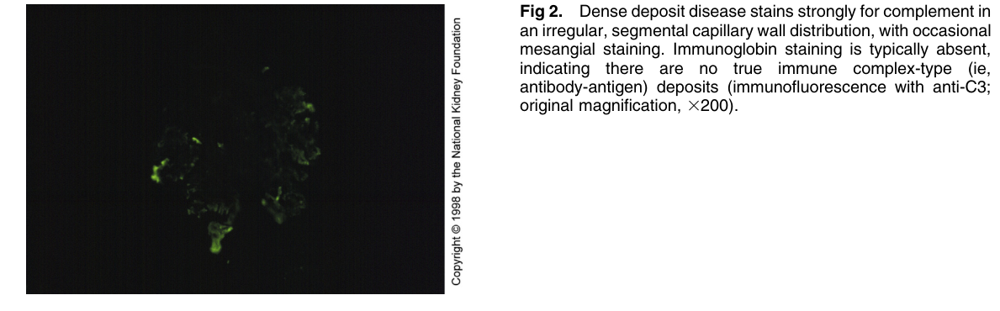

# Dense Deposit Disease 2 - Figures and Tables Index

This document lists all figures and tables extracted from `Dense Deposit Disease 2.pdf`.

## Table of Contents
- [Figures](#figures)
- [Tables](#tables)

---

## Figures

### Fig_2

Figure 2. Dense deposit disease stains strongly for complement in an irregular, segmental capillary wall distribution, with occasiona mesangial staining. Immunoglobin staining is typically absent, indicating there are no true immune complex-type (ie, antibody-antigen) deposits (immunofluorescence with anti-C3; original magnification, 3200).

---

## Tables

*No tables resolved for this chapter.*
