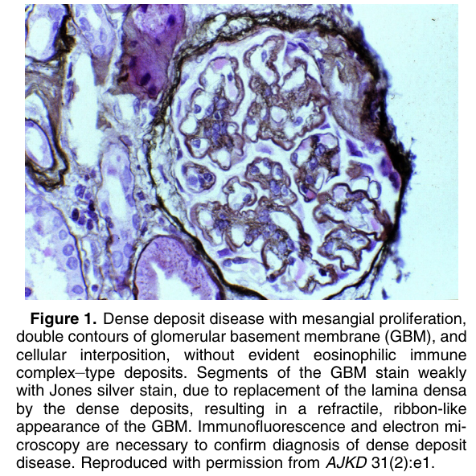
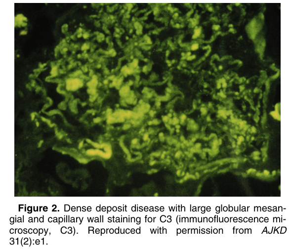
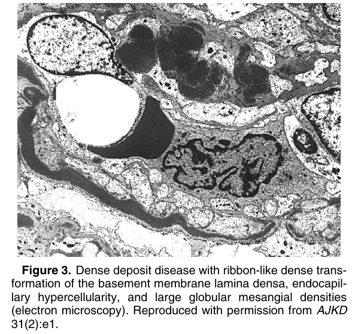
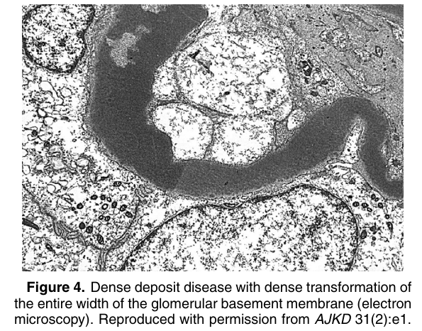

# Dense Deposit Disease - Figures and Tables Index

This document lists all figures and tables extracted from `Dense Deposit Disease.pdf`.

## Table of Contents
- [Figures](#figures)
- [Tables](#tables)

---

## Figures

### Fig_1

Figure 1. Dense deposit disease with mesangial proliferation, double contours of glomerular basement membrane (GBM), and cellular interposition, without evident eosinophilic immune complex–type deposits. Segments of the GBM stain weakly with Jones silver stain, due to replacement of the lamina densa by the dense deposits, resulting in a refractile, ribbon-like appearance of the GBM. Immunofluorescence and electron microscopy are necessary to confirm diagnosis of dense deposit disease. Reproduced with permission from AJKD 31(2):e1.

---

### Fig_2

Figure 2. Dense deposit disease with large globular mesangial and capillary wall staining for C3 (immunofluorescence microscopy, C3). Reproduced with permission from AJKD 31(2):e1.

---

### Fig_3

Figure 3. Dense deposit disease with ribbon-like dense transformation of the basement membrane lamina densa, endocapillary hypercellularity, and large globular mesangial densities (electron microscopy). Reproduced with permission from AJKD 31(2):e1.

---

### Fig_4

Figure 4. Dense deposit disease with dense transformation of the entire width of the glomerular basement membrane (electron microscopy). Reproduced with permission from AJKD 31(2):e1.

---

## Tables

*No tables resolved for this chapter.*
