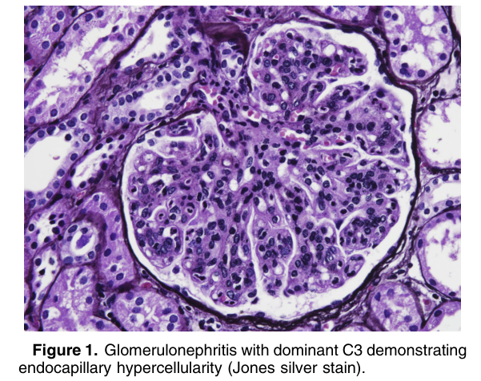
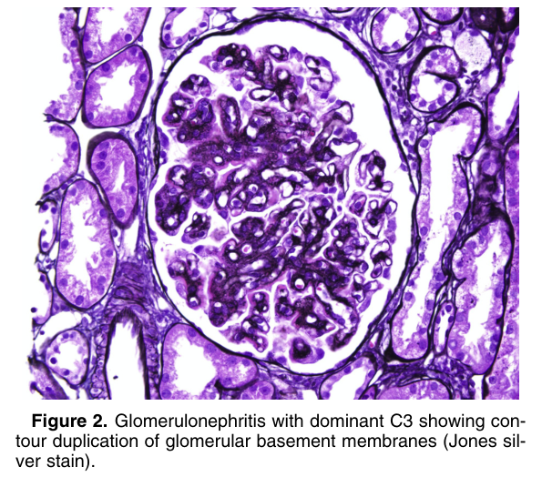
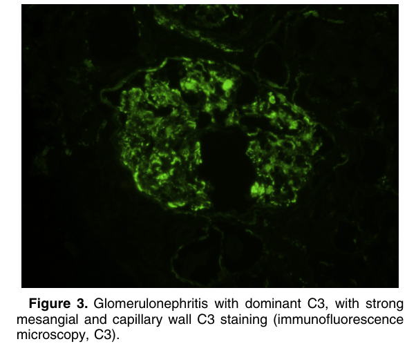
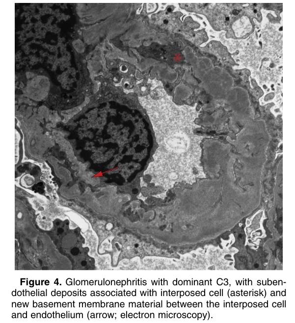

# Glomerulonephritis With Dominant C3 - Figures and Tables Index

This document lists all figures and tables extracted from `Glomerulonephritis With Dominant C3.pdf`.

## Table of Contents
- [Figures](#figures)
- [Tables](#tables)

---

## Figures

### Fig_1

Figure 1. Glomerulonephritis with dominant C3 demonstrating endocapillary hypercellularity (Jones silver stain).

---

### Fig_2

Figure 2. Glomerulonephritis with dominant C3 showing con tour duplication of glomerular basement membranes (Jones sil ver stain).

---

### Fig_3

Figure 3. Glomerulonephritis with dominant C3, with strong mesangial and capillary wall C3 staining (immunofluorescence microscopy, C3).

---

### Fig_4

Figure 4. Glomerulonephritis with dominant C3, with subendothelial deposits associated with interposed cell (asterisk) and new basement membrane material between the interposed cell and endothelium (arrow; electron microscopy).

---

## Tables

*No tables resolved for this chapter.*
