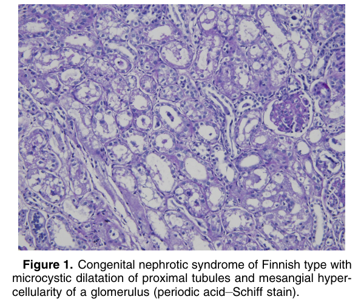
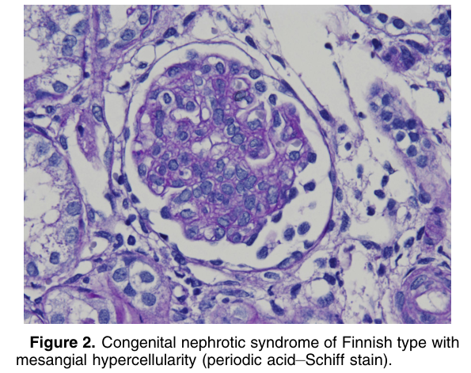
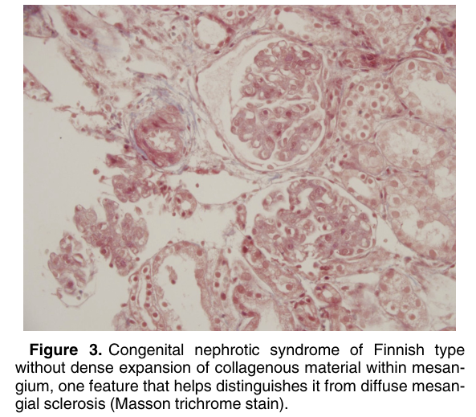
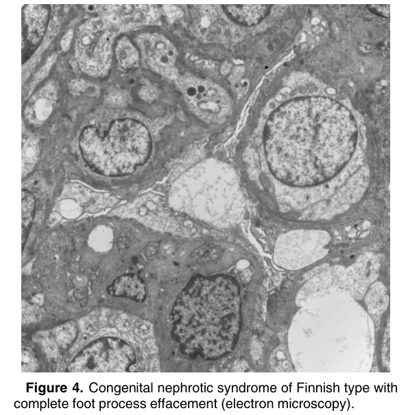

# Congenital Nephrotic Syndrome of Finnish Type - Figures and Tables Index

This document lists all figures and tables extracted from `Congenital Nephrotic Syndrome of Finnish Type.pdf`.

## Table of Contents
- [Figures](#figures)
- [Tables](#tables)

---

## Figures

### Fig_1

Figure 1. Congenital nephrotic syndrome of Finnish type with microcystic dilatation of proximal tubules and mesangial hypercellularity of a glomerulus (periodic acid–Schiff stain).

---

### Fig_2

Figure 2. Congenital nephrotic syndrome of Finnish type with mesangial hypercellularity (periodic acid–Schiff stain).

---

### Fig_3

Figure 3. Congenital nephrotic syndrome of Finnish type without dense expansion of collagenous material within mesangium, one feature that helps distinguishes it from diffuse mesangial sclerosis (Masson trichrome stain).

---

### Fig_4

Figure 4. Congenital nephrotic syndrome of Finnish type with complete foot process effacement (electron microscopy).

---

## Tables

*No tables resolved for this chapter.*
