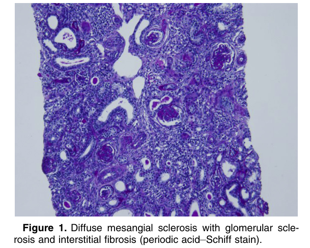
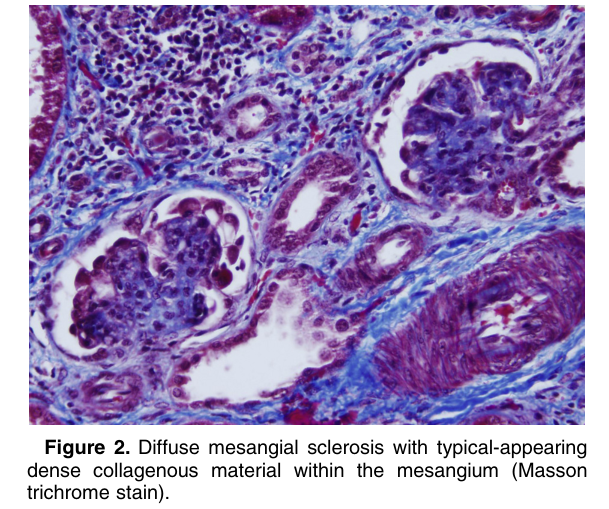
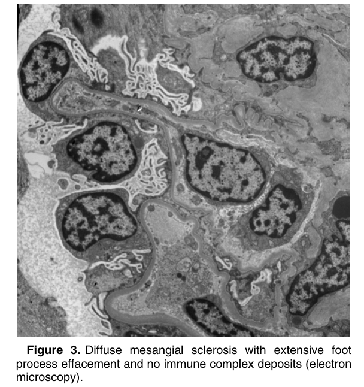

# Diffuse Mesangial Sclerosis - Figures and Tables Index

This document lists all figures and tables extracted from `Diffuse Mesangial Sclerosis.pdf`.

## Table of Contents
- [Figures](#figures)
- [Tables](#tables)

---

## Figures

### Fig_1

Figure 1. Diffuse mesangial sclerosis with glomerular sclerosis and interstitial fibrosis (periodic acid–Schiff stain).

---

### Fig_2

Figure 2. Diffuse mesangial sclerosis with typical-appearing dense collagenous material within the mesangium (Masson trichrome stain).

---

### Fig_3

Figure 3. Diffuse mesangial sclerosis with extensive foot process effacement and no immune complex deposits (electron microscopy).

---

## Tables

*No tables resolved for this chapter.*
