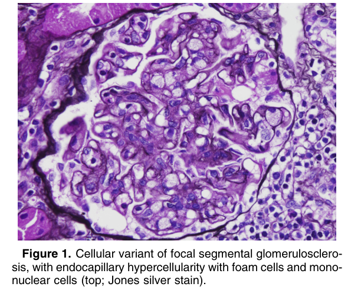
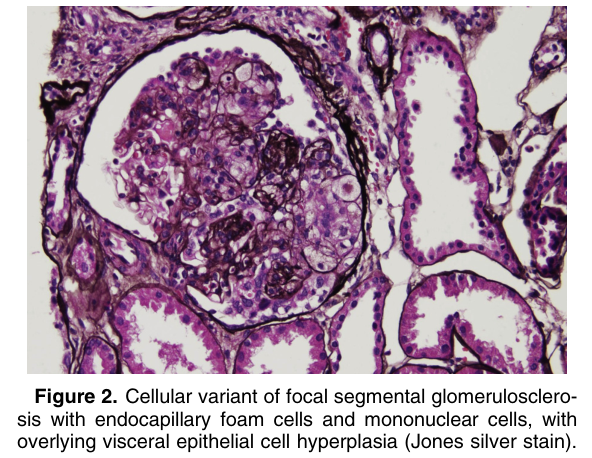

# Cellular Variant of Focal Segmental Glomerulosclerosis - Figures and Tables Index

This document lists all figures and tables extracted from `Cellular Variant of Focal Segmental Glomerulosclerosis.pdf`.

## Table of Contents
- [Figures](#figures)
- [Tables](#tables)

---

## Figures

### Fig_1

Figure 1. Cellular variant of focal segmental glomerulosclerosis, with endocapillary hypercellularity with foam cells and mono nuclear cells (top; Jones silver stain).

---

### Fig_2

Figure 2. Cellular variant of focal segmental glomerulosclerosis with endocapillary foam cells and mononuclear cells, with overlying visceral epithelial cell hyperplasia (Jones silver stain).

---

## Tables

*No tables resolved for this chapter.*
