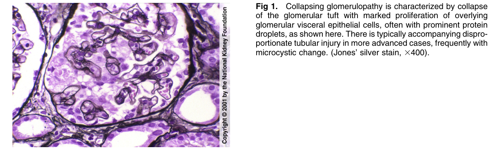
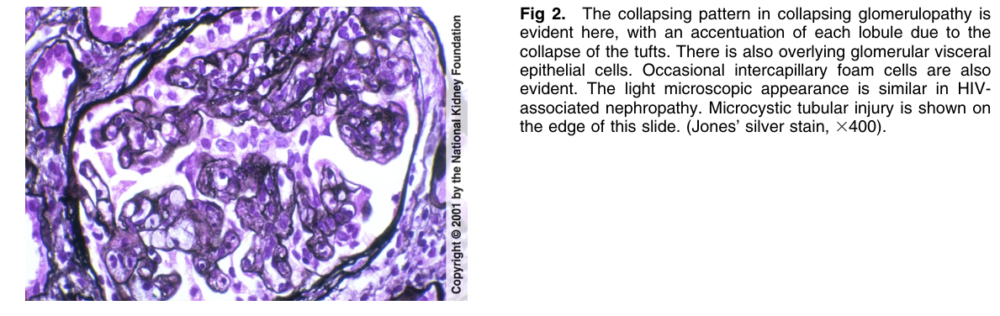
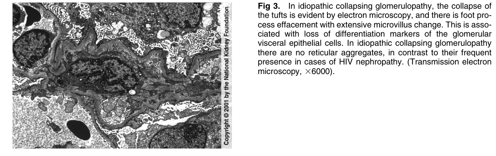

# Collapsing Glomerulopathy 2 - Figures and Tables Index

This document lists all figures and tables extracted from `Collapsing Glomerulopathy 2.pdf`.

## Table of Contents
- [Figures](#figures)
- [Tables](#tables)

---

## Figures

### Fig_1

Figure 1. Collapsing glomerulopathy is characterized by collapse of the glomerular tuft with marked proliferation of overlying glomerular visceral epithelial cells, often with prominent protein droplets, as shown here. There is typically accompanying disproportionate tubular injury in more advanced cases, frequently with microcystic change. (Jones’ silver stain, 3400).

---

### Fig_2

Figure 2. The collapsing pattern in collapsing glomerulopathy is evident here, with an accentuation of each lobule due to the collapse of the tufts. There is also overlying glomerular viscera epithelial cells. Occasional intercapillary foam cells are also evident. The light microscopic appearance is similar in HIVassociated nephropathy. Microcystic tubular injury is shown on the edge of this slide. (Jones’ silver stain, 3400).

---

### Fig_3

Figure 3. In idiopathic collapsing glomerulopathy, the collapse of the tufts is evident by electron microscopy, and there is foot process effacement with extensive microvillus change. This is associated with loss of differentiation markers of the glomerular visceral epithelial cells. In idiopathic collapsing glomerulopathy there are no reticular aggregates, in contrast to their frequen presence in cases of HIV nephropathy. (Transmission electron microscopy, 36000).

---

## Tables

*No tables resolved for this chapter.*
