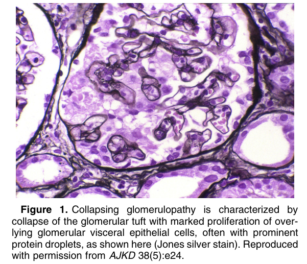
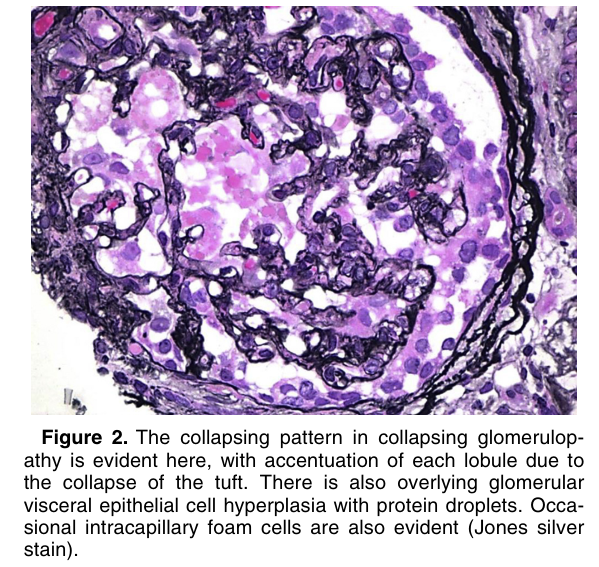
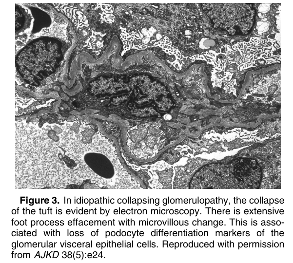

# Collapsing Glomerulopathy - Figures and Tables Index

This document lists all figures and tables extracted from `Collapsing Glomerulopathy.pdf`.

## Table of Contents
- [Figures](#figures)
- [Tables](#tables)

---

## Figures

### Fig_1

Figure 1. Collapsing glomerulopathy is characterized by collapse of the glomerular tuft with marked proliferation of overlying glomerular visceral epithelial cells, often with prominent protein droplets, as shown here (Jones silver stain). Reproduced with permission from AJKD 38(5):e24.

---

### Fig_2

Figure 2. The collapsing pattern in collapsing glomerulopathy is evident here, with accentuation of each lobule due to the collapse of the tuft. There is also overlying glomerular visceral epithelial cell hyperplasia with protein droplets. Occasional intracapillary foam cells are also evident (Jones silver stain).

---

### Fig_3

Figure 3. In idiopathic collapsing glomerulopathy, the collapse of the tuft is evident by electron microscopy. There is extensive foot process effacement with microvillous change. This is associated with loss of podocyte differentiation markers of the glomerular visceral epithelial cells. Reproduced with permission from AJKD 38(5):e24.

---

## Tables

*No tables resolved for this chapter.*
