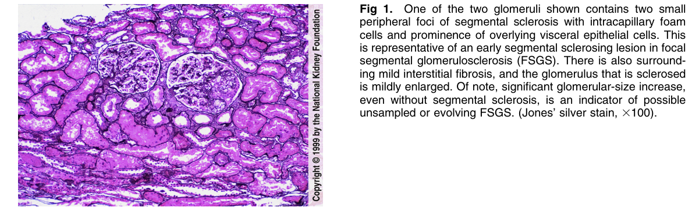
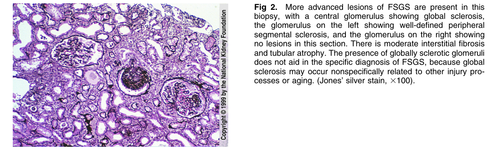
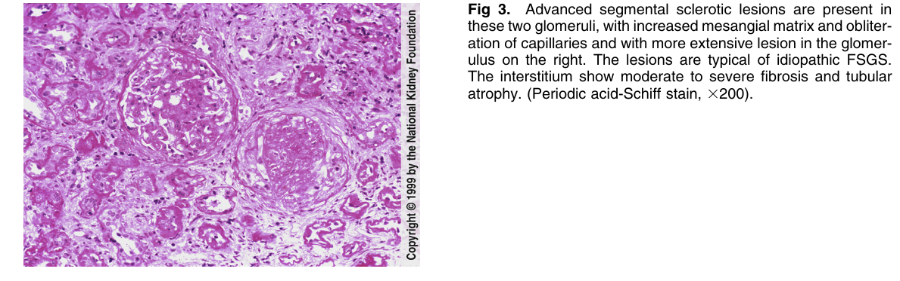
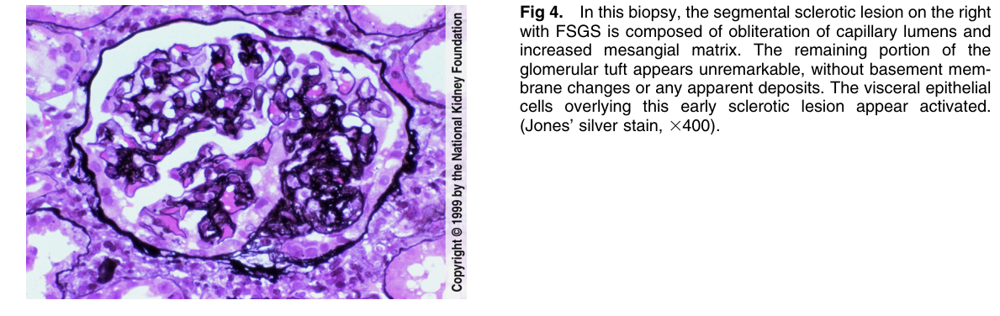
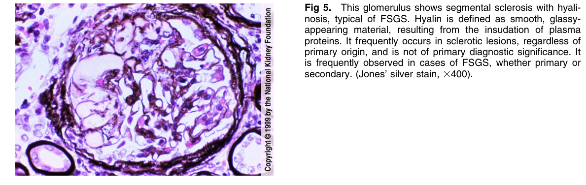
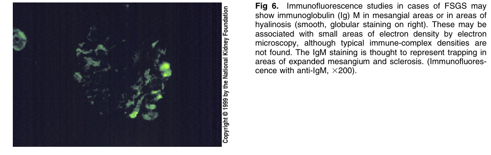

# Focal Segmental Glomerulosclerosis 2 - Figures and Tables Index

This document lists all figures and tables extracted from `Focal Segmental Glomerulosclerosis 2.pdf`.

## Table of Contents
- [Figures](#figures)
- [Tables](#tables)

---

## Figures

### Fig_1

Figure 1. One of the two glomeruli shown contains two small peripheral foci of segmental sclerosis with intracapillary foam cells and prominence of overlying visceral epithelial cells. This is representative of an early segmental sclerosing lesion in foca segmental glomerulosclerosis (FSGS). There is also surrounding mild interstitial fibrosis, and the glomerulus that is sclerosed is mildly enlarged. Of note, significant glomerular-size increase, even without segmental sclerosis, is an indicator of possible unsampled or evolving FSGS. (Jones’ silver stain, 3100).

---

### Fig_2

Fig 2. More advanced lesions of FSGS are present in this biopsy, with a central glomerulus showing global sclerosis, the glomerulus on the left showing well-defined peripheral segmental sclerosis, and the glomerulus on the right showing no lesions in this section. There is moderate interstitial fibrosis and tubular atrophy. The presence of globally sclerotic glomeruli does not aid in the specific diagnosis of FSGS, because global sclerosis may occur nonspecifically related to other injury processes or aging. (Jones’ silver stain, 3100).

---

### Fig_3

Figure 3. Advanced segmental sclerotic lesions are present in these two glomeruli, with increased mesangial matrix and obliteration of capillaries and with more extensive lesion in the glomerulus on the right. The lesions are typical of idiopathic FSGS. The interstitium show moderate to severe fibrosis and tubula atrophy. (Periodic acid-Schiff stain, 3200).

---

### Fig_4

Figure 4. In this biopsy, the segmental sclerotic lesion on the righ with FSGS is composed of obliteration of capillary lumens and increased mesangial matrix. The remaining portion of the glomerular tuft appears unremarkable, without basement membrane changes or any apparent deposits. The visceral epithelia cells overlying this early sclerotic lesion appear activated. (Jones’ silver stain, 3400).

---

### Fig_5

Figure 5. This glomerulus shows segmental sclerosis with hyalinosis, typical of FSGS. Hyalin is defined as smooth, glassyappearing material, resulting from the insudation of plasma proteins. It frequently occurs in sclerotic lesions, regardless o primary origin, and is not of primary diagnostic significance. It is frequently observed in cases of FSGS, whether primary or secondary. (Jones’ silver stain, 3400).

---

### Fig_6

Figure 6. Immunofluorescence studies in cases of FSGS may show immunoglobulin (Ig) M in mesangial areas or in areas o hyalinosis (smooth, globular staining on right). These may be associated with small areas of electron density by electron microscopy, although typical immune-complex densities are not found. The IgM staining is thought to represent trapping in areas of expanded mesangium and sclerosis. (Immunofluorescence with anti-IgM, 3200).

---

## Tables

*No tables resolved for this chapter.*
