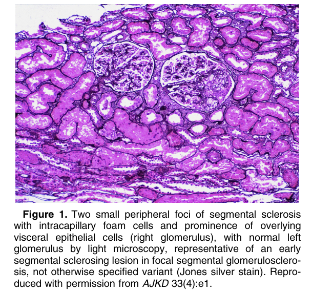
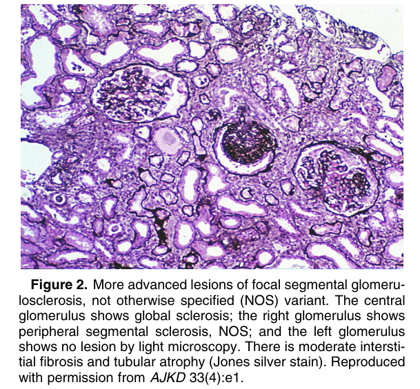
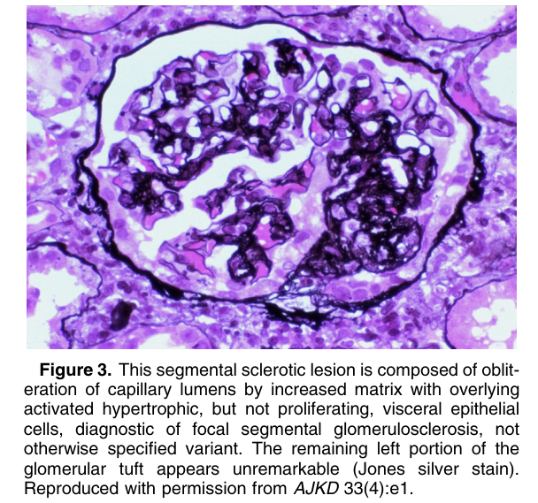
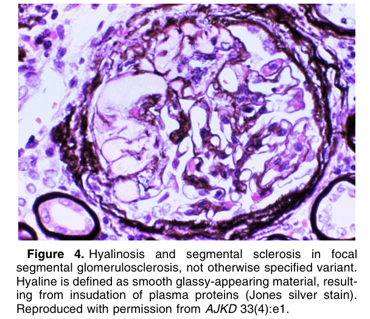
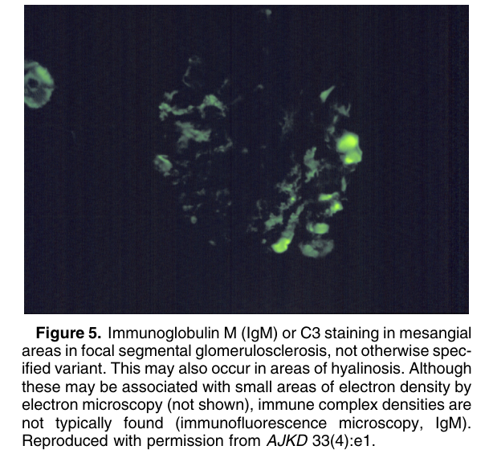
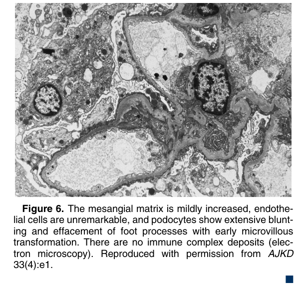

# Focal Segmental Glomerulosclerosis - Figures and Tables Index

This document lists all figures and tables extracted from `Focal Segmental Glomerulosclerosis.pdf`.

## Table of Contents
- [Figures](#figures)
- [Tables](#tables)

---

## Figures

### Fig_1

Figure 1. Two small peripheral foci of segmental sclerosis with intracapillary foam cells and prominence of overlying visceral epithelial cells (right glomerulus), with normal left glomerulus by light microscopy, representative of an early segmental sclerosing lesion in focal segmental glomerulosclerosis, not otherwise specified variant (Jones silver stain). Reproduced with permission from AJKD 33(4):e1.

---

### Fig_2

Figure 2. More advanced lesions of focal segmental glomerulosclerosis, not otherwise specified (NOS) variant. The central glomerulus shows global sclerosis; the right glomerulus shows peripheral segmental sclerosis, NOS; and the left glomerulus shows no lesion by light microscopy. There is moderate interstitial fibrosis and tubular atrophy (Jones silver stain). Reproduced with permission from AJKD 33(4):e1.

---

### Fig_3

Figure 3. This segmental sclerotic lesion is composed of obliteration of capillary lumens by increased matrix with overlying activated hypertrophic, but not proliferating, visceral epithelial cells, diagnostic of focal segmental glomerulosclerosis, not otherwise specified variant. The remaining left portion of the glomerular tuft appears unremarkable (Jones silver stain). Reproduced with permission from AJKD 33(4):e1.

---

### Fig_4

Figure 4. Hyalinosis and segmental sclerosis in focal segmental glomerulosclerosis, not otherwise specified variant. Hyaline is defined as smooth glassy-appearing material, resulting from insudation of plasma proteins (Jones silver stain). Reproduced with permission from AJKD 33(4):e1.

---

### Fig_5

Figure 5. Immunoglobulin M (IgM) or C3 staining in mesangial areas in focal segmental glomerulosclerosis, not otherwise specified variant. This may also occur in areas of hyalinosis. Although these may be associated with small areas of electron density by electron microscopy (not shown), immune complex densities are not typically found (immunofluorescence microscopy, IgM). Reproduced with permission from AJKD 33(4):e1.

---

### Fig_6

Figure 6. The mesangial matrix is mildly increased, endothelial cells are unremarkable, and podocytes show extensive blunting and effacement of foot processes with early microvillous transformation. There are no immune complex deposits (electron microscopy). Reproduced with permission from AJKD 33(4):e1. -

---

## Tables

*No tables resolved for this chapter.*
