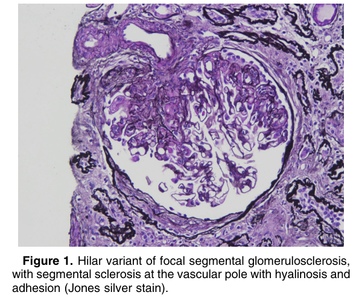
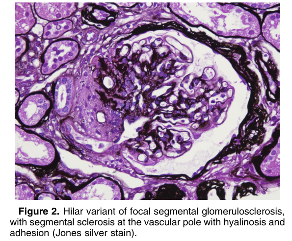

# Hilar Variant of Focal Segmental Glomerulosclerosis - Figures and Tables Index

This document lists all figures and tables extracted from `Hilar Variant of Focal Segmental Glomerulosclerosis.pdf`.

## Table of Contents
- [Figures](#figures)
- [Tables](#tables)

---

## Figures

### Fig_1

Figure 1. Hilar variant of focal segmental glomerulosclerosis, with segmental sclerosis at the vascular pole with hyalinosis and adhesion (Jones silver stain).

---

### Fig_2

Figure 2. Hilar variant of focal segmental glomerulosclerosis, with segmental sclerosis at the vascular pole with hyalinosis and adhesion (Jones silver stain).

---

## Tables

*No tables resolved for this chapter.*
