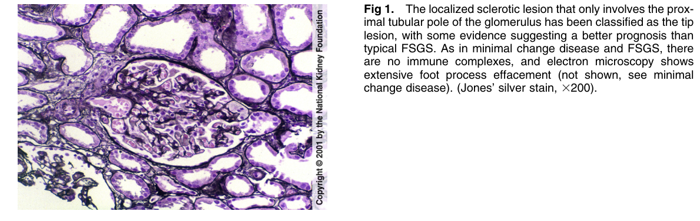
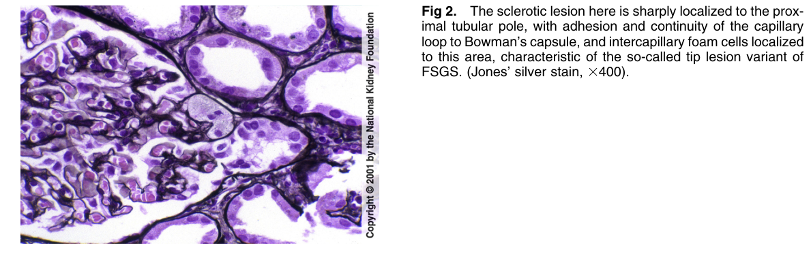

# Tip Lesion Variant of FSGS - Figures and Tables Index

This document lists all figures and tables extracted from `Tip Lesion Variant of FSGS.pdf`.

## Table of Contents
- [Figures](#figures)
- [Tables](#tables)

---

## Figures

### Fig_1

Figure 1. The localized sclerotic lesion that only involves the proximal tubular pole of the glomerulus has been classified as the tip lesion, with some evidence suggesting a better prognosis than typical FSGS. As in minimal change disease and FSGS, there are no immune complexes, and electron microscopy shows extensive foot process effacement (not shown, see minima change disease). (Jones’ silver stain, 3200).

---

### Fig_2

Figure 2. The sclerotic lesion here is sharply localized to the proximal tubular pole, with adhesion and continuity of the capillary loop to Bowman’s capsule, and intercapillary foam cells localized to this area, characteristic of the so-called tip lesion variant o FSGS. (Jones’ silver stain, 3400).

---

## Tables

*No tables resolved for this chapter.*
