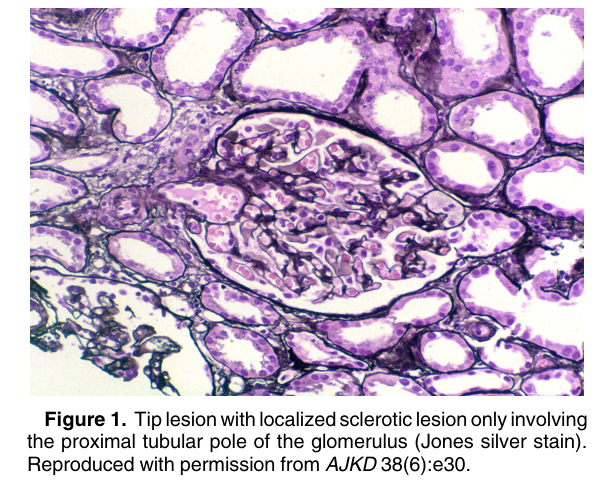
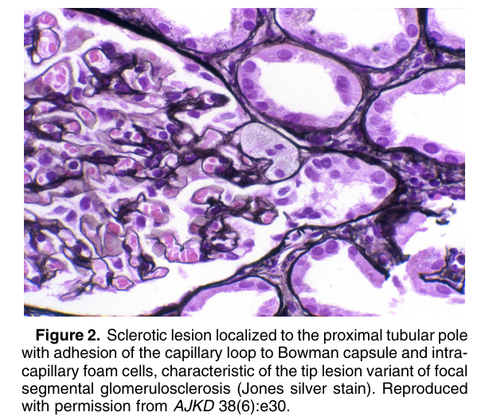

# Tip Lesion Variant of Focal Segmental Glomerulosclerosis - Figures and Tables Index

This document lists all figures and tables extracted from `Tip Lesion Variant of Focal Segmental Glomerulosclerosis.pdf`.

## Table of Contents
- [Figures](#figures)
- [Tables](#tables)

---

## Figures

### Fig_1

Figure 1. Tip lesion with localized sclerotic lesion only involving the proximal tubular pole of the glomerulus (Jones silver stain). Reproduced with permission from AJKD 38(6):e30.

---

### Fig_2

Figure 2. Sclerotic lesion localized to the proximal tubular pole with adhesion of the capillary loop to Bowman capsule and intracapillary foam cells, characteristic of the tip lesion variant of focal segmental glomerulosclerosis (Jones silver stain). Reproduced with permission from AJKD 38(6):e30.

---

## Tables

*No tables resolved for this chapter.*
