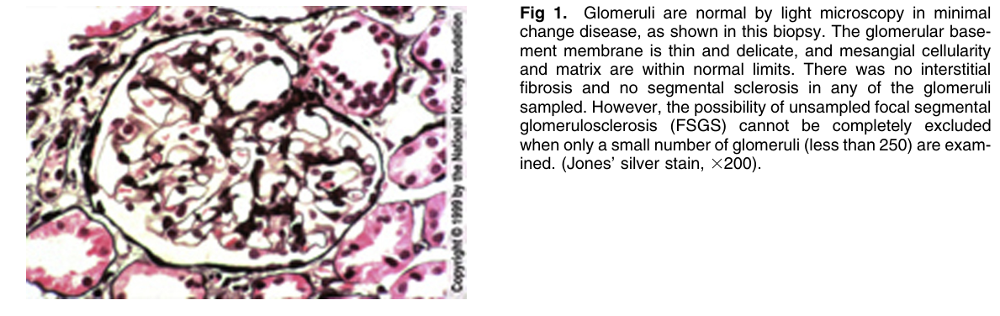
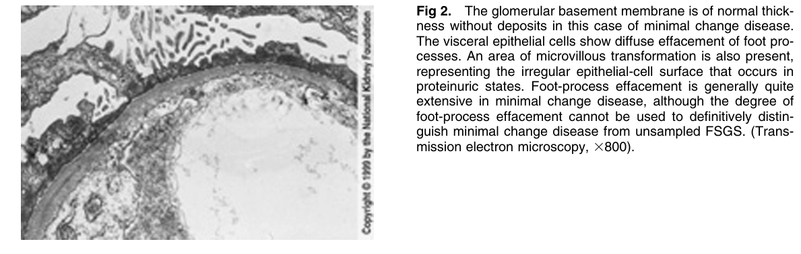

# Minimal Change Disease 2 - Figures and Tables Index

This document lists all figures and tables extracted from `Minimal Change Disease 2.pdf`.

## Table of Contents
- [Figures](#figures)
- [Tables](#tables)

---

## Figures

### Fig_1

Fig 1. Glomeruli are normal by light microscopy in minimal change disease, as shown in this biopsy. The glomerular basement membrane is thin and delicate, and mesangial cellularity and matrix are within normal limits. There was no interstitial fibrosis and no segmental sclerosis in any of the glomeruli sampled. However, the possibility of unsampled focal segmental glomerulosclerosis (FSGS) cannot be completely excluded when only a small number of glomeruli (less than 250) are examined. (Jones’ silver stain, 3200).

---

### Fig_2

Figure 2. The glomerular basement membrane is of normal thick ness without deposits in this case of minimal change disease. The visceral epithelial cells show diffuse effacement of foot processes. An area of microvillous transformation is also present, representing the irregular epithelial-cell surface that occurs in proteinuric states. Foot-process effacement is generally quite extensive in minimal change disease, although the degree of foot-process effacement cannot be used to definitively distinguish minimal change disease from unsampled FSGS. (Transmission electron microscopy, 3800).

---

## Tables

*No tables resolved for this chapter.*
