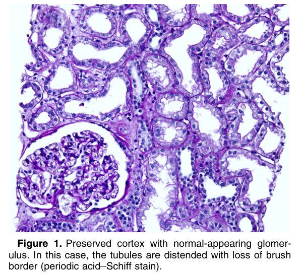
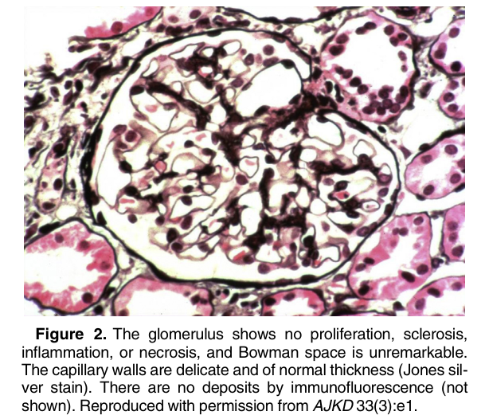
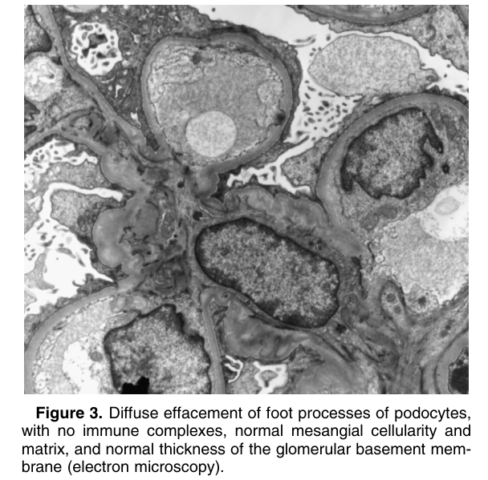
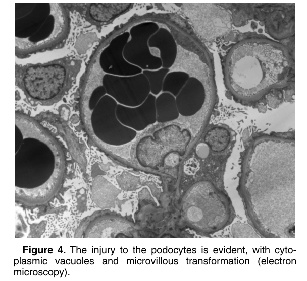
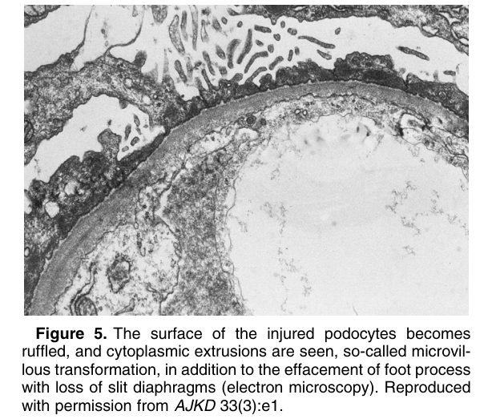
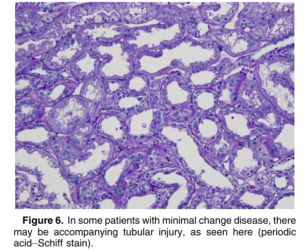

# Minimal Change Disease - Figures and Tables Index

This document lists all figures and tables extracted from `Minimal Change Disease.pdf`.

## Table of Contents
- [Figures](#figures)
- [Tables](#tables)

---

## Figures

### Fig_1

Figure 1. Preserved cortex with normal-appearing glomerulus. In this case, the tubules are distended with loss of brush border (periodic acid–Schiff stain).

---

### Fig_2

Figure 2. The glomerulus shows no proliferation, sclerosis, inflammation, or necrosis, and Bowman space is unremarkable. The capillary walls are delicate and of normal thickness (Jones silver stain). There are no deposits by immunofluorescence (not shown). Reproduced with permission from AJKD 33(3):e1.

---

### Fig_3

Figure 3. Diffuse effacement of foot processes of podocytes, with no immune complexes, normal mesangial cellularity and matrix, and normal thickness of the glomerular basement membrane (electron microscopy).

---

### Fig_4

Figure 4. The injury to the podocytes is evident, with cytoplasmic vacuoles and microvillous transformation (electron microscopy).

---

### Fig_5

Figure 5. The surface of the injured podocytes becomes ruffled, and cytoplasmic extrusions are seen, so-called microvillous transformation, in addition to the effacement of foot process with loss of slit diaphragms (electron microscopy). Reproduced with permission from AJKD 33(3):e1.

---

### Fig_6

Figure 6. In some patients with minimal change disease, there may be accompanying tubular injury, as seen here (periodic acid–Schiff stain).

---

## Tables

*No tables resolved for this chapter.*
