# Membranoproliferative Glomerulonephritis 2 - Figures and Tables Index

This document lists all figures and tables extracted from `Membranoproliferative Glomerulonephritis 2.pdf`.

## Table of Contents
- [Figures](#figures)
- [Tables](#tables)

---

## Figures

### Fig_1

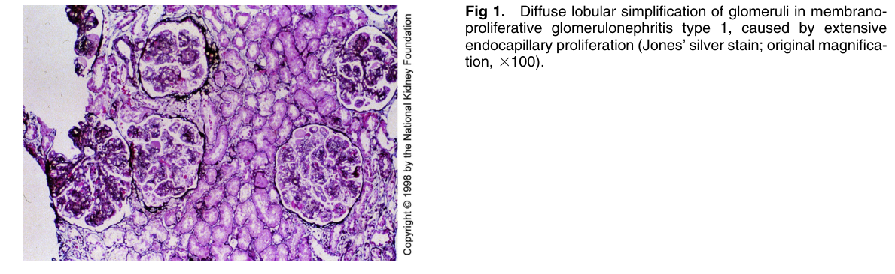

Figure 1. Diffuse lobular simplification of glomeruli in membranoproliferative glomerulonephritis type 1, caused by extensive endocapillary proliferation (Jones’ silver stain; original magnifica tion, 3100).

---

### Fig_2

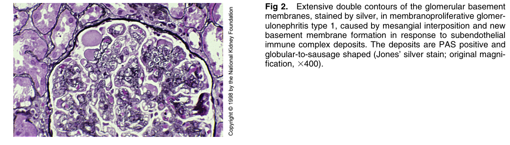

Figure 2. Extensive double contours of the glomerular basemen membranes, stained by silver, in membranoproliferative glomerulonephritis type 1, caused by mesangial interposition and new basement membrane formation in response to subendothelia immune complex deposits. The deposits are PAS positive and globular-to-sausage shaped (Jones’ silver stain; original magni fication, 3400).

---

### Fig_3

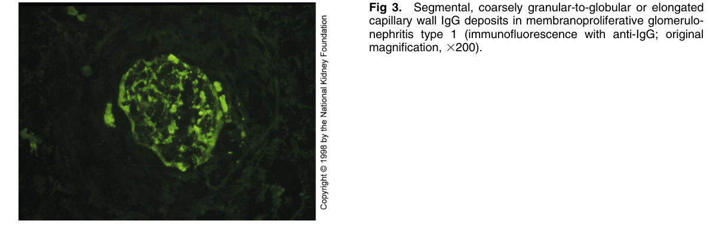

Figure 3. Segmental, coarsely granular-to-globular or elongated capillary wall IgG deposits in membranoproliferative glomerulonephritis type 1 (immunofluorescence with anti-IgG; origina magnification, 3200).

---

### Fig_5

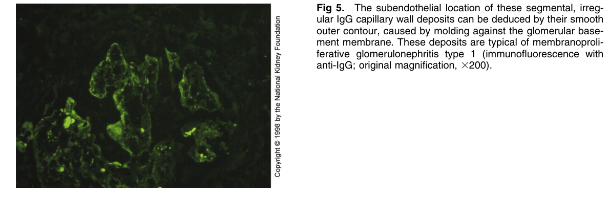

Figure 5. The subendothelial location of these segmental, irregular IgG capillary wall deposits can be deduced by their smooth outer contour, caused by molding against the glomerular basement membrane. These deposits are typical of membranoproliferative glomerulonephritis type 1 (immunofluorescence with anti-IgG; original magnification, 3200).

---

### Fig_6B

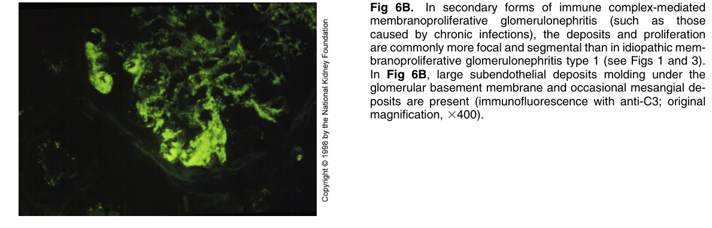

Figure 6B. In secondary forms of immune complex-mediated membranoproliferative glomerulonephritis (such as those caused by chronic infections), the deposits and proliferation are commonly more focal and segmental than in idiopathic mem branoproliferative glomerulonephritis type 1 (see Figs 1 and 3). In Fig 6B, large subendothelial deposits molding under the glomerular basement membrane and occasional mesangial deposits are present (immunofluorescence with anti-C3; origina magnification, 3400).

---

### Fig_7

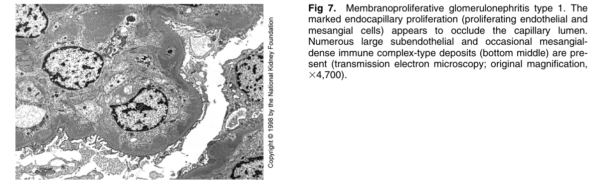

Figure 7. Membranoproliferative glomerulonephritis type 1. The marked endocapillary proliferation (proliferating endothelial and mesangial cells) appears to occlude the capillary lumen. Numerous large subendothelial and occasional mesangialdense immune complex-type deposits (bottom middle) are present (transmission electron microscopy; original magnification, 34,700).

---

### Fig_8

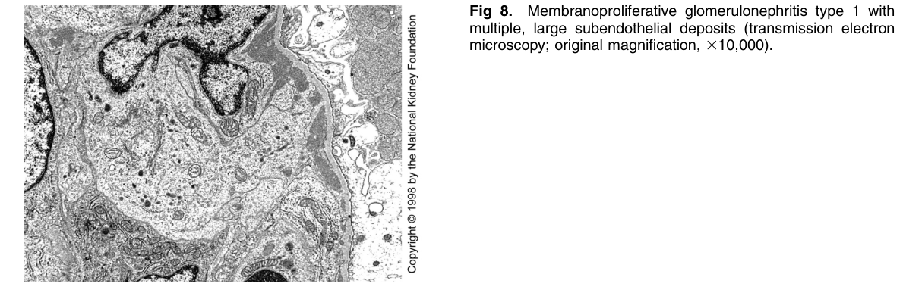

Figure 8. Membranoproliferative glomerulonephritis type 1 with multiple, large subendothelial deposits (transmission electron microscopy; original magnification, 310,000).

---

### Fig_9

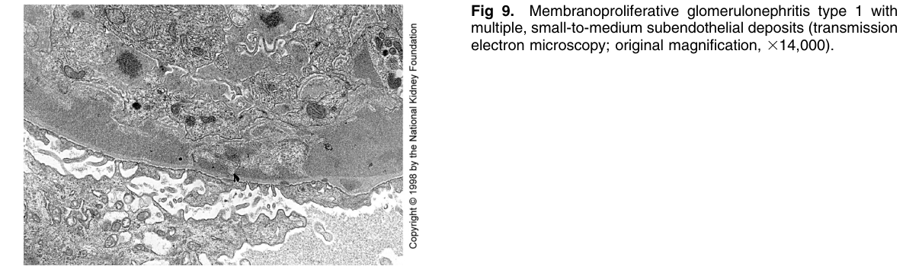

Figure 9. Membranoproliferative glomerulonephritis type 1 with multiple, small-to-medium subendothelial deposits (transmission electron microscopy; original magnification, 314,000).

---

### Fig_10A

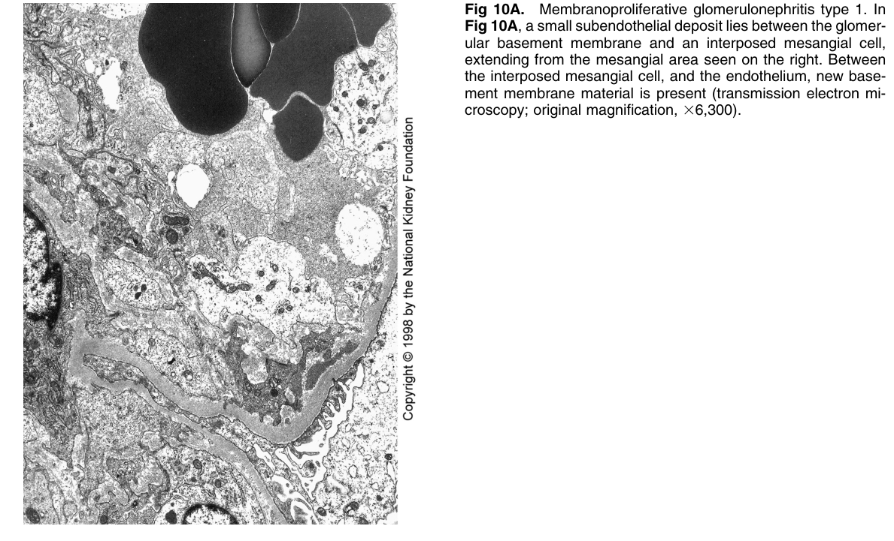

Figure 10A. Membranoproliferative glomerulonephritis type 1. In Fig 10A, a small subendothelial deposit lies between the glomerular basement membrane and an interposed mesangial cell, extending from the mesangial area seen on the right. Between the interposed mesangial cell, and the endothelium, new basement membrane material is present (transmission electron microscopy; original magnification, 36,300).

---

### Fig_10B

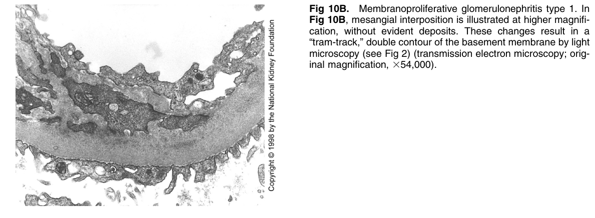

Figure 10B. Membranoproliferative glomerulonephritis type 1. In Fig 10B, mesangial interposition is illustrated at higher magnification, without evident deposits. These changes result in a “tram-track,” double contour of the basement membrane by ligh microscopy (see Fig 2) (transmission electron microscopy; original magnification, 354,000).

---

### Fig_11

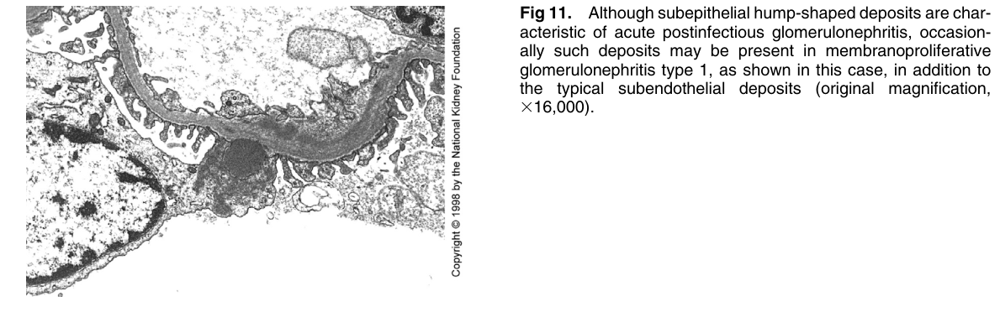

Figure 11. Although subepithelial hump-shaped deposits are characteristic of acute postinfectious glomerulonephritis, occasionally such deposits may be present in membranoproliferative glomerulonephritis type 1, as shown in this case, in addition to the typical subendothelial deposits (original magnification, 316,000).

---

## Tables

*No tables resolved for this chapter.*
