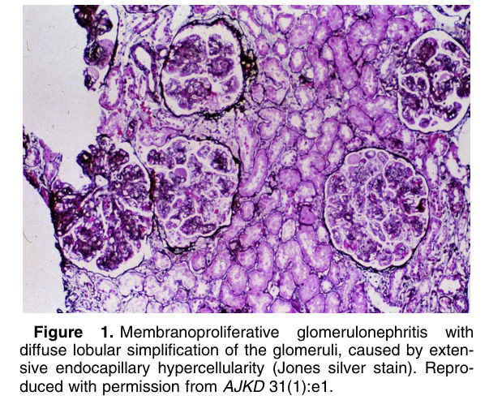
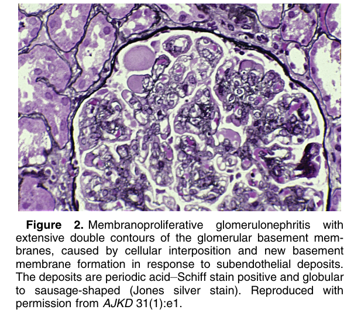
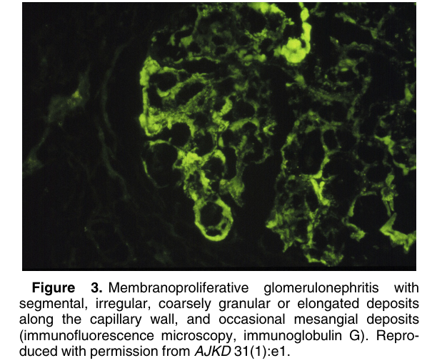
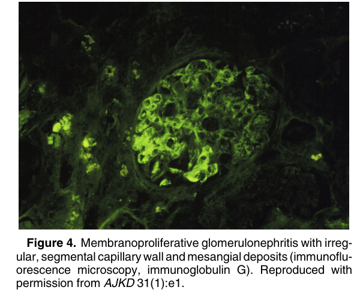
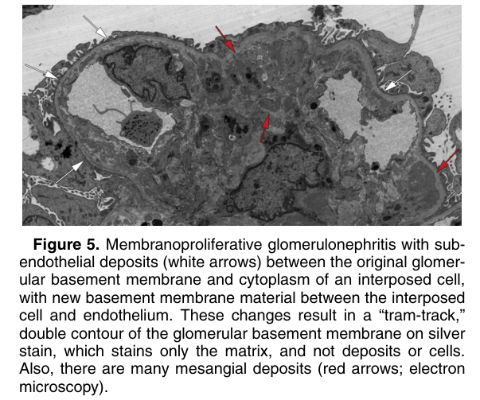
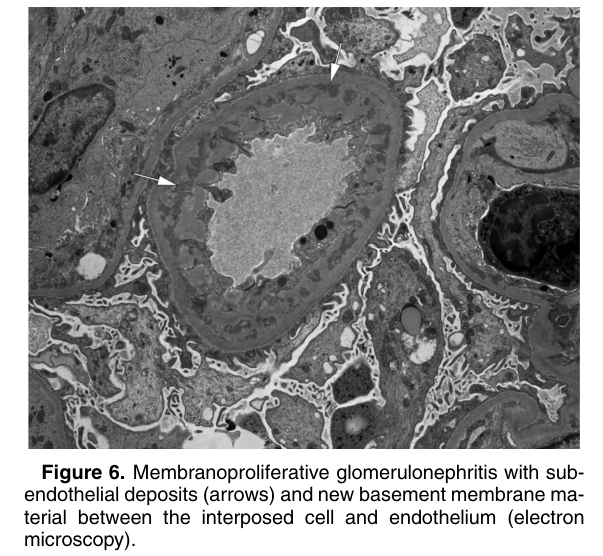

# Membranoproliferative Glomerulonephritis - Figures and Tables Index

This document lists all figures and tables extracted from `Membranoproliferative Glomerulonephritis.pdf`.

## Table of Contents
- [Figures](#figures)
- [Tables](#tables)

---

## Figures

### Fig_1

Figure 1. Membranoproliferative glomerulonephritis with diffuse lobular simplification of the glomeruli, caused by extensive endocapillary hypercellularity (Jones silver stain). Repro duced with permission from AJKD 31(1):e1.

---

### Fig_2

Figure 2. Membranoproliferative glomerulonephritis with extensive double contours of the glomerular basement membranes, caused by cellular interposition and new basement membrane formation in response to subendothelial deposits. The deposits are periodic acid–Schiff stain positive and globular to sausage-shaped (Jones silver stain). Reproduced with permission from AJKD 31(1):e1.

---

### Fig_3

Figure 3. Membranoproliferative glomerulonephritis with segmental, irregular, coarsely granular or elongated deposits along the capillary wall, and occasional mesangial deposits (immunofluorescence microscopy, immunoglobulin G). Reproduced with permission from AJKD 31(1):e1.

---

### Fig_4

Figure 4. Membranoproliferative glomerulonephritis with irregular, segmental capillary wall and mesangial deposits (immunofluorescence microscopy, immunoglobulin G). Reproduced with permission from AJKD 31(1):e1.

---

### Fig_5

Figure 5. Membranoproliferative glomerulonephritis with subendothelial deposits (white arrows) between the original glomerular basement membrane and cytoplasm of an interposed cell, with new basement membrane material between the interposed cell and endothelium. These changes result in a “tram-track,” double contour of the glomerular basement membrane on silver stain, which stains only the matrix, and not deposits or cells. Also, there are many mesangial deposits (red arrows; electron microscopy).

---

### Fig_6

Figure 6. Membranoproliferative glomerulonephritis with subendothelial deposits (arrows) and new basement membrane ma terial between the interposed cell and endothelium (electron microscopy).

---

## Tables

*No tables resolved for this chapter.*
