# Membranous Glomerulonephritis - Figures and Tables Index

This document lists all figures and tables extracted from `Membranous Glomerulonephritis.pdf`.

## Table of Contents
- [Figures](#figures)
- [Tables](#tables)

---

## Figures

### Fig_1

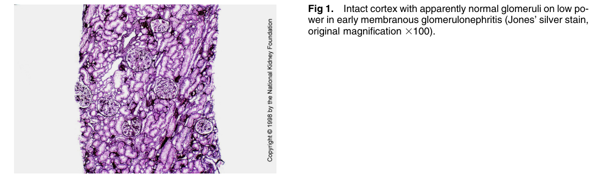

Figure 1. Intact cortex with apparently normal glomeruli on low po wer in early membranous glomerulonephritis (Jones’ silver stain, original magnification 3100).

---

### Fig_4A

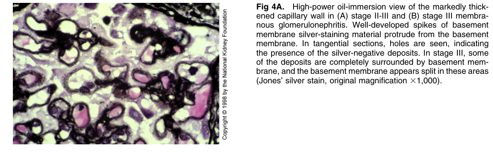

Figure 4A. High-power oil-immersion view of the markedly thickened capillary wall in (A) stage II-III and (B) stage III membranous glomerulonephritis. Well-developed spikes of basemen membrane silver-staining material protrude from the basemen membrane. In tangential sections, holes are seen, indicating the presence of the silver-negative deposits. In stage III, some of the deposits are completely surrounded by basement membrane, and the basement membrane appears split in these areas (Jones’ silver stain, original magnification 31,000).

---

### Fig_4B

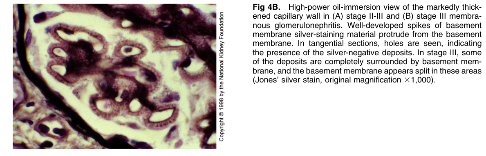

Figure 4B. High-power oil-immersion view of the markedly thickened capillary wall in (A) stage II-III and (B) stage III membranous glomerulonephritis. Well-developed spikes of basemen membrane silver-staining material protrude from the basemen membrane. In tangential sections, holes are seen, indicating the presence of the silver-negative deposits. In stage III, some of the deposits are completely surrounded by basement mem brane, and the basement membrane appears split in these areas (Jones’ silver stain, original magnification 31,000)

---

### Fig_6

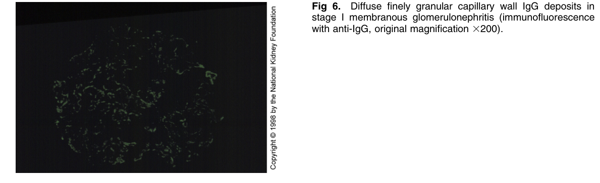

Figure 6. Diffuse finely granular capillary wall IgG deposits in stage I membranous glomerulonephritis (immunofluorescenc with anti-IgG, original magnification 3200).

---

### Fig_8

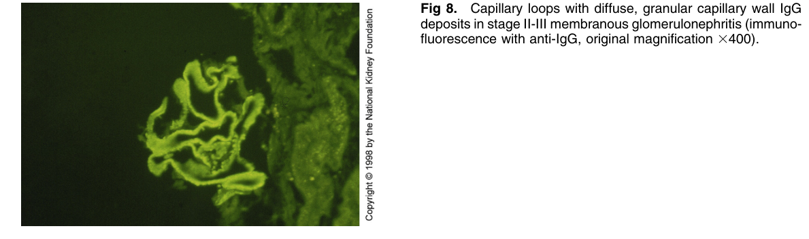

Figure 8. Capillary loops with diffuse, granular capillary wall IgG deposits in stage II-III membranous glomerulonephritis (immuno fluorescence with anti-IgG, original magnification 3400).

---

### Fig_9

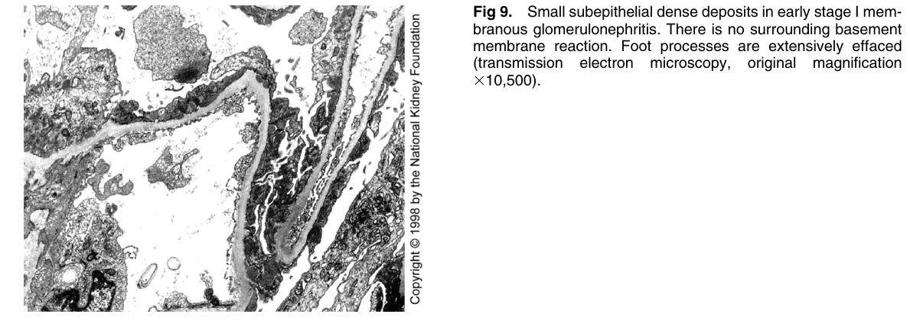

Figure 9. Small subepithelial dense deposits in early stage I membranous glomerulonephritis. There is no surrounding basemen membrane reaction. Foot processes are extensively effaced (transmission electron microscopy, original magnification 310,500).

---

### Fig_10

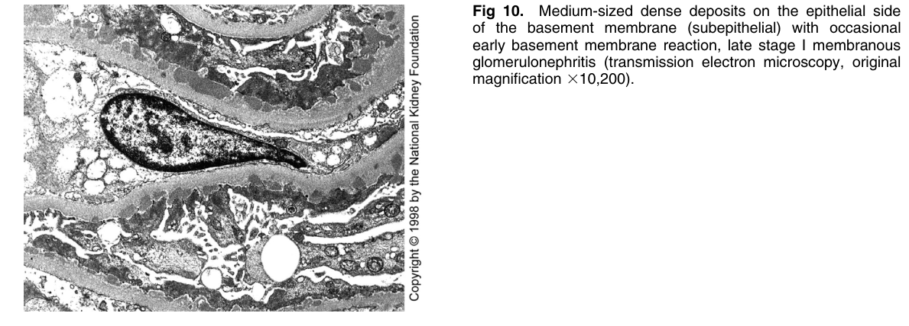

Figure 10. Medium-sized dense deposits on the epithelial side of the basement membrane (subepithelial) with occasiona early basement membrane reaction, late stage I membranous glomerulonephritis (transmission electron microscopy, origina magnification 310,200).

---

### Fig_11

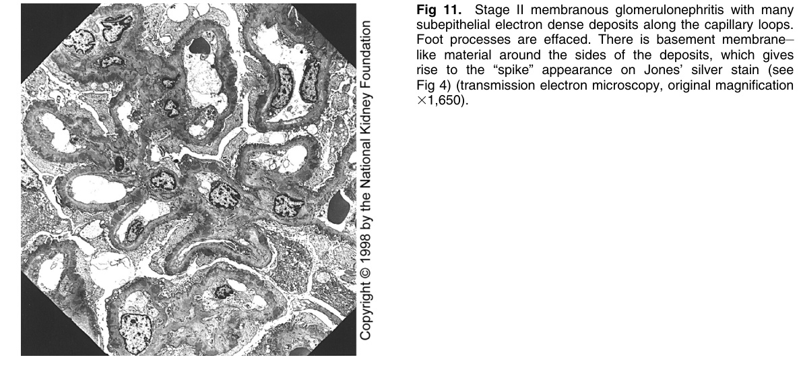

Figure 11. Stage II membranous glomerulonephritis with many subepithelial electron dense deposits along the capillary loops. Foot processes are effaced. There is basement membrane– like material around the sides of the deposits, which gives rise to the “spike” appearance on Jones’ silver stain (see Fig 4) (transmission electron microscopy, original magnification 31,650).

---

### Fig_12

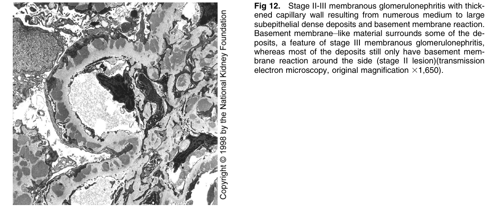

Figure 12. Stage II-III membranous glomerulonephritis with thickened capillary wall resulting from numerous medium to large subepithelial dense deposits and basement membrane reaction. Basement membrane–like material surrounds some of the deposits, a feature of stage III membranous glomerulonephritis, whereas most of the deposits still only have basement membrane reaction around the side (stage II lesion)(transmission electron microscopy, original magnification 31,650).

---

### Fig_13

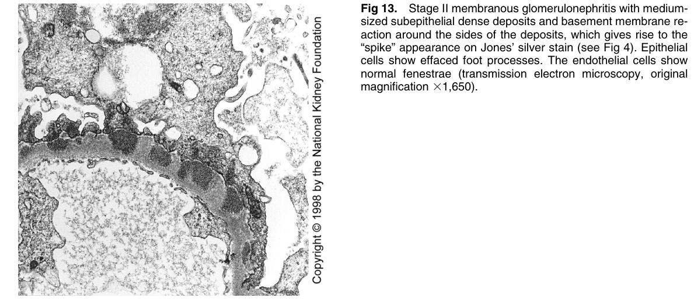

Figure 13. Stage II membranous glomerulonephritis with mediumsized subepithelial dense deposits and basement membrane reaction around the sides of the deposits, which gives rise to the “spike” appearance on Jones’ silver stain (see Fig 4). Epithelia cells show effaced foot processes. The endothelial cells show normal fenestrae (transmission electron microscopy, origina magnification 31,650).

---

### Fig_14

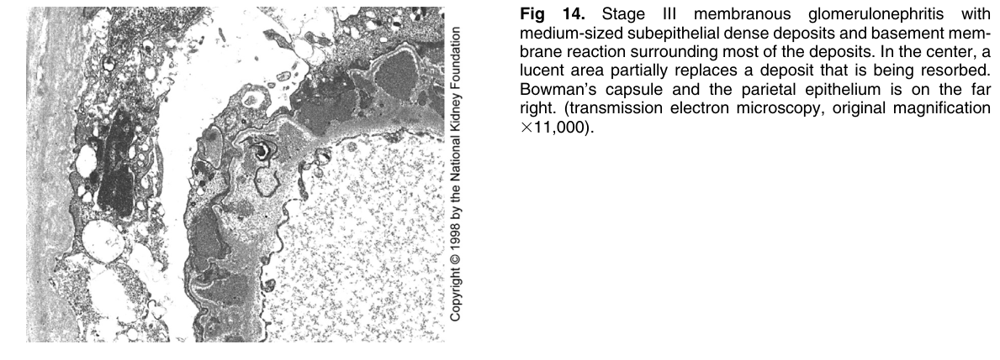

Figure 14. Stage III membranous glomerulonephritis with medium-sized subepithelial dense deposits and basement membrane reaction surrounding most of the deposits. In the center, a lucent area partially replaces a deposit that is being resorbed. Bowman’s capsule and the parietal epithelium is on the far right. (transmission electron microscopy, original magnification 311,000).

---

### Fig_15

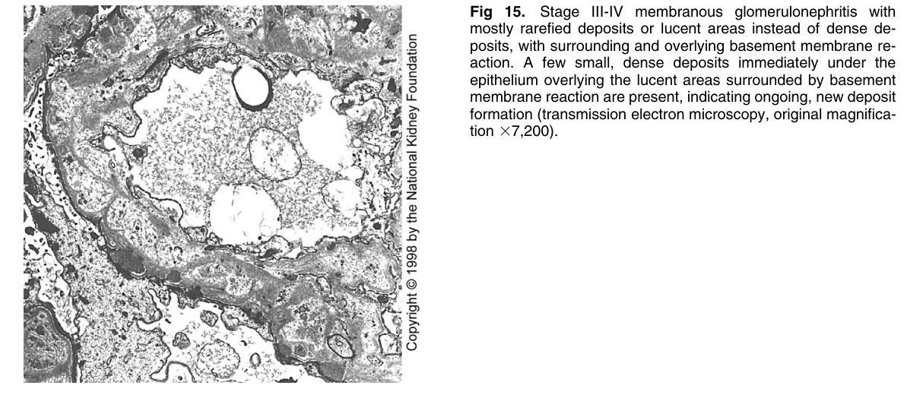

Figure 15. Stage III-IV membranous glomerulonephritis with mostly rarefied deposits or lucent areas instead of dense deposits, with surrounding and overlying basement membrane reaction. A few small, dense deposits immediately under the epithelium overlying the lucent areas surrounded by basement membrane reaction are present, indicating ongoing, new deposi formation (transmission electron microscopy, original magnification 37,200).

---

### Fig_16

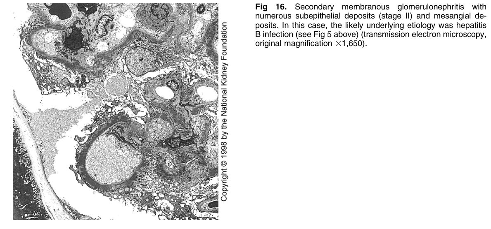

Figure 16. Secondary membranous glomerulonephritis with numerous subepithelial deposits (stage II) and mesangial deposits. In this case, the likely underlying etiology was hepatitis B infection (see Fig 5 above) (transmission electron microscopy, original magnification 31,650).

---

## Tables

*No tables resolved for this chapter.*
