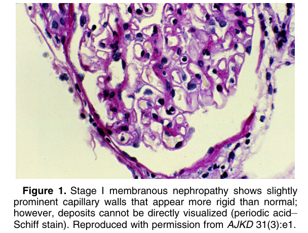
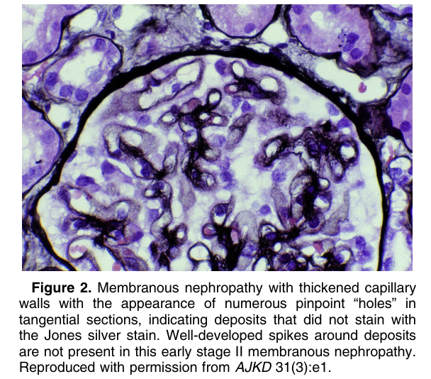
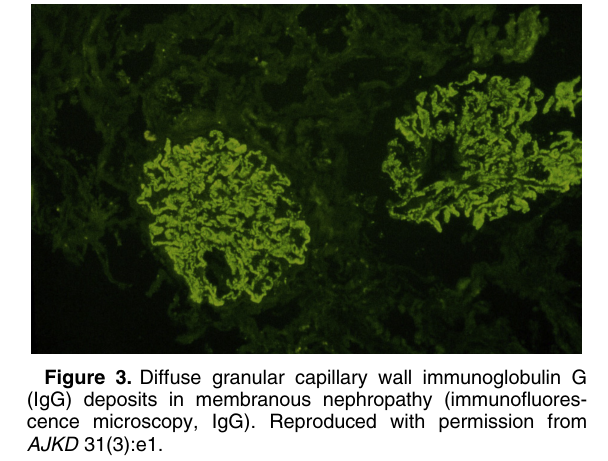
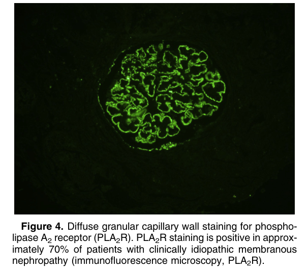
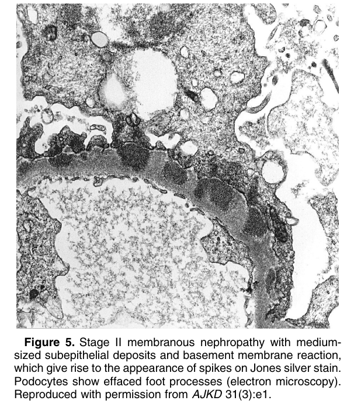
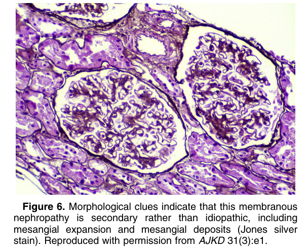
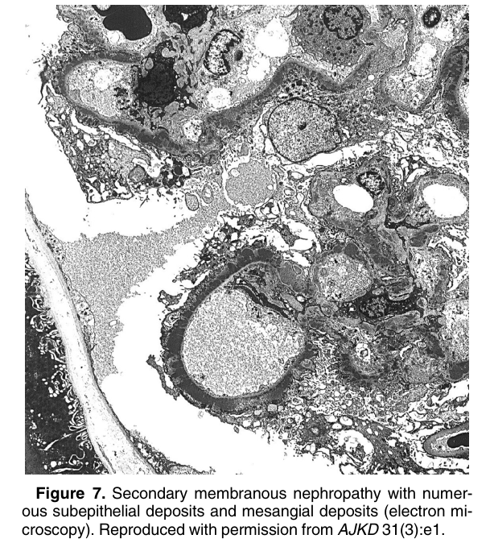

# Membranous Nephropathy - Figures and Tables Index

This document lists all figures and tables extracted from `Membranous Nephropathy.pdf`.

## Table of Contents
- [Figures](#figures)
- [Tables](#tables)

---

## Figures

### Fig_1

Figure 1. Stage I membranous nephropathy shows slightly prominent capillary walls that appear more rigid than normal; however, deposits cannot be directly visualized (periodic acid– Schiff stain). Reproduced with permission from AJKD 31(3):e1.

---

### Fig_2

Figure 2. Membranous nephropathy with thickened capillary walls with the appearance of numerous pinpoint “holes” in tangential sections, indicating deposits that did not stain with the Jones silver stain. Well-developed spikes around deposits are not present in this early stage II membranous nephropathy. Reproduced with permission from AJKD 31(3):e1.

---

### Fig_3

Figure 3. Diffuse granular capillary wall immunoglobulin G (IgG) deposits in membranous nephropathy (immunofluorescence microscopy, IgG). Reproduced with permission from AJKD 31(3):e1.

---

### Fig_4

Figure 4. Diffuse granular capillary wall staining for phospholipase A2 receptor (PLA2R). PLA2R staining is positive in approximately 70% of patients with clinically idiopathic membranous nephropathy (immunofluorescence microscopy, PLA2R).

---

### Fig_5

Figure 5. Stage II membranous nephropathy with mediumsized subepithelial deposits and basement membrane reaction, which give rise to the appearance of spikes on Jones silver stain. Podocytes show effaced foot processes (electron microscopy). Reproduced with permission from AJKD 31(3):e1.

---

### Fig_6

Figure 6. Morphological clues indicate that this membranous nephropathy is secondary rather than idiopathic, including mesangial expansion and mesangial deposits (Jones silver stain). Reproduced with permission from AJKD 31(3):e1.

---

### Fig_7

Figure 7. Secondary membranous nephropathy with numerous subepithelial deposits and mesangial deposits (electron microscopy). Reproduced with permission from AJKD 31(3):e1.

---

## Tables

*No tables resolved for this chapter.*
