# IgA Nephropathy 2 - Figures and Tables Index

This document lists all figures and tables extracted from `IgA Nephropathy 2.pdf`.

## Table of Contents
- [Figures](#figures)
- [Tables](#tables)

---

## Figures

### Fig_1A

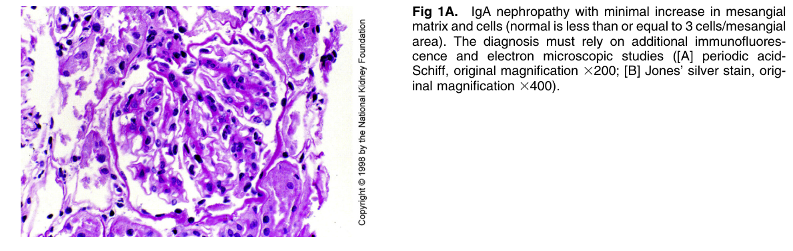

Figure 1A. IgA nephropathy with minimal increase in mesangia matrix and cells (normal is less than or equal to 3 cells/mesangia area). The diagnosis must rely on additional immunofluorescence and electron microscopic studies ([A] periodic acid-Schiff, original magnification 3200; [B] Jones’ silver stain, original magnification 3400).

---

### Fig_1B

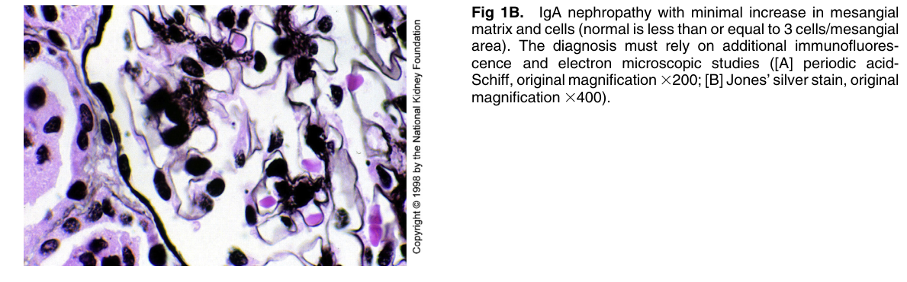

Figure 1B. IgA nephropathy with minimal increase in mesangia matrix and cells (normal is less than or equal to 3 cells/mesangia area). The diagnosis must rely on additional immunofluorescence and electron microscopic studies ([A] periodic acid-Schiff, original magnification 3200; [B] Jones’ silver stain, origina magnification 3400).

---

### Fig_2

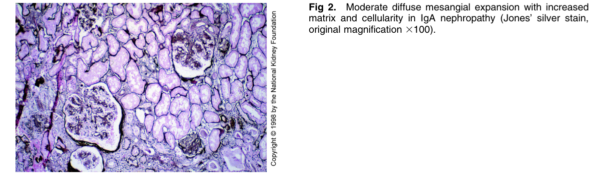

Figure 2. Moderate diffuse mesangial expansion with increased matrix and cellularity in IgA nephropathy (Jones’ silver stain, original magnification 3100).

---

### Fig_3A

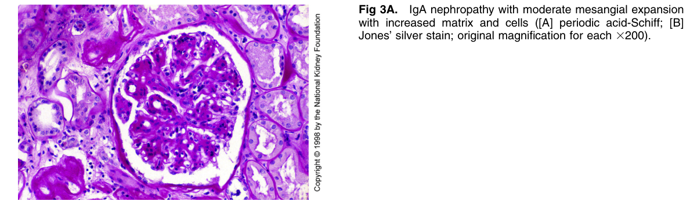

Figure 3A. IgA nephropathy with moderate mesangial expansion with increased matrix and cells ([A] periodic acid-Schiff; [B] Jones’ silver stain; original magnification for each 3200).

---

### Fig_3B

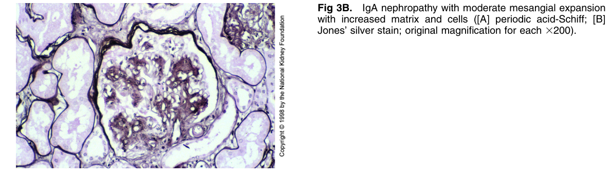

Figure 3B. IgA nephropathy with moderate mesangial expansion with increased matrix and cells ([A] periodic acid-Schiff; [B] Jones’ silver stain; original magnification for each 3200).

---

### Fig_4

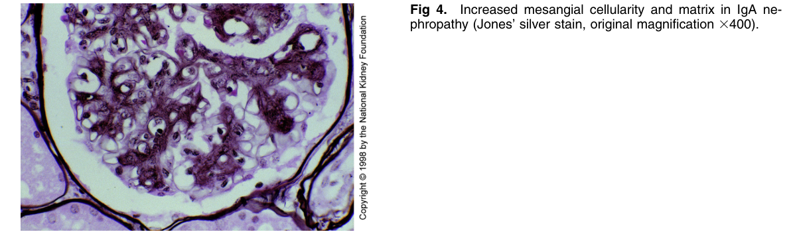

Figure 4. Increased mesangial cellularity and matrix in IgA ne phropathy (Jones’ silver stain, original magnification 3400)

---

### Fig_5A

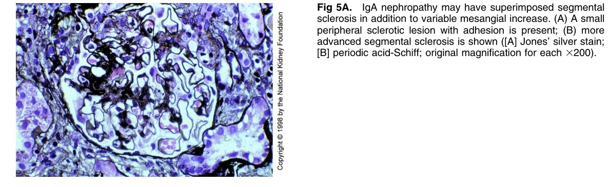

Figure 5A. IgA nephropathy may have superimposed segmenta sclerosis in addition to variable mesangial increase. (A) A smal peripheral sclerotic lesion with adhesion is present; (B) more advanced segmental sclerosis is shown ([A] Jones’ silver stain; [B] periodic acid-Schiff; original magnification for each 3200).

---

### Fig_7

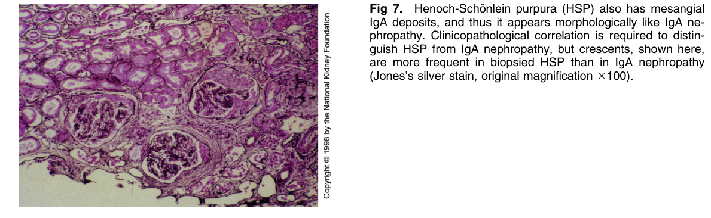

Figure 7. Henoch-Scho¨nlein purpura (HSP) also has mesangia IgA deposits, and thus it appears morphologically like IgA nephropathy. Clinicopathological correlation is required to distinguish HSP from IgA nephropathy, but crescents, shown here, are more frequent in biopsied HSP than in IgA nephropath (Jones’s silver stain, original magnification 3100).

---

### Fig_8

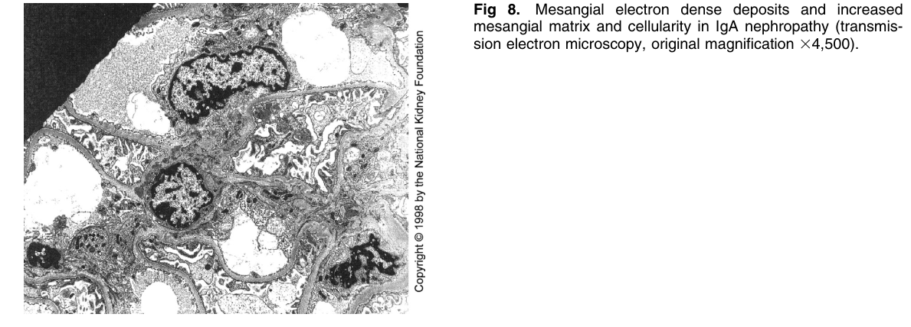

Figure 8. Mesangial electron dense deposits and increased mesangial matrix and cellularity in IgA nephropathy (transmis sion electron microscopy, original magnification 34,500)

---

### Fig_9

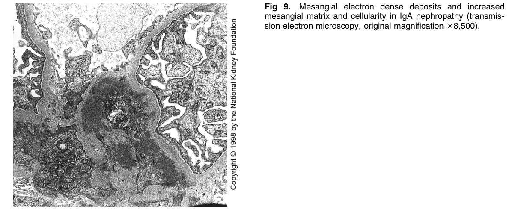

Figure 9. Mesangial electron dense deposits and increased mesangial matrix and cellularity in IgA nephropathy (transmis sion electron microscopy, original magnification 38,500)

---

### Fig_10

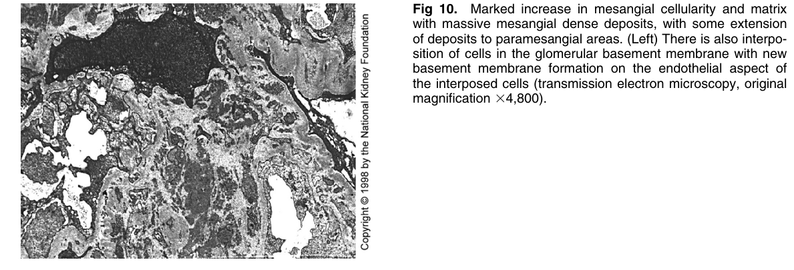

Figure 10. Marked increase in mesangial cellularity and matrix with massive mesangial dense deposits, with some extension of deposits to paramesangial areas. (Left) There is also interposition of cells in the glomerular basement membrane with new basement membrane formation on the endothelial aspect of the interposed cells (transmission electron microscopy, origina magnification 34,800).

---

## Tables

*No tables resolved for this chapter.*
