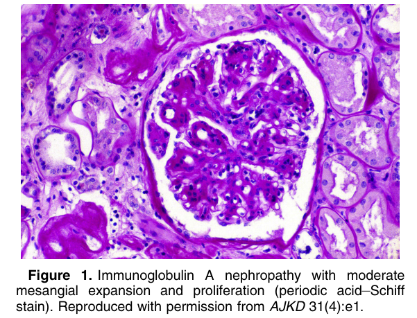
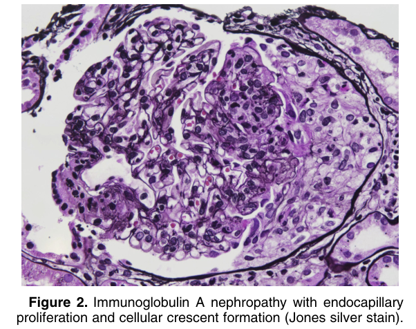
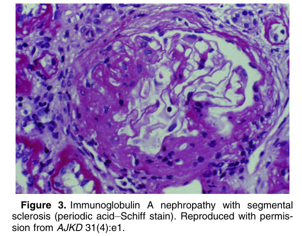
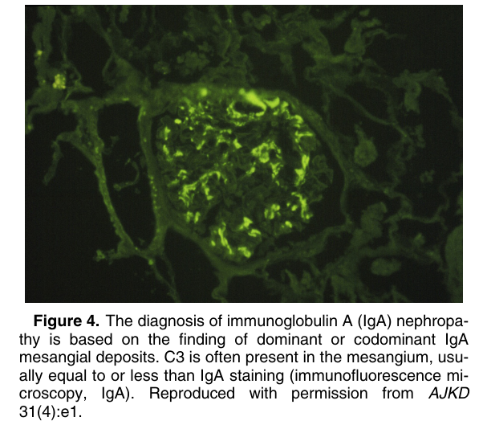
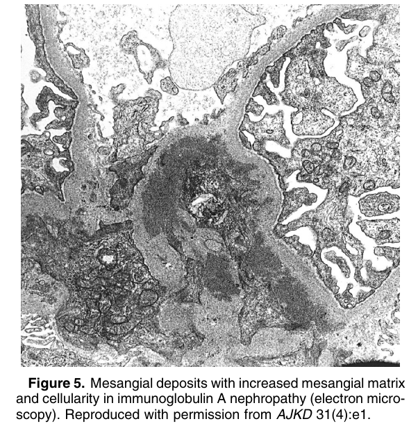
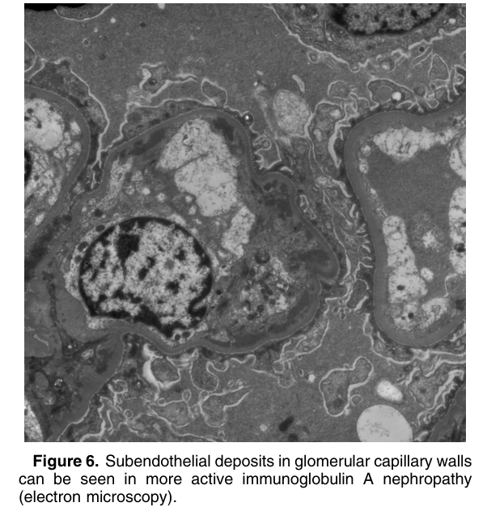

# IgA Nephropathy - Figures and Tables Index

This document lists all figures and tables extracted from `IgA Nephropathy.pdf`.

## Table of Contents
- [Figures](#figures)
- [Tables](#tables)

---

## Figures

### Fig_1

Figure 1. Immunoglobulin A nephropathy with moderate mesangial expansion and proliferation (periodic acid–Schiff stain). Reproduced with permission from AJKD 31(4):e1.

---

### Fig_2

Figure 2. Immunoglobulin A nephropathy with endocapillary proliferation and cellular crescent formation (Jones silver stain).

---

### Fig_3

Figure 3. Immunoglobulin A nephropathy with segmental sclerosis (periodic acid–Schiff stain). Reproduced with permission from AJKD 31(4):e1.

---

### Fig_4

Figure 4. The diagnosis of immunoglobulin A (IgA) nephropathy is based on the finding of dominant or codominant IgA mesangial deposits. C3 is often present in the mesangium, usually equal to or less than IgA staining (immunofluorescence microscopy, IgA). Reproduced with permission from AJKD 31(4):e1.

---

### Fig_5

Figure 5. Mesangial deposits with increased mesangial matrix and cellularity in immunoglobulin A nephropathy (electron micro scopy). Reproduced with permission from AJKD 31(4):e1.

---

### Fig_6

Figure 6. Subendothelial deposits in glomerular capillary walls can be seen in more active immunoglobulin A nephropathy (electron microscopy).

---

## Tables

*No tables resolved for this chapter.*
