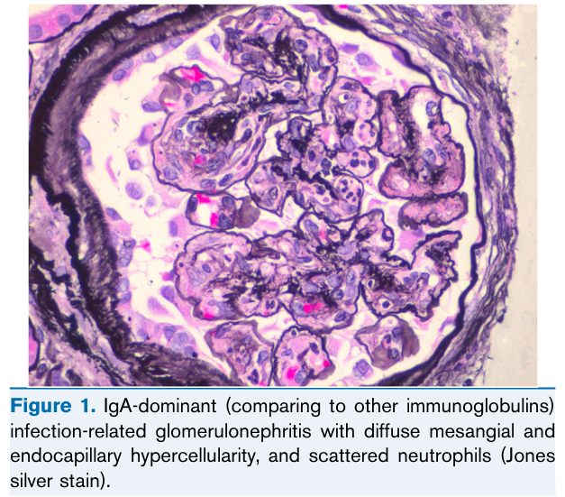
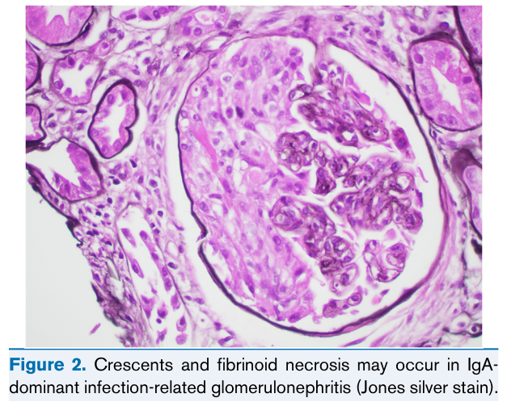
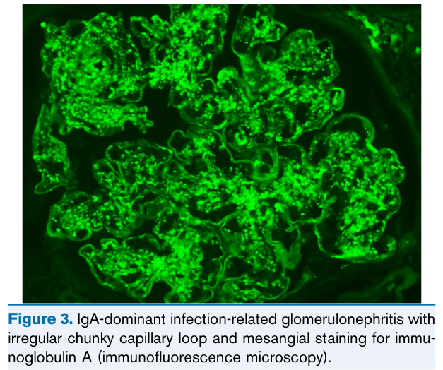
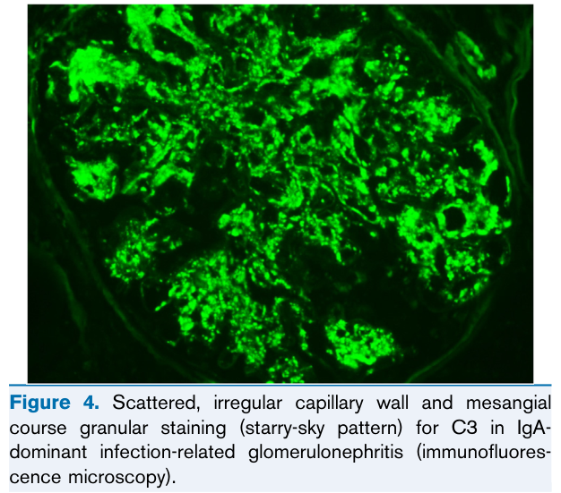
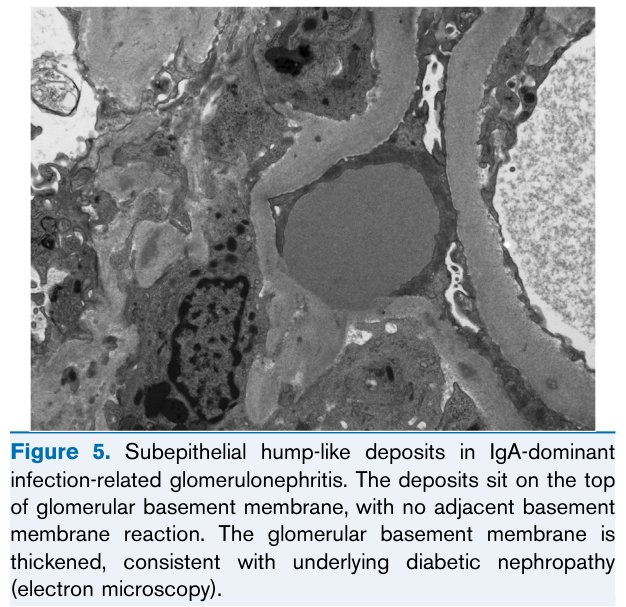

# IgA-Dominant Infection- Related Glomerulonephritis - Figures and Tables Index

This document lists all figures and tables extracted from `IgA-Dominant Infection- Related Glomerulonephritis.pdf`.

## Table of Contents
- [Figures](#figures)
- [Tables](#tables)

---

## Figures

### Fig_1

Figure 1. IgA-dominant (comparing to other immunoglobulins) infection-related glomerulonephritis with diffuse mesangial and endocapillary hypercellularity, and scattered neutrophils (Jones silver stain).

---

### Fig_2

Figure 2. Crescents and fibrinoid necrosis may occur in IgAdominant infection-related glomerulonephritis (Jones silver stain).

---

### Fig_3

Figure 3. IgA-dominant infection-related glomerulonephritis with irregular chunky capillary loop and mesangial staining for immunoglobulin A (immunofluorescence microscopy).

---

### Fig_4

Figure 4. Scattered, irregular capillary wall and mesangia course granular staining (starry-sky pattern) for C3 in IgA dominant infection-related glomerulonephritis (immunofluores cence microscopy).

---

### Fig_5

Figure 5. Subepithelial hump-like deposits in IgA-dominant infection-related glomerulonephritis. The deposits sit on the top of glomerular basement membrane, with no adjacent basement membrane reaction. The glomerular basement membrane is thickened, consistent with underlying diabetic nephropathy (electron microscopy).

---

## Tables

*No tables resolved for this chapter.*
