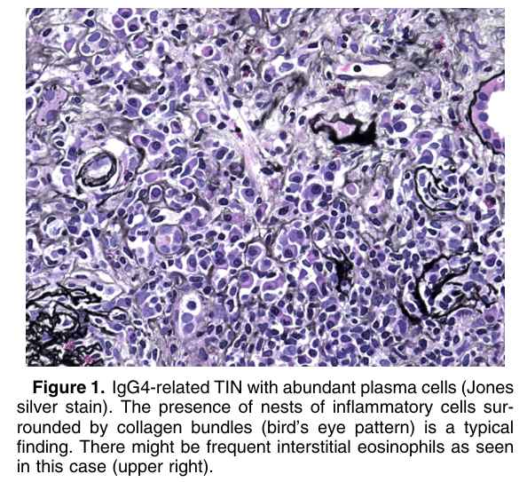
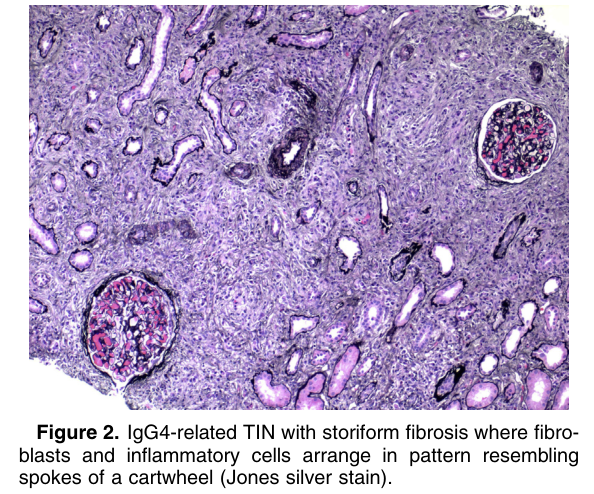
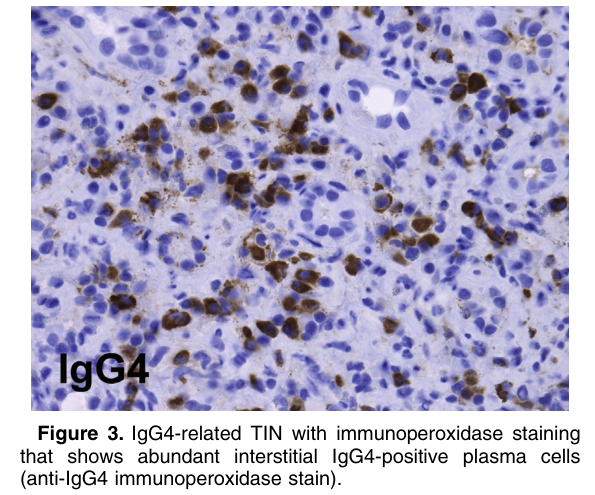
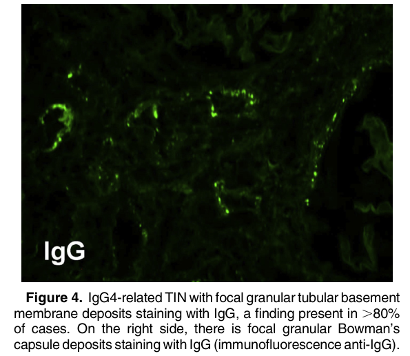
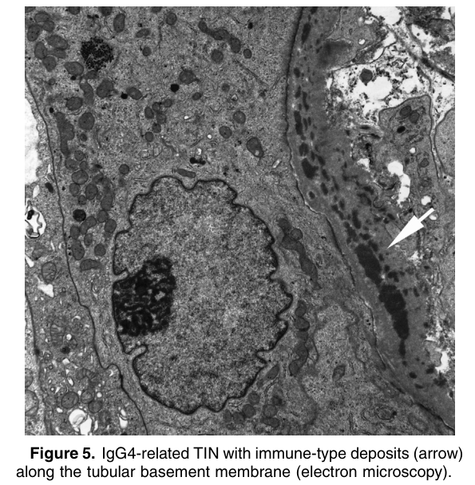

# IgG4-Related Tubulointerstitial Nephritis - Figures and Tables Index

This document lists all figures and tables extracted from `IgG4-Related Tubulointerstitial Nephritis.pdf`.

## Table of Contents
- [Figures](#figures)
- [Tables](#tables)

---

## Figures

### Fig_1

Figure 1. IgG4-related TIN with abundant plasma cells (Jones silver stain). The presence of nests of inflammatory cells surrounded by collagen bundles (bird’s eye pattern) is a typical finding. There might be frequent interstitial eosinophils as seen in this case (upper right).

---

### Fig_2

Figure 2. IgG4-related TIN with storiform fibrosis where fibroblasts and inflammatory cells arrange in pattern resembling spokes of a cartwheel (Jones silver stain).

---

### Fig_3

Figure 3. IgG4-related TIN with immunoperoxidase staining that shows abundant interstitial IgG4-positive plasma cells (anti-IgG4 immunoperoxidase stain).

---

### Fig_4

Figure 4. IgG4-related TIN with focal granular tubular basement membrane deposits staining with IgG, a finding present in .80% of cases. On the right side, there is focal granular Bowman’s capsule deposits staining with IgG (immunofluorescence anti-IgG).

---

### Fig_5

Figure 5. IgG4-related TIN with immune-type deposits (arrow) along the tubular basement membrane (electron microscopy).

---

## Tables

*No tables resolved for this chapter.*
