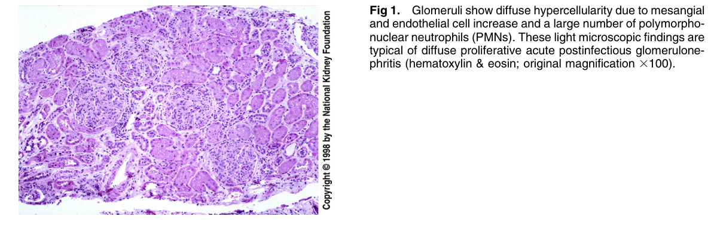
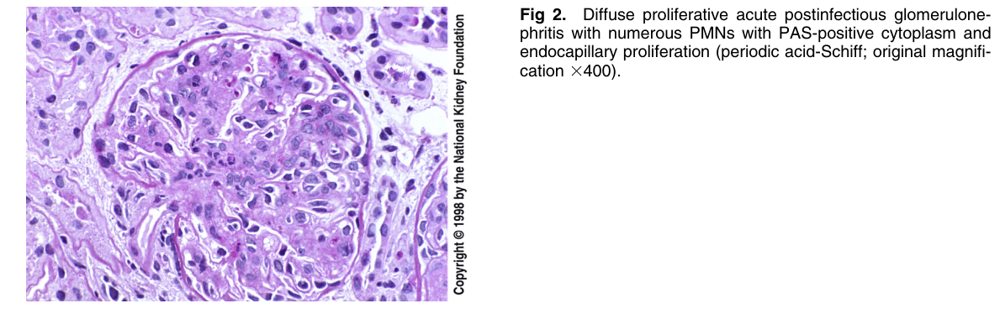
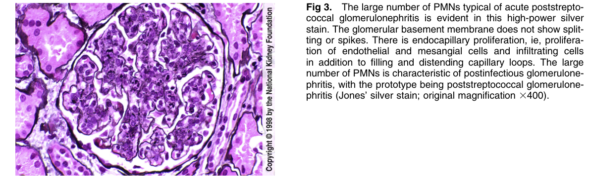
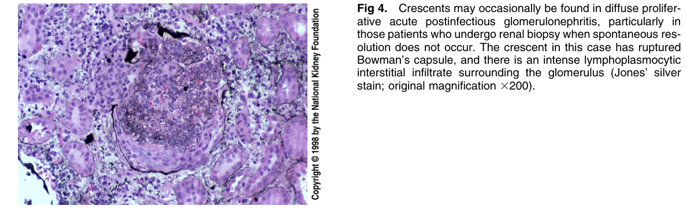
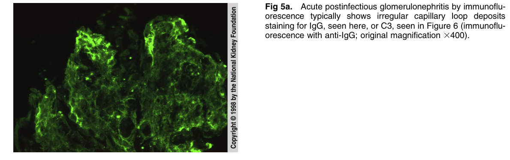
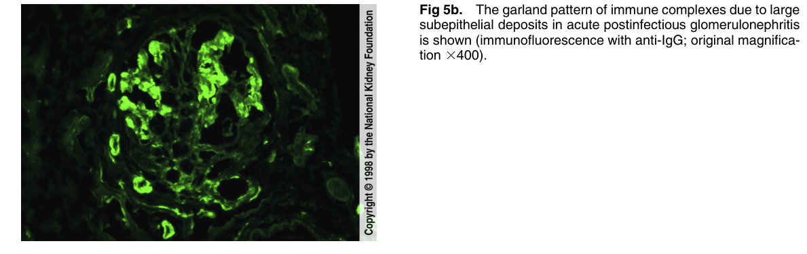
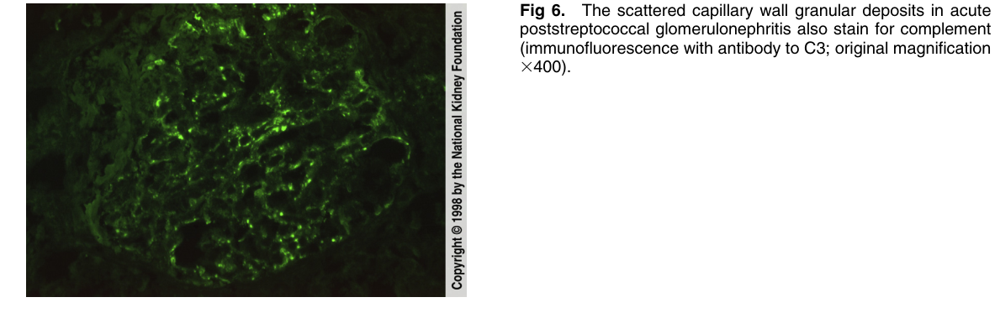
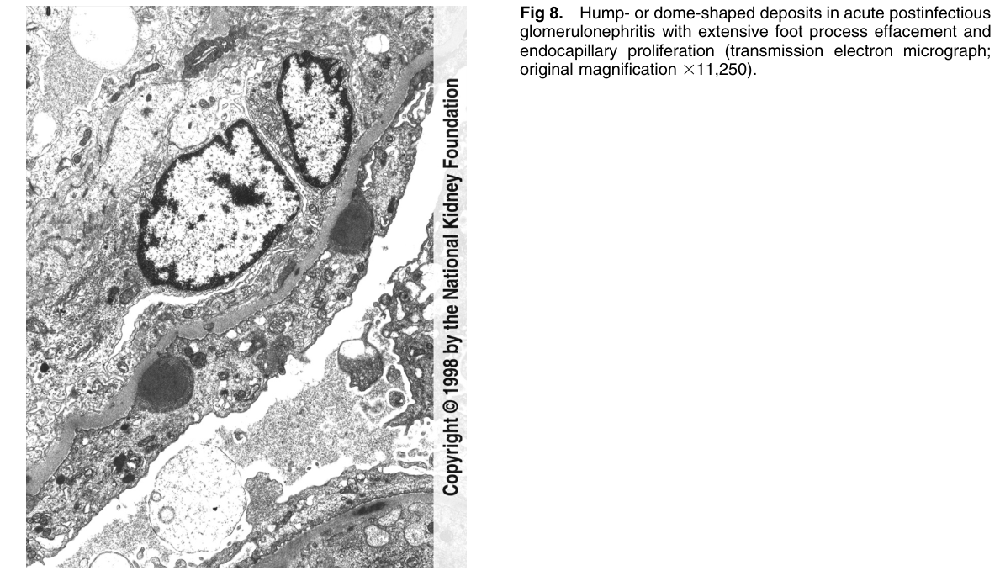
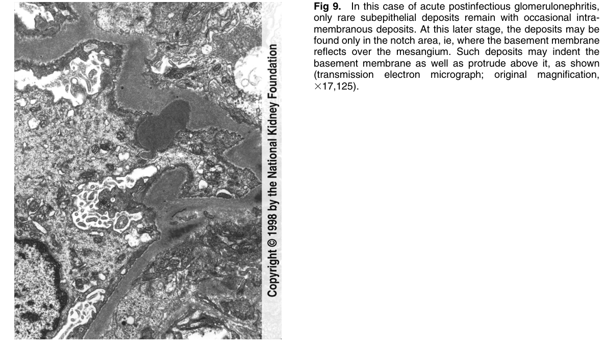

# Postinfectious Glomerulonephritis 2 - Figures and Tables Index

This document lists all figures and tables extracted from `Postinfectious Glomerulonephritis 2.pdf`.

## Table of Contents
- [Figures](#figures)
- [Tables](#tables)

---

## Figures

### Fig_1

Figure 1. Glomeruli show diffuse hypercellularity due to mesangia and endothelial cell increase and a large number of polymorphonuclear neutrophils (PMNs). These light microscopic findings are typical of diffuse proliferative acute postinfectious glomerulone phritis (hematoxylin & eosin; original magnification 3100).

---

### Fig_2

Figure 2. Diffuse proliferative acute postinfectious glomerulonephritis with numerous PMNs with PAS-positive cytoplasm and endocapillary proliferation (periodic acid-Schiff; original magnification 3400).

---

### Fig_3

Figure 3. The large number of PMNs typical of acute poststreptococcal glomerulonephritis is evident in this high-power silver stain. The glomerular basement membrane does not show split ting or spikes. There is endocapillary proliferation, ie, proliferation of endothelial and mesangial cells and infiltrating cells in addition to filling and distending capillary loops. The large number of PMNs is characteristic of postinfectious glomerulonephritis, with the prototype being poststreptococcal glomerulone phritis (Jones’ silver stain; original magnification 3400).

---

### Fig_4

Figure 4. Crescents may occasionally be found in diffuse proliferative acute postinfectious glomerulonephritis, particularly in those patients who undergo renal biopsy when spontaneous resolution does not occur. The crescent in this case has ruptured Bowman’s capsule, and there is an intense lymphoplasmocytic interstitial infiltrate surrounding the glomerulus (Jones’ silver stain; original magnification 3200).

---

### Fig_5a

Figure 5a. Acute postinfectious glomerulonephritis by immunoflu orescence typically shows irregular capillary loop deposits staining for IgG, seen here, or C3, seen in Figure 6 (immunoflu orescence with anti-IgG; original magnification 3400).

---

### Fig_5b

Figure 5b. The garland pattern of immune complexes due to large subepithelial deposits in acute postinfectious glomerulonephriti is shown (immunofluorescence with anti-IgG; original magnification 3400).

---

### Fig_6

Figure 6. The scattered capillary wall granular deposits in acute poststreptococcal glomerulonephritis also stain for complement (immunofluorescence with antibody to C3; original magnification 3400).

---

### Fig_8

Figure 8. Hump- or dome-shaped deposits in acute postinfectious glomerulonephritis with extensive foot process effacement and endocapillary proliferation (transmission electron micrograph; original magnification 311,250).

---

### Fig_9

Figure 9. In this case of acute postinfectious glomerulonephritis, only rare subepithelial deposits remain with occasional intramembranous deposits. At this later stage, the deposits may be found only in the notch area, ie, where the basement membrane reflects over the mesangium. Such deposits may indent the basement membrane as well as protrude above it, as shown (transmission electron micrograph; original magnification, 317,125).

---

## Tables

*No tables resolved for this chapter.*
