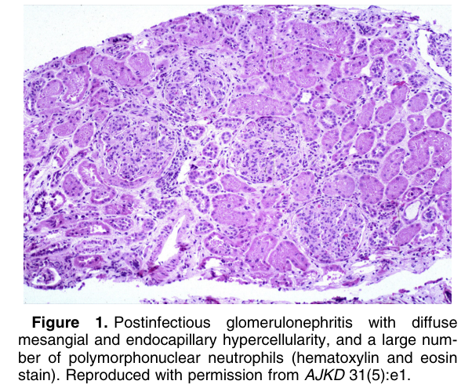
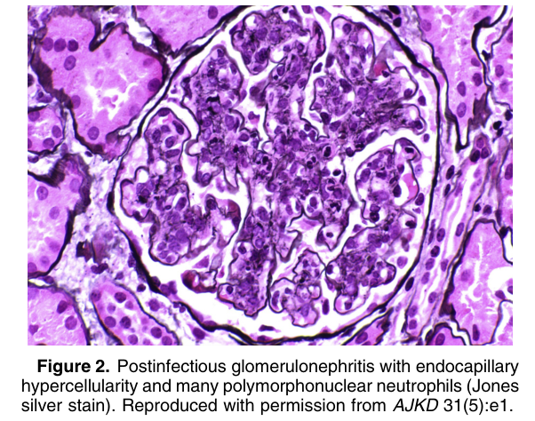
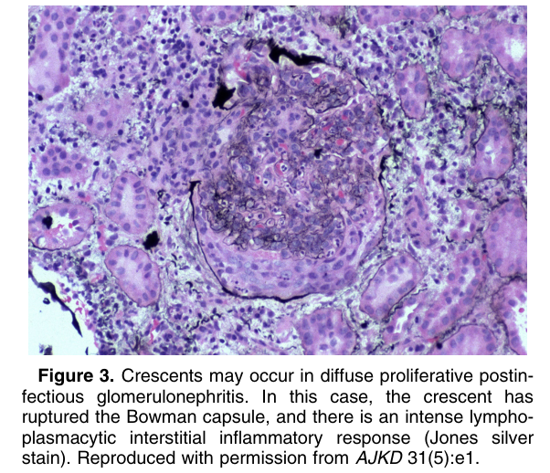
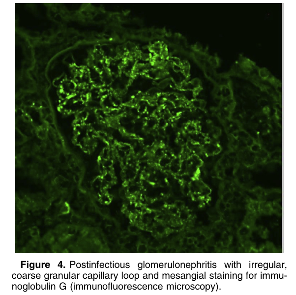
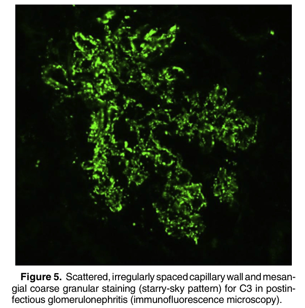
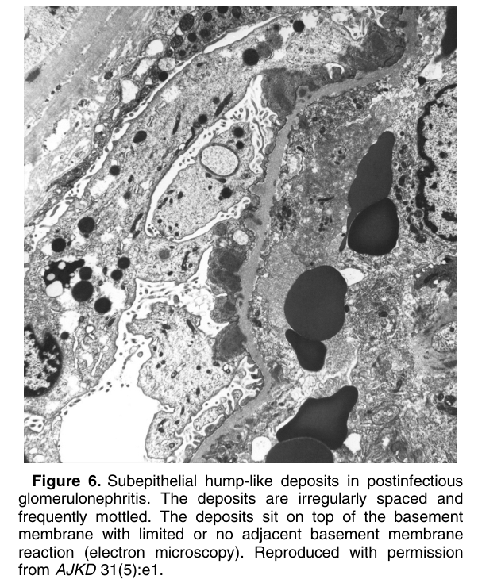

# Postinfectious Glomerulonephritis - Figures and Tables Index

This document lists all figures and tables extracted from `Postinfectious Glomerulonephritis.pdf`.

## Table of Contents
- [Figures](#figures)
- [Tables](#tables)

---

## Figures

### Fig_1

Figure 1. Postinfectious glomerulonephritis with diffuse mesangial and endocapillary hypercellularity, and a large number of polymorphonuclear neutrophils (hematoxylin and eosin stain). Reproduced with permission from AJKD 31(5):e1.

---

### Fig_2

Figure 2. Postinfectious glomerulonephritis with endocapillary hypercellularity and many polymorphonuclear neutrophils (Jones silver stain). Reproduced with permission from AJKD 31(5):e1.

---

### Fig_3

Figure 3. Crescents may occur in diffuse proliferative postinfectious glomerulonephritis. In this case, the crescent has ruptured the Bowman capsule, and there is an intense lymphoplasmacytic interstitial inflammatory response (Jones silver stain). Reproduced with permission from AJKD 31(5):e1.

---

### Fig_4

Figure 4. Postinfectious glomerulonephritis with irregular, coarse granular capillary loop and mesangial staining for immunoglobulin G (immunofluorescence microscopy).

---

### Fig_5

Figure 5. Scattered,irregularlyspacedcapillarywalland mesangial coarse granular staining (starry-sky pattern) for C3 in postin fectious glomerulonephritis (immunofluorescence microscopy).

---

### Fig_6

Figure 6. Subepithelial hump-like deposits in postinfectious glomerulonephritis. The deposits are irregularly spaced and frequently mottled. The deposits sit on top of the basement membrane with limited or no adjacent basement membrane reaction (electron microscopy). Reproduced with permission from AJKD 31(5):e1.

---

## Tables

*No tables resolved for this chapter.*
