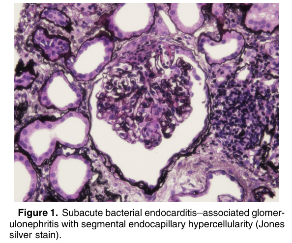
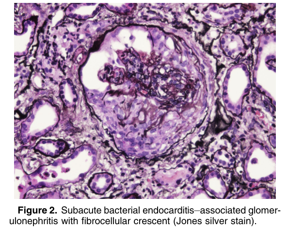
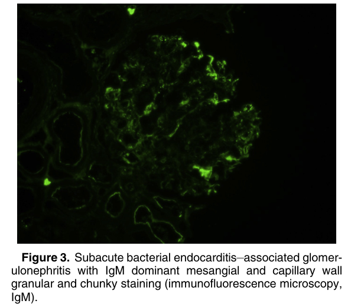
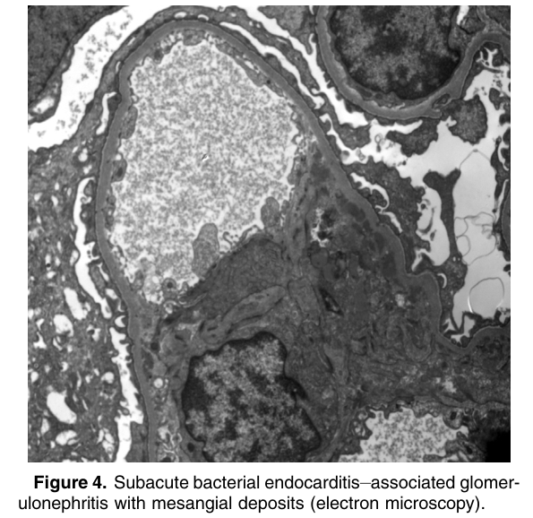
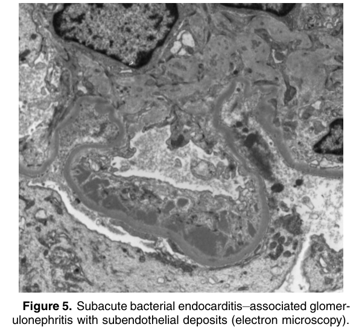

# Subacute Bacterial Endocarditis–Associated Glomerulonephritis - Figures and Tables Index

This document lists all figures and tables extracted from `Subacute Bacterial Endocarditis–Associated Glomerulonephritis.pdf`.

## Table of Contents
- [Figures](#figures)
- [Tables](#tables)

---

## Figures

### Fig_1

Figure 1. Subacute bacterial endocarditis–associated glomerulonephritis with segmental endocapillary hypercellularity (Jones silver stain).

---

### Fig_2

Figure 2. Subacute bacterial endocarditis–associated glomerulonephritis with fibrocellular crescent (Jones silver stain).

---

### Fig_3

Figure 3. Subacute bacterial endocarditis–associated glomerulonephritis with IgM dominant mesangial and capillary wall granular and chunky staining (immunofluorescence microscopy, IgM).

---

### Fig_4

Figure 4. Subacute bacterial endocarditis–associated glomer ulonephritis with mesangial deposits (electron microscopy).

---

### Fig_5

Figure 5. Subacute bacterial endocarditis–associated glomerulonephritis with subendothelial deposits (electron microscopy).

---

## Tables

*No tables resolved for this chapter.*
