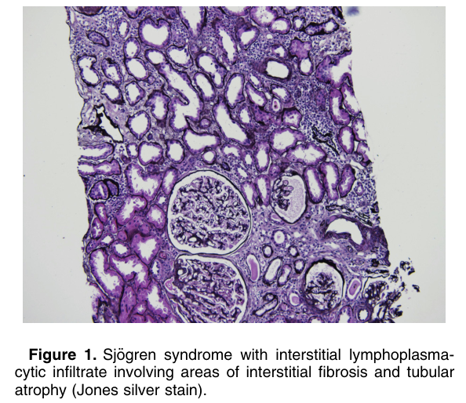
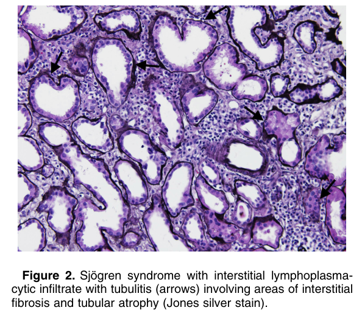
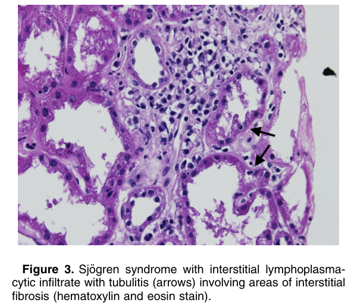

# Kidney Disease in Primary Sjogren Syndrome - Figures and Tables Index

This document lists all figures and tables extracted from `Kidney Disease in Primary Sjogren Syndrome.pdf`.

## Table of Contents
- [Figures](#figures)
- [Tables](#tables)

---

## Figures

### Fig_1

Figure 1. Sjo¨gren syndrome with interstitial lymphoplasmacytic infiltrate involving areas of interstitial fibrosis and tubular atrophy (Jones silver stain).

---

### Fig_2

Figure 2. Sjo¨gren syndrome with interstitial lymphoplasmacytic infiltrate with tubulitis (arrows) involving areas of interstitial fibrosis and tubular atrophy (Jones silver stain).

---

### Fig_3

Figure 3. Sjo¨gren syndrome with interstitial lymphoplasmacytic infiltrate with tubulitis (arrows) involving areas of interstitial fibrosis (hematoxylin and eosin stain).

---

## Tables

*No tables resolved for this chapter.*
