# Lupus Nephritis Proliferative Forms (WHO III, IV) - Figures and Tables Index

This document lists all figures and tables extracted from `Lupus Nephritis Proliferative Forms (WHO III, IV).pdf`.

## Table of Contents
- [Figures](#figures)
- [Tables](#tables)

---

## Figures

### Fig_1

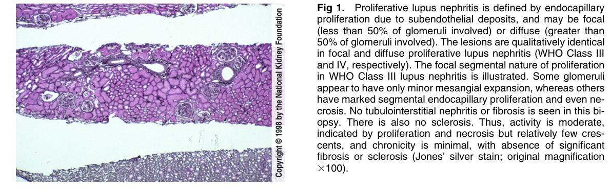

Figure 1. Proliferative lupus nephritis is defined by endocapillary proliferation due to subendothelial deposits, and may be focal (less than 50% of glomeruli involved) or diffuse (greater than 50% of glomeruli involved). The lesions are qualitatively identica in focal and diffuse proliferative lupus nephritis (WHO Class III and IV, respectively). The focal segmental nature of proliferation in WHO Class III lupus nephritis is illustrated. Some glomerul appear to have only minor mesangial expansion, whereas others have marked segmental endocapillary proliferation and even necrosis. No tubulointerstitial nephritis or fibrosis is seen in this biopsy. There is also no sclerosis. Thus, activity is moderate, indicated by proliferation and necrosis but relatively few crescents, and chronicity is minimal, with absence of significant fibrosis or sclerosis (Jones’ silver stain; original magnification 3100).

---

### Fig_2

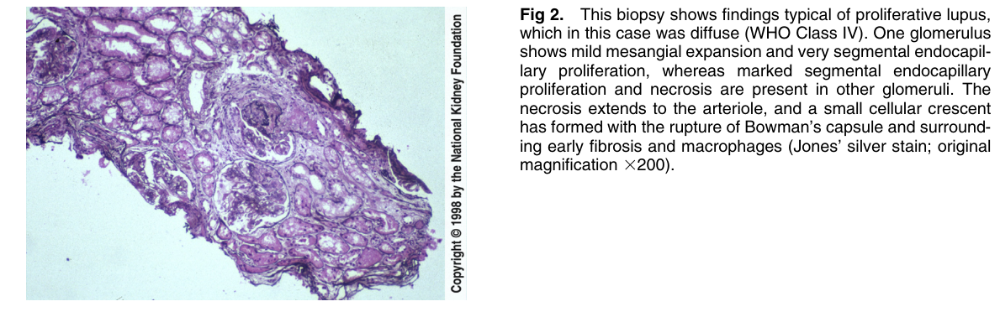

Figure 2. This biopsy shows findings typical of proliferative lupus, which in this case was diffuse (WHO Class IV). One glomerulus shows mild mesangial expansion and very segmental endocapillary proliferation, whereas marked segmental endocapillary proliferation and necrosis are present in other glomeruli. The necrosis extends to the arteriole, and a small cellular crescent has formed with the rupture of Bowman’s capsule and surrounding early fibrosis and macrophages (Jones’ silver stain; origina magnification 3200).

---

### Fig_3

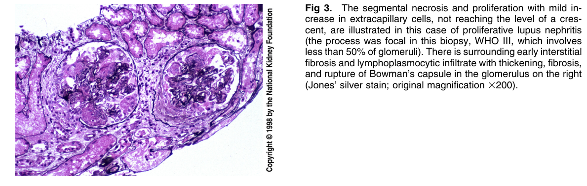

Figure 3. The segmental necrosis and proliferation with mild increase in extracapillary cells, not reaching the level of a crescent, are illustrated in this case of proliferative lupus nephritis (the process was focal in this biopsy, WHO III, which involves less than 50% of glomeruli). There is surrounding early interstitia fibrosis and lymphoplasmocytic infiltrate with thickening, fibrosis, and rupture of Bowman’s capsule in the glomerulus on the righ (Jones’ silver stain; original magnification 3200).

---

### Fig_4

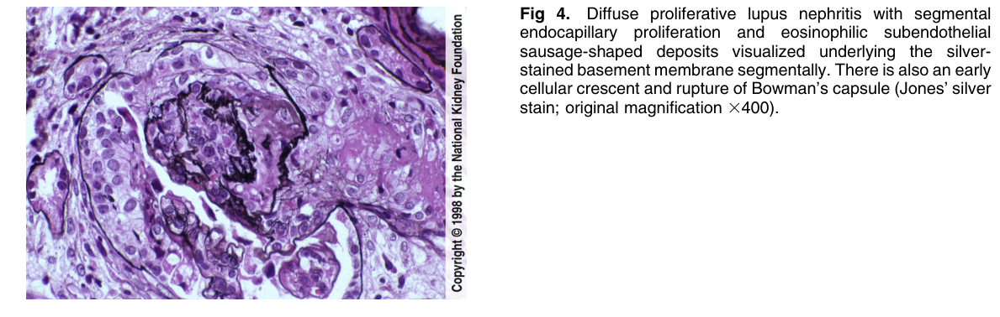

Figure 4. Diffuse proliferative lupus nephritis with segmenta endocapillary proliferation and eosinophilic subendothelia sausage-shaped deposits visualized underlying the silverstained basement membrane segmentally. There is also an early cellular crescent and rupture of Bowman’s capsule (Jones’ silver stain; original magnification 3400).

---

### Fig_5

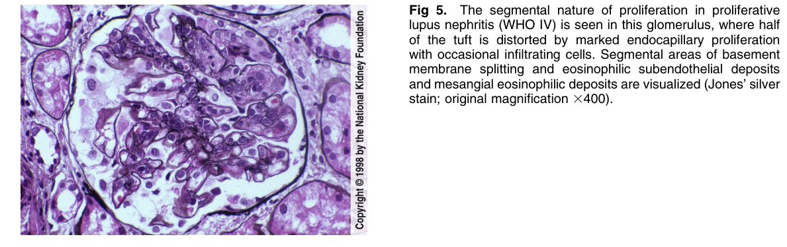

Figure 5. The segmental nature of proliferation in proliferative lupus nephritis (WHO IV) is seen in this glomerulus, where hal of the tuft is distorted by marked endocapillary proliferation with occasional infiltrating cells. Segmental areas of basemen membrane splitting and eosinophilic subendothelial deposits and mesangial eosinophilic deposits are visualized (Jones’ silver stain; original magnification 3400).

---

### Fig_6

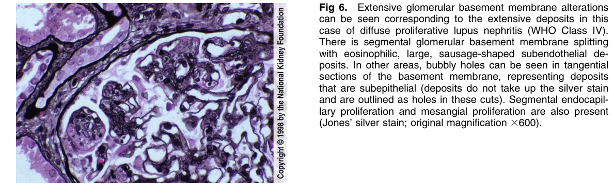

Figure 6. Extensive glomerular basement membrane alterations can be seen corresponding to the extensive deposits in this case of diffuse proliferative lupus nephritis (WHO Class IV). There is segmental glomerular basement membrane splitting with eosinophilic, large, sausage-shaped subendothelial deposits. In other areas, bubbly holes can be seen in tangentia sections of the basement membrane, representing deposits that are subepithelial (deposits do not take up the silver stain and are outlined as holes in these cuts). Segmental endocapillary proliferation and mesangial proliferation are also presen (Jones’ silver stain; original magnification 3600).

---

### Fig_7

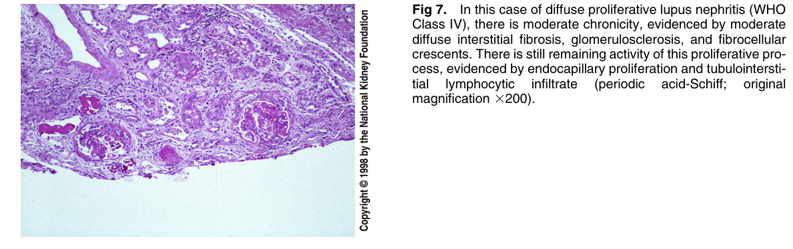

Figure 7. In this case of diffuse proliferative lupus nephritis (WHO Class IV), there is moderate chronicity, evidenced by moderate diffuse interstitial fibrosis, glomerulosclerosis, and fibrocellular crescents. There is still remaining activity of this proliferative process, evidenced by endocapillary proliferation and tubulointerstitial lymphocytic infiltrate (periodic acid-Schiff; origina magnification 3200).

---

### Fig_8

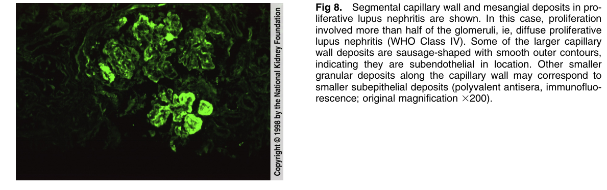

Figure 8. Segmental capillary wall and mesangial deposits in proliferative lupus nephritis are shown. In this case, proliferation involved more than half of the glomeruli, ie, diffuse proliferative lupus nephritis (WHO Class IV). Some of the larger capillary wall deposits are sausage-shaped with smooth outer contours, indicating they are subendothelial in location. Other smaller granular deposits along the capillary wall may correspond to smaller subepithelial deposits (polyvalent antisera, immunofluo rescence; original magnification 3200).

---

### Fig_9

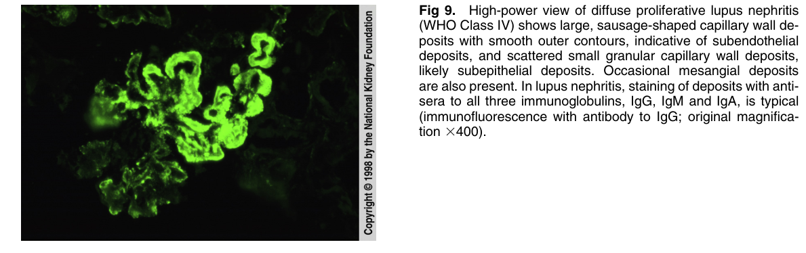

Figure 9. High-power view of diffuse proliferative lupus nephritis (WHO Class IV) shows large, sausage-shaped capillary wall deposits with smooth outer contours, indicative of subendothelia deposits, and scattered small granular capillary wall deposits, likely subepithelial deposits. Occasional mesangial deposits are also present. In lupus nephritis, staining of deposits with anti sera to all three immunoglobulins, IgG, IgM and IgA, is typica (immunofluorescence with antibody to IgG; original magnification 3400).

---

### Fig_10

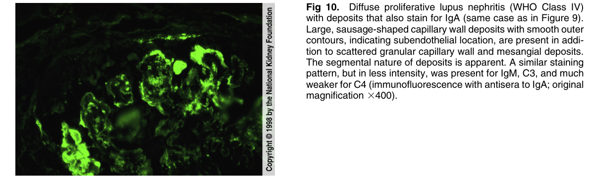

Figure 10. Diffuse proliferative lupus nephritis (WHO Class IV) with deposits that also stain for IgA (same case as in Figure 9). Large, sausage-shaped capillary wall deposits with smooth outer contours, indicating subendothelial location, are present in addition to scattered granular capillary wall and mesangial deposits. The segmental nature of deposits is apparent. A similar staining pattern, but in less intensity, was present for IgM, C3, and much weaker for C4 (immunofluorescence with antisera to IgA; origina magnification 3400).

---

### Fig_11

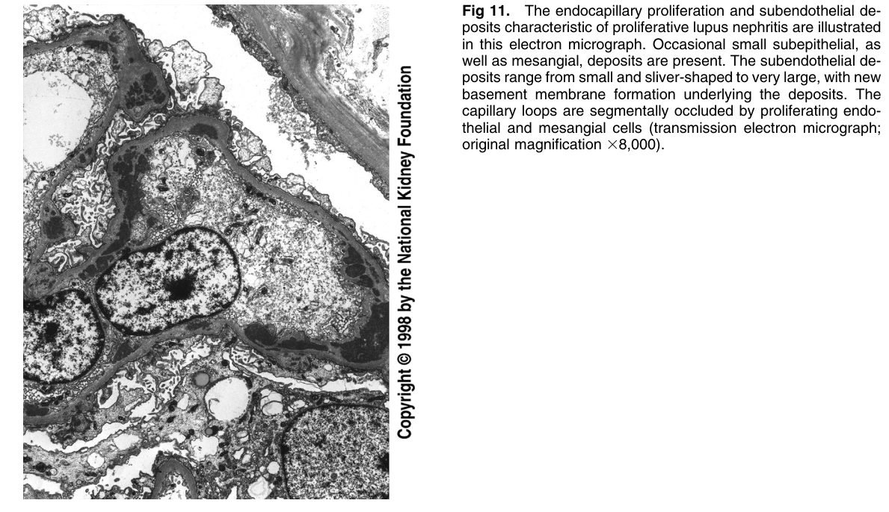

Figure 11. The endocapillary proliferation and subendothelial deposits characteristic of proliferative lupus nephritis are illustrated in this electron micrograph. Occasional small subepithelial, as well as mesangial, deposits are present. The subendothelial deposits range from small and sliver-shaped to very large, with new basement membrane formation underlying the deposits. The capillary loops are segmentally occluded by proliferating endothelial and mesangial cells (transmission electron micrograph; original magnification 38,000).

---

### Fig_12

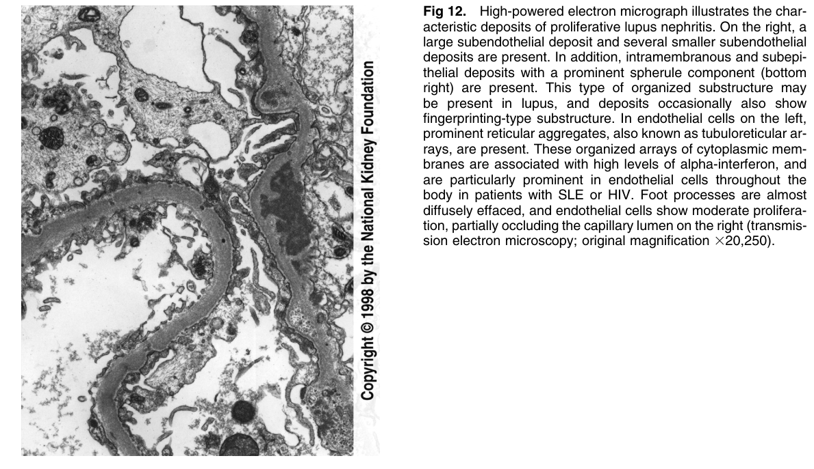

Figure 12. High-powered electron micrograph illustrates the characteristic deposits of proliferative lupus nephritis. On the right, a large subendothelial deposit and several smaller subendothelia deposits are present. In addition, intramembranous and subepithelial deposits with a prominent spherule component (bottom right) are present. This type of organized substructure may be present in lupus, and deposits occasionally also show fingerprinting-type substructure. In endothelial cells on the left, prominent reticular aggregates, also known as tubuloreticular arrays, are present. These organized arrays of cytoplasmic membranes are associated with high levels of alpha-interferon, and are particularly prominent in endothelial cells throughout the body in patients with SLE or HIV. Foot processes are almos diffusely effaced, and endothelial cells show moderate proliferation, partially occluding the capillary lumen on the right (transmission electron microscopy; original magnification 320,250).

---

## Tables

*No tables resolved for this chapter.*
